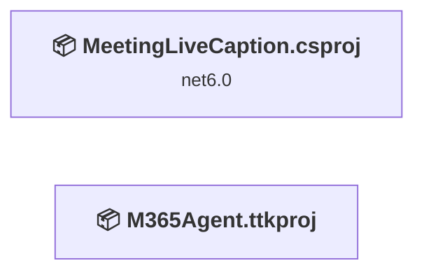
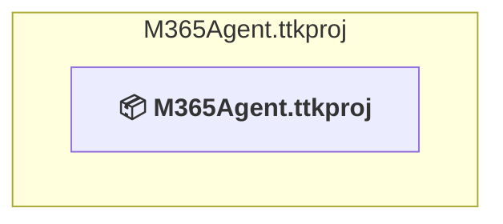
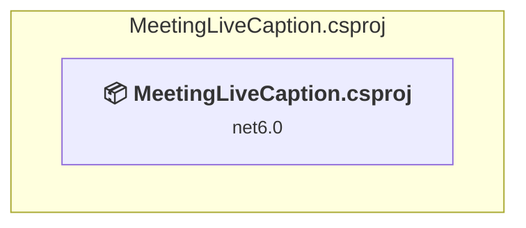

# Projects and dependencies analysis

This document provides a comprehensive overview of the projects and their dependencies in the context of upgrading to .NETCoreApp,Version=v10.0.

## Table of Contents

- [Executive Summary](#executive-Summary)
  - [Highlevel Metrics](#highlevel-metrics)
  - [Projects Compatibility](#projects-compatibility)
  - [Package Compatibility](#package-compatibility)
  - [API Compatibility](#api-compatibility)
- [Aggregate NuGet packages details](#aggregate-nuget-packages-details)
- [Top API Migration Challenges](#top-api-migration-challenges)
  - [Technologies and Features](#technologies-and-features)
  - [Most Frequent API Issues](#most-frequent-api-issues)
- [Projects Relationship Graph](#projects-relationship-graph)
- [Project Details](#project-details)

  - [M365Agent\M365Agent.ttkproj](#m365agentm365agentttkproj)
  - [MeetingLiveCaption\MeetingLiveCaption.csproj](#meetinglivecaptionmeetinglivecaptioncsproj)

## Executive Summary

### Highlevel Metrics

| Metric | Count | Status |
| :--- | :---: | :--- |
| Total Projects | 2 | 1 require upgrade |
| Total NuGet Packages | 5 | 2 need upgrade |
| Total Code Files | 8 |  |
| Total Code Files with Incidents | 2 |  |
| Total Lines of Code | 366 |  |
| Total Number of Issues | 5 |  |
| Estimated LOC to modify | 1+ | at least 0,3% of codebase |

### Projects Compatibility

| Project | Target Framework | Difficulty | Package Issues | API Issues | Est. LOC Impact | Description |
| :--- | :---: | :---: | :---: | :---: | :---: | :--- |
| [M365Agent\M365Agent.ttkproj](#m365agentm365agentttkproj) |  | ✅ None | 0 | 0 |  | DotNetCoreApp, Sdk Style = True |
| [MeetingLiveCaption\MeetingLiveCaption.csproj](#meetinglivecaptionmeetinglivecaptioncsproj) | net6.0 | 🟢 Low | 3 | 1 | 1+ | AspNetCore, Sdk Style = True |

### Package Compatibility

| Status | Count | Percentage |
| :--- | :---: | :---: |
| ✅ Compatible | 3 | 60,0% |
| ⚠️ Incompatible | 0 | 0,0% |
| 🔄 Upgrade Recommended | 2 | 40,0% |
| ***Total NuGet Packages*** | ***5*** | ***100%*** |

### API Compatibility

| Category | Count | Impact |
| :--- | :---: | :--- |
| 🔴 Binary Incompatible | 0 | High - Require code changes |
| 🟡 Source Incompatible | 0 | Medium - Needs re-compilation and potential conflicting API error fixing |
| 🔵 Behavioral change | 1 | Low - Behavioral changes that may require testing at runtime |
| ✅ Compatible | 532 |  |
| ***Total APIs Analyzed*** | ***533*** |  |

## Aggregate NuGet packages details

| Package | Current Version | Suggested Version | Projects | Description |
| :--- | :---: | :---: | :--- | :--- |
| AdaptiveCards | 2.7.3 |  | [MeetingLiveCaption.csproj](#meetinglivecaptionmeetinglivecaptioncsproj) | ✅Compatible |
| AdaptiveCards.Templating | 1.3.1 |  | [MeetingLiveCaption.csproj](#meetinglivecaptionmeetinglivecaptioncsproj) | ✅Compatible |
| Microsoft.AspNetCore.Mvc.NewtonsoftJson | 6.0.11 | 10.0.7 | [MeetingLiveCaption.csproj](#meetinglivecaptionmeetinglivecaptioncsproj) | NuGet package upgrade is recommended |
| Microsoft.Bot.Builder.Integration.AspNet.Core | 4.18.1 |  | [MeetingLiveCaption.csproj](#meetinglivecaptionmeetinglivecaptioncsproj) | ✅Compatible |
| Microsoft.Identity.Client | 4.48.0 | 4.84.0 | [MeetingLiveCaption.csproj](#meetinglivecaptionmeetinglivecaptioncsproj) | NuGet package contains security vulnerability |

## Top API Migration Challenges

### Technologies and Features

| Technology | Issues | Percentage | Migration Path |
| :--- | :---: | :---: | :--- |

### Most Frequent API Issues

| API | Count | Percentage | Category |
| :--- | :---: | :---: | :--- |
| M:Microsoft.Extensions.DependencyInjection.HttpClientFactoryServiceCollectionExtensions.AddHttpClient(Microsoft.Extensions.DependencyInjection.IServiceCollection) | 1 | 100,0% | Behavioral Change |

## Projects Relationship Graph

Legend:
📦 SDK-style project
⚙️ Classic project

## Project Details

### M365Agent\M365Agent.ttkproj

#### Project Info

- **Current Target Framework:** ✅
- **SDK-style**: True
- **Project Kind:** DotNetCoreApp
- **Dependencies**: 0
- **Dependants**: 0
- **Number of Files**: 0
- **Lines of Code**: 0
- **Estimated LOC to modify**: 0+ (at least 0,0% of the project)

#### Dependency Graph

Legend:
📦 SDK-style project
⚙️ Classic project

### API Compatibility

| Category | Count | Impact |
| :--- | :---: | :--- |
| 🔴 Binary Incompatible | 0 | High - Require code changes |
| 🟡 Source Incompatible | 0 | Medium - Needs re-compilation and potential conflicting API error fixing |
| 🔵 Behavioral change | 0 | Low - Behavioral changes that may require testing at runtime |
| ✅ Compatible | 0 |  |
| ***Total APIs Analyzed*** | ***0*** |  |

### MeetingLiveCaption\MeetingLiveCaption.csproj

#### Project Info

- **Current Target Framework:** net6.0
- **Proposed Target Framework:** net10.0
- **SDK-style**: True
- **Project Kind:** AspNetCore
- **Dependencies**: 0
- **Dependants**: 0
- **Number of Files**: 10
- **Number of Files with Incidents**: 2
- **Lines of Code**: 366
- **Estimated LOC to modify**: 1+ (at least 0,3% of the project)

#### Dependency Graph

Legend:
📦 SDK-style project
⚙️ Classic project

### API Compatibility

| Category | Count | Impact |
| :--- | :---: | :--- |
| 🔴 Binary Incompatible | 0 | High - Require code changes |
| 🟡 Source Incompatible | 0 | Medium - Needs re-compilation and potential conflicting API error fixing |
| 🔵 Behavioral change | 1 | Low - Behavioral changes that may require testing at runtime |
| ✅ Compatible | 532 |  |
| ***Total APIs Analyzed*** | ***533*** |  |

