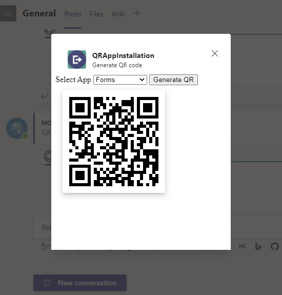
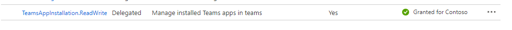

## Install app using barcode sample

This sample demos app installation using QR code with applications app id in Csharp

Currently, Microsoft Teams support for QR or barcode scanner capability is only available for mobile clients

## Features of the sample

- 
- Generate QR code for app id.



- Install app in team with barcode scanner.


## Prerequisites

- [.NET Core SDK](https://dotnet.microsoft.com/download) version 3.1

  ```bash
  # determine dotnet version
  dotnet --version
  ```
- [Ngrok](https://ngrok.com/download) (For local environment testing) Latest (any other tunneling software can also be used)
  ```bash
  # run ngrok locally
  ngrok http -host-header=localhost 3978
  ```

- [Teams](https://teams.microsoft.com) Microsoft Teams is installed and you have an account

## To try this sample

1. Create a Bot Registration
   In Azure portal, create a [Bot Framework registration resource](https://docs.microsoft.com/en-us/azure/bot-service/bot-builder-authentication?view=azure-bot-service-4.0&tabs=csharp%2Caadv2).
   Add following permission in app registration.
   
   

2) Clone the repository
   ```bash
   git clone https://github.com/OfficeDev/Microsoft-Teams-Samples.git
   ```

3) In a terminal, navigate to `samples/QR-app-installation/csharp`

    ```bash
    # change into project folder
    cd # QRAppInstallation
    ```
4) Run ngrok - point to port 3978

    ```bash
    # ngrok http -host-header=rewrite 3978
 ```
 
5) Modify the `manifest.json` in the `/appPackage` folder and replace the `{{Microsoft-App-Id}}` with the id from step 2 and `{{domain-name}}` with base Url domain.

6) Zip the contents of `appPackage` folder into a `manifest.zip`, and use the `manifest.zip` to deploy in app store or add to Teams as in step 7.

7) Modify the `/appsettings.json` and fill in the `{{Microsoft-App-Id}}`,`{{ Microsoft-App-Password }}` and `{{onnection Name}}` with the id from step 2.

8) Add `{{ Application Base Url }}`in appsetting.json with ngrok tunnel url or deployed application base url.

9) Run the bot from a terminal or from Visual Studio, choose option A or B.

  A) From a terminal

  ```bash
  # run the bot
  dotnet run
  ```

  B) Or from Visual Studio

  - Launch Visual Studio
  - File -> Open -> Project/Solution
  - Navigate to `QRAppInstallation` folder
  - Select `QRAppInstallation.csproj` file
  - Press `F5` to run the project 

10) Upload the manifest.zip to Teams (in the Apps view click "Upload a custom app")
   - Go to Microsoft Teams. From the lower left corner, select Apps
   - From the lower left corner, choose Upload a custom App
   - Go to your project directory, the ./appPackage folder, select the zip folder, and choose Open.
   - Select Add in the pop-up dialog box. Your tab is uploaded to Teams.

## Deploy the bot to Azure

To learn more about deploying a bot to Azure, see [Deploy your bot to Azure](https://aka.ms/azuredeployment) for a complete list of deployment instructions.

## Further reading

- [Bot Framework Documentation](https://docs.botframework.com)
- [Bot Basics](https://docs.microsoft.com/azure/bot-service/bot-builder-basics?view=azure-bot-service-4.0)
- [Activity processing](https://docs.microsoft.com/en-us/azure/bot-service/bot-builder-concept-activity-processing?view=azure-bot-service-4.0)
- [Azure Bot Service Introduction](https://docs.microsoft.com/azure/bot-service/bot-service-overview-introduction?view=azure-bot-service-4.0)
- [Azure Bot Service Documentation](https://docs.microsoft.com/azure/bot-service/?view=azure-bot-service-4.0)
- [.NET Core CLI tools](https://docs.microsoft.com/en-us/dotnet/core/tools/?tabs=netcore2x)
- [Azure CLI](https://docs.microsoft.com/cli/azure/?view=azure-cli-latest)
- [Azure Portal](https://portal.azure.com)
- [Language Understanding using LUIS](https://docs.microsoft.com/en-us/azure/cognitive-services/luis/)
- [Channels and Bot Connector Service](https://docs.microsoft.com/en-us/azure/bot-service/bot-concepts?view=azure-bot-service-4.0)
