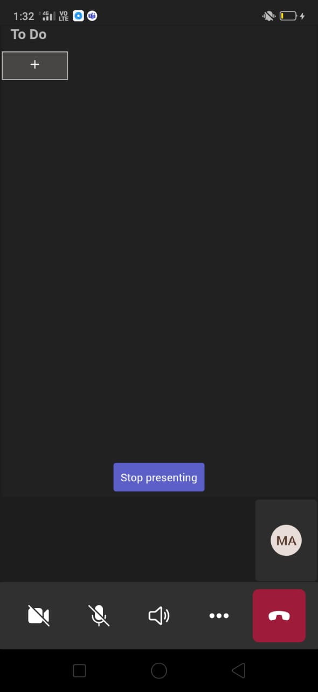
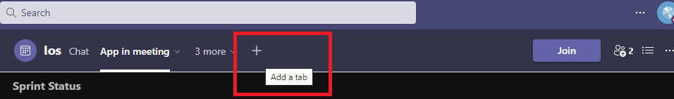
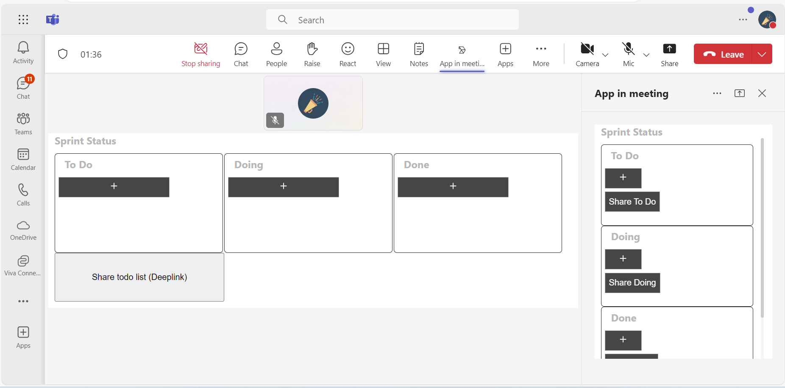
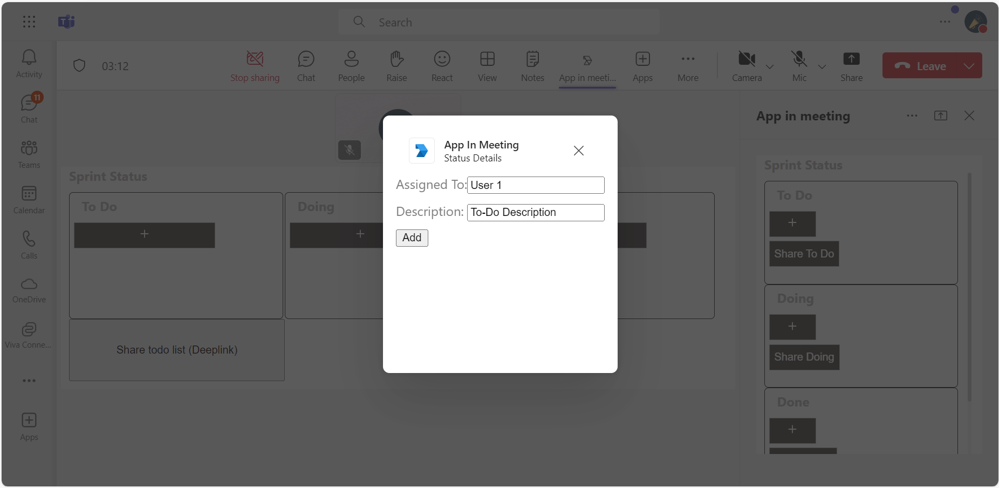
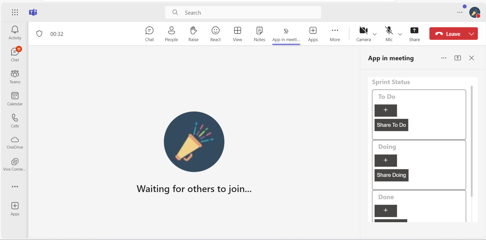

# Meetings Stage View

This sample application enables the configuration and use of shared meeting stages within Microsoft Teams, leveraging the [Live Share SDK](https://aka.ms/livesharedocs) for real-time interaction. It includes features such as a meeting side panel and theme customization options, allowing users to enhance their collaborative experience during meetings. The demo manifest is available for testing in your Microsoft Teams client.

## Included Features
* Meeting Stage
* Meeting SidePanel
* Live Share SDK
* RSC Permissions

## Interaction with app - Web


## Interaction with app - Mobile


## Interaction with app theme


## Try it yourself - experience the App in your Microsoft Teams client
Please find below demo manifest which is deployed on Microsoft Azure and you can try it yourself by uploading the app manifest (.zip file link below) to your teams and/or as a personal app. (Uploading must be enabled for your tenant, [see steps here](https://docs.microsoft.com/microsoftteams/platform/concepts/build-and-test/prepare-your-o365-tenant#enable-custom-teams-apps-and-turn-on-custom-app-uploading)).

**Realtime meeting stage view:** [Manifest](/samples/meetings-stage-view/csharp/demo-manifest/Meeting-stage-view.zip)

## Prerequisites

- [.NET Core SDK](https://dotnet.microsoft.com/download) version 6.0

  determine dotnet version
  ```bash
  dotnet --version
  ```
- [dev tunnel](https://learn.microsoft.com/en-us/azure/developer/dev-tunnels/get-started?tabs=windows) or [Ngrok](https://ngrok.com/download) (For local environment testing) latest version (any other tunneling software can also be used)
  
- [Teams](https://teams.microsoft.com) Microsoft Teams is installed and you have an account

-[Microsoft 365 Agents Toolkit for Visual Studio](https://learn.microsoft.com/en-us/microsoftteams/platform/toolkit/toolkit-v4/install-teams-toolkit-vs?pivots=visual-studio-v17-7)


## Run the app (Using Microsoft 365 Agents Toolkit for Visual Studio)

The simplest way to run this sample in Teams is to use Microsoft 365 Agents Toolkit for Visual Studio.

1. Install Visual Studio 2022 **Version 17.14 or higher** [Visual Studio](https://visualstudio.microsoft.com/downloads/)
1. Install Microsoft 365 Agents Toolkit for Visual Studio Microsoft 365 Agents Toolkit extension
1. In the debug dropdown menu of Visual Studio, select Dev Tunnels > Create A Tunnel (set authentication type to Public) or select an existing public dev tunnel.
1. In the debug dropdown menu of Visual Studio, select default startup project > `Microsoft Teams (browser)`
1. Right-click the 'M365Agent' project in Solution Explorer and select **Microsoft 365 Agents Toolkit > Select Microsoft 365 Account**
1. Sign in to Microsoft 365 Agents Toolkit with a **Microsoft 365 work or school account**
1. Set `Startup Item` as `Microsoft Teams (browser)`.
1. Press F5, or select Debug > Start Debugging menu in Visual Studio to start your app
    </br>
1. In the opened web browser, select Add button to install the app in Teams

> If you do not have permission to upload custom apps (uploading), Microsoft 365 Agents Toolkit will recommend creating and using a Microsoft 365 Developer Program account - a free program to get your own dev environment sandbox that includes Teams.


## Setup.

**This capability is currently available in developer preview only**

2) App Registration

### Register your application with Azure AD

1. Register a new application in the [Microsoft Entra ID – App Registrations](https://go.microsoft.com/fwlink/?linkid=2083908) portal.
2. Select **New Registration** and on the *register an application page*, set following values:
    * Set **name** to your app name.
    * Choose the **supported account types** (any account type will work)
    * Leave **Redirect URI** empty.
    * Choose **Register**.
3. On the overview page, copy and save the **Application (client) ID, Directory (tenant) ID**. You'll need those later when updating your Teams application manifest and in the appsettings.json.
4. Navigate to **API Permissions**, and make sure to add the follow permissions:
    * Select Add a permission
    * Select Microsoft Graph -> Delegated permissions.
    * `User.Read` (enabled by default)
    * Click on Add permissions. Please make sure to grant the admin consent for the required permissions.

3. Setup NGROK
 - Run ngrok - point to port 3978

   ```bash
   ngrok http 3978 --host-header="localhost:3978"
   ```  

   Alternatively, you can also use the `dev tunnels`. Please follow [Create and host a dev tunnel](https://learn.microsoft.com/en-us/azure/developer/dev-tunnels/get-started?tabs=windows) and host the tunnel with anonymous user access command as shown below:

   ```bash
   devtunnel host -p 3978 --allow-anonymous
   ```

3. Setup for code

- Clone the repository

    ```bash
    git clone https://github.com/OfficeDev/Microsoft-Teams-Samples.git
    ```

 - In a terminal, navigate to `samples/meetings-stage-view/csharp`

    ```bash
    # change into project folder
    cd # AppInMeeting
    ```

- Inside ClientApp folder execute the below command.

    ```bash
    # npx @fluidframework/azure-local-service@latest
    ```
    
- Run the app from a terminal or from Visual Studio, choose option A or B.

  A) From a terminal

  ```bash
  # run the app
  dotnet run
  ```

  B) Or from Visual Studio

  - Launch Visual Studio
  - File -> Open -> Project/Solution
  - Navigate to `AppInMeeting` folder
  - Select `AppInMeeting.csproj` file
  - Press `F5` to run the project

## Getting the App id for share to stage deeplink.

1) Navigate to [Teams admin portal]("https://admin.teams.microsoft.com/dashboard")

2) Under Teams Apps section, select Manage apps.

3) Search the uploaded app and copy the `App ID`


4) Navigate to `samples/meetings-stage-view/csharp/AppInMeeting/ClientApp/src/components/app-in-meeting.jsx`

5) On line 41, replace `<<App id>>` with `Id` obtained in step 3.

6) Navigate to `samples/meetings-stage-view/csharp/AppInMeeting/ClientApp/src/components/share-to-meeting.jsx`

7) On line 24, replace `<Application-Base-URL>` with your application's base url whrre app is running. E.g. if you are using ngrok it would be something like `https://1234.ngrok-free.app` and if you are using dev tunnels, your URL will be like: https://12345.devtunnels.ms.

8) On line 25, replace `<<Application-ID>>` with `Id` obtained in step 3.

9) When the app is running, the home page will contain a `share to teams` button. Clicking it will share the page content directly to meeting. (Make sure the app's base url is added in manifest's valid domains section and app is published to store).

5. Setup Manifest for Teams
- __*This step is specific to Teams.*__
    - **Edit** the `manifest.json` contained in the ./appPackage folder to replace your Microsoft App Id (that was created when you registered your app registration earlier) *everywhere* you see the place holder string `{{Microsoft-App-Id}}` (depending on the scenario the Microsoft App Id may occur multiple times in the `manifest.json`)
    - **Edit** the `manifest.json` for `validDomains` and replace `{{domain-name}}` with base Url of your domain. E.g. if you are using ngrok it would be `https://1234.ngrok-free.app` then your domain-name will be `1234.ngrok-free.app` and if you are using dev tunnels then your domain will be like: `12345.devtunnels.ms`.
    - **Zip** up the contents of the `appPackage` folder to create a `manifest.zip` (Make sure that zip file does not contains any subfolder otherwise you will get error while uploading your .zip package)

- Upload the manifest.zip to Teams (in the Apps view click "Upload a custom app")
   - Go to Microsoft Teams. From the lower left corner, select Apps
   - From the lower left corner, choose Upload a custom App
   - Go to your project directory, the ./appPackage folder, select the zip folder, and choose Open.
   - Select Add in the pop-up dialog box. Your app is uploaded to Teams.

## Running the sample
    You can use this app by following the below steps:
       - Edit a meeting and select `+` icon at the top right corner.


- Default home page


- It will redirect to consent popup to share screen


- The page will be shared in meeting


- App in stage view.


- Sharing specific part of your app to the meeting stage.


**NOTE: Currently Live Share SDK is not supported in mobiles.**

## Android Meeting Side panel and stage view.


## Android Meeting Side panel and stage view.






    - Search for your app `App in meeting` and add it.


    - Join the meeting and click on the app icon at the top
    - This will open a sidepanel with `Share` icon at top to share the app for collaboration in stage view.



    - You can now interact with the app.

- Add Details for collaboration.





- App in sidepanel.



- Sharing specific parts of app.


## Interaction with App theme when Teams Theme changes.


## Further reading

- [Build apps for Teams meeting stage](https://learn.microsoft.com/en-us/microsoftteams/platform/apps-in-teams-meetings/build-apps-for-teams-meeting-stage)
- [Build tabs for meeting](https://learn.microsoft.com/en-us/microsoftteams/platform/apps-in-teams-meetings/build-tabs-for-meeting?tabs=desktop)
- [Meeting stage view](https://learn.microsoft.com/microsoftteams/platform/sbs-meetings-stage-view)
- [Enable Share to Meeting](https://learn.microsoft.com/microsoftteams/platform/concepts/build-and-test/share-in-meeting?tabs=method-1#enable-share-in-meeting)
- [Deeplink to meeting share to stage](https://learn.microsoft.com/microsoftteams/platform/concepts/build-and-test/share-in-meeting?tabs=method-1#generate-a-deep-link-to-share-content-to-stage-in-meetings)
- [Handle theme change](https://learn.microsoft.com/en-us/microsoftteams/platform/tabs/how-to/access-teams-context?tabs=Json-v2%2Cteamsjs-v2%2Cdefault#handle-theme-change)

