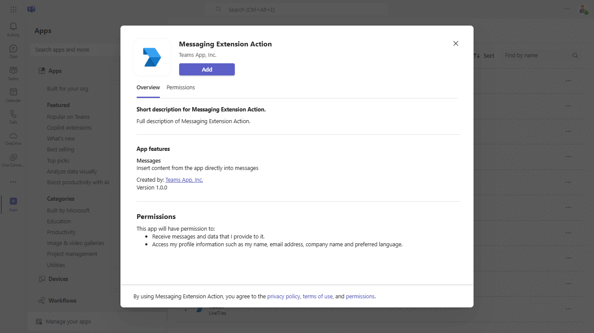
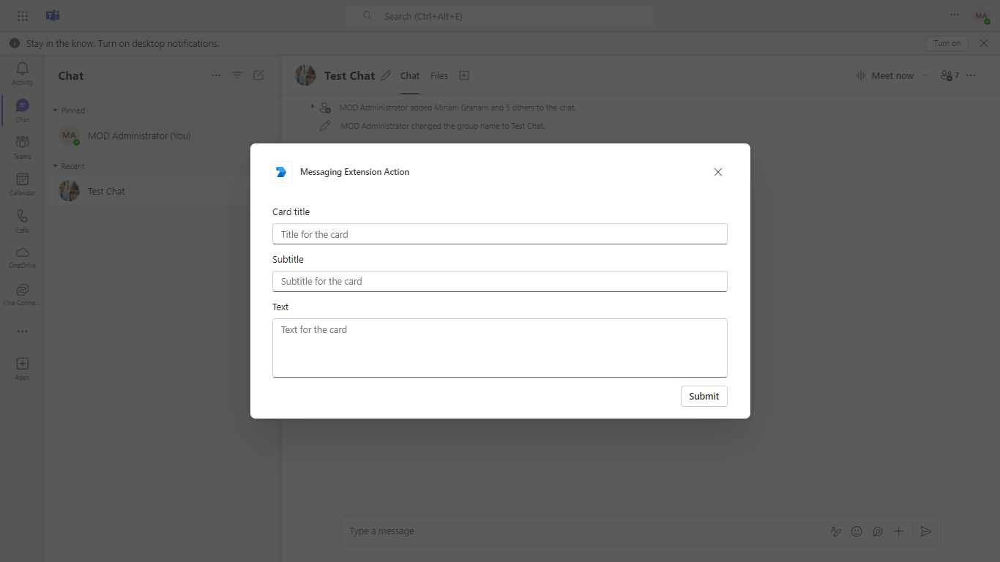
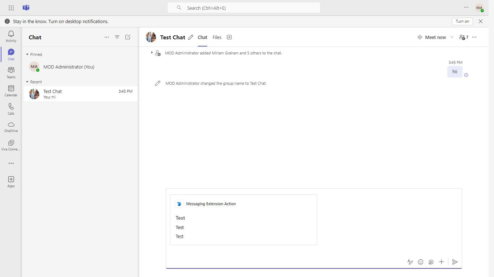
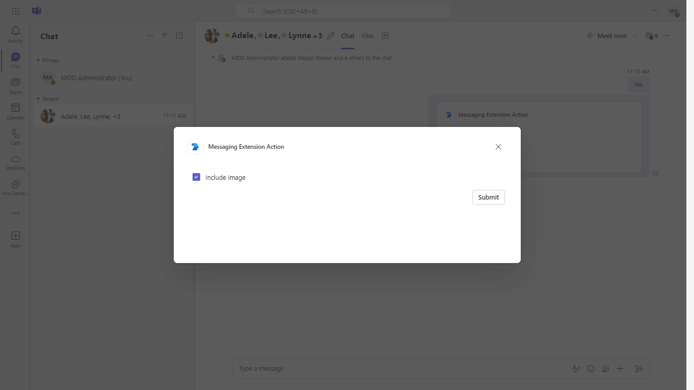
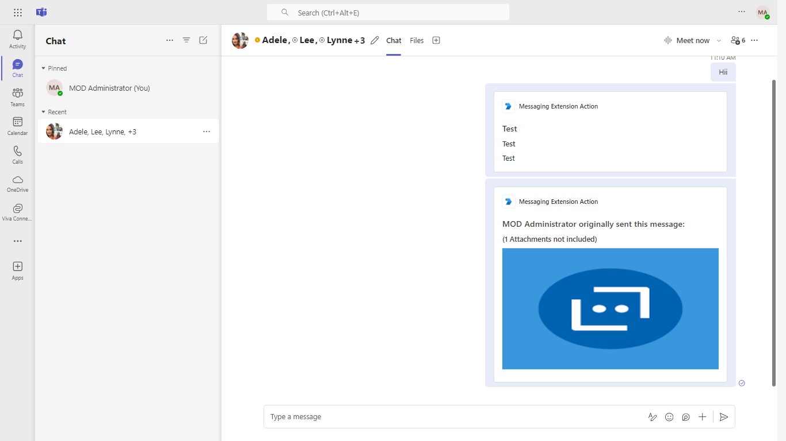

# Action-based Messaging Extension

This sample demonstrates an action-based Messaging Extension in Microsoft Teams. It accepts parameters from the user and returns a Hero Card, handles a message-context action ("Share Message"), and demonstrates link unfurling.

## Included Features
* Bots
* Message Extensions (Action Commands)
* Link Unfurling

## Interaction with app



## Prerequisites

- [Node.js](https://nodejs.org/en/) (version 18, 20, or 22)
- [Microsoft 365 Agents Toolkit for Visual Studio Code](https://marketplace.visualstudio.com/items?itemName=TeamsDevApp.ms-teams-vscode-extension) **or** the [Microsoft 365 Agents Toolkit CLI](https://learn.microsoft.com/microsoftteams/platform/toolkit/teamsfx-cli)
- A [Microsoft 365 developer account](https://docs.microsoft.com/microsoftteams/platform/concepts/build-and-test/prepare-your-o365-tenant) with permission to upload custom apps
- [dev tunnels](https://learn.microsoft.com/azure/developer/dev-tunnels/get-started?tabs=windows) (started automatically by the toolkit during local debugging)

## Run the app (Microsoft 365 Agents Toolkit for Visual Studio Code)

1. Install [Visual Studio Code](https://code.visualstudio.com/) and the [Microsoft 365 Agents Toolkit](https://marketplace.visualstudio.com/items?itemName=TeamsDevApp.ms-teams-vscode-extension) extension.
1. Open this sample folder (`samples/msgext-action-quickstart/js`) in VS Code.
1. Sign in to the toolkit with your Microsoft 365 account.
1. Press **F5** (or **Run > Start Debugging**). The toolkit will:
    - Validate prerequisites
    - Start a dev tunnel exposing port `3978`
    - Provision an AAD app, Teams app, and Azure Bot resource
    - Build and start the bot locally
    - Launch a Teams web client where you can install the app
1. Click **Add** in the Teams install dialog and try the **Create Card** and **Share Message** commands from the message extension.

> If you don't have permission to upload custom apps, the toolkit can help you sign up for a free [Microsoft 365 Developer Program](https://developer.microsoft.com/microsoft-365/dev-program) tenant.

## Run the app (Manual setup)

1. **Register a Microsoft Entra ID (Azure AD) application**
    - Go to [Microsoft Entra ID - App Registrations](https://go.microsoft.com/fwlink/?linkid=2083908) and choose **New registration**.
    - Give it a name, choose any supported account type, leave Redirect URI blank, and **Register**.
    - From the **Overview** page, copy the **Application (client) ID** and **Directory (tenant) ID**.
    - Under **Certificates & secrets**, create a **client secret** and copy its value.
    - Under **API permissions**, add `User.Read` (Microsoft Graph - Delegated) and grant admin consent.

2. **Create an Azure Bot resource**
    - Follow [Create a bot resource](https://learn.microsoft.com/azure/bot-service/abs-quickstart) using the App ID from step 1.
    - Enable the **Microsoft Teams** channel.
    - Set the messaging endpoint to `https://<your_tunnel_domain>/api/messages`.

3. **Start a tunnel for `localhost:3978`**

    ```powershell
    devtunnel host -p 3978 --allow-anonymous
    ```

4. **Configure and run the bot**

    ```powershell
    git clone https://github.com/OfficeDev/Microsoft-Teams-Samples.git
    cd Microsoft-Teams-Samples/samples/msgext-action-quickstart/js
    npm install
    ```

    Edit `.env` and set:

    ```
    MicrosoftAppId=<App ID from step 1>
    MicrosoftAppPassword=<Client secret from step 1>
    MicrosoftAppType=MultiTenant
    MicrosoftAppTenantId=<Tenant ID>
    ```

    Start the app:

    ```powershell
    npm start
    ```

5. **Sideload the Teams app**
    - Edit `appManifest/manifest.json`: replace every `${{AAD_APP_CLIENT_ID}}` with your bot App ID, `${{BOT_DOMAIN}}` with your tunnel domain (e.g. `abcd-1234.devtunnels.ms`), and `${{TEAMS_APP_ID}}` with a new GUID.
    - Zip the contents of `appManifest/` into `manifest.zip`.
    - In Teams, go to **Apps > Manage your apps > Upload an app > Upload a custom app** and select `manifest.zip`.

## Required API permissions

This sample uses only Microsoft Bot Framework / Teams platform APIs - it does not call Microsoft Graph at runtime. The minimal AAD permissions needed for the registered app are:

| Resource | Permission | Type | Required for |
|---|---|---|---|
| Microsoft Graph | `User.Read` | Delegated | Default sign-in (already present) |

Grant admin consent after adding the permission.

If you extend the sample to call Microsoft Graph (e.g. to fetch user, team, or chat data), add the corresponding delegated permissions (such as `User.ReadBasic.All` or `TeamMember.Read.All`) and grant admin consent.

The Teams app manifest declares:

- `permissions`: `identity`, `messageTeamMembers`
- `validDomains`: `token.botframework.com`, `${{BOT_DOMAIN}}`

No Resource-Specific Consent (RSC) permissions are required for this scenario.

## Running the sample










## Further reading

- [Action-based Messaging Extensions](https://learn.microsoft.com/microsoftteams/platform/messaging-extensions/how-to/action-commands/define-action-command)
- [CloudAdapter (botbuilder-js)](https://learn.microsoft.com/javascript/api/botbuilder/cloudadapter)
- [Bot Framework Documentation](https://docs.botframework.com)
- [Azure Bot Service Documentation](https://learn.microsoft.com/azure/bot-service/)


