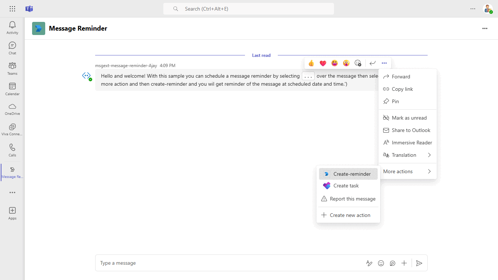
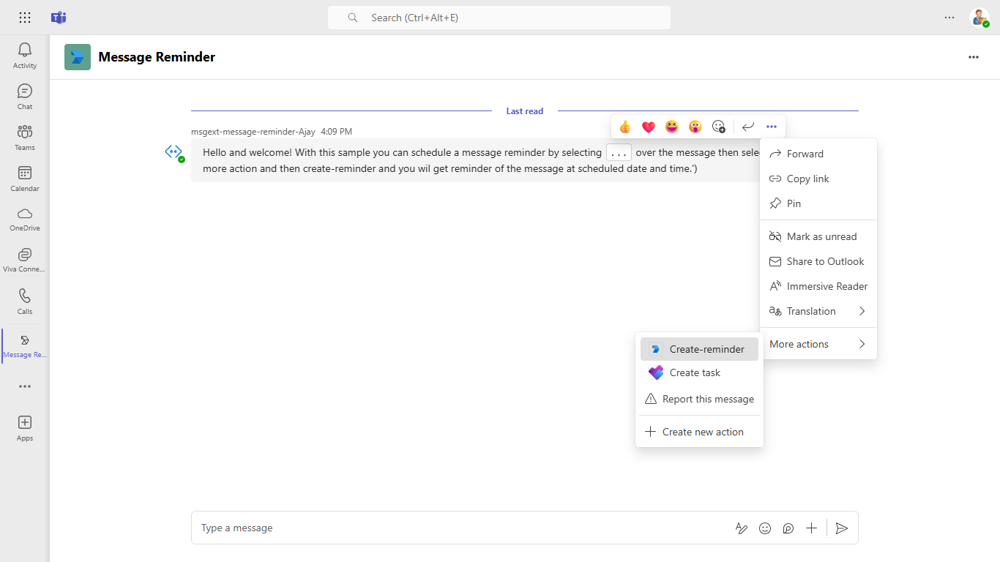
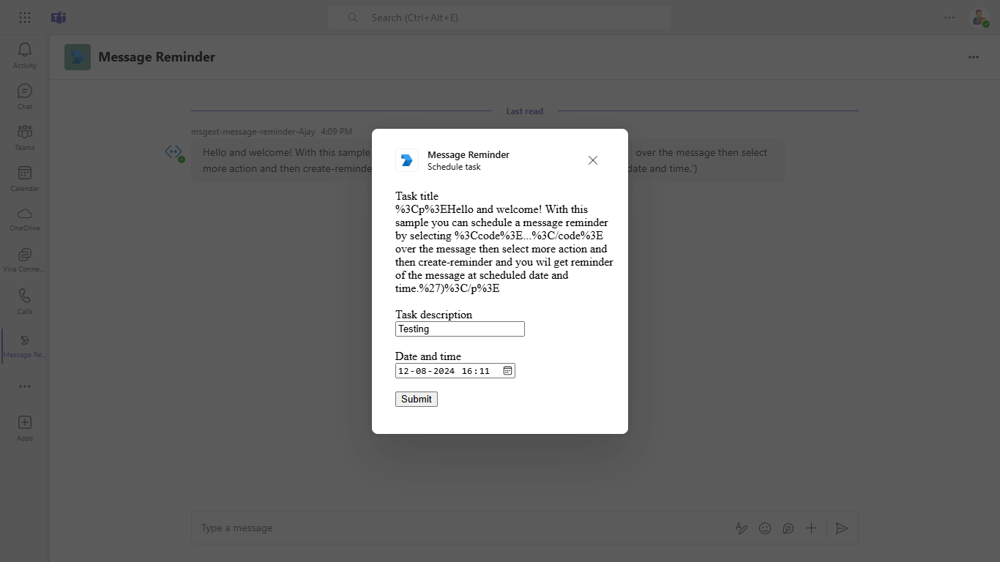
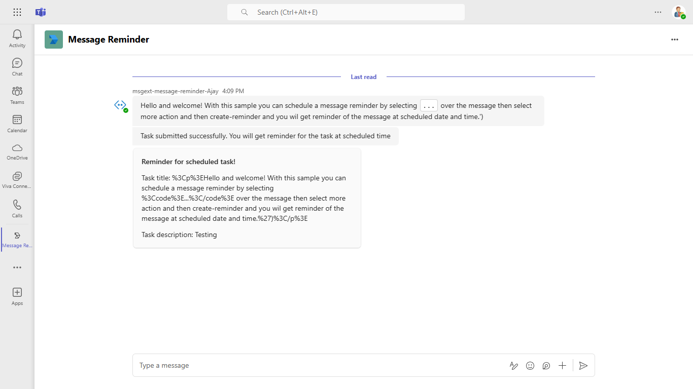
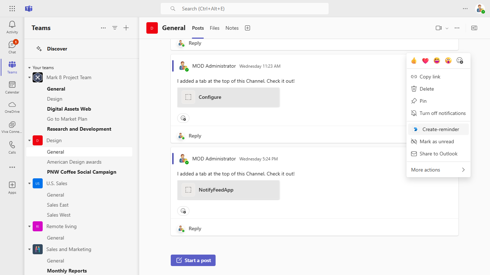
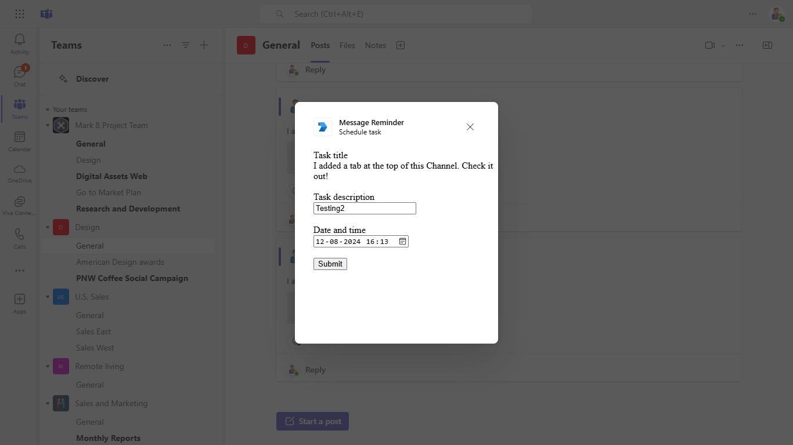
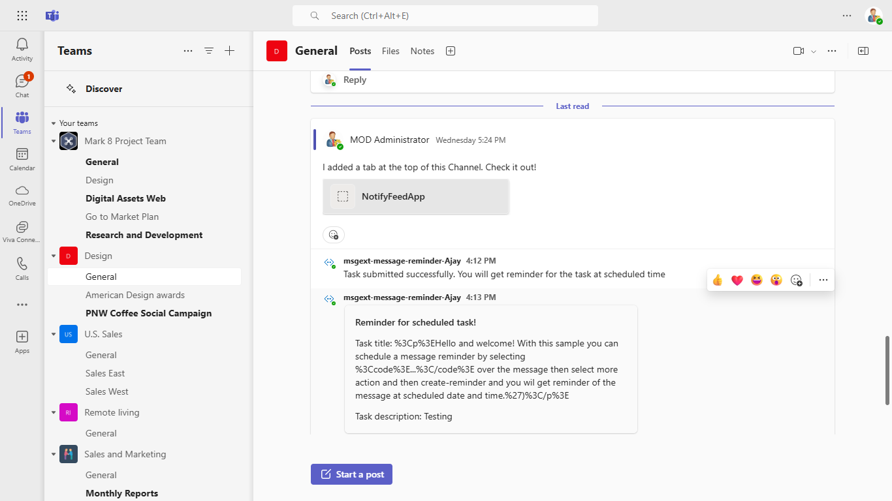

# Message reminder with messaging extension action

This Node.js sample illustrates how to create a Messaging Extension that enables users to schedule tasks from within Microsoft Teams, with reminder cards sent at the scheduled times.

## Interaction with app



## Prerequisites

- [Node.js](https://nodejs.org/) (v18 or higher)
- [Microsoft 365 Agents Toolkit for VS Code](https://marketplace.visualstudio.com/items?itemName=TeamsDevApp.ms-teams-vscode-extension)
- Microsoft Teams account with permission to upload custom apps
- [Dev tunnel](https://learn.microsoft.com/azure/developer/dev-tunnels/get-started?tabs=windows) or [ngrok](https://ngrok.com/download) for local testing

## Run the app (Using Microsoft 365 Agents Toolkit for Visual Studio Code)

The simplest way to run this sample in Teams is to use Microsoft 365 Agents Toolkit for Visual Studio Code.

1. Ensure you have downloaded and installed [Visual Studio Code](https://code.visualstudio.com/docs/setup/setup-overview)
1. Install the [Microsoft 365 Agents Toolkit extension](https://marketplace.visualstudio.com/items?itemName=TeamsDevApp.ms-teams-vscode-extension)
1. Select **File > Open Folder** in VS Code and choose this sample's directory from the repo
1. Using the extension, sign in with your Microsoft 365 account where you have permissions to upload custom apps
1. Select **Debug > Start Debugging** or **F5** to run the app in a Teams web client.
1. In the browser that launches, select the **Add** button to install the app to Teams.

> If you do not have permission to upload custom apps (sideloading), Microsoft 365 Agents Toolkit will recommend creating and using a Microsoft 365 Developer Program account - a free program to get your own dev environment sandbox that includes Teams.

## Setup (Manual)

1. **App Registration**
   - Register a new application in the [Microsoft Entra ID – App Registrations](https://go.microsoft.com/fwlink/?linkid=2083908) portal.
   - Set **name** to your app name, choose **supported account types** (single tenant), and **Register**.
   - Copy the **Application (client) ID** and **Directory (tenant) ID**.
   - Navigate to **API Permissions** and add: `User.Read` (delegated, enabled by default).
   - Grant admin consent for the required permissions.

2. **Bot Setup**
   - Create an [Azure Bot resource](https://docs.microsoft.com/azure/bot-service/bot-builder-authentication?view=azure-bot-service-4.0&tabs=csharp%2Caadv2).
   - [Enable the Teams Channel](https://docs.microsoft.com/azure/bot-service/channel-connect-teams?view=azure-bot-service-4.0).
   - Set the messaging endpoint to `https://<your_tunnel_domain>/api/messages`.

3. **Tunnel Setup**

   ```bash
   devtunnel host -p 3978 --allow-anonymous
   ```

4. **Run the app**
   - Clone the repository and navigate to `samples/msgext-message-reminder/nodejs`
   - Create a `.env` file with:
     ```
     MicrosoftAppId=<your-app-id>
     MicrosoftAppPassword=<your-client-secret>
     MicrosoftAppType=SingleTenant
     MicrosoftAppTenantId=<your-tenant-id>
     BaseUrl=<your-tunnel-url>
     ```
   - Install dependencies and start:
     ```bash
     npm install
     npm start
     ```

5. **Upload manifest**
   - Edit `appManifest/manifest.json` and replace `${{AAD_APP_CLIENT_ID}}` with your App ID, `${{BOT_DOMAIN}}` with your tunnel domain.
   - Zip the contents of `appManifest/` and upload to Teams.

## Running the sample

**Personal scope:**

Select `...` over a message to get the `create-reminder` action for scheduling a task.



Task module to schedule a task.



Reminder card at the scheduled date and time.



**Team scope:**

Navigate to the team where the app is installed.

Select `...` over a message to get the `create-reminder` action.



Task module to schedule a task.



Reminder card at the scheduled date and time.



## API Permissions

This sample requires the following Microsoft Graph delegated permission:
- `User.Read` (enabled by default)

No additional admin-consented permissions are needed for basic functionality.

## Further reading

- [Messaging Extension Action Commands](https://learn.microsoft.com/microsoftteams/platform/messaging-extensions/how-to/action-commands/define-action-command)
- [Bot Framework Documentation](https://docs.botframework.com)
- [Azure Bot Service](https://docs.microsoft.com/azure/bot-service/?view=azure-bot-service-4.0)
- [Proactive Messaging](https://learn.microsoft.com/microsoftteams/platform/bots/how-to/conversations/send-proactive-messages)


