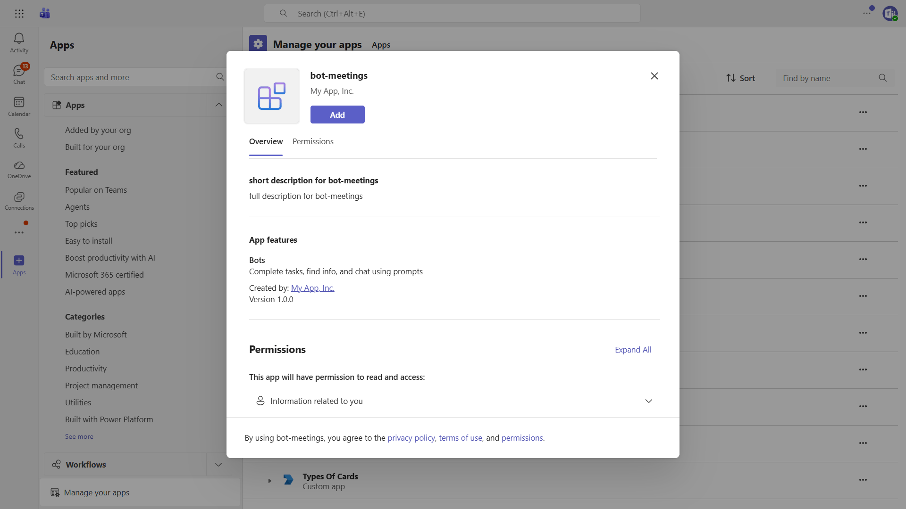

# Bot Meetings

This sample demonstrates how to handle real-time meeting events and retrieve meeting transcripts in Microsoft Teams. It showcases:

- **Real-time Meeting Events** - Receives and displays meeting start, end, and participant join/leave events
- **Meeting Transcripts** - Retrieves and displays meeting transcripts via Microsoft Graph API
- **Adaptive Cards** - Interactive cards for viewing transcripts in task modules
- **RSC Permissions** - Resource-specific consent for meeting access

## Table of Contents

- [Interaction with Bot](#interaction-with-bot)
- [Sample Implementations](#sample-implementations)
- [Prerequisites](#prerequisites)
- [Setup Instructions](#setup-instructions)
  - [1. Setup Local Tunnel](#1-setup-local-tunnel)
  - [2. Provision the App with the Teams Developer CLI](#2-provision-the-app-with-the-teams-developer-cli)
  - [3. Add Graph API Permissions and Grant Admin Consent](#3-add-graph-api-permissions-and-grant-admin-consent)
  - [4. Configure Application Access Policy](#4-configure-application-access-policy)
  - [5. Add RSC Permissions and Enable Meeting Participant Events](#5-add-rsc-permissions-and-enable-meeting-participant-events)
  - [6. Setup Code](#6-setup-code)
- [Running the Sample](#running-the-sample)
- [Troubleshooting](#troubleshooting)
- [Further Reading](#further-reading)

## Interaction with Bot



## Sample Implementations

| Language | Framework | Directory |
|----------|-----------|-----------|
| C# | .NET / ASP.NET Core | [dotnet/bot-meetings](dotnet/bot-meetings/README.md) |
| TypeScript | Node.js | [nodejs/bot-meetings](nodejs/bot-meetings/README.md) |
| Python | Python | [python/bot-meetings](python/bot-meetings/README.md) |

## Prerequisites

- Microsoft Teams is installed and you have an account (not a guest account)
- [M365 developer account](https://docs.microsoft.com/en-us/microsoftteams/platform/concepts/build-and-test/prepare-your-o365-tenant) or access to a Teams account with the appropriate permissions to install an app
- [dev tunnel](https://learn.microsoft.com/en-us/azure/developer/dev-tunnels/get-started?tabs=windows) or [ngrok](https://ngrok.com/download) latest version or equivalent tunneling solution
- [Teams Developer CLI](https://microsoft.github.io/teams-sdk/cli/installation): `npm install -g @microsoft/teams.cli`

## Setup Instructions

### 1. Setup Local Tunnel

**Using dev tunnels:**

Please follow [Create and host a dev tunnel](https://learn.microsoft.com/en-us/azure/developer/dev-tunnels/get-started?tabs=windows) and host the tunnel with anonymous user access:

```bash
devtunnel host -p 3978 --allow-anonymous
```

**Using ngrok:**

```bash
ngrok http 3978 --host-header="localhost:3978"
```

Take note of the tunnel URL (e.g. `https://12345.devtunnels.ms` or `https://1234.ngrok-free.app`); you''ll use it as the bot messaging endpoint and tunnel domain in subsequent steps.

### 2. Provision the App with the Teams Developer CLI

The [Teams Developer CLI](https://microsoft.github.io/teams-sdk/cli/) provisions your Microsoft Entra app, Teams-managed bot registration, Teams app manifest, and writes the credentials directly into your project''s environment file in a single command.

Sign in with your M365 account:

```bash
teams login
```

From the language-specific sample directory you want to run, provision the app and credentials.

For Node.js and Python (`nodejs/bot-meetings` or `python/bot-meetings`):

```bash
teams app create --name "Bot Meetings" --endpoint https://<your-tunnel-domain>/api/messages --env .env
```

For .NET (`dotnet/bot-meetings`):

```bash
teams app create --name "Bot Meetings" --endpoint https://<your-tunnel-domain>/api/messages --env appsettings.json
```

This single command creates a Microsoft Entra app registration, registers a Teams-managed bot pointing at your tunnel endpoint, generates the Teams app manifest, and writes `CLIENT_ID`, `CLIENT_SECRET`, and `TENANT_ID` into the environment file you specified (PascalCase keys under a `Teams` section for `appsettings.json`).

The CLI prints a Teams app ID on success - save it; you''ll use it in step 5 when adding RSC permissions.

### 3. Add Graph API Permissions and Grant Admin Consent

The CLI provisions a baseline Microsoft Entra app, but the meeting Graph API permissions used by this sample must still be added manually in the portal:

- Open your app registration in the [Microsoft Entra ID - App Registrations](https://go.microsoft.com/fwlink/?linkid=2083908) portal (it will be named "Bot Meetings" from step 2)
- Navigate to **API Permissions** -> **Add a permission** -> **Microsoft Graph**
- Under **Delegated permissions**, ensure `User.Read` is present (added by default)
- Under **Application permissions**, add:
  - `OnlineMeetings.Read.All` (for reading meeting information)
  - `OnlineMeetingTranscript.Read.All` (for reading meeting transcripts)
- Click **Add permissions**
- Click **Grant admin consent** to consent for the required permissions

> **Note**: Admin consent is required for application permissions. If you are not a Global Administrator, contact your tenant admin to grant consent, or use this link: `https://login.microsoftonline.com/common/adminconsent?client_id=<YOUR_APP_ID>`

### 4. Configure Application Access Policy

Online meeting application access policies cannot be configured through the Teams CLI; they must be created and granted via PowerShell.

Follow this link - [Configure application access policy](https://docs.microsoft.com/en-us/graph/cloud-communication-online-meeting-application-access-policy)

Follow this link - [Manage policies via PowerShell](https://learn.microsoft.com/en-us/microsoftteams/teams-powershell-managing-teams#manage-policies-via-powershell)


### 5. Add RSC Permissions and Enable Meeting Participant Events

**Add RSC permissions via the Teams CLI:**

Using the Teams app ID returned by `teams app create` in step 2, add the resource-specific consent permissions this sample requires:

```bash
teams app rsc add <teamsAppId> OnlineMeeting.ReadBasic.Chat --type Application
teams app rsc add <teamsAppId> OnlineMeetingTranscript.Read.Chat --type Application
teams app rsc add <teamsAppId> ChannelMeeting.ReadBasic.Group --type Application
teams app rsc add <teamsAppId> OnlineMeetingParticipant.Read.Chat --type Application
```

These permissions allow the bot to:
- Read basic meeting information
- Access meeting transcripts
- Read channel meeting details
- Monitor meeting participant events

**Enable meeting participant events:**

To receive real-time participant join and leave events, enable Meeting event subscriptions for `Participant Join` and `Participant Leave` on the bot registration. The Teams CLI does not currently expose meeting-event subscriptions, so configure them on the bot resource directly (e.g. in the Azure portal for an Azure Bot resource) following the guidance in the [meeting participant events](https://learn.microsoft.com/microsoftteams/platform/apps-in-teams-meetings/meeting-apps-apis?tabs=dotnet#receive-meeting-participant-events) documentation.


**Update manifest scopes:**

Ensure the `bots` entry in `manifest.json` includes the `team`, `personal`, and `groupChat` scopes so the bot can be added to meetings:

```json
"bots": [
  {
    "botId": "",
    "scopes": [
      "team",
      "personal",
      "groupChat"
    ],
    "isNotificationOnly": false
  }
]
```

Re-package and re-upload the manifest if you make changes:

```bash
teams app package
teams app update <teamsAppId> --file appPackage/<package>.zip
```

### 6. Setup Code

**Navigate to your chosen language sample directory:**

```bash
# For Node.js:
cd samples/TeamsSDK/bot-meetings/nodejs/bot-meetings

# For .NET:
cd samples/TeamsSDK/bot-meetings/dotnet/bot-meetings

# For Python:
cd samples/TeamsSDK/bot-meetings/python/bot-meetings
```

**Install dependencies:**

For Node.js:
```bash
npm install
```

For .NET:
```bash
dotnet restore
```

For Python:
```bash
pip install -e .
```

**Start the bot:**

For Node.js:
```bash
npm start
```

For .NET:
```bash
dotnet run
```

For Python:
```bash
python app.py
```

## Running the Sample

Once the bot is running and added to Teams, you can interact with it in meetings to:

- Receive real-time notifications when meetings start, end, or when participants join/leave
- Request and view meeting transcripts
- Use adaptive cards to interact with meeting data

## Troubleshooting

- If Teams cannot communicate with your bot, verify your tunnel URL is reachable
- Ensure your `.env` or `appsettings.json` file is set up correctly
- Verify that admin consent has been granted for the required Graph API permissions
- Check that the application access policy has been configured correctly for your user
- Confirm that Meeting event subscriptions are enabled in the bot registration
- Use the Channels UI in Azure Bot Service in the Azure Portal to see detailed endpoint errors

## Further Reading

### Teams Development
- [Microsoft Teams SDK Documentation](https://learn.microsoft.com/microsoftteams/platform/) - Official Microsoft Teams platform documentation
- [Teams Developer CLI](https://microsoft.github.io/teams-sdk/cli/) - Command-line provisioning for Teams apps

### Meeting Events & Transcripts
- [Meeting participant events](https://learn.microsoft.com/microsoftteams/platform/apps-in-teams-meetings/meeting-apps-apis?tabs=dotnet#receive-meeting-participant-events) - Real-time meeting participant events
- [Configure application access policy](https://docs.microsoft.com/en-us/graph/cloud-communication-online-meeting-application-access-policy) - Application access for online meetings

### Tools & Resources
- [Azure Bot Service](https://azure.microsoft.com/services/bot-services/) - Cloud-based bot development service