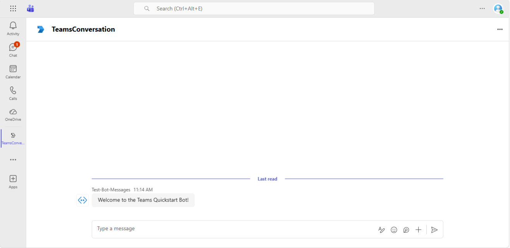

# Bot Quickstart

This sample demonstrates how to handle various bot conversation events in Microsoft Teams.

## Table of Contents

- [Interaction with Bot](#interaction-with-bot)
- [Sample Implementations](#sample-implementations)
- [How to run these samples](#how-to-run-these-samples)
  - [Run in the Teams Client](#run-in-the-teams-client)
    - [Configure DevTunnels](#configure-devtunnels)
  - [Provision with the Teams Developer CLI](#provision-with-the-teams-developer-cli)
- [Troubleshooting](#troubleshooting)
- [Further Reading](#further-reading)

## Interaction with Bot



The bot responds to the following commands:

* **Who am I?** - Gets information about the current user
* **Mention me** - The bot mentions the user in its response
* **Echo {message}** - The bot echoes back the provided message

## Sample Implementations

| Language | Framework | Directory |
|----------|-----------|-----------|
| C# | .NET 10 / ASP.NET Core | [dotnet/bot-quickstart](dotnet/bot-quickstart/README.md) |
| TypeScript | Node.js | [nodejs/bot-quickstart](nodejs/bot-quickstart/README.md) |
| Python | Python | [python/bot-quickstart](python/bot-quickstart/README.md) |

# How to run these samples

You can run these samples locally in the Teams Client after you have provisioned the Teams app, written its credentials into your project's environment file, and started the bot against a public DevTunnels URL.

## Run in the Teams Client

To run these samples in the Teams Client, you need to provision your app in an M365 tenant and configure the app to your DevTunnels URL.

1. Install the [DevTunnels CLI](https://learn.microsoft.com/en-us/azure/developer/dev-tunnels/get-started)
2. Get access to an [M365 Developer Tenant](https://learn.microsoft.com/en-us/office/developer-program/microsoft-365-developer-program-get-started)
3. Install the [Teams Developer CLI](https://microsoft.github.io/teams-sdk/cli/installation): `npm install -g @microsoft/teams.cli`

### Configure DevTunnels

Create a persistent tunnel for port 3978 with anonymous access:

```bash
devtunnel create -a my-tunnel
devtunnel port create -p 3978 my-tunnel
devtunnel host my-tunnel
```

Take note of the URL shown after *Connect via browser:*

## Provision with the Teams Developer CLI

The [Teams Developer CLI](https://microsoft.github.io/teams-sdk/cli/) provisions your Microsoft Entra app, Teams-managed bot registration, Teams app manifest, and writes the credentials directly into your project's environment file in a single command.

Sign in with your M365 account:

```bash
teams login
```

From the language-specific sample directory you want to run, provision the app and credentials.

For Node.js and Python (`nodejs/<sample>` or `python/<sample>`):

```bash
teams app create --name "<App Name>" --endpoint https://<your-devtunnel-domain>/api/messages --env .env
```

For .NET (`dotnet/<sample>`):

```bash
teams app create --name "<App Name>" --endpoint https://<your-devtunnel-domain>/api/messages --env appsettings.json
```

This single command creates a Microsoft Entra app registration, registers a Teams-managed bot pointing at your DevTunnels endpoint, generates and uploads the Teams app manifest, and writes `CLIENT_ID`, `CLIENT_SECRET`, and `TENANT_ID` into the environment file you specified (PascalCase keys under a `Teams` section for `appsettings.json`).

Once provisioning completes, start your bot - the sample will pick up the credentials automatically - and sideload the app from the prompt in Teams. See the [Teams Developer CLI documentation](https://microsoft.github.io/teams-sdk/cli/) for the full command reference.

> **Tip**: Using an AI coding assistant (GitHub Copilot CLI, Claude Code, Cursor, VS Code)? Install the [`teams-dev` agent skill](https://microsoft.github.io/teams-sdk/developer-tools/agent-skills) to drive these CLI steps from natural language - your assistant runs the right commands, manages credentials, and guides you through bot registration end-to-end.

# Teams SDK Troubleshooting

If you encounter errors you believe exists in Teams SDK, you can file an issue in GitHub for the langauge in which you encountered the issue
- [C#](https://github.com/microsoft/teams.net/issues/new/choose)
- [TypeScript](https://github.com/microsoft/teams.ts/issues/new/choose)
- [Python](https://github.com/microsoft/teams.py/issues/new/choose)

You can file general issues that exists across all SDK langauges [here](https://github.com/microsoft/teams-sdk/issues/new/choose)

## General Troubleshooting

- If Teams cannot communicate with your bot, verify your DevTunnels URL is reachable.
- Ensure your `.env` or `appsettings.json` file is set up correctly.
- Use the Channels UI in Azure Bot Service in the Azure Portal to see detailed endpoint errors.

## Further Reading

- [Microsoft Teams SDK Documentation](https://learn.microsoft.com/microsoftteams/platform/)
- [Teams Developer CLI](https://microsoft.github.io/teams-sdk/cli/)
- [`teams-dev` Agent Skill](https://microsoft.github.io/teams-sdk/developer-tools/agent-skills) - AI coding assistant skill that drives the Teams Developer CLI via natural language