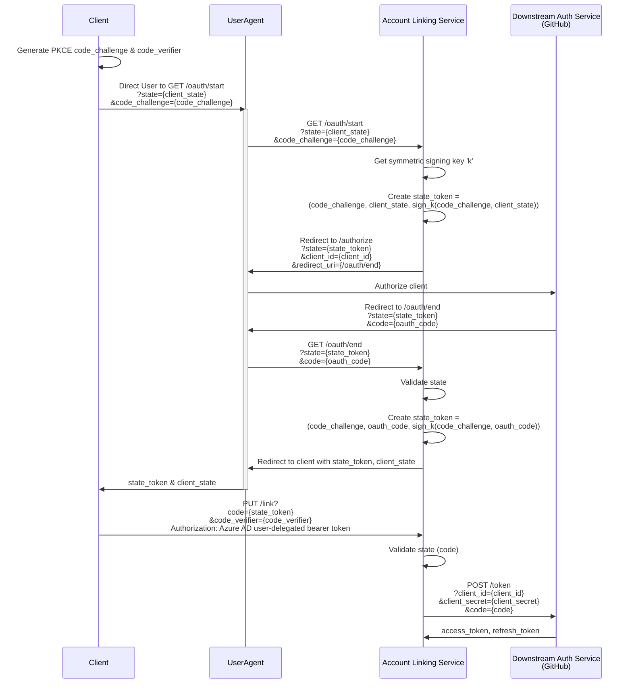
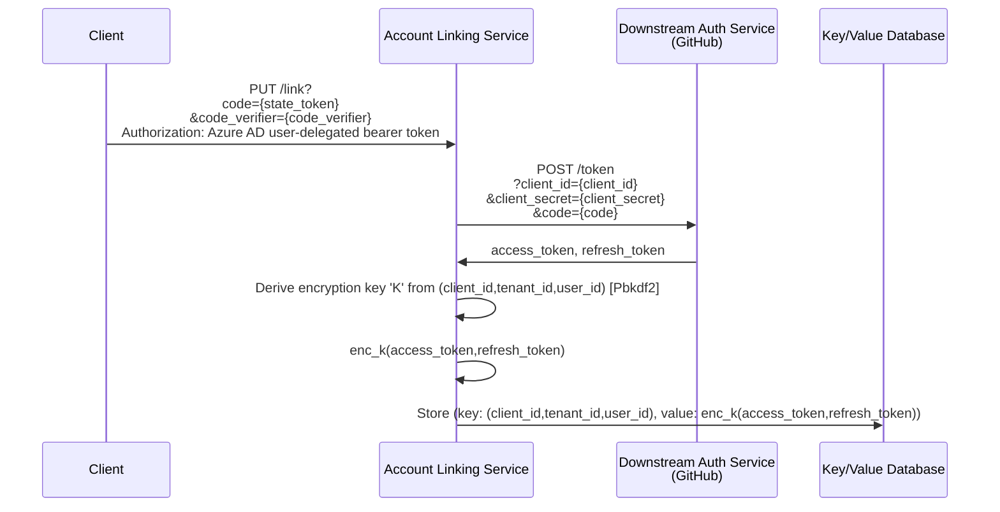
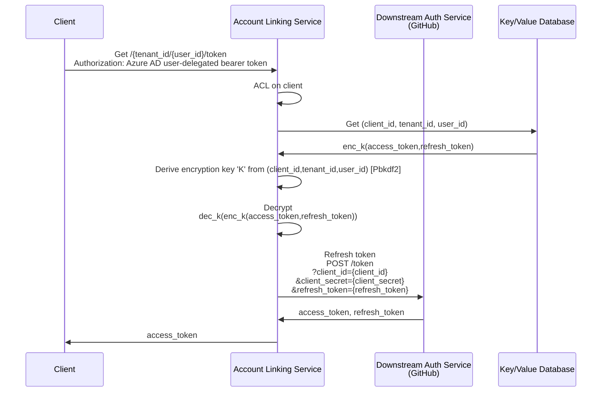

# Account linking flows
This document outlines the various (sub) flows that are used in account linking

## Authorization flow
The authorization flow is effectively and [OAuth2.0 authorization code grant](https://datatracker.ietf.org/doc/html/rfc6749#section-4.1) nested inside an [OAuth2.0 PKCE public client grant](https://datatracker.ietf.org/doc/html/rfc7636). 

The assumption is there is an existing trust relationship between the `Client` and the `Account Linking Service`. In the existing sample they are in the same process but in the abstract this could be done via any authentication of the client on the requests to the service.

In the above sample the open & close of the `User Agent` change based on capability. For Tab, this is the authentication popup, for conversational bot it is the OAuthCard and for Messaging Extension it is the auth invoke response. 

## Credential Storage flow
The storage flow is involved in securely storing the token credentials.

The goal is to ensure that the database is untrusted in case of a security breach. To that end each value is [encrypted with a symmetric derived key](https://datatracker.ietf.org/doc/html/rfc2898#section-5.2) from the user/tenant ids.

## Credential retrieval flow
The retrieval flow is the reverse of the storage flow. It performs the [OAuth2.0 refresh flow](https://datatracker.ietf.org/doc/html/rfc6749#section-6) if necessary.

