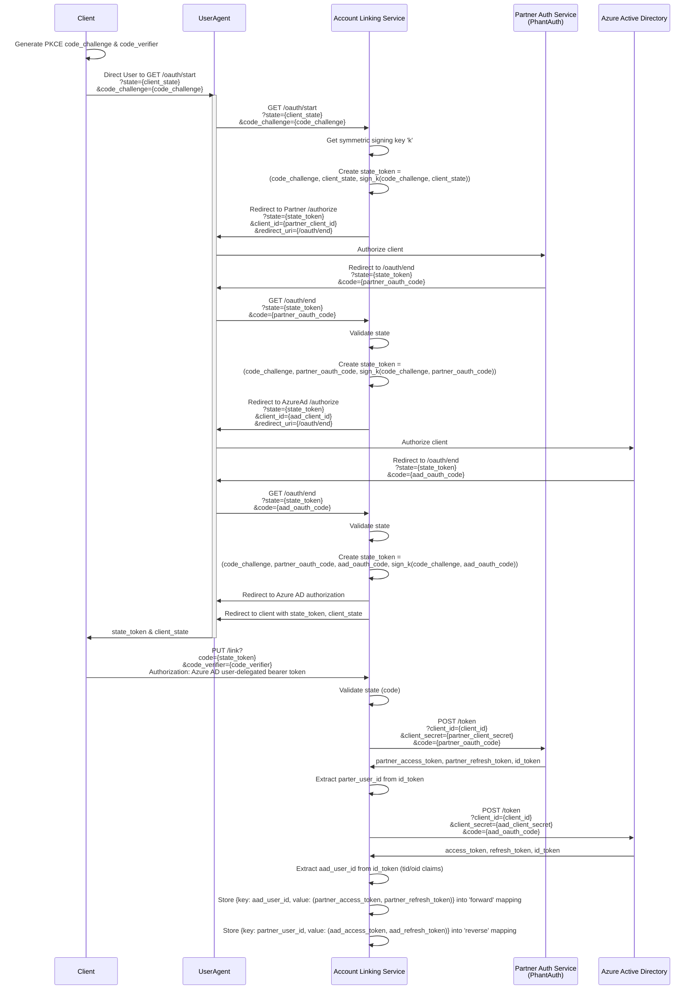

# V2 Eng 1 Pager
The second iteration of the account linking sample is going to be focused on the 'reverse' path where the account-linking is bidirectional so the partner developer can
use their native identifier for the user to perform actions in M365. 

The implementation is just going to be repeating the work in v1 just with AzureAd as the target resource that we maintain refresh and access tokens for. It will maintain two tables,
one that keeps the user's M365 identity as the key and the refresh/access tokens as the value (what we have in v1) and another that keeps their partner identity as the key and the AzureAD refresh/access tokens as the value. 

## Goals
1. 'Reverse' path (external identity => Azure AD access token)
2. Show how to 'silently' try SSO and raise consent iff necessary
3. Show how to chain together AzureAD consent & partner consent in a single auth popup / flow.

### Additional nice-to-have
1. Allow for "client" configuration / multiple clients

## Implementation
Given that we need the reverse path from the partner system back into AzureAD we need to add the concept of the user's identity in the partner system. We need to be able to perform 4 operations

1. Authorize client in both AzureAd and partner system (link the identities)
2. Get the AzureAd access token given the partner id for the user
3. Get the partner auth token given the azure id for the user
4. Unlink the two accounts

Use [phantauth](phantauth.net/doc/) and demonstrate this using the OIDC system. Need to do this since we need a stable way to know the 
'partner' system's id. The most "standards" compliant way would be OIDC.

### Auth Flow

### Client implementations
#### Teams App
Need Tab / ME / Conversational Bot

Call /user with PhantAuth? 

#### External App
Need 'login with PhantAuth'

Post notification? Just get the /me endpoint result?

### Open Items
1. How to pass login hint(s) to the Azure Flow
2. What to do w/o id_token (or usable claims from id token)
3. Token bloat, how big is too big? 
4. What 'action' should be demonstrated on the Azure side. Notification would be ideal but that is a pretty involved scenario in its own right - /me is easiest but hard to demonstrate the value add.
5. Does it make sense to factor this out into 3 separate processes (one Teams app, one public app, account linking service) or leave as a single monolith
    pro breakout: clearly demonstrates responsibility & dependencies
    con breakout: setup gets more complex, registration more complex, includes (likely minimal) S2S auth concerns.

