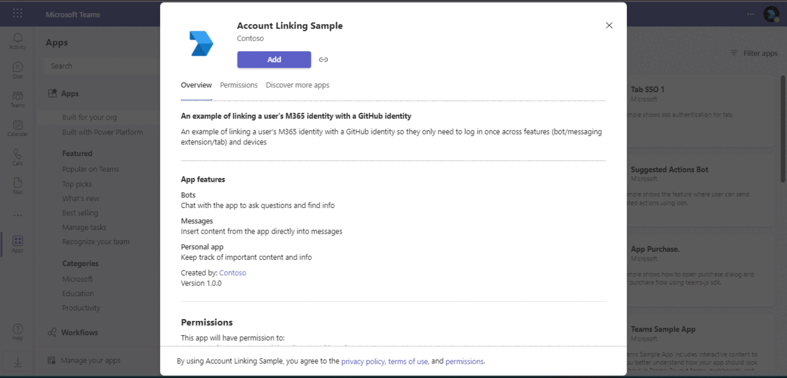
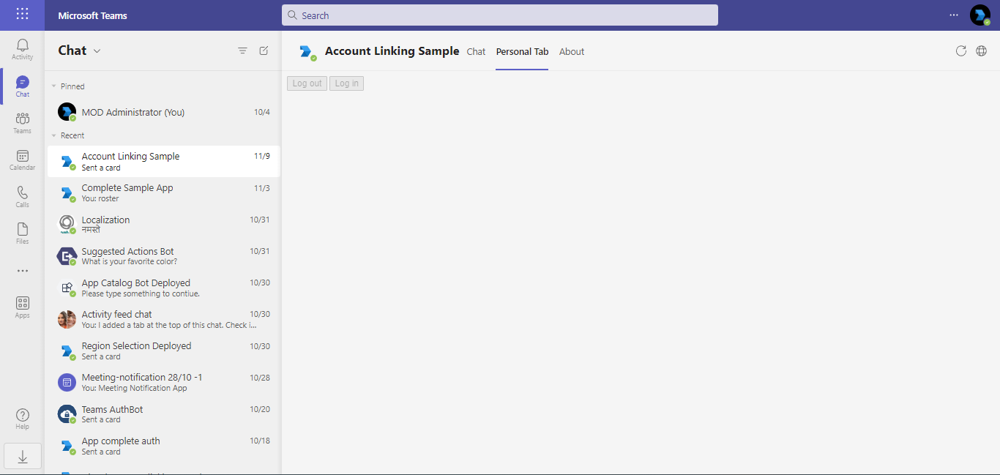
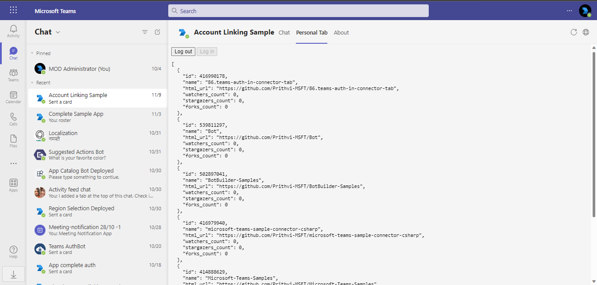
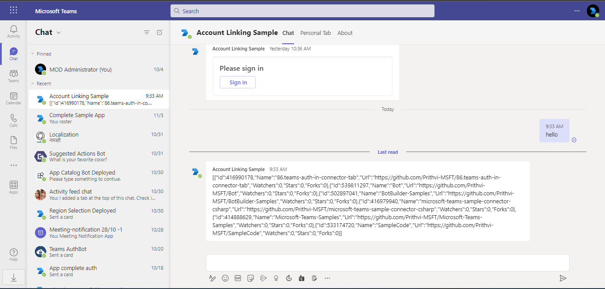
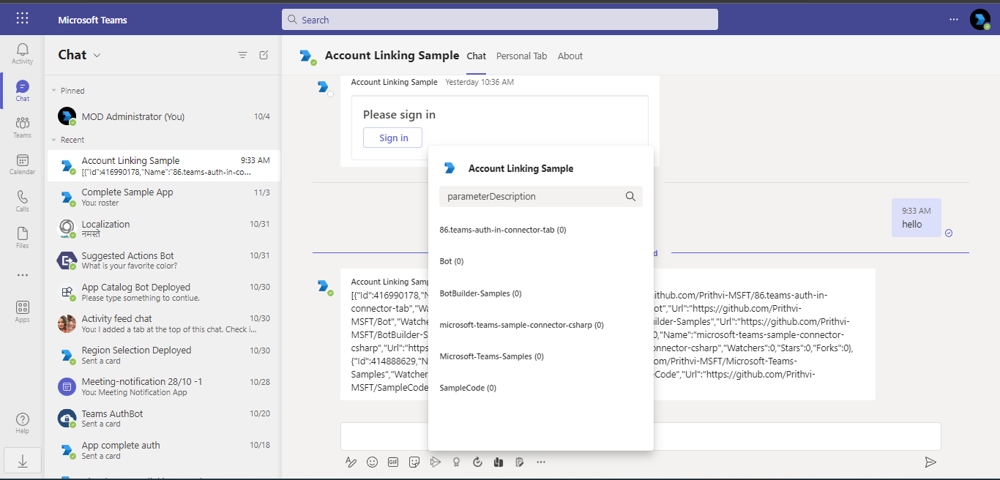

# External OAuth identity linking in Teams Apps.

This sample demos linking user's AAD id with their GitHub identity. 

The code generically handles account linking for OAuth2.0, the only GitHub specifics are related to calling the GitHub API.



Please see the [Code Tours](#code-tours) section for in-depth explanation of the sample. 

## About the sample
After the user installs the app, they will be prompted when using any of the capabilities (tab / conversational bot / messaging extension) to log into GitHub. After logging in the app will store the users access and refresh tokens so that they won't need to log in again across the other capabilities or on other devices. 

There are example in-memory and Azure implementations of the token persistance. 

## Prerequisites

- [.NET Core SDK](https://dotnet.microsoft.com/download) version 6.0

  determine dotnet version
  ```bash
  dotnet --version
  ```
- [ngrok](https://ngrok.com/download) (For local environment testing) Latest (any other tunneling software can also be used)
  
  run ngrok locally
  ```bash
  ngrok http 5001 --host-header="localhost:5001"
  ```

## Setup
### 1. Getting the domain name
If you are running this app locally, you will probably be using some form of tunnel to your local machine. For this sample we use [ngrok](https://ngrok.com)

```bash
ngrok http 5001 --host-header="localhost:5001"
```

```bash
Session Status                online
Account                       {{REDACTED}}
Version                       2.3.40
Region                        United States (us)
Web Interface                 http://127.0.0.1:4040
Forwarding                    http://590a2d6f8b31.ngrok-free.app -> https://localhost:5001
Forwarding                    https://590a2d6f8b31.ngrok-free.app -> https://localhost:5001
Connections                   ttl     opn     rt1     rt5     p50     p90
                              0       0       0.00    0.00    0.00    0.00                
```

For this example, we'll use the `590a2d6f8b31.ngrok-free.app` as our domain name.

### 2. Provision an Azure AD application for Tab SSO
Please follow the instructions on [creating an Azure AD application with Tab SSO](https://docs.microsoft.com/en-us/microsoftteams/platform/tabs/how-to/authentication/auth-aad-sso?tabs=dotnet#1-create-your-azure-ad-application). The fully qualified domain name will be the ngrok url from before.

#### 2.1 Configure the app for v2 tokens
**IMPORTANT** Please ensure the `accessTokenAcceptedVersion` in the `Manifest` blade is set to `2`.


Please save for a future step
1. The `Application (client) id` from the "Overview" blade for the app
2. A client secret from the "Certificates & secrets" page

### 3. Configure Azure Bot
Create a new [Azure Bot Registration]() and [connect it to Microsoft Teams](https://docs.microsoft.com/en-us/azure/bot-service/channel-connect-teams?view=azure-bot-service-4.0)

Please save  
1. The `Application (client) id` from the "Overview" blade for the bot (called the bot id going forward)
2. A client secret from the "Certificates & secrets" page (called the bot secret going forward)

### 4. Provision a GitHub app
Please follow the instructions on [creating a GitHub App](https://docs.github.com/en/developers/apps/building-github-apps/creating-a-github-app).

The "callback url" will be `https://{{your-domain}}/oauth/end`, e.g. `https://590a2d6f8b31.ngrok-free.app/oauth/end`.

Please save
1. The `Client ID`
2. A `client secret` 

### 5. Filling in the Manifest file
Please fill in the following values into the `Manifest/Manifest.json` file (called out using the `{{ }}` fences)

| Parameter  | Value |
|---|---|
| Bot Id  | The "Application (client) id" from step 3. |
| Azure Ad Application Id | the "Application (client) id" from step 2| 
|Base Url | The base url of your application. For example, if you are using ngrok then your base URL will be like: `https://590a2d6f8b31.ngrok-free.app`.
|Base Url Domain| The base url domain of your application. For example, if you are using ngrok then your domain name will be like: `590a2d6f8b31.ngrok-free.app`.

### 6. Clone the repository

    ```bash
    git clone https://github.com/OfficeDev/Microsoft-Teams-Samples.git
    ```

### 7. Filling in the app settings
Please copy the `Source/appsettings.json` into a new file `appsettings.development.json` and fill in the following parameters. 

| Parameter | Value |
| --------- | ----- |
| AzureAd:ClientId | The client id from step 2 |
| AzureAd:ClientSecret | The client secret from step 2 |
| AzureAd:TenantId | `common` | 
| Bot:MicrosoftAppId | The client id from step 3 | 
| Bot:MicrosoftAppPassword | The client secret from step 3 | 
| OAuth:ClientId | The client id from step 4 | 
| OAuth:ClientSecret | the client secret from step 4 |

Please note the `StateReplay`, `TokenStorage` and `Keyring` sections are unused unless the `UseAzure` setting is `true`.

### 8. Running the app (navigate to `samples/account-linking/csharp/Source`)

```bash
dotnet run
```

### 9. Installing the app
Please follow the documentation on [creating a Microsoft Teams app package](https://docs.microsoft.com/en-us/microsoftteams/platform/concepts/build-and-test/apps-package) and [sideloading your app in Teams](https://docs.microsoft.com/en-us/microsoftteams/platform/concepts/build-and-test/apps-package). 

The "manifest" in question is the `Manifest` directory filled out in step 5.

### 10. (Optional) Enable the Azure Ad version of the integration
If you want to try out the implementation using Azure you will need to provision a few resources first

1. [Storage account (with table storage)](https://docs.microsoft.com/en-us/azure/storage/common/storage-account-overview)
2. [KeyVault](https://azure.microsoft.com/en-us/services/key-vault/)

The `StateReplay:Endpoint`, `TokenStorage:Endpoint` values and `KeyRing` section will need to be filled out with the values from the above.
## Code Tours
This repository uses VSCode [Code Tours](https://marketplace.visualstudio.com/items?itemName=vsls-contrib.codetour#:~:text=A%20%22code%20tour%22%20is%20simply%20a%20series%20of,CONTRIBUTING.md%20file%20and%2For%20rely%20on%20help%20from%20others.) to explain _how_ the code works. 

The tour files can be found in the `.tours` directory.

### 11. Features of the sample

**Tab that will prompt to github authentication:**



**Github details for the user:**



**Github Auth using Bot authentication**



**The user can view the detaiks from ME also:**



## OAuth Issues

If you encounter issues with your OAuth2.0 provider missing parameters it should be small changes to the query string parameters involved in the flow. 

### Authorization missing parameters
Add the parameters to the [OAuthController](./Source/Controllers/OAuthController.cs):58

### Access token request missing parameters
Add the parameters to the 
- [OAuthServiceClient](./Source/Services/OAuth/OAuthServiceClient.cs):41 for code flow
- [OAuthServiceClient](./Source/Services/OAuth/OAuthServiceClient.cs):55 for refresh token flow

## Further reading

- [Bot Framework Documentation](https://docs.botframework.com)
- [Bot Basics](https://docs.microsoft.com/azure/bot-service/bot-builder-basics?view=azure-bot-service-4.0)
- [Authentication basics](https://docs.microsoft.com/en-us/microsoftteams/platform/concepts/authentication/authentication)


