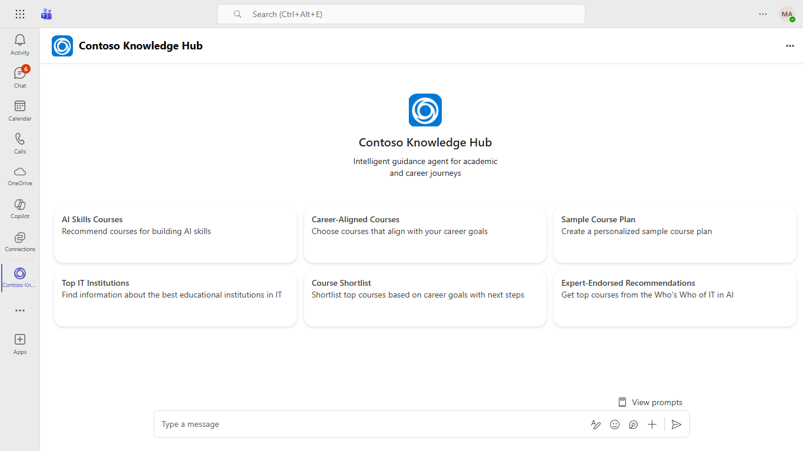

# Contoso Knowledge Hub - AI Academic & Career Guidance Agent
Contoso Knowledge Hub is an intelligent guidance agent built on the Teams SDK, designed to empower students in their academic and career journeys. It offers personalized course recommendations, career-aligned planning, institutional insights, and expert-endorsed AI course recommendations.

## Included Features
* Bots

## Interaction with app


## Prerequisites

-  Microsoft Teams is installed and you have an account (not a guest account)
-  [.Net](https://dotnet.microsoft.com/en-us/download/dotnet/6.0) version 6.0
-  [dev tunnel](https://learn.microsoft.com/en-us/azure/developer/dev-tunnels/get-started?tabs=windows) or [ngrok](https://ngrok.com/download) latest version or equivalent tunneling solution
-  [M365 developer account](https://docs.microsoft.com/en-us/microsoftteams/platform/concepts/build-and-test/prepare-your-o365-tenant) or access to a Teams account with the appropriate permissions to install an app.
-  [Microsoft 365 Agents Toolkit for Visual Studio](https://learn.microsoft.com/en-us/microsoftteams/platform/toolkit/toolkit-v4/install-teams-toolkit-vs?pivots=visual-studio-v17-7)
-  [Azure OpenAI](https://aka.ms/oai/access) resource
-  [Azure OpenAI in Azure AI Foundry Models resource](https://learn.microsoft.com/en-us/azure/ai-foundry/openai/how-to/create-resource?pivots=web-portal)
-  [AI: Create an Azure OpenAI Resource and Deploy a Model](https://learn.microsoft.com/en-us/microsoft-cloud/dev/tutorials/openai-acs-msgraph/02-openai-create-resource)
 
## Run the app (Using Microsoft 365 Agents Toolkit for Visual Studio)

The simplest way to run this sample in Teams is to use Microsoft 365 Agents Toolkit for Visual Studio.
1. Install Visual Studio 2022 **Version 17.14 or higher** [Visual Studio](https://visualstudio.microsoft.com/downloads/)
1. Install Microsoft 365 Agents Toolkit for Visual Studio [Microsoft 365 Agents Toolkit extension](https://learn.microsoft.com/en-us/microsoftteams/platform/toolkit/toolkit-v4/install-teams-toolkit-vs?pivots=visual-studio-v17-7)
1. In the debug dropdown menu of Visual Studio, select Dev Tunnels > Create A Tunnel (set authentication type to Public) or select an existing public dev tunnel.
1. Right-click the 'M365Agent' project in Solution Explorer and select **Microsoft 365 Agents Toolkit > Select Microsoft 365 Account**
1. Sign in to Microsoft 365 Agents Toolkit with a **Microsoft 365 work or school account**
1. Set `Startup Item` as `Microsoft Teams (browser)`.
1. Press F5, or select Debug > Start Debugging menu in Visual Studio to start your app
</br>
1. In the opened web browser, select Add button to install the app in Teams
> If you do not have permission to upload custom apps (uploading), Microsoft 365 Agents Toolkit will recommend creating and using a Microsoft 365 Developer Program account - a free program to get your own dev environment sandbox that includes Teams.

### Register your app with Azure AD.(Run the app manually)

  1. Register a new application in the [Microsoft Entra ID – App Registrations](https://go.microsoft.com/fwlink/?linkid=2083908) portal.
  2. Select **New Registration** and on the *register an application page*, set following values:
      * Set **name** to your app name.
      * Choose the **supported account types** (any account type will work)
      * Leave **Redirect URI** empty.
      * Choose **Register**.
  3. On the overview page, copy and save the **Application (client) ID, Directory (tenant) ID**. You'll need those later when updating your Teams application manifest and in the appsettings.json.
  4. Navigate to **API Permissions**, and make sure to add the follow permissions:
   Select Add a permission
      * Select Add a permission
      * Select Microsoft Graph -\> Delegated permissions.
      * `User.Read` (enabled by default)
      * Click on Add permissions. Please make sure to grant the admin consent for the required permissions.

## Setup

> Note these instructions are for running the sample on your local machine, the tunnelling solution is required because
> the Teams service needs to call into the bot.

1. Run ngrok - point to port 3978

   ```bash
   ngrok http 3978 --host-header="localhost:3978"
   ```  

   Alternatively, you can also use the `dev tunnels`. Please follow [Create and host a dev tunnel](https://learn.microsoft.com/en-us/azure/developer/dev-tunnels/get-started?tabs=windows) and host the tunnel with anonymous user access command as shown below:

   ```bash
   devtunnel host -p 3978 --allow-anonymous
   ```

4. Setup for code

  - Clone the repository

    ```bash
    git clone https://github.com/OfficeDev/Microsoft-Teams-Samples.git
    ```
  - If you are using Visual Studio
    - Launch Visual Studio
    - File -> Open -> Project/Solution
    - Navigate to `samples/agent-knowledge-hub/csharp` folder
    - Select `AgentKnowledgeHub.sln` file and open it in Visual Studio
    - Press `F5` to run this project
    
  - Modify the `/appsettings.Development.json` and fill in the following details:
     - `{{TODO: BOT_ID}}` - Generated from Step 1 while doing Microsoft Entra ID app registration in Azure portal.
     - `{{TODO: BOT_PASSWORD}}` - Generated from Step 1, also referred to as Client secret
     - `MicrosoftAppType` - Set this as MultiTenant to if your bot is supported on multiple tenants; 
     - Replace `{{TODO: your-azure-openai-api-key}}` with your Azure OpenAI API key
     - Replace `{{TODO: your-azure-openai-endpoint}}` with your Azure OpenAI endpoint URL
     - Replace `{{TODO: your-azure-openai-deployment-name>}}`with your model deployment name
     
5.  Manually update the manifest.json
    - Edit the `manifest.json` contained in the  `appPackage/` folder to replace with your MicrosoftAppId (that was created in step1.1 and is the same value of MicrosoftAppId in `appsettings.json` file) *everywhere* you see the place holder string `{TODO: BOT_ID}` (depending on the scenario the Microsoft App Id may occur multiple times in the `manifest.json`). 
    - Zip up the contents of the `appPackage/` folder to create a `manifest.zip`
    - Upload the `manifest.zip` to Teams (in the left-bottom *Apps* view, click "Upload a custom app")

## Running the sample

**Install App Personal**


**Home Page**


**AI Skills Courses**


**Career Aligned Courses**


## Further reading

- [Teams SDK V2](https://aka.ms/teams-ai-library-v2)
- [Microsoft 365 Agents Toolkit Documentations](https://docs.microsoft.com/microsoftteams/platform/toolkit/teams-toolkit-fundamentals)
- [Microsoft 365 Agents Toolkit CLI](https://aka.ms/teamsfx-toolkit-cli)
- [Microsoft 365 Agents Toolkit Samples](https://github.com/OfficeDev/TeamsFx-Samples)


