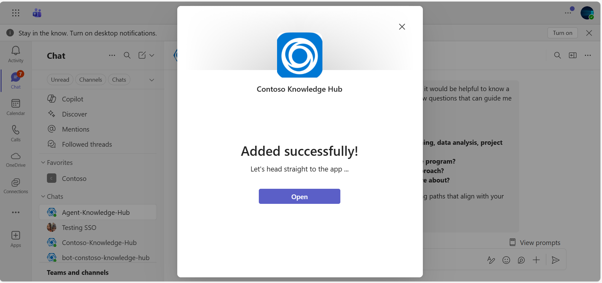
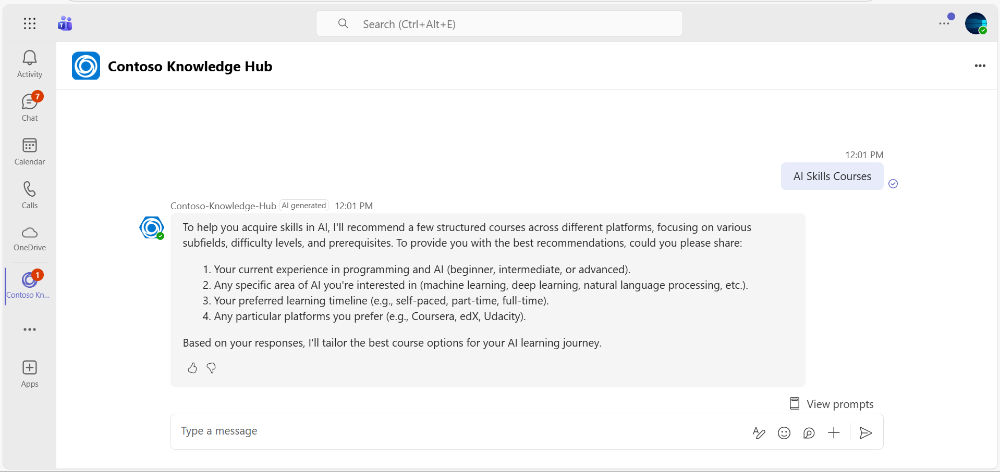
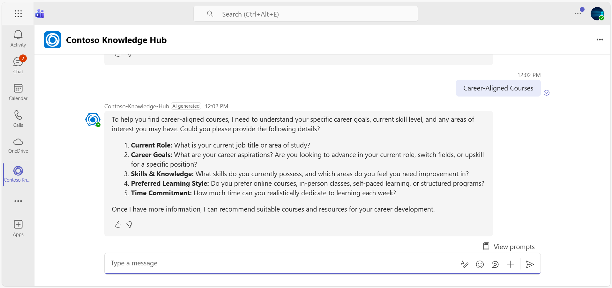

# Contoso Knowledge Hub - AI Academic & Career Guidance Agent

This sample demonstrates an AI-powered Academic Agent built with the **Microsoft Teams SDK for Python**. The bot provides comprehensive educational support, career guidance, and course recommendations using Azure OpenAI.

## Interaction with App


## Included Features
* **Teams SDK** - Microsoft Teams SDK for Python (`microsoft.teams.*`)
* **Azure OpenAI Integration** - GPT-powered responses with Azure OpenAI
* **Prompt Management** - Structured prompts system with instructions
* **Educational Agent** - Academic guidance and course recommendations

## Architecture

Uses **Microsoft Teams SDK for Python** (v2.0 alpha):
- `App` class for bot creation and HTTP server
- `ChatPrompt` for AI-powered conversations
- `OpenAICompletionsAIModel` for Azure OpenAI integration
- Decorator-based event handlers (`@app.on_message`)
- Built-in authentication support (Managed Identity, Client Credentials)
- `LocalStorage` for conversation state management

## Prerequisites

- Microsoft Teams is installed and you have an account
- [UV version](https://docs.astral.sh/uv/getting-started/installation/) is >= 0.8.11. Install or upgrade.
- [Python Version](https://www.python.org/downloads/) Install or upgrade min version >= 3.12.
- [dev tunnel](https://learn.microsoft.com/en-us/azure/developer/dev-tunnels/get-started?tabs=windows) or [ngrok](https://ngrok.com/) latest version or equivalent tunnelling solution
- [Microsoft 365 Agents Toolkit for VS Code](https://marketplace.visualstudio.com/items?itemName=TeamsDevApp.ms-teams-vscode-extension) or [TeamsFx CLI](https://learn.microsoft.com/microsoftteams/platform/toolkit/teamsfx-cli?pivots=version-one)
- [Azure OpenAI in Azure AI Foundry Models resource](https://learn.microsoft.com/en-us/azure/ai-foundry/openai/how-to/create-resource?pivots=web-portal)
- [AI: Create an Azure OpenAI Resource and Deploy a Model](https://learn.microsoft.com/en-us/microsoft-cloud/dev/tutorials/openai-acs-msgraph/02-openai-create-resource)

## Run the app (Using Microsoft 365 Agents Toolkit for Visual Studio Code)

The simplest way to run this sample in Teams is to use Microsoft 365 Agents Toolkit for Visual Studio Code.

1. Ensure you have downloaded and installed [Visual Studio Code](https://code.visualstudio.com/docs/setup/setup-overview)
1. Install the [Microsoft 365 Agents Toolkit extension](https://marketplace.visualstudio.com/items?itemName=TeamsDevApp.ms-teams-vscode-extension) and [Python Extension](https://marketplace.visualstudio.com/items?itemName=ms-python.python)
1. Select **File > Open Folder** in VS Code and choose this samples directory from the repo
1. Press **CTRL+Shift+P** to open the command box and enter **Python: Create Environment** to create and activate your desired virtual environment. Remember to select `requirements.txt` as dependencies to install when creating the virtual environment.
1. Using the extension, sign in with your Microsoft 365 account where you have permissions to upload custom apps
1. Select **Debug > Start Debugging** or **F5** to run the app in a Teams web client.
1. In the browser that launches, select the **Add** button to install the app to Teams.

> If you do not have permission to upload custom apps (uploading), Microsoft 365 Agents Toolkit will recommend creating and using a Microsoft 365 Developer Program account - a free program to get your own dev environment sandbox that includes Teams.

## Setup for bot

In Azure portal, create a [Azure Bot resource](https://docs.microsoft.com/azure/bot-service/bot-service-quickstart-registration).
    - For bot handle, make up a name.
    - Select "Use existing app registration" (Create the app registration in Microsoft Entra ID beforehand.)
    - __*If you don't have an Azure account*__ create an [Azure free account here](https://azure.microsoft.com/free/)
    
   In the new Azure Bot resource in the Portal, 
    - Ensure that you've [enabled the Teams Channel](https://learn.microsoft.com/azure/bot-service/channel-connect-teams?view=azure-bot-service-4.0)
    - In Settings/Configuration/Messaging endpoint, enter the current `https` URL you were given by running the tunneling application. Append it with the path `/api/messages`

## Run the app (Manually Uploading to Teams)
## Setup for code
> Note these instructions are for running the sample on your local machine, the tunnelling solution is required because
the Teams service needs to call into the bot.

1) Clone the repository

    ```bash
    git clone https://github.com/OfficeDev/Microsoft-Teams-Samples.git
    ```

2) Run ngrok - point to port 3978

   ```bash
   ngrok http 3978 --host-header="localhost:3978"
   ```  

   Alternatively, you can also use the `dev tunnels`. Please follow [Create and host a dev tunnel](https://learn.microsoft.com/en-us/azure/developer/dev-tunnels/get-started?tabs=windows) and host the tunnel with anonymous user access command as shown below:

   ```bash
   devtunnel host -p 3978 --allow-anonymous
   ```

3) Register a new application in the [Microsoft Entra ID – App Registrations](https://go.microsoft.com/fwlink/?linkid=2083908) portal.
  
  A) Select **New Registration** and on the *register an application page*, set following values:
      * Set **name** to your app name.
      * Choose the **supported account types** (any account type will work)
      * Leave **Redirect URI** empty.
      * Choose **Register**.
  B) On the overview page, copy and save the **Application (client) ID, Directory (tenant) ID**. You'll need those later when updating your Teams application manifest and in the appsettings.json.
  C) Navigate to **API Permissions**, and make sure to add the following permissions:
   Select Add a permission
      * Select Add a permission
      * Select Microsoft Graph -\> Delegated permissions.
      * `User.Read` (enabled by default)
      * Click on Add permissions. Please make sure to grant the admin consent for the required permissions.

4) In a terminal, navigate to `samples/agent-knowledge-hub/python`

5) Activate your desired virtual environment

1) Update the `.env` configuration for the agent to use the Microsoft App Id and App Password from the app registration. (Note the App Password is referred to as the "client secret" in the azure portal and you can always create a new client secret anytime.)
 - In the `.env` file, set:
   - `MicrosoftAppId=<your-microsoft-app-id>`
   - `MicrosoftAppPassword=<your-app-password>`
   - `MicrosoftAppType=<MultiTenant|SingleTenant|UserAssignedMSI>` (MultiTenant is default)
 - Also configure your Azure OpenAI settings:
   - `AZURE_OPENAI_API_KEY=<your-azure-openai-key>`
   - `AZURE_OPENAI_ENDPOINT=<your-azure-openai-endpoint>`
   - `AZURE_OPENAI_DEPLOYMENT_NAME=gpt-4o-mini`

6) Install dependencies by running ```pip install -r requirements.txt``` in the project folder.

7) Update the `config.py` configuration for the bot to use the Microsoft App Id and App Password from the Bot Framework registration. (Note the App Password is referred to as the "client secret" in the azure portal and you can always create a new client secret anytime.)

8) __*This step is specific to Teams.*__
    - **Edit** the `manifest.json` contained in the `appManifest` folder to replace your Microsoft App Id (that was created when you registered your bot earlier) *everywhere* you see the place holder string `${{BOT_ID}}` and `${{TEAMS_APP_ID}}` (depending on the scenario the Microsoft App Id may occur multiple times in the `manifest.json`)
    - **Zip** up the contents of the `appManifest` folder to create a `manifest.zip`
    - **Upload** the `manifest.zip` to Teams (in the Apps view click "Upload a custom app")

9) Run your bot with `python app.py`

## Running the sample

**Using Teams AI SDK for Python:**

The bot responds to user messages with AI-generated educational guidance, course recommendations, and career advice based on the instructions in `prompts/chat/instructions.txt`.

**Key Features:**
- AI-powered responses using Azure OpenAI (gpt-4o-mini)
- Educational support and course recommendations
- Career guidance and skills assessment
- Feedback mechanism with thumbs up/down buttons
- Automatic "AI generated" indicator on responses

### Screenshots

- **App Installation:**


- **Personal Chat - AI Guidance:**


- **AI Response with Feedback:**


- **Agent Recommendations:**


- **Agent Recommendations:**


## Deploy the agent to Azure

To learn more about deploying a bot to Azure, see [Deploy your bot to Azure](https://aka.ms/azuredeployment) for a complete list of deployment instructions.

## Further reading

- [Teams SDK for Python - Getting Started](https://microsoft.github.io/teams-ai/python/getting-started)
- [Teams SDK Documentation](https://microsoft.github.io/teams-ai/)
- [Azure OpenAI Service](https://learn.microsoft.com/en-us/azure/cognitive-services/openai/)
- [Microsoft Teams Platform Documentation](https://docs.microsoft.com/en-us/microsoftteams/platform/)
- [Azure Bot Service Introduction](https://docs.microsoft.com/azure/bot-service/bot-service-overview-introduction?view=azure-bot-service-4.0)


