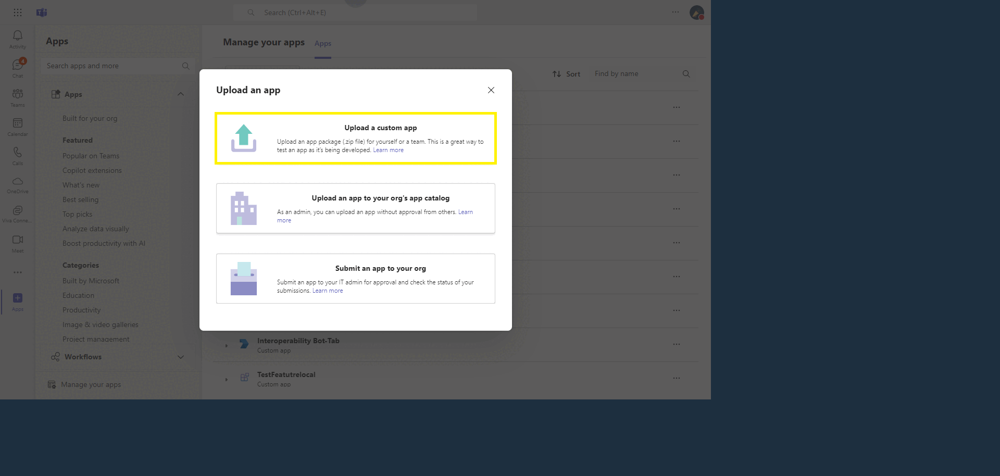
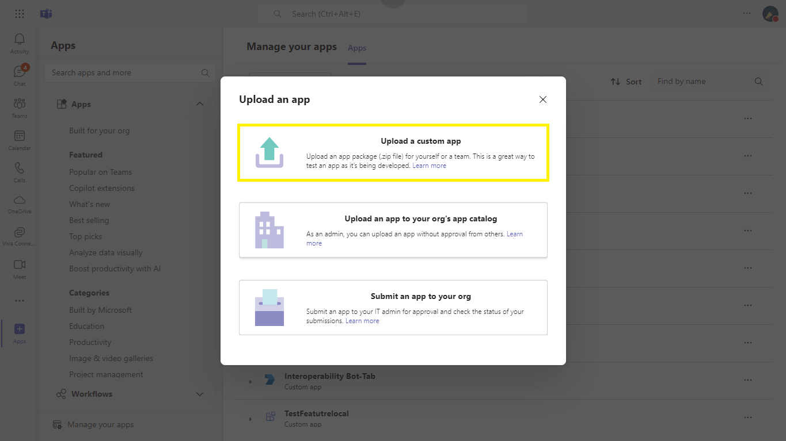
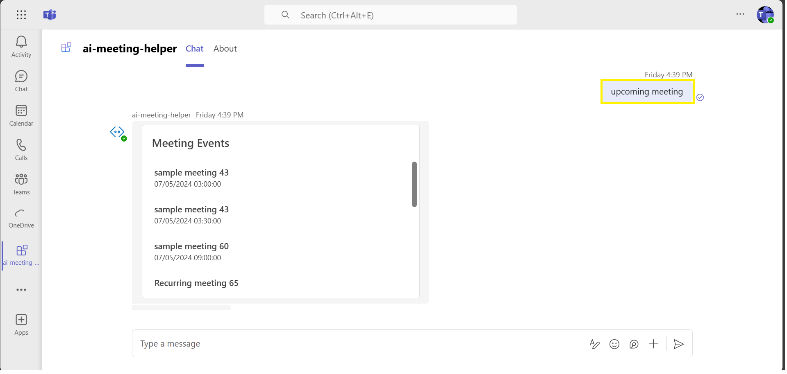

# Compliance Checker with Azure AI Search sample

## Interaction with app

 

## Try it yourself - experience the App in your Microsoft Teams client
Please find below demo manifest which is deployed on Microsoft Azure and you can try it yourself by uploading the app package (.zip file link below) to your teams and/or as a personal app. (Sideloading must be enabled for your tenant, [see steps here](https://docs.microsoft.com/microsoftteams/platform/concepts/build-and-test/prepare-your-o365-tenant#enable-custom-teams-apps-and-turn-on-custom-app-uploading)).

**Microsoft Teams Msgext Doc Compliance Checker sample app:** [Manifest](/samples/ai-meeting-helper/demo-manifest/ai-meeting-helper.zip)

## Prerequisites

- [Node.js 18.x](https://nodejs.org/download/release/v18.18.2/)
- [Visual Studio Code](https://code.visualstudio.com/)
- [Blob Storage](https://learn.microsoft.com/en-us/azure/storage/blobs/storage-quickstart-blobs-portal)
- [Teams Toolkit](https://marketplace.visualstudio.com/items?itemName=TeamsDevApp.ms-teams-vscode-extension)
- [Open AI](https://platform.openai.com/docs/quickstart/build-your-application) or [Azure OpenAI]([https://azure.microsoft.com/free/](https://learn.microsoft.com/en-us/azure/ai-services/openai/quickstart?tabs=command-line&pivots=programming-language-studio))

## Run the app (Using Teams Toolkit for Visual Studio Code)

The simplest way to run this sample in Teams is to use Teams Toolkit for Visual Studio Code.

1. Ensure you have downloaded and installed [Visual Studio Code](https://code.visualstudio.com/docs/setup/setup-overview)
1. Install the [Teams Toolkit extension](https://marketplace.visualstudio.com/items?itemName=TeamsDevApp.ms-teams-vscode-extension)
1. Select **File > Open Folder** in VS Code and choose this samples directory from the repo
1. Using the extension, sign in with your Microsoft 365 account where you have permissions to upload custom apps
1. Select **Debug > Start Debugging** or **F5** to run the app in a Teams web client.
1. In the browser that launches, select the **Add** button to install the app to Teams.

> If you do not have permission to upload custom apps (sideloading), Teams Toolkit will recommend creating and using a Microsoft 365 Developer Program account - a free program to get your own dev environment sandbox that includes Teams.

## Setup and use the sample
1) Clone the repository

    ```bash
    git clone https://github.com/OfficeDev/Microsoft-Teams-Samples.git
    ```
1) Navigate to the `samples/ai-meeting-helper` folder and open with Visual Studio Code.
  
1) Create a policy for a demo tenant user for creating the online meeting on behalf of that user using the following PowerShell script
  -  Follow this link- [Configure application access policy](https://docs.microsoft.com/en-us/graph/cloud-communication-online-meeting-application-access-policy)

      

1) In Azure App Registration Under left menu, navigate to **API Permissions**, and make sure to add the following permissions of Microsoft Graph API > Application permissions:

    - `Calendars.Read`
    - `Calendars.ReadBasic.All`
    - `Calendars.ReadWrite`
    - `EventListener.Read.All`
    - `EventListener.ReadWrite.All`
    - `OnlineMeetingArtifact.Read.All`
    - `OnlineMeetingRecording.Read.All`
    - `OnlineMeetings.Read.All`
    - `OnlineMeetings.ReadWrite.All`
    - `OnlineMeetingTranscript.Read.All`
    - `User.Read.All`
    - `User.ReadBasic.All`
    - `User.ReadWrite.All`

1) Navigate to the `samples/ai-meeting-helper/.localConfigs` directory and update the values below.

   ```txt
        BOT_ID="BOT_ID"
        BOT_PASSWORD="SECRET_BOT_PASSWORD"
        AZURE_OPENAI_API_KEY="SECRET_AZURE_OPENAI_API_KEY"
        AZURE_OPENAI_ENDPOINT="AZURE_OPENAI_ENDPOINT"
        AZURE_OPENAI_DEPLOYMENT_NAME="AZURE_OPENAI_DEPLOYMENT_NAME"
        Token="Token"
        BOT_ENDPOINT="BOT_ENDPOINT"
        Base64EncodedCertificate="Base_64_Encoded_Certificate"
        EncryptionCertificateId="Encryption_Certificate_Id"
        PRIVATE_KEY_PATH="Pem_File_Path"
        Account_Name="Azure_Storage_Account"
        Account_Key="Azure_Storage_Account_Key"
        Table_Name="Azure_Storage_Table"
        partitionKey="Azure_Storage_Table_PartitionKey"
        AI_Model="Azure_Open_AI_Model"
        SubscriptionURL="https://graph.microsoft.com/v1.0/subscriptions"
        SystemPrompt="Generate a filtered list of action items from meeting transcriptions by user in bullet point user wise categorized with proper format like:  <b> Attendee:</b> 
        Action Items in bullet points"
    ``` 

## Running the sample

**Select Upload an app**


**Select Add**


**Find all upcomoing meetings**


**Click on the specific meeting for subscription**


**Joing the meeting that you have subscribe**


**Start transcription**


**End the Meeting**


**Meeting Helper Results**


## Further reading

### AI, Message Extensions And Blob Storage

- [Azure OpenAI Service](https://learn.microsoft.com/azure/ai-services/openai/overview)

