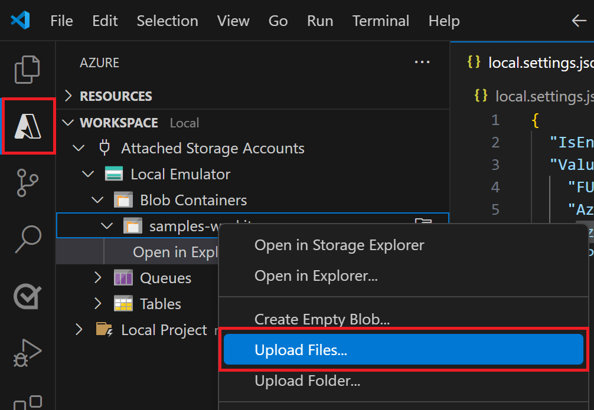

# Setup Azure Function for Storing Embedding Vectors in CosmosDB

## Create an Azure Open AI service

- In Azure portal, create an [Azure Open AI service](https://learn.microsoft.com/en-us/azure/ai-services/openai/how-to/create-resource?pivots=web-portal).
- Create and collect `AzureOpenAIEndpoint`, `AzureOpenAIApiKey`, `AzureOpenAIDeploymentName` and save these values to update in `.local.settings.json` file later.

- **Deploy Azure Open AI model:** Deploy the `text-embedding-ada-002` model in your created Azure Open AI service for the application to create embedding vectors.


## Create and Configure Azure CosmosDB for NoSQL

 - **[Create Azure CosmosDB Account](https://learn.microsoft.com/en-us/azure/cosmos-db/nosql/quickstart-portal#create-account)** in Azure portal and [Enroll in the Vector Search Preview Feature](https://learn.microsoft.com/en-us/azure/cosmos-db/nosql/vector-search#enroll-in-the-vector-search-preview-feature)
  
 - Create and collect `CosmosDBEndpoint`, `CosmosDBKey`, `CosmosDBDatabaseId`, `CosmosDBContainerId`, `PartitionKey` and save these values to update in `.local.settings.json` file later.

## Create Azure Blob storage

- In Azure portal, create an [Azure Blob storage](https://learn.microsoft.com/en-us/azure/storage/blobs/storage-blobs-introduction).
- Create and collect `AzureStorageDBConnString`, `AzureBlobContainerName` and save these values to update in `.local.settings.json` file later.

## Create Azure Function

- [Create the function app](https://learn.microsoft.com/en-us/azure/azure-functions/functions-event-grid-blob-trigger?pivots=programming-language-javascript#create-the-function-app)
- [Update application settings](https://learn.microsoft.com/en-us/azure/azure-functions/functions-event-grid-blob-trigger?pivots=programming-language-javascript#update-application-settings)
- [Build the endpoint URL](https://learn.microsoft.com/en-us/azure/azure-functions/functions-event-grid-blob-trigger?pivots=programming-language-javascript#build-the-endpoint-url)

## Create Azure App Insights
- [Azure App Insights](https://learn.microsoft.com/en-us/azure/azure-monitor/app/nodejs)
- Create and collect `APPINSIGHTS_INSTRUMENTATIONKEY`, `APPINSIGHTS_CONNECTIONSTRING` and save these values to update in `.local.settings.json` file later.


## Create the Event Subscription
**> Note: Please follow the documentation below carefully to successfully set up and run your Azure Function.**

- [Create the event subscription](https://learn.microsoft.com/en-us/azure/azure-functions/functions-event-grid-blob-trigger?pivots=programming-language-javascript#create-the-event-subscription).

- [Trigger Azure Functions on blob containers using an event subscription](https://learn.microsoft.com/en-us/azure/azure-functions/functions-event-grid-blob-trigger?pivots=programming-language-javascript#create-the-event-subscription).

## Code Setup

  - Clone the repository

    ```bash
    git clone https://github.com/OfficeDev/Microsoft-Teams-Samples.git
    ```
  - Navigate to `samples/api-doc-search/azure-function-nodejs` folder and open the project in Visual Studio Code.
  - Open `.local.settings1.json` file and rename it as `.local.settings.json` and update the configuration for the application to use the `AzureOpenAIEndpoint`, `AzureOpenAIApiKey`, `AzureOpenAIDeploymentName`, `CosmosDBEndpoint`, `CosmosDBKey`, `CosmosDBDatabaseId`, `CosmosDBContainerId`, `PartitionKey`, `SimilarityScore`, `APPINSIGHTS_INSTRUMENTATIONKEY`, `APPINSIGHTS_CONNECTIONSTRING` values.
  
  - In a terminal, navigate to `samples/api-doc-search/azure-function-nodejs`

 - Install node modules and run application by pressing F5 in Visual Studio Code
 
   ```bash
    npm install
   ```

## Running the sample locally by uploading file in local emulated storage

Step: 1 [Prepare local storage emulation](https://learn.microsoft.com/en-us/azure/azure-functions/functions-event-grid-blob-trigger?pivots=programming-language-javascript#prepare-local-storage-emulation) and [Run the azure function locally](https://learn.microsoft.com/en-us/azure/azure-functions/functions-event-grid-blob-trigger?pivots=programming-language-javascript#run-the-function-locally)

  

Step 2: [Upload the file in local emulated storage and it will trigger Azure function locally and Azure function with start creating and storing embedding vectors in CosmosDB](https://learn.microsoft.com/en-us/azure/azure-functions/functions-event-grid-blob-trigger?pivots=programming-language-javascript#upload-a-file-to-the-container)

  

Step 3: [Run the function locally](https://learn.microsoft.com/en-us/azure/azure-functions/functions-event-grid-blob-trigger?pivots=programming-language-javascript#prepare-local-storage-emulation)

  

  - After running Azure function, provide file name like: `abc.pdf` it will start creating the required vector embeddings for uploaded file and store the vectors in the Azure NoSQL Cosmos DB.

  

## Running the deployed Azure function by uploading file in Azure Blob storage
[Upload a file to the blob container and it will trigger Azure function automatically and Azure function with start creating and storing embedding vectors in CosmosDB](https://learn.microsoft.com/en-us/azure/azure-functions/functions-event-grid-blob-trigger?pivots=programming-language-javascript#upload-a-file-to-the-container)

- **Upload file to Azure Blob container:** Upload the file(s) for which you want to create vector embeddings into the Blob Storage container.
  

- **Azure Function Invocation:** Uploading the files to blob will automatically trigger the Azure function which will start creating the required vector embeddings and store in the Azure NoSQL Cosmos DB.
  

  

## Deploy the Azure Function (Optional)

[Deploy your function code to azure function](https://learn.microsoft.com/en-us/azure/azure-functions/functions-event-grid-blob-trigger?pivots=programming-language-javascript#deploy-your-function-code)

## Further reading

- [Azure CosmosDB](https://learn.microsoft.com/en-us/azure/cosmos-db/nosql/vector-search)

- [Vector Search Preview Feature](https://learn.microsoft.com/en-us/azure/cosmos-db/nosql/vector-search#enroll-in-the-vector-search-preview-feature)

- [Azure Open AI Service](https://learn.microsoft.com/en-us/azure/ai-services/openai/overview)

- [Azure Function](https://learn.microsoft.com/en-us/azure/azure-functions/functions-event-grid-blob-trigger?pivots=programming-language-javascript)

- [Azure Blob Storage](https://learn.microsoft.com/en-us/azure/storage/blobs/storage-blobs-introduction)

- [Azure App Insights](https://learn.microsoft.com/en-us/azure/azure-monitor/app/nodejs)

- [Trigger Azure Functions on blob containers using an event subscription](https://learn.microsoft.com/en-us/azure/azure-functions/functions-event-grid-blob-trigger?pivots=programming-language-javascript#deploy-your-function-code)