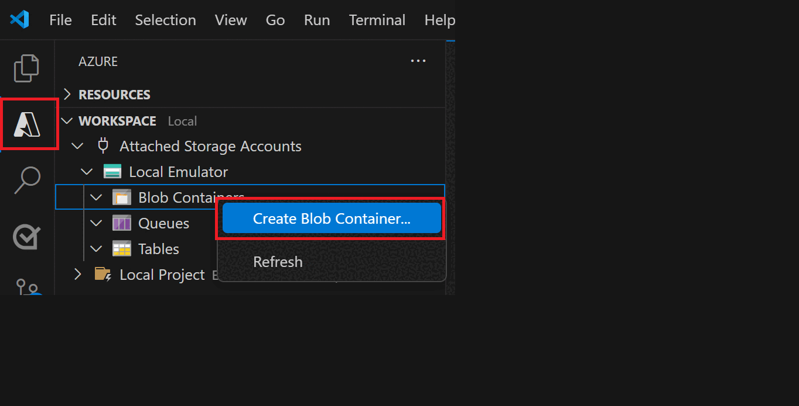
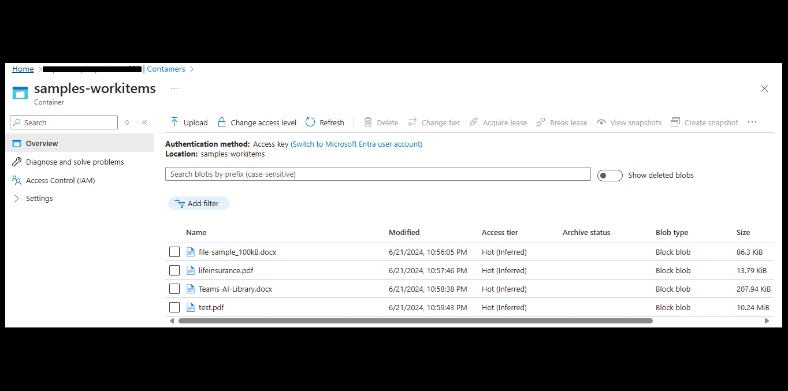
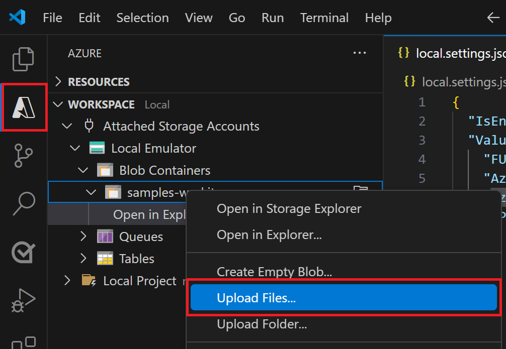
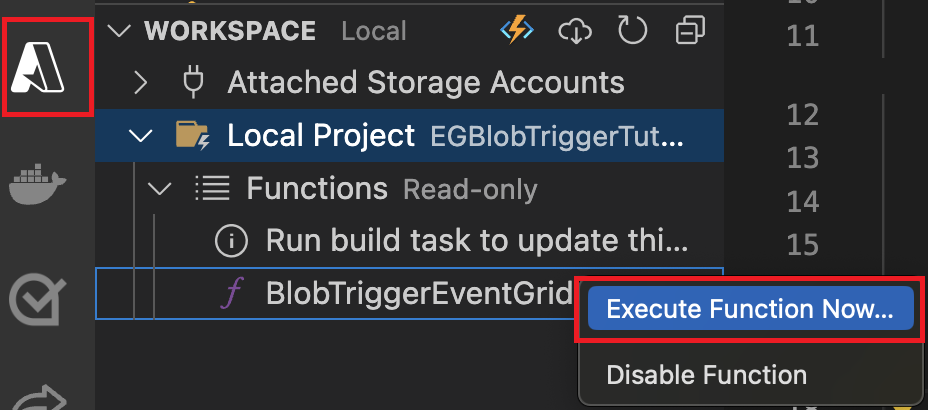
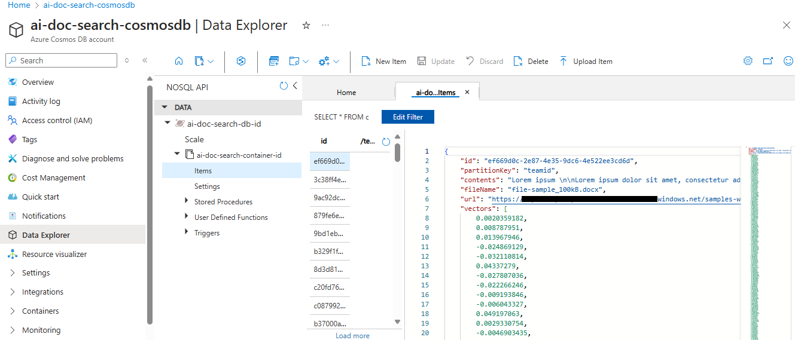
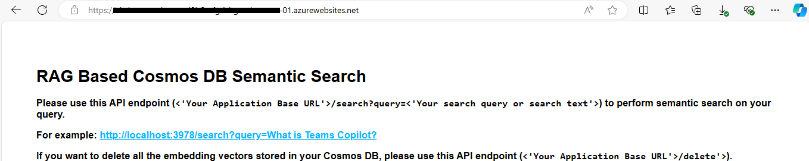
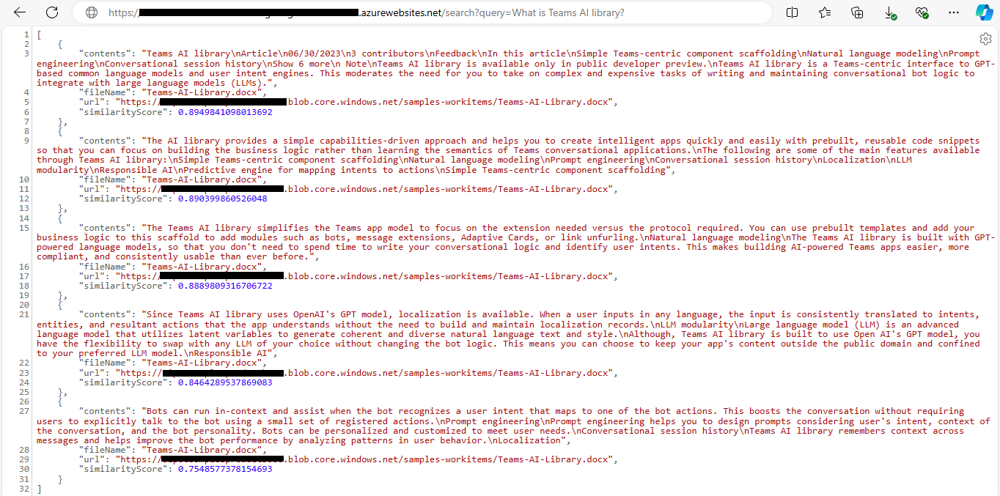
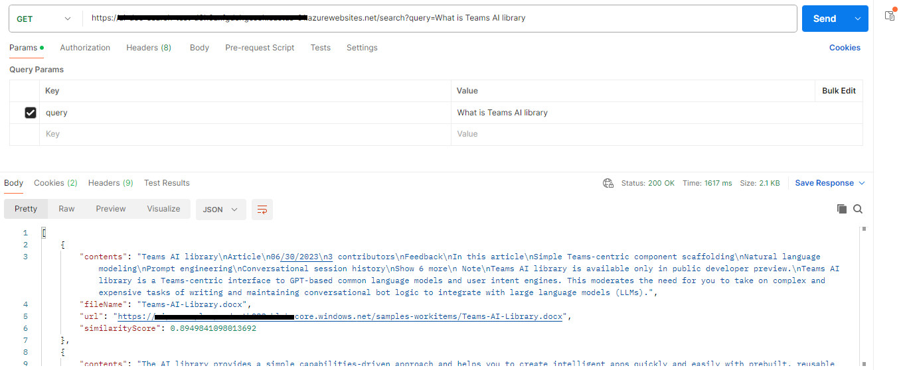
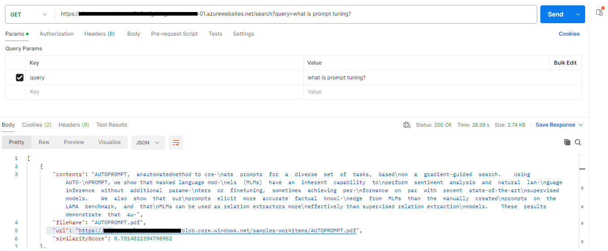

# RAG-based Semantic Search API with Azure CosmosDB NoSQL

This sample demonstrates the concept of Retrieval Augmented Generation (RAG). 
 
- To do this, we upload documents into an Azure blob storage. The contents of these documents are converted into embedding vectors that are stored in an Azure NoSQL Cosmos DB. Using an API endpoint, we can run prompt queries on the contents of the documents. 
 
- Relevant results are returned by performing RAG on the document contents embedding vectors and shown along with a calculated similarity score.
 
- The API endpoint can be called in two ways - using the browser directly, or a GET call using any API testing tool. 

> **Note:** This is a Custom API application, you can consume/call this API from any other applications.

## Included Features
* **Blob-based Event Subscription:** Enables event-driven actions based on changes or updates to Azure Blob Storage.
* **Azure Open AI Embeddings:** Utilizes OpenAI embeddings for enhanced understanding and representation of textual content.
* **Vector Search with NoSQL Cosmos DB:** Performs efficient vector searches using the `VectorDistance()` function within Azure Cosmos DB, a scalable NoSQL database.

## Interaction with the application locally



## Interaction with the application with deployed resources



## Prerequisites

- [NodeJS](https://nodejs.org/en/)
- [Azure Open AI Service](https://learn.microsoft.com/en-us/azure/ai-services/openai/overview)
- [Azure CosmosDB](https://learn.microsoft.com/en-us/azure/cosmos-db/nosql/vector-search)
- [Azure Function](https://learn.microsoft.com/en-us/azure/azure-functions/functions-event-grid-blob-trigger?pivots=programming-language-javascript)
- [Azure Blob Storage](https://learn.microsoft.com/en-us/azure/storage/blobs/storage-blobs-introduction)
- [Azure App Insights](https://learn.microsoft.com/en-us/azure/azure-monitor/app/nodejs)
- API testing tools such as Postman

## Setup the application locally

### Setup Azure Function
Follow below guide to setup Azure Function and other resources before proceeding:
- [Setup Azure Function and other resources](../azure-function-nodejs/README.md)

### Create and configure Azure Cosmos DB for NoSQL

**> Note: You can skip this step if you have already created the Azure CosmosDB account while creating Azure function.**
 - **[Create Azure Cosmos DB Account](https://learn.microsoft.com/en-us/azure/cosmos-db/nosql/quickstart-portal#create-account)** in Azure portal and [Enroll in the Vector Search Preview Feature](https://learn.microsoft.com/en-us/azure/cosmos-db/nosql/vector-search#enroll-in-the-vector-search-preview-feature)
 - Create `database`, `container` and collect `CosmosDBEndpoint`, `CosmosDBKey`, `CosmosDBDatabaseId`, `CosmosDBContainerId` and save those values to update in `.env` file later.

### Create an Azure Open AI service
**> Note: You can skip this step if you have already created the Azure Open AI service while creating the Azure function.**
- In Azure portal, create an [Azure Open AI service](https://learn.microsoft.com/en-us/azure/ai-services/openai/how-to/create-resource?pivots=web-portal).
- Deploy the `text-embedding-ada-002` model in your created Azure Open AI service for the application to create embedding vectors for user prompts or queries.
- Create and collect `AzureOpenAIEndpoint`, `AzureOpenAIApiKey`, `AzureOpenAIDeploymentName`, and save those value  to update in `.env` file later.

## Setup the Application Insights
In Azure portal, create an [Application Insights](https://learn.microsoft.com/en-us/azure/azure-monitor/app/nodejs#resource) and save `Instrumentation Key` and `Connection String` values and which will be required later while updating `.env` file configuration in sample code.

**Note:** In `.env` file, we call these values as `APPINSIGHTS_INSTRUMENTATIONKEY` and `APPINSIGHTS_CONNECTIONSTRING`.

### Setup for code

  - Clone the repository

    ```bash
    git clone https://github.com/OfficeDev/Microsoft-Teams-Samples.git
    ```
  - Navigate to `samples/api-doc-search/nodejs` folder and open the project in Visual Studio Code.
  - Open `.env` file and update the `.env` configuration for the application to use the `AzureOpenAIEndpoint`, `AzureOpenAIApiKey`, `AzureOpenAIDeploymentName`, `CosmosDBEndpoint`, `CosmosDBKey`, `CosmosDBDatabaseId`, `CosmosDBContainerId`, `SimilarityScore`, `APPINSIGHTS_INSTRUMENTATIONKEY`, `APPINSIGHTS_CONNECTIONSTRING` values.
  
**Note: All of these above values are created and collected in the previous steps.
Also, responses depend on `Cosine Similarity` where `Cosine similarity` compares two items by looking at the angle between them, giving a score from 0 to 1, where `1` means they are exactly the same, and `0` means they are completely different.**

  - In a terminal, navigate to `samples/api-doc-search/nodejs`
  - Install node modules and run application by pressing F5 in Visual Studio Code
 
   ```bash
    npm install
   ```

## Running the sample

**Note:** To run this sample, you need to have the Azure function running locally or deployed. Follow the steps mentioned in the [Azure Function](../azure-function-nodejs/README.md) section to configure and run the Azure function locally.

In this step, we will run the sample by uploading files on which a prompt query needs to be executed. Once the file is uploaded, embedding vectors  for it are created, and using an API endpoint, a prompt query can be fired which returns relevant responses using RAG, along with a similarity score.

### Running the sample locally by uploading file in local emulated storage
Step: 1 [Prepare local storage emulation](https://learn.microsoft.com/en-us/azure/azure-functions/functions-event-grid-blob-trigger?pivots=programming-language-javascript#prepare-local-storage-emulation) and [Run the azure function locally](https://learn.microsoft.com/en-us/azure/azure-functions/functions-event-grid-blob-trigger?pivots=programming-language-javascript#run-the-function-locally)

  

Step 2: [Upload the file in local emulated storage and it will trigger Azure function locally and Azure function with start creating and storing embedding vectors in CosmosDB](https://learn.microsoft.com/en-us/azure/azure-functions/functions-event-grid-blob-trigger?pivots=programming-language-javascript#upload-a-file-to-the-container)

  

Step 3: [Run the function locally](https://learn.microsoft.com/en-us/azure/azure-functions/functions-event-grid-blob-trigger?pivots=programming-language-javascript#prepare-local-storage-emulation)

  

  - After running Azure function, provide file name like: `abc.pdf` it will start creating the required embedding vectors for uploaded file and store the vectors in the Azure NoSQL Cosmos DB.

  

**You can call the API Endpoint to run the required prompts on the documents in two ways:**

**1) Directly from a web browser Once you run the sample locally by presssing F5 in Visual Studio Code, it will open the Application Homepage:**

  

- **Type your query like: `http://localhost:3000/search?query=what is Teams AI Library?`**

  


**2) Using an API testing tool, like Postman:**
- **Type your query and select `GET` and press `Send` button: `http://localhost:3000/search?query=what is Teams AI Library`**
  


- **`http://localhost:3000/search?query=what is Prompt Tuning?`**
  

### Running the sample by uploading the files to Azure Blob Storage

- **Upload file to Azure Blob container:** Upload the file(s) for which you want to create embedding vectors into the Blob Storage container in Azure.

  

- **Azure Function Invocation:** Uploading the files to blob will automatically trigger the Azure function (Deployed Azure Function) which will start creating the required embedding vectors  and store in the Azure NoSQL Cosmos DB.

  

- **Cosmos DB Embeddings:** Once the Azure function is executed, the embedding vectors for the uploaded files are stored in the Azure Cosmos DB.
  

**You can call the API Endpoint to run the required prompts on the documents in two ways:**
**Note:** You can use your deployed application URL instead of `http://localhost:3000` in the below steps.

**1) Directly from a web browser Once you run the sample locally by presssing F5 in Visual Studio Code, it will open the Application Homepage:**

  

- **Type your query like: `http://localhost:3000/search?query=what is Teams AI Library?`**

  


**2) Using an API testing tool, like Postman:**
- **Type your query and select `GET` and press `Send` button: `http://localhost:3000/search?query=what is Teams AI Library`**
  


- **`http://localhost:3000/search?query=what is Prompt Tuning?`**
  


## Deploy the app to Azure
If you want to deploy the application to Azure, you can follow the below steps:
- Create an Azure app service in Azure portal that support `NodeJS`.
- Deploy the code to the app service.

To learn more about deploying a `NodeJS` app to Azure, see [Configure the App Service app and deploy the code](https://learn.microsoft.com/en-us/azure/app-service/quickstart-nodejs?tabs=windows&pivots=development-environment-vscode#configure-the-app-service-app-and-deploy-code) for a complete list of deployment instructions.

## Deploy the Azure function to Azure
To test the application in Azure environment, you can deploy the Azure function to Azure. Follow the below guide to deploy the Azure function to Azure:
[Deploy the code](https://learn.microsoft.com/en-us/azure/app-service/quickstart-nodejs?tabs=windows&pivots=development-environment-vscode#configure-the-app-service-app-and-deploy-code)

## Further reading

- [Azure CosmosDB](https://learn.microsoft.com/en-us/azure/cosmos-db/nosql/vector-search)

- [Vector Search Preview Feature](https://learn.microsoft.com/en-us/azure/cosmos-db/nosql/vector-search#enroll-in-the-vector-search-preview-feature)

- [Azure Open AI Service](https://learn.microsoft.com/en-us/azure/ai-services/openai/overview)

- [Azure Function](https://learn.microsoft.com/en-us/azure/azure-functions/functions-event-grid-blob-trigger?pivots=programming-language-javascript)

- [Azure Blob Storage](https://learn.microsoft.com/en-us/azure/storage/blobs/storage-blobs-introduction)

- [Azure App Insights](https://learn.microsoft.com/en-us/azure/azure-monitor/app/nodejs)

