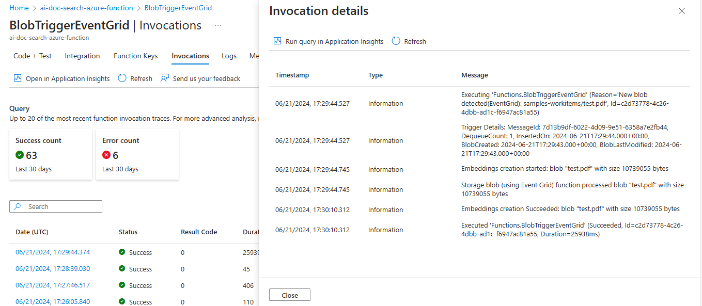

# RAG-based semantic search API using NoSQL CosmosDB

This is a sample application that demonstrates how to perform RAG-based semantic search using CosmosDB.

## Included Features
* Blob based Event Grid Trigger
* Azure Open AI Embeddings
* Vector search based on VectorDistance() function

## Interaction with app


## Prerequisites


- [NodeJS](https://nodejs.org/en/)
- [Azure Open AI Service](https://learn.microsoft.com/en-us/azure/ai-services/openai/overview)
- [Azure CosmosDB](https://learn.microsoft.com/en-us/azure/cosmos-db/nosql/vector-search)
- [Azure Function](https://learn.microsoft.com/en-us/azure/azure-functions/functions-event-grid-blob-trigger?pivots=programming-language-javascript)


- [Azure Blob Storage](https://learn.microsoft.com/en-us/azure/storage/blobs/storage-blobs-introduction)
- [Azure App Insights](https://learn.microsoft.com/en-us/azure/azure-monitor/app/nodejs)
- [Postman or other API testing tool](https://www.postman.com/api-platform/api-testing/)

## Setup the application locally

### Setup Azure Function
- [Setup Azure Function and other resources](../azure-function-nodejs/README.md)

### Create and configure Azure Cosmos DB for NoSQL

 - **[Create Azure Cosmos DB Account](https://learn.microsoft.com/en-us/azure/cosmos-db/nosql/quickstart-portal#create-account)** in Azure portal and [Enroll in the Vector Search Preview Feature](https://learn.microsoft.com/en-us/azure/cosmos-db/nosql/vector-search#enroll-in-the-vector-search-preview-feature)
 - Create and collect `CosmosDBEndpoint`, `CosmosDBKey`, `CosmosDBDatabaseId`, `CosmosDBContainerId` and save those values in Notepad to update in `.env` file later.

### Create Azure Open AI service
- In Azure portal, create a [Azure Open AI servie](https://learn.microsoft.com/en-us/azure/ai-services/openai/how-to/create-resource?pivots=web-portal).
- Create and collect `AzureOpenAIEndpoint`, `AzureOpenAIApiKey`, `AzureOpenAIDeploymentName`, and save those values in Notepad to update in `.env` file later.
   
### Setup for code

  - Clone the repository

    ```bash
    git clone https://github.com/OfficeDev/Microsoft-Teams-Samples.git
    ```
  - Navigate to `samples/api-doc-search/nodejs` folder and open the project in Visual Studio Code.
  - Open `.env` file and update the `.env` configuration for the application to use the `AzureOpenAIEndpoint`, `AzureOpenAIApiKey`, `AzureOpenAIDeploymentName`, `CosmosDBEndpoint`, `CosmosDBKey`, `CosmosDBDatabaseId`, `CosmosDBContainerId`, `SimilarityScore`, `APPINSIGHTS_INSTRUMENTATIONKEY`, `APPINSIGHTS_CONNECTIONSTRING` values.
  - In a terminal, navigate to `samples/api-doc-search/nodejs`

 - Install node modules and run application via pressing F5 in Visual Studio Code
 
   ```bash
    npm install
   ```

## Running the sample

- **Upload file to Azure Blob container:** Upload the file to blob container and it will trigger Azure function automatically.


- **Azure Function will invoke:** Azure function will invoke and start creating and storing embedding vectors in CosmosDB.

  

- **Azure function with store embeddings in CosmosDB:** You can see the embedding vectors stored in CosmosDB.


- **API Application Home Page:**


- **Open the Postman and search the query to get results:**
`http://localhost:3000/search?query=what is Teams AI Library?`


- **Open the Postman and search the query to get results:**
`http://localhost:3000/search?query=what is Prompt Tuning?`


  
- **Open any browser and you can hit same API like below:**
`http://localhost:3000/search?query=what is Teams AI Library?`


## Deploy the sample in Azure environment

[Deploy the code](https://learn.microsoft.com/en-us/azure/app-service/quickstart-nodejs?tabs=windows&pivots=development-environment-vscode#configure-the-app-service-app-and-deploy-code)

## Further reading

- [Azure CosmosDB](https://learn.microsoft.com/en-us/azure/cosmos-db/nosql/vector-search)

- [Vector Search Preview Feature](https://learn.microsoft.com/en-us/azure/cosmos-db/nosql/vector-search#enroll-in-the-vector-search-preview-feature)

- [Azure Open AI Service](https://learn.microsoft.com/en-us/azure/ai-services/openai/overview)

- [Azure Function](https://learn.microsoft.com/en-us/azure/azure-functions/functions-event-grid-blob-trigger?pivots=programming-language-javascript)

- [Azure Blob Storage](https://learn.microsoft.com/en-us/azure/storage/blobs/storage-blobs-introduction)

- [Azure App Insights](https://learn.microsoft.com/en-us/azure/azure-monitor/app/nodejs)


