# HR Talent Management App

The HR Talent Management App is designed to simulate a comprehensive recruitment system within Microsoft Teams. It enables users and teams to efficiently handle hiring processes by creating, managing, and searching for job positions and candidates. This sample includes everything you need to test the app, including source code, deployment guides, and a pre-configured app package to upload directly into Teams.

## Included Features
* Bots
* Tabs
* Message extensions

## Interaction with app
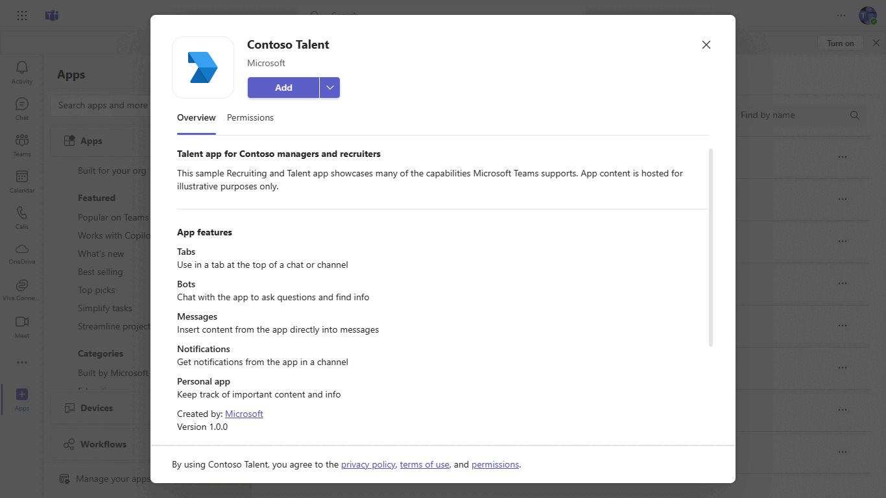

## Try it yourself - experience the App in your Microsoft Teams client
Please find below demo manifest which is deployed on Microsoft Azure and you can try it yourself by uploading the app manifest (.zip file link below) to your teams and/or as a personal app. (Sideloading must be enabled for your tenant, [see steps here](https://docs.microsoft.com/microsoftteams/platform/concepts/build-and-test/prepare-your-o365-tenant#enable-custom-teams-apps-and-turn-on-custom-app-uploading)).

**App HR Talent:** [Manifest](/samples/app-HR-talent/csharp/\src\demo-manifest\bot-task-module.zip)

## Prerequisites

- Microsoft Teams is installed and you have an account
- [.NET SDK](https://dotnet.microsoft.com/download) version 6.0
- [dev tunnel](https://learn.microsoft.com/en-us/azure/developer/dev-tunnels/get-started?tabs=windows) or [ngrok](https://ngrok.com/) latest version or equivalent tunnelling solution
- Please see the Teams Apps Talent Management Lab.pdf document for a detailed list of Pre-requisites.
## Setup

### 1. Setup for Bot SSO
- Setup for Bot SSO
Refer to [Bot SSO Setup document](https://github.com/OfficeDev/Microsoft-Teams-Samples/blob/main/samples/app-HR-talent/csharp/BotSSOSetup.md).

- Ensure that you've [enabled the Teams Channel](https://docs.microsoft.com/en-us/azure/bot-service/channel-connect-teams?view=azure-bot-service-4.0)

- While registering the bot, use `https://<your_tunnel_domain>/api/messages` as the messaging endpoint.
    > NOTE: When you create your bot you will create an App ID and App password - make sure you keep these for later.

### 2. Setup NGROK
1) Run ngrok - point to port 5400

   ```bash
   ngrok http 5400 --host-header="localhost:5400"
   ```  

   Alternatively, you can also use the `dev tunnels`. Please follow [Create and host a dev tunnel](https://learn.microsoft.com/en-us/azure/developer/dev-tunnels/get-started?tabs=windows) and host the tunnel with anonymous user access command as shown below:

   ```bash
   devtunnel host -p 5400 --allow-anonymous
   ```

### 3. Setup for code

- Clone the repository

    ```bash
    git clone https://github.com/OfficeDev/Microsoft-Teams-Samples.git
    ```

- Run the bot from a terminal or from Visual Studio:

  A) From a terminal, navigate to `samples/app-HR-talent/csharp`

  ```bash
  # run the bot
  dotnet run
  ```
  B) Or from Visual Studio

  - Launch Visual Studio
  - File -> Open -> Project/Solution
  - Navigate to `samples/app-HR-talent/csharp` folder
  - Select `TeamsTalentMgmtApp.sln` file
  - Press `F5` to run the project

- Update the appsettings.json configuration for the bot to use the MicrosoftAppId (Microsoft App Id), MicrosoftAppPassword (App Password) and connectionName (OAuth Connection Name) and BaseUrl eg.(123.ngrok-free.app), TenantId (We can get from Azure app registration), ClientId (Is same appid), AppSecret (App Password) and ApplicationIdURI (api://botid-xxxxxxxxxxxxxxxxxxxxx) from the Microsoft Entra ID app registration or from Bot Framework registration. BaseUrl as your application base URL.

### 4. Register your Teams Auth SSO with Azure AD

1. Register a new application in the [Microsoft Entra ID – App Registrations](https://go.microsoft.com/fwlink/?linkid=2083908) portal.
2. Select **New Registration** and on the *register an application page*, set following values:
    * Set **name** to your app name.
    * Choose the **supported account types** (any account type will work)
    * Leave **Redirect URI** empty.
    * Choose **Register**.
3. On the overview page, copy and save the **Application (client) ID, Directory (tenant) ID**. You’ll need those later when updating your Teams application manifest and in the appsettings.json.
4. Under **Manage**, select **Expose an API**. 
5. Select the **Set** link to generate the Application ID URI in the form of `api://{AppID}`. Insert your fully qualified domain name (with a forward slash "/" appended to the end) between the double forward slashes and the GUID. The entire ID should have the form of: `api://fully-qualified-domain-name/botid-{AppID}`
    * ex: `api://%ngrokDomain%.ngrok-free.app/botid-00000000-0000-0000-0000-000000000000`.
6. Select the **Add a scope** button. In the panel that opens, enter `access_as_user` as the **Scope name**.
7. Set **Who can consent?** to `Admins and users`
8. Fill in the fields for configuring the admin and user consent prompts with values that are appropriate for the `access_as_user` scope:
    * **Admin consent title:** Teams can access the user’s profile.
    * **Admin consent description**: Allows Teams to call the app’s web APIs as the current user.
    * **User consent title**: Teams can access the user profile and make requests on the user's behalf.
    * **User consent description:** Enable Teams to call this app’s APIs with the same rights as the user.
9. Ensure that **State** is set to **Enabled**
10. Select **Add scope**
    * The domain part of the **Scope name** displayed just below the text field should automatically match the **Application ID** URI set in the previous step, with `/access_as_user` appended to the end:
        * `api://[ngrokDomain].ngrok-free.app/botid-00000000-0000-0000-0000-000000000000/access_as_user.
11. In the **Authorized client applications** section, identify the applications that you want to authorize for your app’s web application. Each of the following IDs needs to be entered:
    * `1fec8e78-bce4-4aaf-ab1b-5451cc387264` (Teams mobile/desktop application)
    * `5e3ce6c0-2b1f-4285-8d4b-75ee78787346` (Teams web application)
**Note** If you want to test or extend your Teams apps across Office and Outlook, kindly add below client application identifiers while doing Azure AD app registration in your tenant:
   * `4765445b-32c6-49b0-83e6-1d93765276ca` (Office web)
   * `0ec893e0-5785-4de6-99da-4ed124e5296c` (Office desktop)
   * `bc59ab01-8403-45c6-8796-ac3ef710b3e3` (Outlook web)
   * `d3590ed6-52b3-4102-aeff-aad2292ab01c` (Outlook desktop)    
12. Navigate to **API Permissions**, and make sure to add the follow permissions:
-   Select Add a permission
-   Select Microsoft Graph -\> Delegated permissions.
    * User.Read (enabled by default)
    * email
    * offline_access
    * OpenId
    * profile
    * Team.ReadBasic.All
    * Channel.ReadBasic.All
    * ChannelMessage.Send
    * ChannelMessage.Read.All
    * Chat.ReadBasic
    * ChatMessage.Read
    * ChatMessage.Send

-   Select Microsoft Graph -\>  Application permission.
    * select AppCatalog.Read.All
    * TeamsAppInstallation.ReadWriteSelfForUser.All
    *  User.Read.All

-   Click on Add permissions. Please make sure to grant the admin consent for the required permissions.
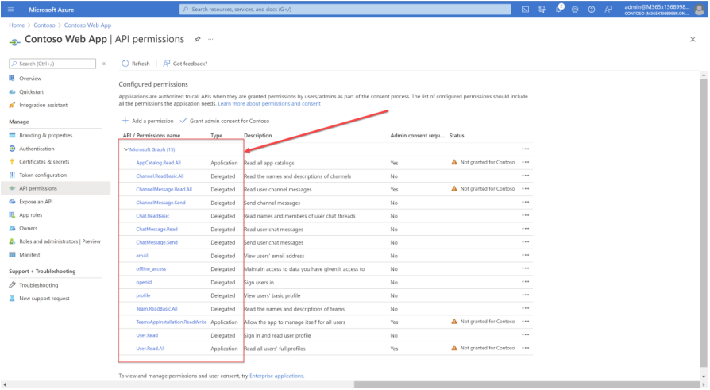

13. Navigate to **Authentication**
    If an app hasn't been granted IT admin consent, users will have to provide consent the first time they use an app.
    - Set a redirect URI:
    * Select **Add a platform**.
    * Select **Single-page application**.
    * Enter the **redirect URI** for the app in the following format: 
      1) https://%ngrokDomain%.ngrok-free.app/StaticViews/LoginResult.html

    - Set another redirect URI:
    * Select **Add a platform**.
    * Select **web**.
    * Enter the **redirect URI** for the app in the following format: 
      1) https://token.botframework.com/.auth/web/redirect
    
14.  Navigate to the **Certificates & secrets**. In the Client secrets section, click on "+ New client secret". Add a description      (Name of the secret) for the secret and select “Never” for Expires. Click "Add". Once the client secret is created, copy its value, it need to be placed in the appsettings.json.

 ### 5. Setup Manifest for Teams

**This step is specific to Teams.**
   - **Edit** the `manifest.json` contained in the  `AppManifest` folder to replace your Microsoft App Id (that was created when you registered your bot earlier) *everywhere* you see the place holder string `<<YOUR-MICROSOFT-APP-ID>>` (depending on the scenario the Microsoft App Id may occur multiple times in the `manifest.json`)
   - **Edit** the `manifest.json` for `validDomains` and `<<DOMAIN-NAME>>` with base Url domain. E.g. if you are using ngrok it would be `https://1234.ngrok-free.app` then your domain-name will be `1234.ngrok-free.app` and if you are using dev tunnels then your domain will be like: `12345.devtunnels.ms`.
   - **Zip** up the contents of the `AppManifest` folder to create a `manifest.zip`.(Make sure that zip file does not contains any subfolder otherwise you will get error while uploading your .zip package)
   - **Upload** the `manifest.zip` to Teams (In Teams Apps/Manage your apps click "Upload an app". Browse to and Open the .zip file. At the next dialog, click the Add button.)

**Note**: This `manifest.json` specified that the bot will be installed in a "personal" scope only. Please refer to Teams documentation for more details. 

## Running the sample

You can interact with this bot by sending it a message. The bot will respond by requesting you to login to Microsoft Entra ID, then making a call to the Graph API on your behalf and returning the results.

**Install App:**

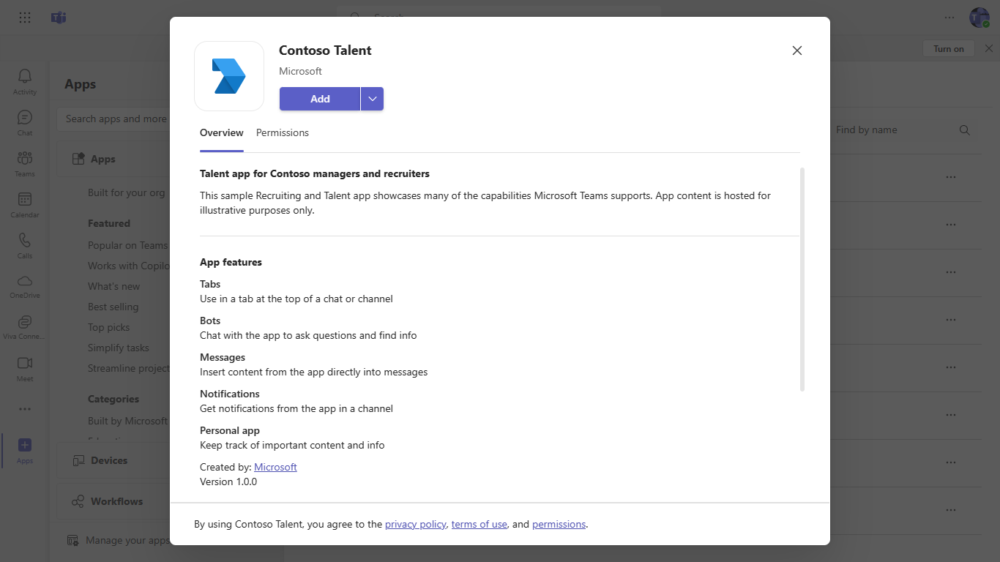

**Welcome Card:**

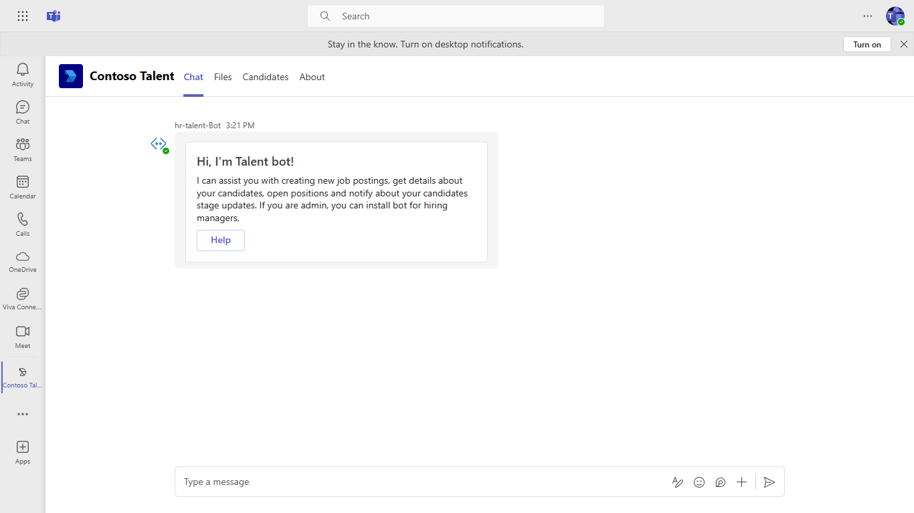

**Help Card:**

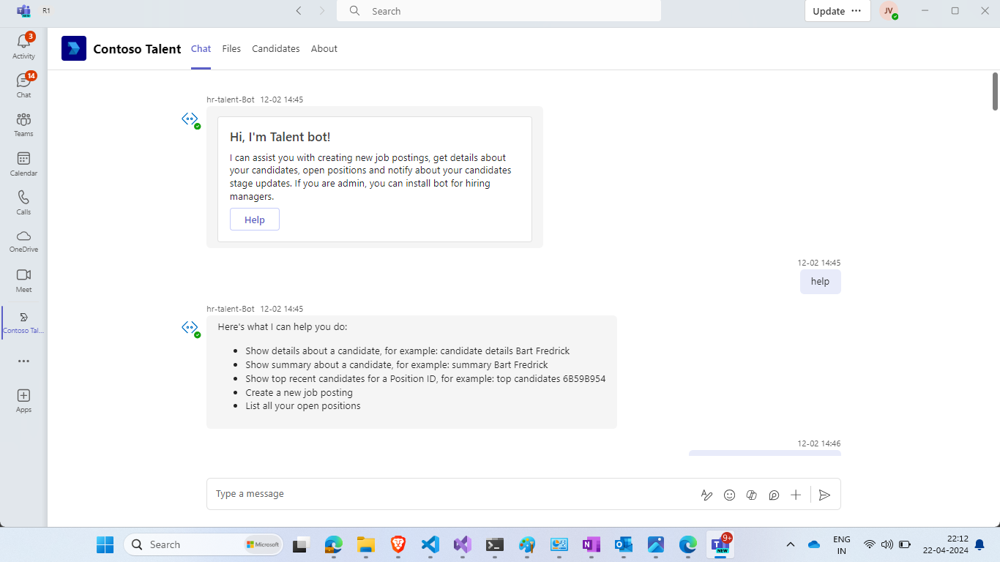

- Type anything from the examples of help card
- The bot will perform `Single Sign-On` and perform the funtion provided

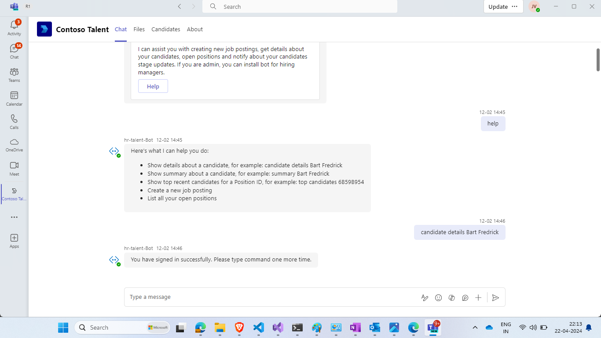

**Candidate Details**

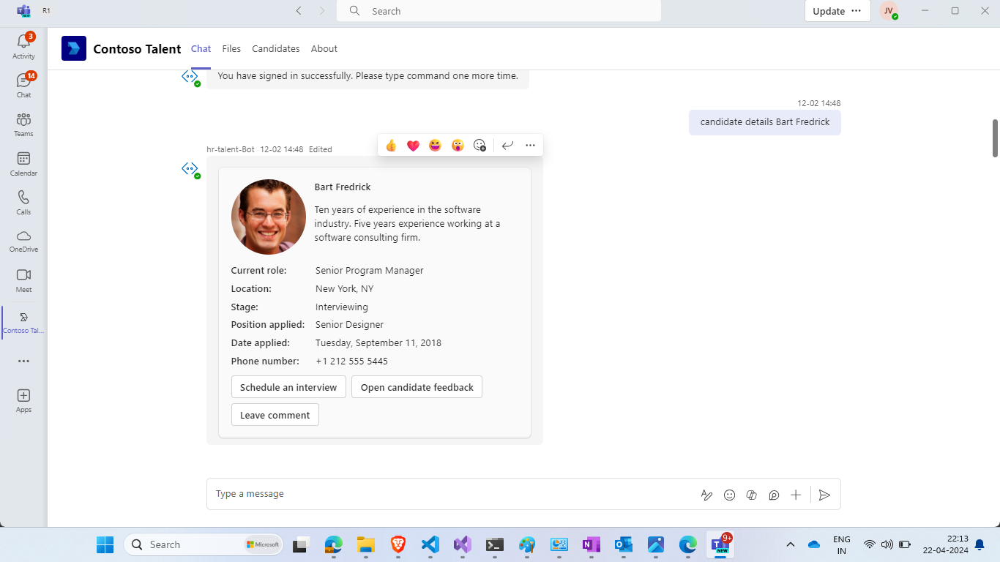

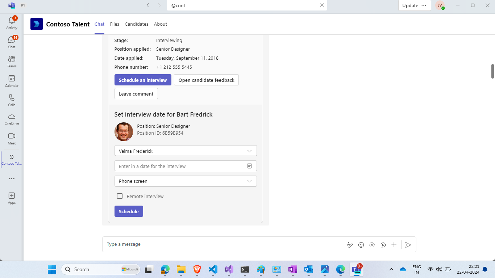

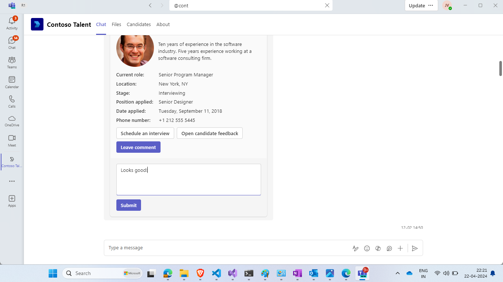

**Summary**

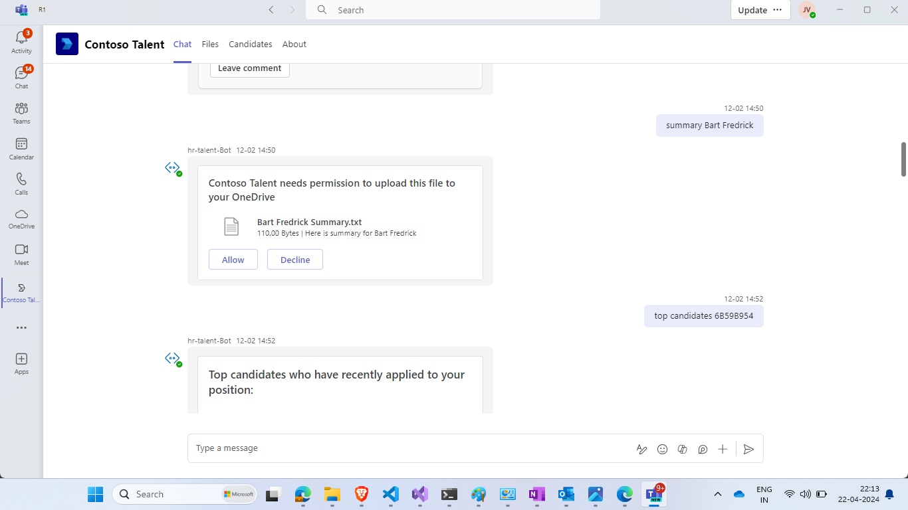

**Top Candidates List**

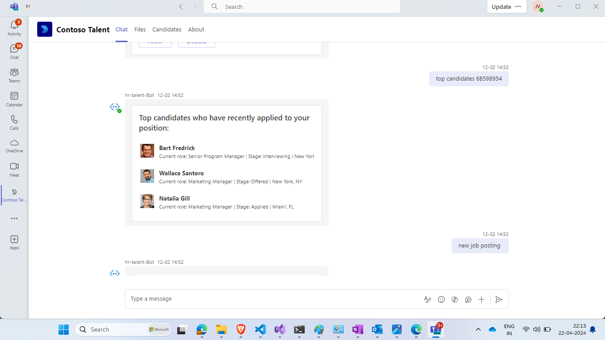

**New Job Posting**

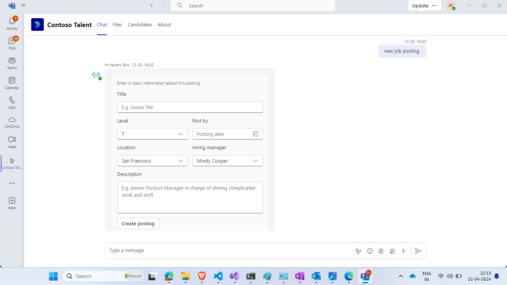

**Show open positions**

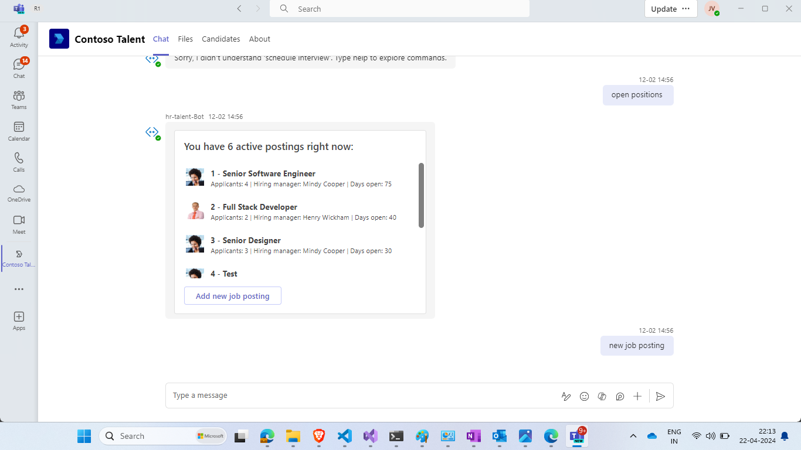

- Typing an @ symbol will show a dropdown with a list of installed bots. If you can’t see yours 
then start typing the name until it’s displayed and then select it from the list.
This will change the context of the search box to your bot only and once in that context you 
will be prompted with all the available search functionality exposed by our bot. In this case 
`Candidates` and `Positions`. Select candidates to see a list of candidates

**Candidates**


**Positions**


**Open Messaging Extension (Search)**

**Messaging Extension Candidates**

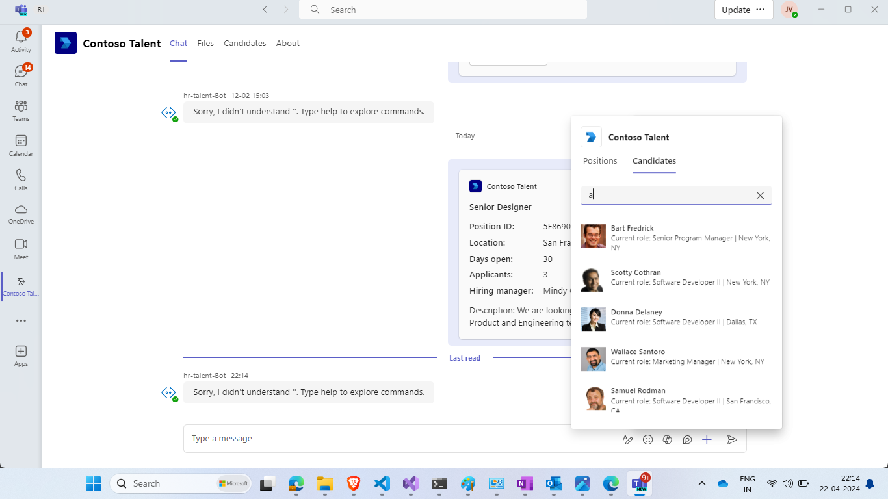

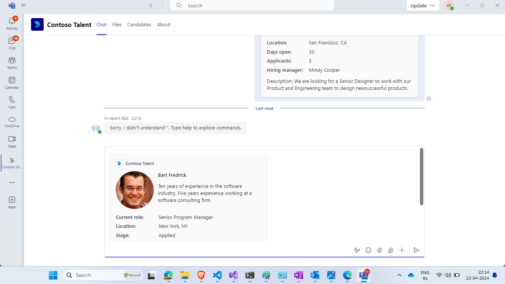

**Messaging Extension Positions**

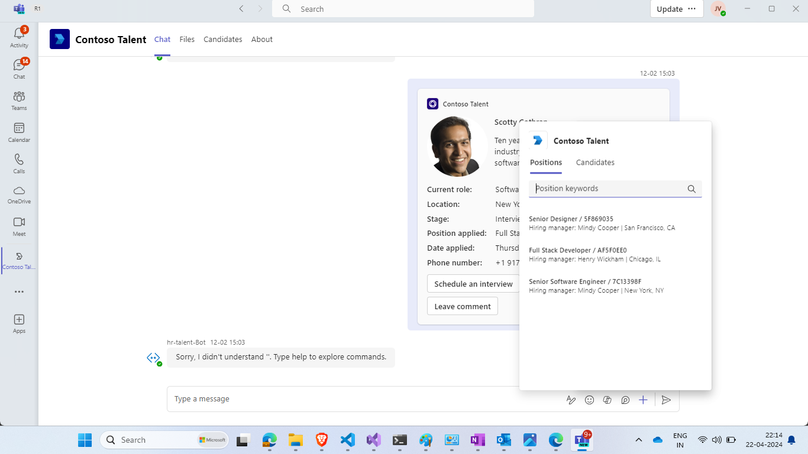

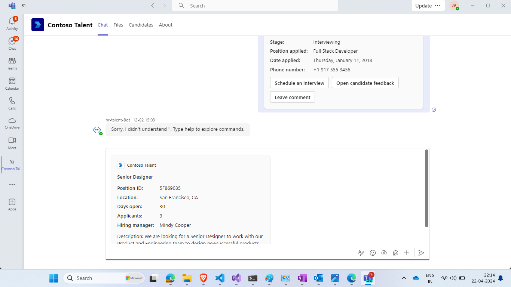

**Click on the Candidates tab to see in detail**

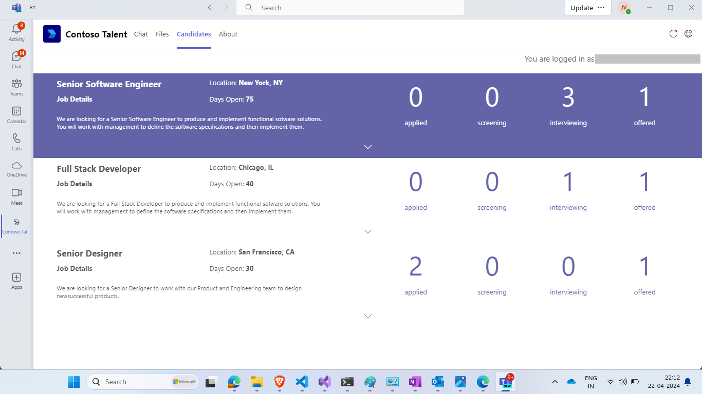

## Deploy the bot to Azure

To learn more about deploying a bot to Azure, see [Deploy your bot to Azure](https://aka.ms/azuredeployment) for a complete list of deployment instructions.

## Further reading

- [Bot Framework Documentation](https://docs.botframework.com)
- [Bot Basics](https://docs.microsoft.com/azure/bot-service/bot-builder-basics?view=azure-bot-service-4.0)
- [SSO for Bot](https://docs.microsoft.com/microsoftteams/platform/bots/how-to/authentication/auth-aad-sso-bots)
- [SSO for Messaging Extensions](https://docs.microsoft.com/microsoftteams/platform/messaging-extensions/how-to/enable-sso-auth-me)
- [SSO for Tab](https://docs.microsoft.com/en-us/microsoftteams/platform/tabs/how-to/authentication/auth-aad-sso)
- [Azure Portal](https://portal.azure.com)
- [Add Authentication to Your Bot Via Azure Bot Service](https://docs.microsoft.com/azure/bot-service/bot-builder-authentication?view=azure-bot-service-4.0&tabs=csharp)
- [Azure Bot Service Introduction](https://docs.microsoft.com/azure/bot-service/bot-service-overview-introduction?view=azure-bot-service-4.0)
- [Azure Bot Service Documentation](https://docs.microsoft.com/azure/bot-service/?view=azure-bot-service-4.0)
- [Extend Teams apps across Microsoft 365](https://learn.microsoft.com/microsoftteams/platform/m365-apps/overview)

