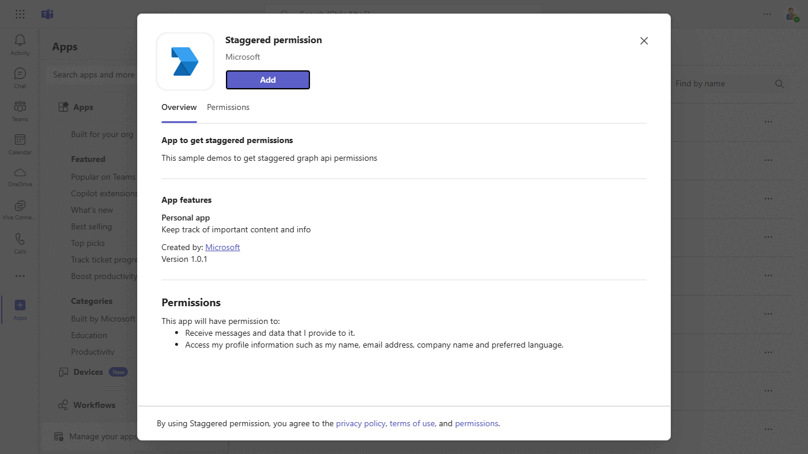
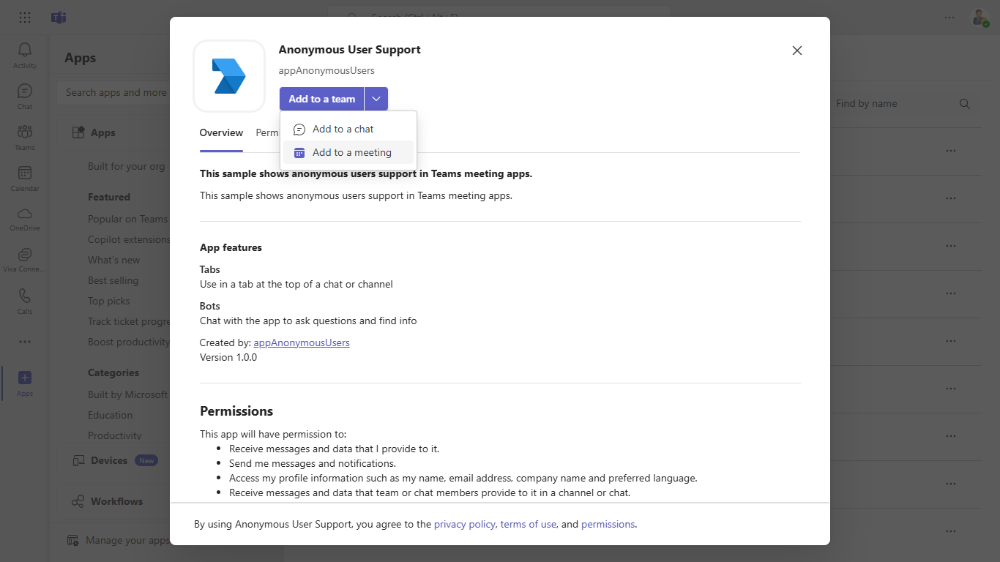
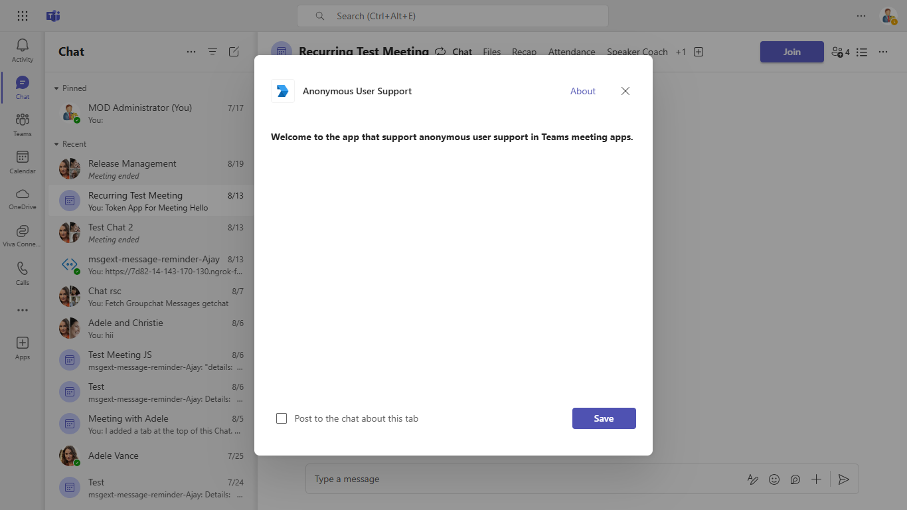
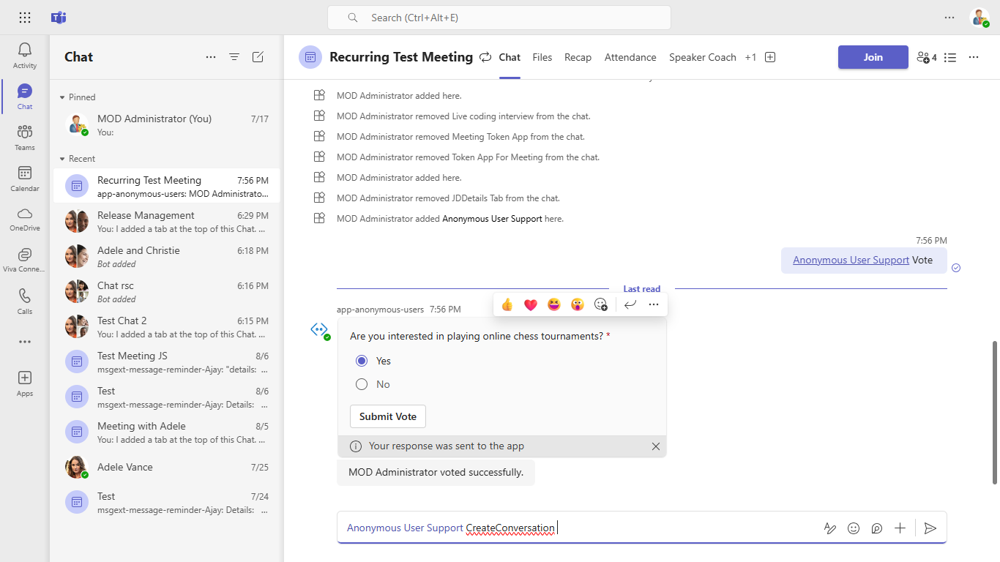
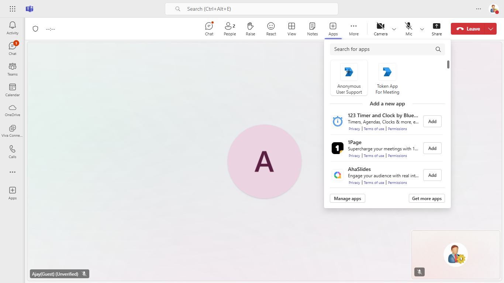
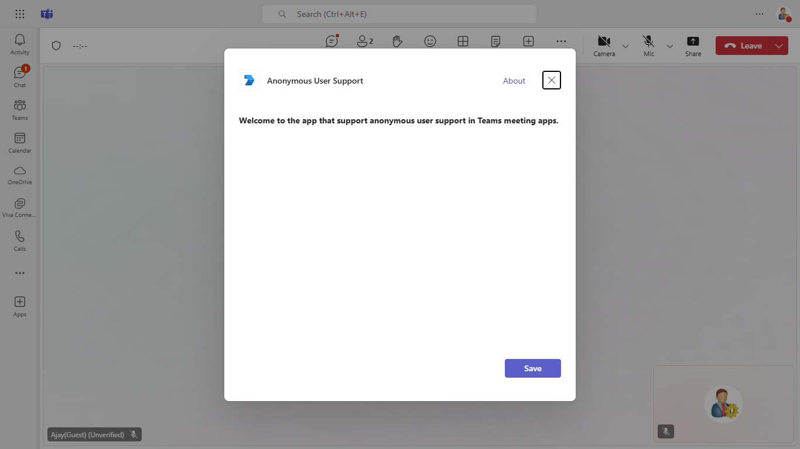
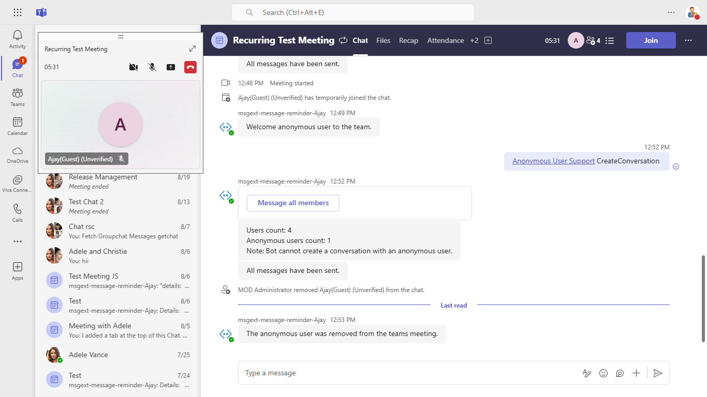
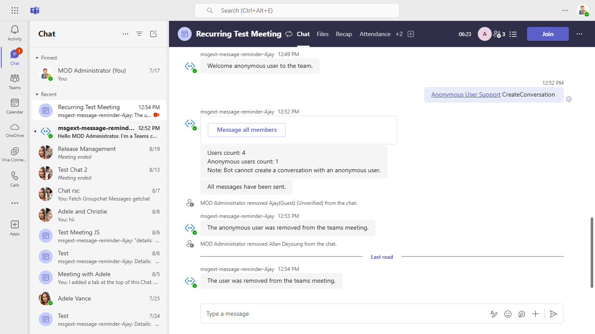

## Anonymous User Support

This sample shows anonymous users support in meeting apps.

**Interaction with app**


## Prerequisites

- [.NET Core SDK](https://dotnet.microsoft.com/download) version 6.0

  determine dotnet version
  ```bash
  dotnet --version
  ```
- [ngrok](https://ngrok.com/) or equivalent tunnelling solution
- [Teams](https://teams.microsoft.com) Microsoft Teams is installed and you have an account

## Setup

> Note these instructions are for running the sample on your local machine.

1. Run ngrok - point to port 3978

   ```bash
     ngrok http 3978 --host-header="localhost:3978"
   ```  

2. Setup

 ### Register you app with Azure AD.

  1. Register a new application in the [Azure Active Directory – App Registrations](https://go.microsoft.com/fwlink/?linkid=2083908) portal.
  2. Select **New Registration** and on the *register an application page*, set following values:
      * Set **name** to your app name.
      * Choose the **supported account types** (any account type will work)
      * Leave **Redirect URI** empty.
      * Choose **Register**.
  3. On the overview page, copy and save the **Application (client) ID, Directory (tenant) ID**. You’ll need those later when updating your Teams application manifest and in the appsettings.json.
  4. Under **Manage**, select **Expose an API**. 
  5. Select the **Set** link to generate the Application ID URI in the form of `api://{base-url}/botid-{AppID}`. Insert your fully qualified domain name (with a forward slash "/" appended to the end) between the double forward slashes and the GUID. The entire ID should have the form of: `api://fully-qualified-domain-name/botid-{AppID}`
      * ex: `api://%ngrokDomain%.ngrok-free.app/botid-00000000-0000-0000-0000-000000000000`.
  6. Select the **Add a scope** button. In the panel that opens, enter `access_as_user` as the **Scope name**.
  7. Set **Who can consent?** to `Admins and users`
  8. Fill in the fields for configuring the admin and user consent prompts with values that are appropriate for the `access_as_user` scope:
      * **Admin consent title:** Teams can access the user’s profile.
      * **Admin consent description**: Allows Teams to call the app’s web APIs as the current user.
      * **User consent title**: Teams can access the user profile and make requests on the user's behalf.
      * **User consent description:** Enable Teams to call this app’s APIs with the same rights as the user.
  9. Ensure that **State** is set to **Enabled**
  10. Select **Add scope**
      * The domain part of the **Scope name** displayed just below the text field should automatically match the **Application ID** URI set in the previous step, with `/access_as_user` appended to the end:
          * `api://[ngrokDomain].ngrok-free.app/botid-00000000-0000-0000-0000-000000000000/access_as_user.
  11. In the **Authorized client applications** section, identify the applications that you want to authorize for your app’s web application. Each of the following IDs needs to be entered:
      * `1fec8e78-bce4-4aaf-ab1b-5451cc387264` (Teams mobile/desktop application)
      * `5e3ce6c0-2b1f-4285-8d4b-75ee78787346` (Teams web application)
  12. Navigate to **API Permissions**, and make sure to add the follow permissions:
  -   Select Add a permission
  -   Select Microsoft Graph -\> Delegated permissions.
      - `User.Read` (enabled by default)
  -   Click on Add permissions. Please make sure to grant the admin consent for the required permissions.
  13. Navigate to **Authentication**
      If an app hasn't been granted IT admin consent, users will have to provide consent the first time they use an app.
  - Set a redirect URI:
      * Select **Add a platform**.
      * Select **Single-page application**.
      * Enter the **redirect URI** for the app in the following format: `https://{Base_Url}/auth-end` and `https://{Base_Url}/auth-start`.
  14.  Navigate to the **Certificates & secrets**. In the Client secrets section, click on "+ New client secret". Add a description(Name of the secret) for the secret and select “Never” for Expires. Click "Add". Once the client secret is created, copy its value, it need to be placed in the appsettings.json.

  15. Create a Bot Registration
    - Register a bot with Azure Bot Service, following the instructions [here](https://docs.microsoft.com/en-us/azure/bot-service/bot-service-quickstart-registration?view=azure-bot-service-3.0).
    - Ensure that you've [enabled the Teams Channel](https://docs.microsoft.com/en-us/azure/bot-service/channel-connect-teams?view=azure-bot-service-4.0)
    - While registering the bot, use `https://<your_ngrok_url>/api/messages` as the messaging endpoint.

16. To test facebook auth flow [create a facebookapp](FacebookAuth/README.md) and get client id and secret for facebook app.
    Now go to your bot channel registartion -> configuration -> Add OAuth connection string
   - Provide connection Name : for eg `facebookconnection`. You'll use this name in your bot in the appsettings.json file.
   - Select service provider ad `facebook`
   - Add clientid and secret of your facebook app that was created using Step 16.
      
3. Clone the repository

    ```bash
    git clone https://github.com/OfficeDev/Microsoft-Teams-Samples.git
    ```
    
4. Run the app from a terminal or from Visual Studio, choose option A or B.

    A) From a terminal, navigate to `samples/app-anonymous-users/csharp`

    ```bash
    # run the app
    dotnet run
    ```
    B) Or from Visual Studio

    - Launch Visual Studio
    - File -> Open -> Project/Solution
    - Navigate to `samples/app-anonymous-users/csharp` folder
    - Select `AnonymousUsers.sln` file
    - Press `F5` to run the project

5. In a terminal, navigate to `samples/app-anonymous-users/csharp/ClientApp`

    - Inside ClientApp folder execute the below command.

        ```bash
        # npm install
        ```

 6) Modify the `/appsettings.json` and fill in the following details:
  Modify the `appsettings.json` and fill in the following details:
   - `{{Microsoft-App-id}}` - Generated from Step 1 (Application (client) ID)is the application app id
   - `{{TenantId}}` - Generated from Step 1(Directory (tenant) ID) is the tenant id
   - `{{MicrosoftAppPassword}}` - Generated from Step 1.14, also referred to as Client secret
   - `{{domain-name}}` - Your application's base url. E.g. https://12345.ngrok-free.app if you are using ngrok.
   - `{{FacebookAppId}} and {{FacebookAppPassword}}`- Generated from step 16.
  
  7) Modify the .env file in your project folder (or in Visual Studio) and fill in below details:
   - `{{Microsoft-App-id}}` - Generated from Step 1 (Application (client) ID)is the application app id
   - `{{FacebookAppId}}`- Generated from step 16.
   
 7. __*This step is specific to Teams.*__

- **Edit** the `manifest.json` contained in the  `TeamsAppManifest` folder to replace your Microsoft App Id `<<YOUR-MICROSOFT-APP-ID>>` (that was created when you registered your bot earlier) *everywhere* you see the place holder string `<<YOUR-MICROSOFT-APP-ID>>` (depending on the scenario the Microsoft App Id may occur multiple times in the `manifest.json`)

- **Edit** the `manifest.json` for `{{domain-name}}` with base Url domain. E.g. if you are using ngrok it would be `https://1234.ngrok-free.app` then your domain-name will be `1234.ngrok-free.app`.

- **Zip** up the contents of the `TeamsAppManifest` folder to create a `manifest.zip` (Make sure that zip file does not contains any subfolder otherwise you will get error while uploading your .zip package)

- **Upload** the `manifest.zip` to Teams (In Teams Apps/Manage your apps click "Upload an app". Browse to and Open the .zip file. At the next dialog, click the Add button.)

- Add the app to team/groupChat scope (Supported scopes). 

**Note:**
-   If you are facing any issue in your app,  [please uncomment this line](https://github.com/OfficeDev/Microsoft-Teams-Samples/blob/main/samples/app-anonymous-users/csharp/AdapterWithErrorHandler.cs#L27) and put your debugger for local debug.

## Running the sample

You can interact with Teams Tab meeting sidepanel.

**Install app:**


**Add to a meeting:**



**Select meeting:**


**Add app in a meeting tab:**



**Select vote:**


**Vote UI:**


**Submit vote:**


**Select CreateConversation:**



**All message have been send and user count:**


**Send user conversation mmessage:**


**Click the "Share Invite" button, copy the URL, open the URL in a new tab, and set up a guest account:**


**Accept guest user:**


**CreateConversation guest user:**



**Add app:**



**Share to stage view:**


**Click share to stage view:**


**Screen visible anonymous users:**


**Click sign-in button**


**Click sign-in button anonymous users:**


**Anonymous user success page:**


**Click submit vote button:**


**Anonymous user showing the count:**


**Click submit vote button anonymous users:**


**User showing the count:**


**Anonymous user showing the count:**


**Remove guest user:**


**Confirm message:**


**The anonymous user was removed from team:**



**Remove tenant user:**


**The tenant user was removed from team:**



**Add users:**


**Welcome to the team:**


## Further reading

- [Build apps for anonymous users](https://learn.microsoft.com/en-us/microsoftteams/platform/apps-in-teams-meetings/build-apps-for-anonymous-user?branch=pr-en-us-7318&tabs=javascript)
- [Authentication basics](https://docs.microsoft.com/microsoftteams/platform/concepts/authentication/authentication)
- [Create facebook app for development](https://developers.facebook.com/docs/development/create-an-app/)


