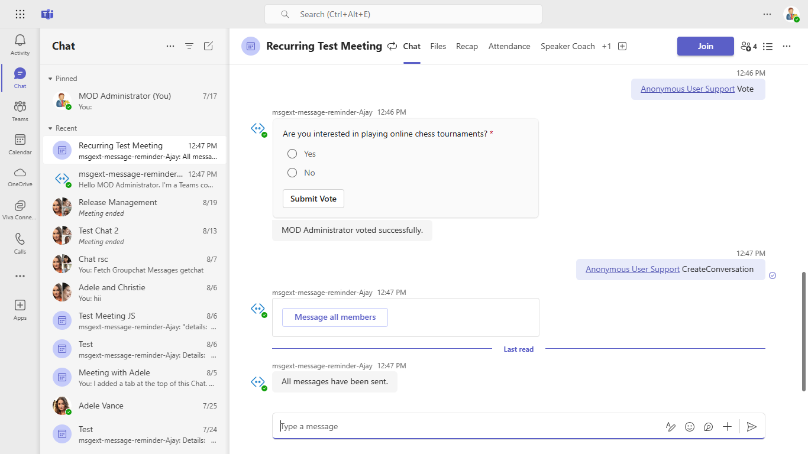
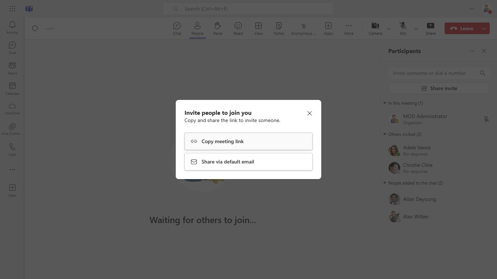
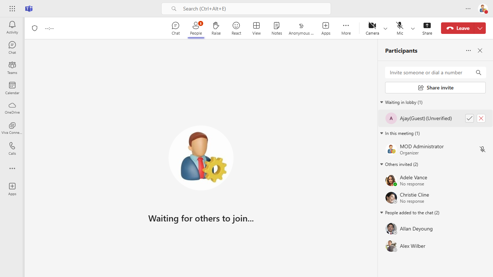
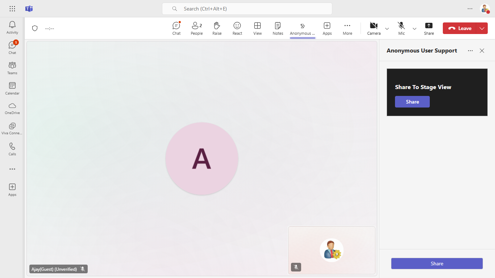
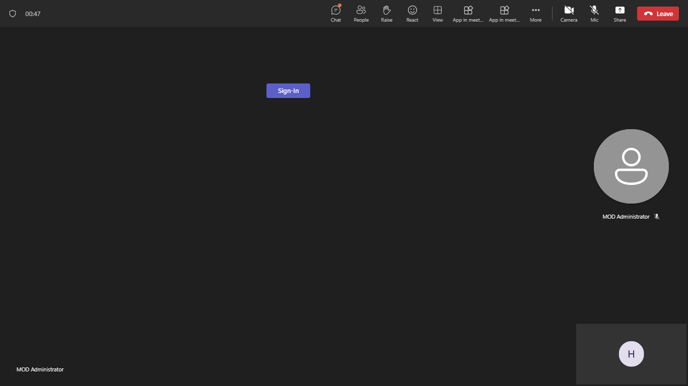
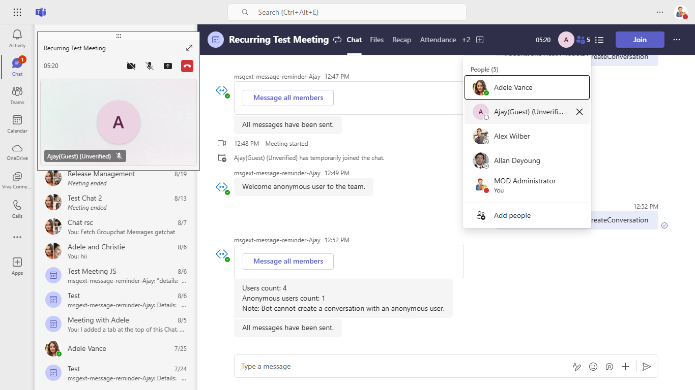
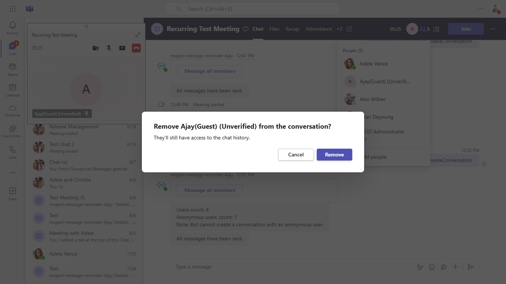
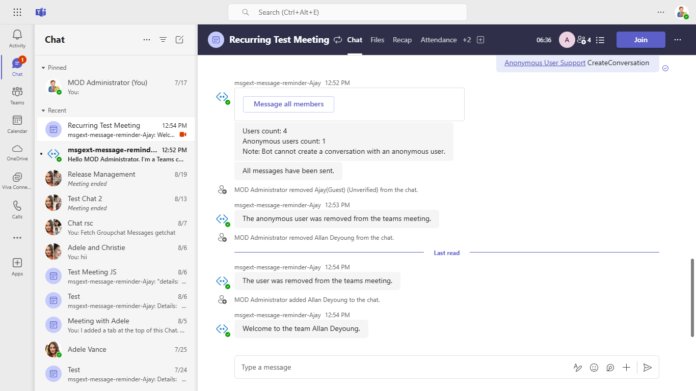
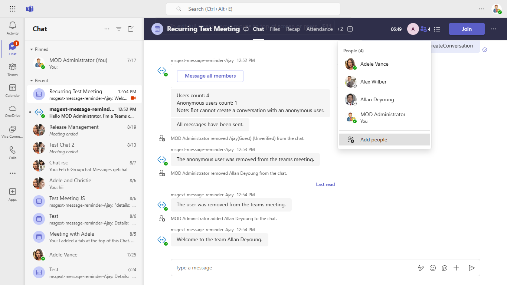

### Anonymous User Support

This sample shows Anonymous Users Support In Meeting.

**Interaction with bot**


## Try it yourself - experience the App in your Microsoft Teams client
Please find below demo manifest which is deployed on Microsoft Azure and you can try it yourself by uploading the app package (.zip file link below) to your teams and/or as a personal app. (Sideloading must be enabled for your tenant, [see steps here](https://docs.microsoft.com/microsoftteams/platform/concepts/build-and-test/prepare-your-o365-tenant#enable-custom-teams-apps-and-turn-on-custom-app-uploading)).

**Anonymous Users:** [Manifest](/samples/app-anonymous-users/csharp/demo-manifest/app-anonymous-users.zip)

## Prerequisites

- [.NET Core SDK](https://dotnet.microsoft.com/download) version 6.0

  determine dotnet version
  ```bash
  dotnet --version
  ```
- [ngrok](https://ngrok.com/) or equivalent tunnelling solution
- [Teams](https://teams.microsoft.com) Microsoft Teams is installed and you have an account

## Setup

> Note these instructions are for running the sample on your local machine.

1. Run ngrok - point to port 3978

   ```bash
     ngrok http -host-header=rewrite 3978
   ```  

2. Setup

   **Register your application with Azure AD:**

    - Register a new application in the [Azure Active Directory – App Registrations](https://go.microsoft.com/fwlink/?linkid=2083908) portal.

    - Select **New Registration** and on the *register an application page*, set following values:
           * Set **name** to your app name.
           * Choose the **supported account types** (any account type will work)
           * Leave **Redirect URI** empty.
           * Choose **Register**.

    - On the overview page, copy and save the **Application (client) ID, Directory (tenant) ID**. You’ll need those later when updating your Teams application manifest and in the appsettings.json.

    - Ensure that you've [enabled the Teams Channel](https://docs.microsoft.com/en-us/azure/bot-service/channel-connect-teams?view=azure-bot-service-4.0)

3. Clone the repository

    ```bash
    git clone https://github.com/OfficeDev/Microsoft-Teams-Samples.git
    ```
    
4. Run the app from a terminal or from Visual Studio, choose option A or B.

    A) From a terminal, navigate to `samples/app-anonymous-users/csharp`

    ```bash
    # run the app
    dotnet run
    ```
    B) Or from Visual Studio

    - Launch Visual Studio
    - File -> Open -> Project/Solution
    - Navigate to `samples/app-anonymous-users/csharp` folder
    - Select `AnonymousUsers.sln` file
    - Press `F5` to run the project

5. In a terminal, navigate to `samples/app-anonymous-users/csharp/ClientApp`

    - Inside ClientApp folder execute the below command.

        ```bash
        # npm install
        ```

 6) Modify the `/appsettings.json` and fill in the following details:
  - `{{ MicrosoftAppType }}` - **Allowed values are: MultiTenant(default), SingleTenant, UserAssignedMSI**
  - `{{ MicrosoftAppId }}` - Generated from Step 2 is the application app id
  - `{{ MicrosoftAppPassword }}` - Generated from Step 2, also referred to as Client secret
  - `{{ MicrosoftAppTenantId }}` - Generated from Step 2 is the tenantId id

 7. __*This step is specific to Teams.*__

- **Edit** the `manifest.json` contained in the  `TeamsAppManifest` folder to replace your Microsoft App Id `<<YOUR-MICROSOFT-APP-ID>>` (that was created when you registered your bot earlier) *everywhere* you see the place holder string `<<YOUR-MICROSOFT-APP-ID>>` (depending on the scenario the Microsoft App Id may occur multiple times in the `manifest.json`)

- **Edit** the `manifest.json` for `{{domain-name}}` with base Url domain. E.g. if you are using ngrok it would be `https://1234.ngrok.io` then your domain-name will be `1234.ngrok.io`.

- **Zip** up the contents of the `TeamsAppManifest` folder to create a `manifest.zip` (Make sure that zip file does not contains any subfolder otherwise you will get error while uploading your .zip package)

- **Upload** the `manifest.zip` to Teams (In Teams Apps/Manage your apps click "Upload an app". Browse to and Open the .zip file. At the next dialog, click the Add button.)

- Add the app to team/groupChat scope (Supported scopes). 

**Note:**
-   If you are facing any issue in your app,  [please uncomment this line](https://github.com/OfficeDev/Microsoft-Teams-Samples/blob/7336b195da6ea77299d220612817943551065adb/samples/app-anonymous-users/csharp/AdapterWithErrorHandler.cs#L27) and put your debugger for local debug.

## Running the sample

You can interact with Teams Tab meeting sidepanel.

**Install app:**


**Add to a meeting:**


**Select meeting:**


**Add app in a meeting tab:**


**Select vote:**


**Submit vote:**


**Vote successfully:**


**Select CreateConversation:**


**All message have been send:**


**Send user conversation mmessage:**



**Send next user conversation mmessage:**


**Join meeting and Click share invite:**



**Paste the URL and create a guest user:**


**Accept guest user:**



**CreateConversation guest user:**


**Add app:**


**Add app in a meeting tab:**


**Share to stage view:**



**Click share to stage view:**


**Screen visible anonymous users:**



**Tenant user submit vote:**


**Anonymous users screen cout auto update:**


**Anonymous user submit vote:**


**Tenant users screen cout auto update:**


**Remove guest user:**



**Confirm message:**



**The anonymous user was removed from team:**


**Remove tenant user:**


**The tenant user was removed from team:**


**Add users:**



**Welcome to the team:**




## Further reading

- [Build apps for anonymous users](https://learn.microsoft.com/en-us/microsoftteams/platform/apps-in-teams-meetings/build-apps-for-anonymous-user?branch=pr-en-us-7318&tabs=javascript)


