# Microsoft Teams Authentication Sample

This sample demonstrates authentication in Microsoft Teams using bot and tab.

## Included Features
* Teams SSO (Using bots and tabs)
* Bots
* MSAL.js 2.0 support

## Interaction with App


## Getting started

1. Install some sort of tunnelling service. These instructions assume you are using ngrok: https://ngrok.com/
2. Begin your tunnelling service to get an https endpoint. For this example ngrok is used. Start an ngrok tunnel with the following command (you'll need the https endpoint for the bot registration):<br>

    ```bash
    ngrok http 3978 --host-header=localhost
    ```
### Setup for code

 - Clone the repository

    ```bash
    git clone https://github.com/OfficeDev/Microsoft-Teams-Samples.git
    ```
 - In a terminal, navigate to `samples/app-auth/nodejs`

 - Install modules

    ```bash
    npm install
    npm start
    ```
    
3. Register a bot with Azure Bot Service, following the instructions [here](https://docs.microsoft.com/en-us/azure/bot-service/bot-service-quickstart-registration?view=azure-bot-service-3.0).
- Ensure that you've [enabled the Teams Channel](https://docs.microsoft.com/en-us/azure/bot-service/channel-connect-teams?view=azure-bot-service-4.0)
- While registering the bot, use `https://<your_ngrok_url>/api/messages` as the messaging endpoint.
    > NOTE: When you create your bot you will create an App ID and App password - make sure you keep these for later.

> **IMPORTANT**: Do not use the legacy Bot Framework portal, nor App Studio, to create the bot. Your bot MUST be registered with
> Azure Bot Service to use the authentication functionality provided by Azure Bot Service.

4. Create an app manifest. Navigate to the file, manifest/manifest.json - Change:
    1. <<REGISTERED_BOT_ID>> (there are 3) change to your registered bot's app ID
    2. <<BASE_URI_DOMAIN>> (there are 5) change to your https endpoint from ngrok excluding the "https://" part
    **Note:** If you want to test your app across multi hub like: Outlook/Office.com, please update the `manifest.json` in the `app-auth\nodejs\Manifest_Hub` folder with the required values.
    3. Zip up the contents of the `manifest` folder to create a `manifest.zip` or `Manifest_Hub` folder into a `Manifest_Hub.zip`. (Make sure that zip file does not contains any subfolder otherwise you will get error while uploading your .zip package)

## Setup

To be able to use an identity provider, first you have to register your application.

### Changing app settings

This project uses the [config](https://www.npmjs.com/package/config) package. The default configuration is in `config\default.json`.

-   Environment variable overrides are defined in `config\custom-environment-variables.json`. You can set these environment variables when running node. If you are using Visual Studio Code, you can set these in your `launch.json` file.
-   Alternatively, you can specify local modifications in `config\local.json`.

The instructions below assume that you're using environment variables to configure the app, and will specify the name of the variable to set.

### [Using Azure AD](#using-azure-ad)

Registering a bot with the Microsoft Bot Framework automatically creates a corresponding Azure AD application with the same name and ID.

1. Go to the [Application Registration Portal](https://aka.ms/appregistrations) and sign in with the same account that you used to register your bot.
2. Find your application in the list and click on the name to edit.
3. Navigate to **Authentication** under **Manage** and add the following redirect URLs:

    - `https://<your_ngrok_url>/tab/simple-end`
    - `https://token.botframework.com/.auth/web/redirect`
    - Add this URL as *Single-page application* `https://<your_ngrok_url>/tab/silent-end`

4. Additionally, under the **Implicit grant** subsection select **Access tokens** and **ID tokens**

5. Click on **Expose an API** under **Manage**. Select the Set link to generate the Application ID URI in the form of api://{AppID}. Insert your fully qualified domain name (with a forward slash "/" appended to the end) between the double forward slashes and the GUID. The entire ID should have the form of: api://<your_ngrok_url>/{AppID}
6. Select the **Add a scope** button. In the panel that opens, enter `access_as_user` as the **Scope name**.
7. Set Who can consent? to Admins and users

8. Fill in the fields for configuring the admin and user consent prompts with values that are appropriate for the `access_as_user` scope. Suggestions:
    - **Admin consent title:** Teams can access the user’s profile
    - **Admin consent description**: Allows Teams to call the app’s web APIs as the current user.
    - **User consent title**: Teams can access your user profile and make requests on your behalf
    - **User consent description:** Enable Teams to call this app’s APIs with the same rights that you have
9. Ensure that **State** is set to **Enabled**

10. Select **Add scope**
    - Note: The domain part of the **Scope name** displayed just below the text field should automatically match the **Application ID** URI set in the previous step, with `/access_as_user` appended to the end; for example:
        - `api://<your_ngrok_url>/<aad_application_id>/access_as_user`
    - If you are facing any issue in your app, please uncomment [this] line( https://github.com/OfficeDev/Microsoft-Teams-Samples/blob/main/samples/app-auth/nodejs/src/AuthBot.ts#L119) and put your debugger for local debug.
   
11. In the **Authorized client applications** section, you identify the applications that you want to authorize to your app’s web application. Each of the following IDs needs to be entered:
    - `1fec8e78-bce4-4aaf-ab1b-5451cc387264` (Teams mobile/desktop application)
    - `5e3ce6c0-2b1f-4285-8d4b-75ee78787346` (Teams web application)
**Note** If you want to test or extend your Teams apps across Office and Outlook, kindly add below client application identifiers while doing Azure AD app registration in your tenant:
    * `4765445b-32c6-49b0-83e6-1d93765276ca` (Office web)
    * `0ec893e0-5785-4de6-99da-4ed124e5296c` (Office desktop)
    * `bc59ab01-8403-45c6-8796-ac3ef710b3e3` (Outlook web)
    * `d3590ed6-52b3-4102-aeff-aad2292ab01c` (Outlook desktop)
    
12. Navigate to **API Permissions**, and make sure to add the following delegated permissions:
    - User.Read
    - email
    - offline_access
    - openid
    - profile
13. Scroll to the bottom of the page and click on "Add Permissions".

14. The bot uses `MICROSOFT_APP_ID` and `MICROSOFT_APP_PASSWORD`, so these should already be set.

### Update your Microsoft Teams application manifest

15. Add new properties to your Microsoft Teams manifest:

    - **WebApplicationInfo** - The parent of the following elements.
    - **Id** - The client ID of the application. This is an application ID that you obtain as part of registering the application with Azure AD 1.0 endpoint.
    - **Resource** - The domain and subdomain of your application. This is the same URI (including the `api://` protocol) that you used when registering the app in AAD. The domain part of this URI should match the domain, including any subdomains, used in the URLs in the section of your Teams application manifest.

    ```json
    "webApplicationInfo": {
    "id": "<<<REGISTERED_BOT_ID>>",
    "resource": "api://<<BASE_URI_DOMAIN>>/<<<REGISTERED_BOT_ID>>"
    }
    ```

16. Add permissions and update validDomains to allow token endpoint used by bot framework. Teams will only show the sign-in popup if its from a whitelisted domain.

    ```json
    "permissions": [
        "identity"
    ],
    "validDomains": [
        "<<BASE_URI_DOMAIN>>",
        "token.botframework.com"
    ],
    ```

Notes:
-   The resource for an AAD app will usually just be the root of its site URL and the appID (e.g. api://subdomain.example.com/6789/c6c1f32b-5e55-4997-881a-753cc1d563b7). We also use this value to ensure your request is coming from the same domain. Therefore make sure that your contentURL for your tab uses the same domains as your resource property.
-   You need to be using manifest version 1.5 or higher for these fields to be used.
-   Scopes aren’t supported in the manifest and instead should be specified in the API Permissions section in the Azure portal
-   If you are facing any issue in your app, please uncomment [this](https://github.com/OfficeDev/Microsoft-Teams-Samples/blob/main/samples/app-auth/nodejs/src/AuthBot.ts#L119) line and put your debugger for local debug.

### Add the Azure AD OAuth connection to the bot

1. Navigate to your Azure bot's service page on the [Azure Portal](https://ms.portal.azure.com/#blade/HubsExtension/BrowseResourceBlade/resourceType/Microsoft.BotService%2FbotServices).
2. Click **Settings**.
3. Under **OAuth Connection Settings** near the bottom of the page, click **Add Setting**.
4. Fill in the form as follows:

    1. For **Name**, enter a name for your connection (e.g., "AzureADv2")
    2. For **Service Provider**, select **Azure Active Directory v2**. Once you select this, the Azure AD-specific fields will be displayed.
    3. For **Client id**, enter your bot's client ID.
    4. For **Client secret**, enter your bot's client secret.
    5. For **Tenant ID**, enter `common`.
    6. For **Scopes**, enter `User.Read`.

5. Click **Save**.
6. Set the environment variable `AZUREAD_CONNECTIONNAME` to the name that you chose for this OAuth connection.

### [Optional] Using LinkedIn

1. Follow the instructions [here](https://docs.microsoft.com/en-us/linkedin/shared/authentication/authorization-code-flow?context=linkedin/context#step-1-configure-your-application) to create and configure a LinkedIn application for OAuth 2.
2. In "Authorized Redirect URLs", add `https://token.botframework.com/.auth/web/redirect`.
3. Note your app's "Client ID" and "Client Secret".
4. Navigate to your Azure bot's service page on the [Azure Portal](https://ms.portal.azure.com/#blade/HubsExtension/BrowseResourceBlade/resourceType/Microsoft.BotService%2FbotServices).
5. Click **Settings**.
6. Under **OAuth Connection Settings** near the bottom of the page, click **Add Setting**.
7. Fill in the form as follows:

    1. For **Name**, enter a name for your connection (e.g., "LinkedIn")
    2. For **Service Provider**, select **LinkedIn**.
    3. For **Client id**, enter the client ID for your LinkedIn app.
    4. For **Client secret**, enter the client secret for your LinkedIn app.
    5. For **Scopes**, enter `r_liteprofile r_emailaddress`.

8. Click **Save**.
9. Set the environment variable `LINKEDIN_CONNECTIONNAME` to the name that you chose for this OAuth connection.

### [Optional] Using Google

1. Obtain OAuth2 client credentials from the [Google API Console](https://console.developers.google.com). Enable access to the [Google People API](https://developers.google.com/people/).
2. In "Authorized redirect URLs", add `https://token.botframework.com/.auth/web/redirect`.
3. Note your app's "Client ID" and "Client Secret".
4. Navigate to your Azure bot's service page on the [Azure Portal](https://ms.portal.azure.com/#blade/HubsExtension/BrowseResourceBlade/resourceType/Microsoft.BotService%2FbotServices).
5. Click **Settings**.
6. Under **OAuth Connection Settings** near the bottom of the page, click **Add Setting**.
7. Fill in the form as follows:

    1. For **Name**, enter a name for your connection (e.g., "Google")
    2. For **Service Provider**, select **Google**.
    3. For **Client id**, enter the client ID for your Google app.
    4. For **Client secret**, enter the client secret for your Google app.
    5. For **Scopes**, enter `openid profile email`.

8. Click **Save**.
9. Set the environment variable `GOOGLE_CONNECTIONNAME` to the name that you chose for this OAuth connection.

### Testing the OAuth connections

Before proceeding, it's wise to test the OAuth connections that you have configured with the Azure Bot Service.

1. Open the [Azure Bot](https://ms.portal.azure.com/#blade/HubsExtension/BrowseResourceBlade/resourceType/Microsoft.BotService%2FbotServices) blade on the Azure Portal.
2. Navigate to your Azure Bot resource.
3. Click **Settings**.
4. Under **OAuth Connection Settings** near the bottom of the page, click on the connection.
5. Click on **Test connection**.
6. Sign in and authorize your app when prompted.

If the connection was configured correctly, you will be taken to a page with the access token that your bot would have received.


## Running the sample

Tab authentication

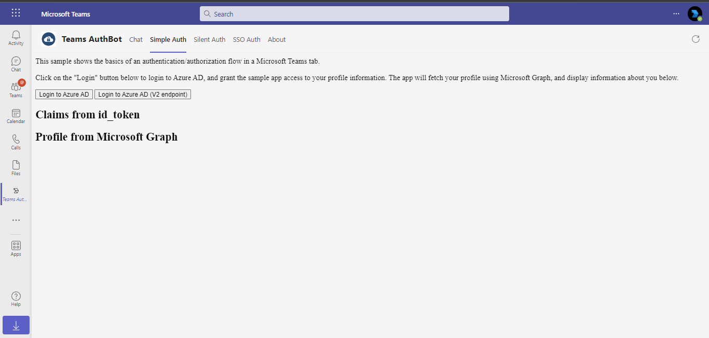

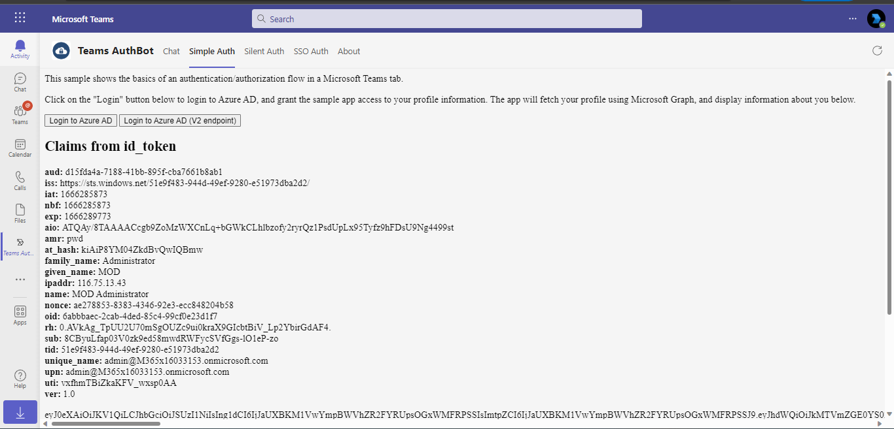

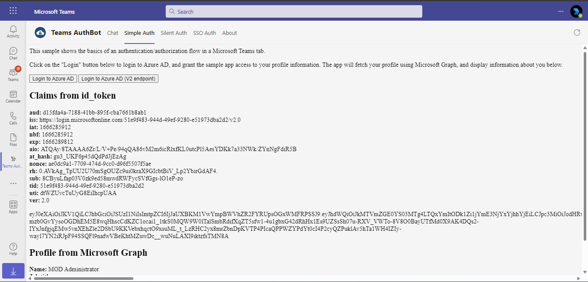

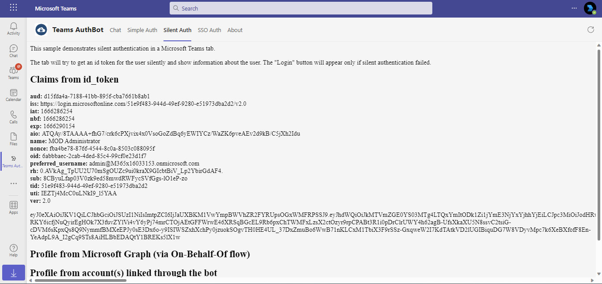

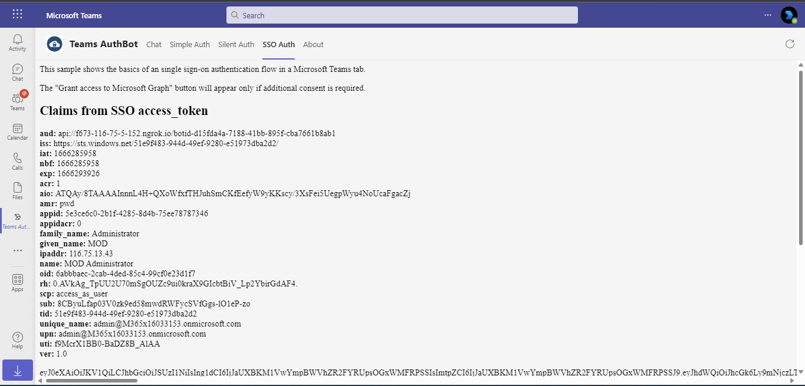

Bot authentication


## Outlook on the web

- To view your app in Outlook on the web.

- Go to [Outlook on the web](https://outlook.office.com/mail/)and sign in using your dev tenant account.

**On the side bar, select More Apps. Your sideloaded app title appears among your installed apps**

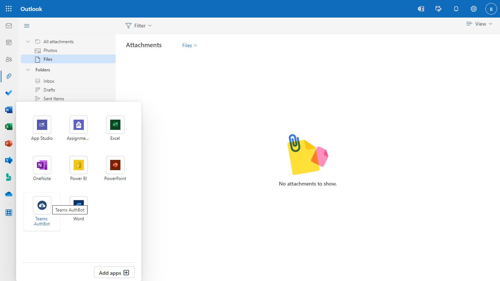

**Select your app icon to launch and preview your app running in Outlook on the web**

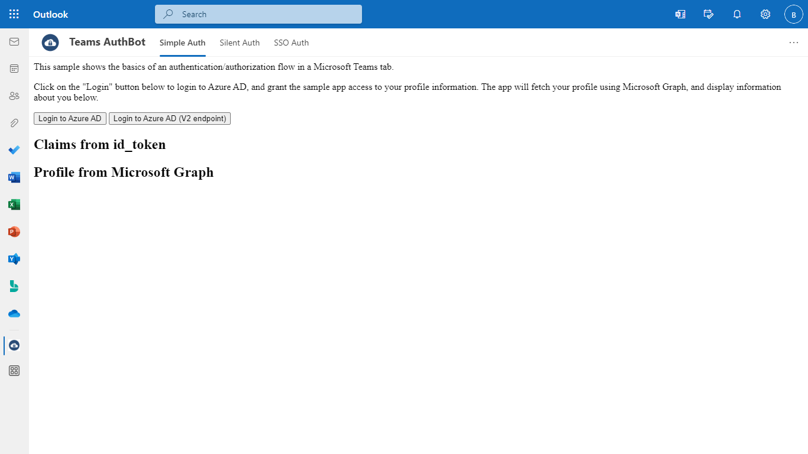


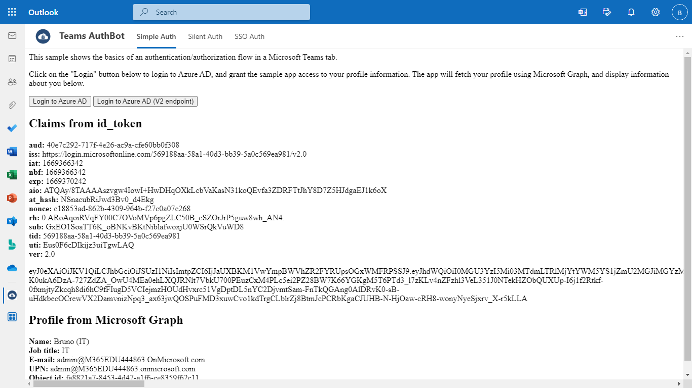

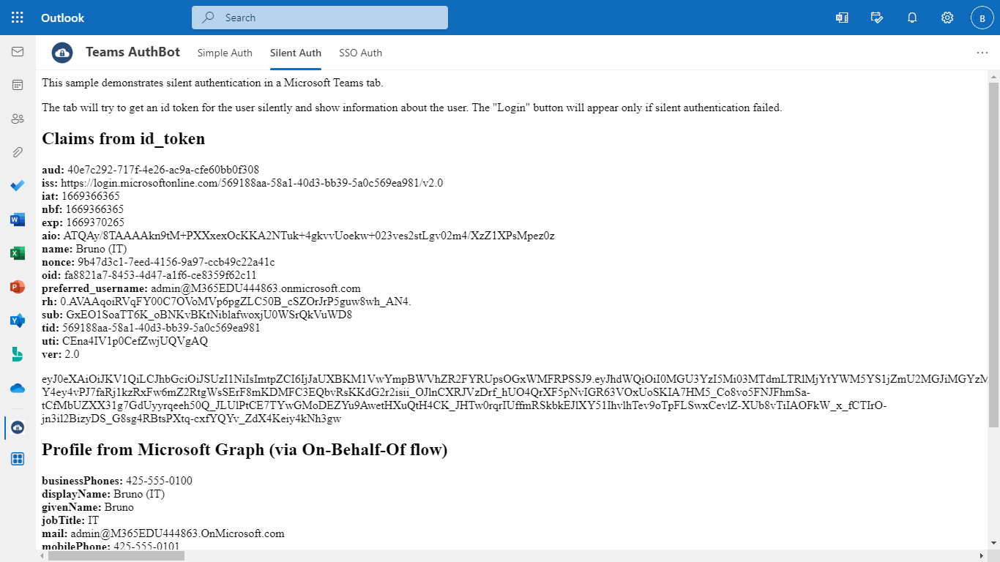

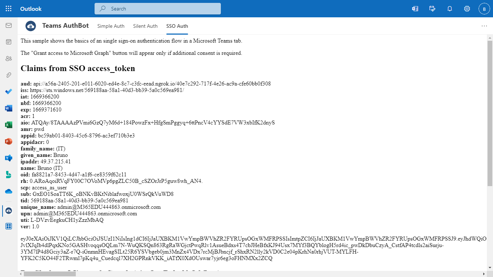

**Note:** Similarly, you can test your application in the Outlook desktop app as well.

## Office on the web

- To preview your app running in Office on the web.

- Log into office.com with test tenant credentials

**Select the Apps icon on the side bar. Your sideloaded app title appears among your installed apps**

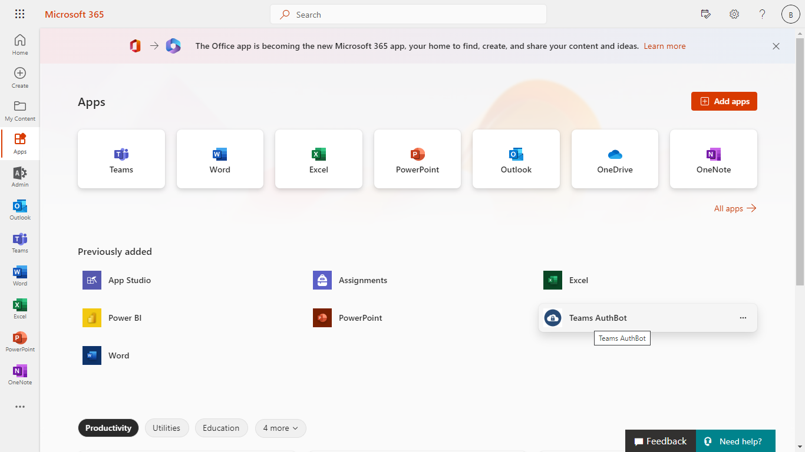

**Select your app icon to launch your app in Office on the web**

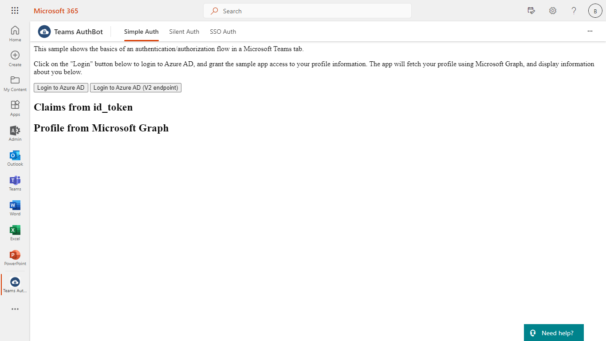 

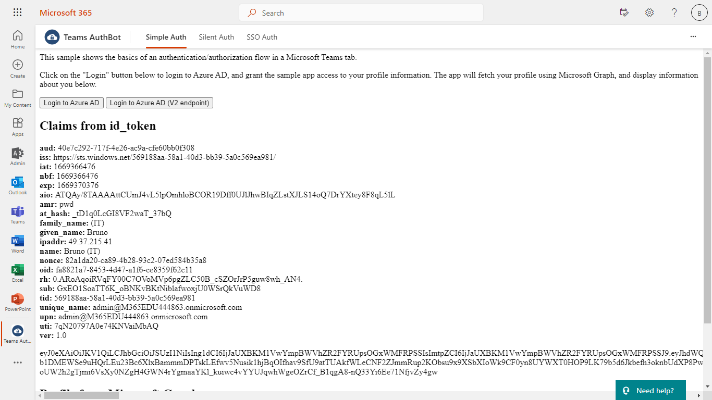 

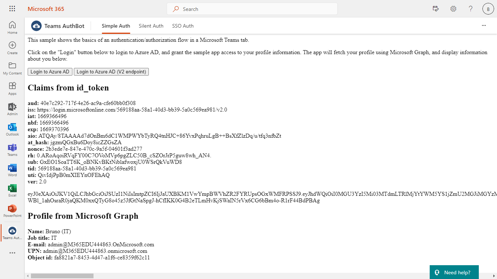 

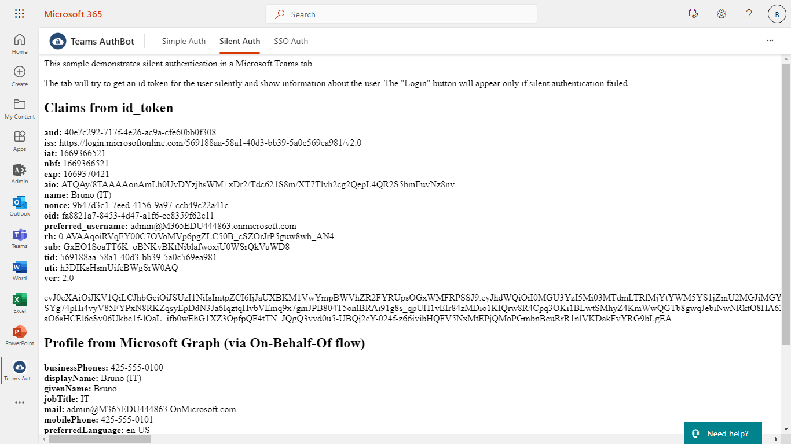 

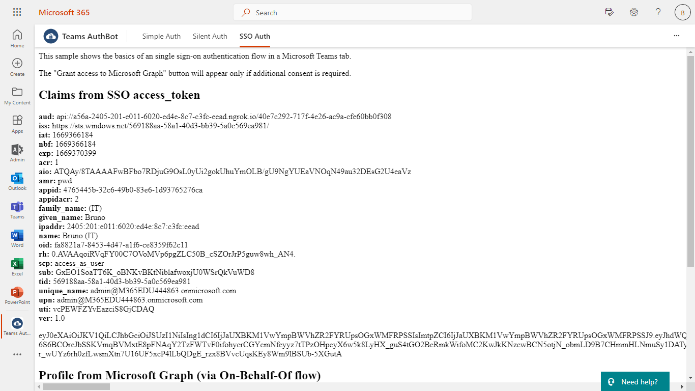 

**Note:** Similarly, you can test your application in the Office 365 desktop app as well.

## Security notes

-   The verification code mechanism prevents a potential ["man in the middle" attack](https://hueniverse.com/explaining-the-oauth-session-fixation-attack-aa759250a0e7) by requiring evidence that the user who authorized the bot in the browser is the same person as the user who is chatting with the bot. **Don't** remove the need for a verification code without understanding what it is protecting against, and weighing the risk against your use case and threat model.
-   Don't use the `signin/verifyState` message to pass sensitive data (e.g., access tokens) directly to your bot in plaintext. The `state` value should not be usable without additional information that's available only to your bot.
-   The Teams app sends the `signin/verifyState` invoke message in a way that's equivalent to the user typing a message to your bot. This means that although the user information in the message is not falsifiable, a malicious user **can** tamper with the payload, or send additional invoke messages that were not initiated by your app.
-   Store your users’ access tokens in such a way that they are encrypted at rest, especially if you are also storing refresh tokens. Consider, based on your use case and threat model, how often to rotate the encryption key. (The sample uses an in-memory store for simplicity; do not do this in your production app!)
-   If you are using OAuth, remember that the `state` parameter in the authentication request must contain a unique session token to prevent request forgery attacks. The sample uses a randomly-generated GUID.

## Mobile clients

As of April 2019, Microsoft Teams mobile clients support the `signin` action protocol (that is, mobile clients work the same way as the desktop/web clients). It does require an updated version of the [Microsoft Teams JavaScript library](https://www.npmjs.com/package/@microsoft/teams-js) (1.4.1 or later). The way it used to work is described [here](fallbackUrl.md).

## Further reading

- [Extend Teams apps across Microsoft 365](https://learn.microsoft.com/en-us/microsoftteams/platform/m365-apps/overview)


