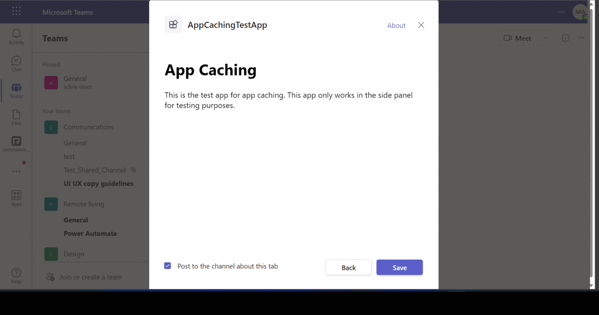
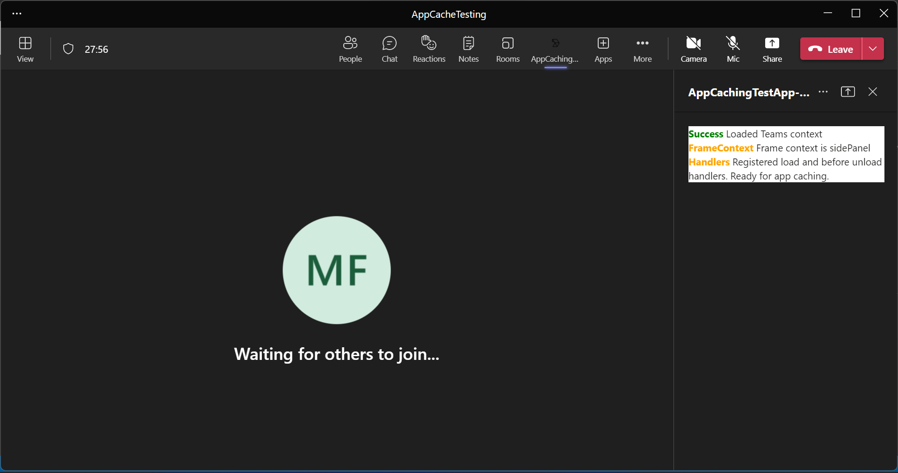
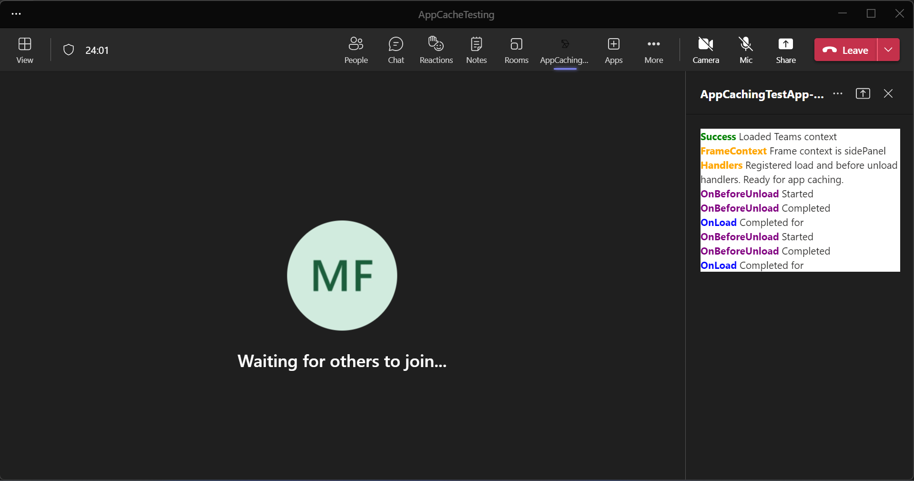
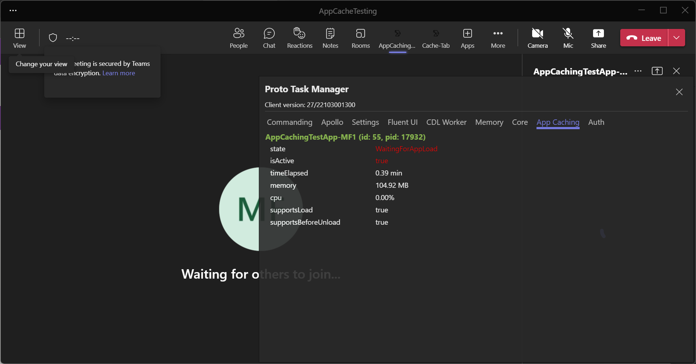
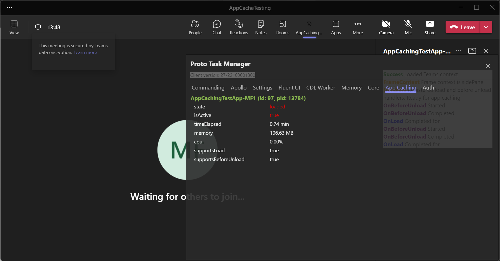
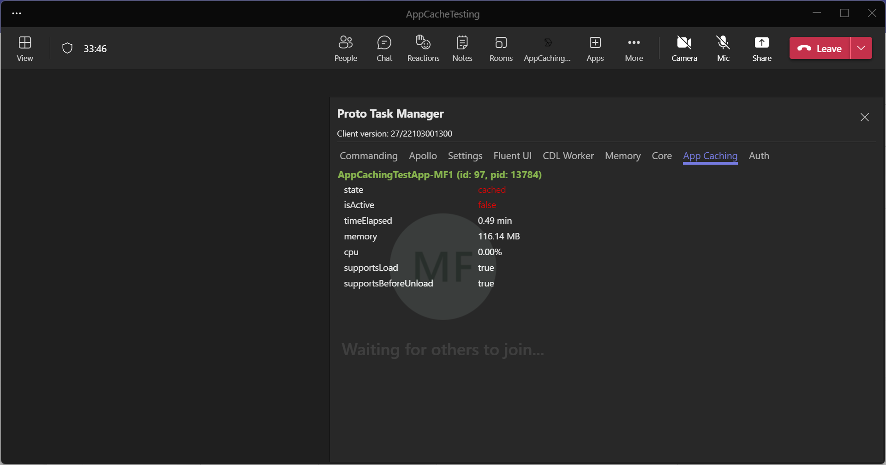

## App Caching In Meetings

This sample feature is to improve the subsequent loading time of an App that the user has visited during the current Meeting (specifically Apps loaded in the SidePanel of a Meeting).

**Interaction with App**
  
 
## Prerequisites

- [NodeJS](https://nodejs.org/en/)
- [ngrok](https://ngrok.com/) or equivalent tunnelling solution

### Setup 
> Note these instructions are for running the sample on your local machine.

1) Run ngrok - point to port 3978

    ```bash
    ngrok http -host-header=rewrite 3978
    ```

2) Clone the repository

    ```bash
    git clone https://github.com/OfficeDev/Microsoft-Teams-Samples.git
    ```

   A) If you are using Visual Studio Code

    - Launch Visual Studio code
    - File -> Open Folder
    - Navigate to `samples/app-cache-meetings` folder
    - Select `nodejs` folder

   B) Install node modules

   Inside node js folder, open your local terminal and run the below command to install node modules. You can do the same in Visual Studio code terminal by opening the project in Visual Studio code.

    ```bash
    npm install
    ```

3) Run your app

    ```bash
    npm start
    ```
    - Your App will start running on 3978 PORT.

4) __*This step is specific to Teams.*__
    - **Edit** the `manifest.json` contained in the  `TeamsAppManifest` folder to replace your `<<MANIFEST-ID>>`, You can use any GUID Id in place of `<<Manifest-ID>>`
    - **Edit** the `manifest.json` for `ValidDomains` with base Url domain. E.g. if you are using ngrok it would be `https://1234.ngrok.io` then your domain-name will be `1234.ngrok.io`.
    - **Zip** up the contents of the `TeamsAppManifest` folder to create a `manifest.zip` (Make sure that zip file does not contains any subfolder otherwise you will get error while uploading your .zip package)
    - **Upload** the `manifest.zip` to Teams (In Teams Apps/Manage your apps click "Upload an app". Browse to and Open the .zip file. At the next dialog, click the Add button.)
    - Sideload the app In meetings (Supported scopes)
     

## Running the sample

**Add the App in meeting**.


**App Caching Sideloaded  :**


**loading Team Context :** 
 

**Waiting For Cache State to load in Proto Task Manager view :**
Open Debug Panel **Proto Task Manager** ( `Ctrl+Shift+Alt+8` on Windows, `Cmd+Shift+Option+8` on Mac), navigate to App Caching section you should see these apps getting cached/loaded. Non-cacheable apps will not appear in this panel.


**App Caching Sideloaded  :**


**The state is now Cached :**
This Panel queries the state of the Cache and updates the table on a periodic basis (every second for now)



## Further reading


