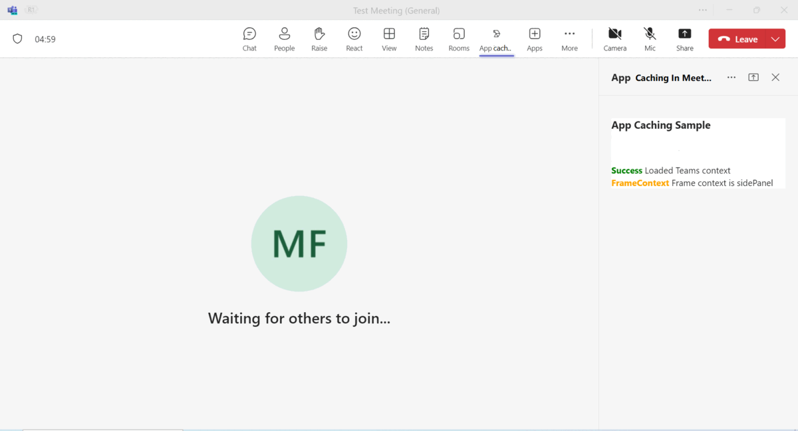
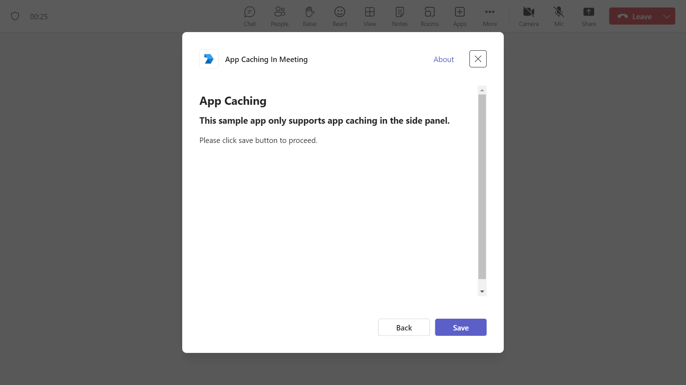
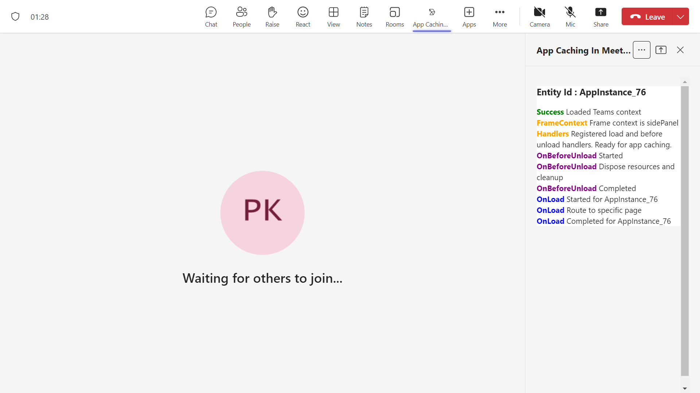
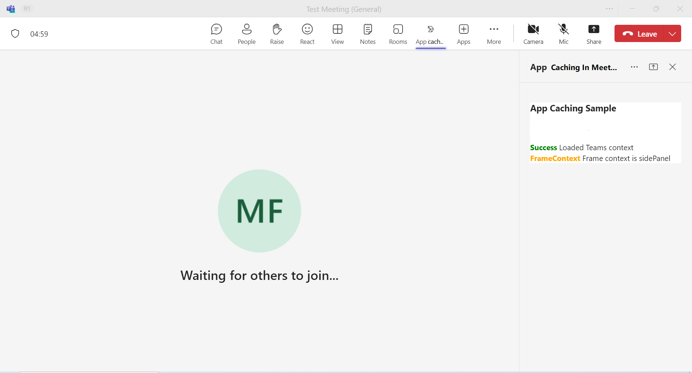

## App Caching in Meetings

This sample demonstrates how to enhance the loading speed of applications within Microsoft Teams during ongoing meetings. Specifically, it illustrates the caching mechanism for apps loaded in the side panel, allowing users to quickly access previously visited apps without delay.

**Interaction with App**
  

**Change of App theme when Teams theme changes to (light,dark and contrast)**.
 
 
## Prerequisites

- [NodeJS](https://nodejs.org/en/)
- [dev tunnel](https://learn.microsoft.com/en-us/azure/developer/dev-tunnels/get-started?tabs=windows) or [ngrok](https://ngrok.com/) latest version or equivalent tunnelling solution
- [Microsoft 365 Agents Toolkit for VS Code](https://marketplace.visualstudio.com/items?itemName=TeamsDevApp.ms-teams-vscode-extension) or [TeamsFx CLI](https://learn.microsoft.com/microsoftteams/platform/toolkit/teamsfx-cli?pivots=version-one)

## Run the app (Using Microsoft 365 Agents Toolkit for Visual Studio Code)

The simplest way to run this sample in Teams is to use Microsoft 365 Agents Toolkit for Visual Studio Code.

1. Ensure you have downloaded and installed [Visual Studio Code](https://code.visualstudio.com/docs/setup/setup-overview)
1. Install the [Microsoft 365 Agents Toolkit extension](https://marketplace.visualstudio.com/items?itemName=TeamsDevApp.ms-teams-vscode-extension)
1. Select **File > Open Folder** in VS Code and choose this samples directory from the repo
1. Using the extension, sign in with your Microsoft 365 account where you have permissions to upload custom apps
1. Select **Debug > Start Debugging** or **F5** to run the app in a Teams web client.
1. In the browser that launches, select the **Add** button to install the app to Teams.

> If you do not have permission to upload custom apps (uploading), Microsoft 365 Agents Toolkit will recommend creating and using a Microsoft 365 Developer Program account - a free program to get your own dev environment sandbox that includes Teams.

### Setup 
> Note these instructions are for running the sample on your local machine.

1) Run ngrok - point to port 3978

   ```bash
   ngrok http 3978 --host-header="localhost:3978"
   ```  

   Alternatively, you can also use the `dev tunnels`. Please follow [Create and host a dev tunnel](https://learn.microsoft.com/en-us/azure/developer/dev-tunnels/get-started?tabs=windows) and host the tunnel with anonymous user access command as shown below:

   ```bash
   devtunnel host -p 3978 --allow-anonymous


   ```


2) Clone the repository

    ```bash
    git clone https://github.com/OfficeDev/Microsoft-Teams-Samples.git
    ```

   **Open your project in Visual Studio Code (Optional Step)**

    - Launch Visual Studio code
    - File -> Open Folder
    - Navigate to `samples/app-cache-meetings` folder
    - Select `nodejs` folder and open it

   Install node modules (Either open any local terminal inside your `nodejs` folder or open Visual Studio Code terminal by opening the project in Visual Studio Code)

    ```bash
    npm install
    ```

3) Run your app (Either from any local terminal or from Visual Studio Code terminal)

    ```bash
    npm start
    ```

    - Your App will start running on 3978 PORT.

4) __*This step is specific to Teams.*__
    - **Edit** the `manifest.json` contained in the  `appManifest` folder to replace your `<<MANIFEST-ID>>`, You can use any GUID Id in place of `<<Manifest-ID>>` or [Generate Guid](https://guidgenerator.com/)
    - **Edit** the `manifest.json` for `<<Valid_Domain>>` with base Url domain. E.g. if you are using ngrok it would be `https://1234.ngrok-free.app` then your domain-name will be `1234.ngrok-free.app` and if you are using dev tunnels then your domain will be like: `12345.devtunnels.ms`. Replace it at all the places in your manifest.json.
    - **Zip** up the contents of the `appManifest` folder to create a `manifest.zip` (Make sure that zip file does not contains any subfolder otherwise you will get error while uploading your .zip package)
    - **Upload** the `manifest.zip` to Teams (In Teams Apps/Manage your apps click "Upload an app". Browse to and Open the .zip file. At the next dialog, click the Add button.)
    - Upload a custom app In meetings (Supported scopes)

### Register you app with Azure AD.

  1. Register a new application in the [Microsoft Entra ID – App Registrations](https://go.microsoft.com/fwlink/?linkid=2083908) portal.
  2. Select **New Registration** and on the *register an application page*, set following values:
      * Set **name** to your app name.
      * Choose the **supported account types** (any account type will work)
      * Leave **Redirect URI** empty.
      * Choose **Register**.
  3. On the overview page, copy and save the **Application (client) ID, Directory (tenant) ID**. You’ll need those later when updating your Teams application manifest and in the appsettings.json.
  4. Navigate to **API Permissions**, and make sure to add the follow permissions:
   Select Add a permission
      * Select Add a permission
      * Select Microsoft Graph -\> Delegated permissions.
      * `User.Read` (enabled by default)
      * Click on Add permissions. Please make sure to grant the admin consent for the required permissions.
     

## Running the sample

**Add the App in meeting**.


**App Caching Uploaded  :**


**AppCache in first tab with Unique Id Loaded :** 


**AppCache in second tab with Unique Id Loaded :** 


**Teams Theme Changes To Dark :** 


**Teams Theme Changes To Light :** 


**Teams Theme Changes To Contrast :** 


> Note open debug panel **Proto Task Manager** ( `Ctrl+Shift+Alt+8` on Windows, `Cmd+Shift+Option+8` on Mac), navigate to App Caching section you should see these apps getting cached/loaded. Non-cacheable apps will not appear in this panel.

**Note** In Teams T1, there is no `light theme`, only we get two themes in meetings (`dark` and `contrast`). By default Teams T1 default theme is `dark`. and where as in Teams T2 we get three themes. Default theme is light and remaining other two themes are `dark` and `contrast`.


## Further reading
[Upload your app in Teams](https://learn.microsoft.com/en-us/microsoftteams/platform/concepts/deploy-and-publish/apps-upload)

[Manage custom and uploaded apps in Teams admin center](https://learn.microsoft.com/en-us/microsoftteams/teams-custom-app-policies-and-settings)

[Handle theme change](https://learn.microsoft.com/en-us/microsoftteams/platform/tabs/how-to/access-teams-context?tabs=Json-v2%2Cteamsjs-v2%2Cdefault#handle-theme-change)


