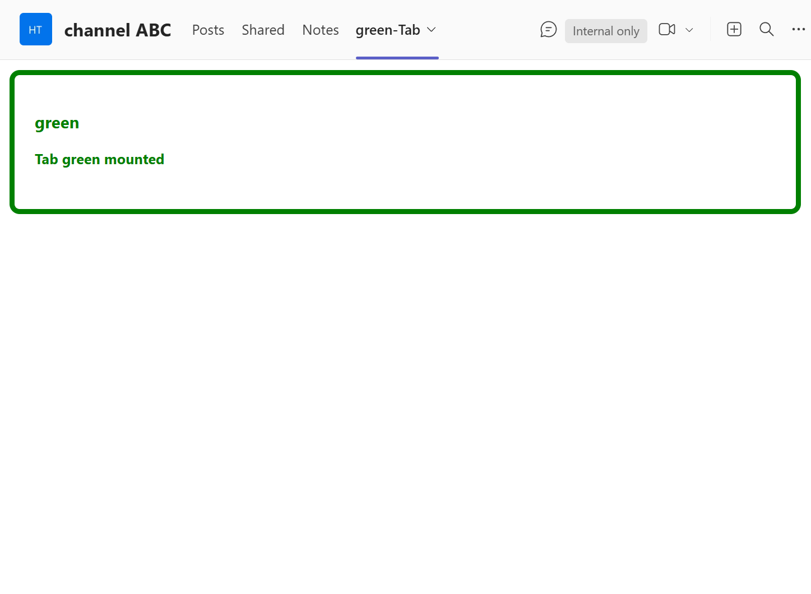

## App Caching for Multiple Tabs

This sample demonstrates how to enhance the loading speed of applications within Microsoft Teams. Specifically, it illustrates the caching mechanism for apps loaded in channels or chats, allowing users to quickly access the same app without delay.

## Prerequisites

- [NodeJS](https://nodejs.org/en/)
- [dev tunnel](https://learn.microsoft.com/en-us/azure/developer/dev-tunnels/get-started?tabs=windows) or [ngrok](https://ngrok.com/) latest version or equivalent tunnelling solution
- [Teams Toolkit for VS Code](https://marketplace.visualstudio.com/items?itemName=TeamsDevApp.ms-teams-vscode-extension) or [TeamsFx CLI](https://learn.microsoft.com/microsoftteams/platform/toolkit/teamsfx-cli?pivots=version-one)

## Run the app (Using Teams Toolkit for Visual Studio Code)

The simplest way to run this sample in Teams is to use Teams Toolkit for Visual Studio Code.

1. Ensure you have downloaded and installed [Visual Studio Code](https://code.visualstudio.com/docs/setup/setup-overview)
1. Install the [Teams Toolkit extension](https://marketplace.visualstudio.com/items?itemName=TeamsDevApp.ms-teams-vscode-extension)
1. Select **File > Open Folder** in VS Code and choose this samples directory from the repo
1. Using the extension, sign in with your Microsoft 365 account where you have permissions to upload custom apps
1. Select **Debug > Start Debugging** or **F5** to run the app in a Teams web client.
1. In the browser that launches, select the **Add** button to install the app to Teams.

> If you do not have permission to upload custom apps (uploading), Teams Toolkit will recommend creating and using a Microsoft 365 Developer Program account - a free program to get your own dev environment sandbox that includes Teams.

### Setup 
> Note these instructions are for running the sample on your local machine.

1) Run ngrok - point to port 3978

   ```bash
   ngrok http 3978 --host-header="localhost:3978"
   ```  

   Alternatively, you can also use the `dev tunnels`. Please follow [Create and host a dev tunnel](https://learn.microsoft.com/en-us/azure/developer/dev-tunnels/get-started?tabs=windows) and host the tunnel with anonymous user access command as shown below:

   ```bash
   devtunnel host -p 3978 --allow-anonymous
   ```

2) Clone the repository

    ```bash
    git clone https://github.com/OfficeDev/Microsoft-Teams-Samples.git
    ```

   **Open your project in Visual Studio Code (Optional Step)**

    - Launch Visual Studio code
    - File -> Open Folder
    - Navigate to `samples/app-caching-for-multiple-tabs` folder
    - Select `nodejs` folder and open it

   Install node modules (Either open any local terminal inside your `nodejs` folder or open Visual Studio Code terminal by opening the project in Visual Studio Code)

    ```bash
    npm install
    ```

3) Run your app (Either from any local terminal or from Visual Studio Code terminal)

    ```bash
    npm start
    ```

    - Your App will start running on 3978 PORT.

4) __*This step is specific to Teams.*__
    - **Edit** the `manifest.json` contained in the  `appManifest` folder to replace your `<<MANIFEST-ID>>`, You can use any GUID Id in place of `<<Manifest-ID>>` or [Generate Guid](https://guidgenerator.com/)
    - **Edit** the `manifest.json` for `<<Valid_Domain>>` with base Url domain. E.g. if you are using ngrok it would be `https://1234.ngrok-free.app` then your domain-name will be `1234.ngrok-free.app` and if you are using dev tunnels then your domain will be like: `12345.devtunnels.ms`. Replace it at all the places in your manifest.json.
    - **Zip** up the contents of the `appManifest` folder to create a `manifest.zip` (Make sure that zip file does not contains any subfolder otherwise you will get error while uploading your .zip package)
    - **Upload** the `manifest.zip` to Teams (In Teams Apps/Manage your apps click "Upload an app". Browse to and Open the .zip file. At the next dialog, click the Add button.)
    - Upload the app In meetings (Supported scopes)
     

## Running the sample

**Adding tab (green) to a channel**




**Adding a second tab (blue) to a channel**


Click between the two tabs and observer the fast app load. The displayed log shows that the same app is cached and being reused for the two tabs. 
 

> Note open debug panel **Proto Task Manager** ( `Ctrl+Shift+Alt+8` on Windows, `Cmd+Shift+Option+8` on Mac), navigate to App Caching section you should see these apps getting cached/loaded. Non-cacheable apps will not appear in this panel.


## Further reading
[Upload your app in Teams](https://learn.microsoft.com/en-us/microsoftteams/platform/concepts/deploy-and-publish/apps-upload)

[Manage custom and uploaded apps in Teams admin center](https://learn.microsoft.com/en-us/microsoftteams/teams-custom-app-policies-and-settings)

[Handle theme change](https://learn.microsoft.com/en-us/microsoftteams/platform/tabs/how-to/access-teams-context?tabs=Json-v2%2Cteamsjs-v2%2Cdefault#handle-theme-change)


