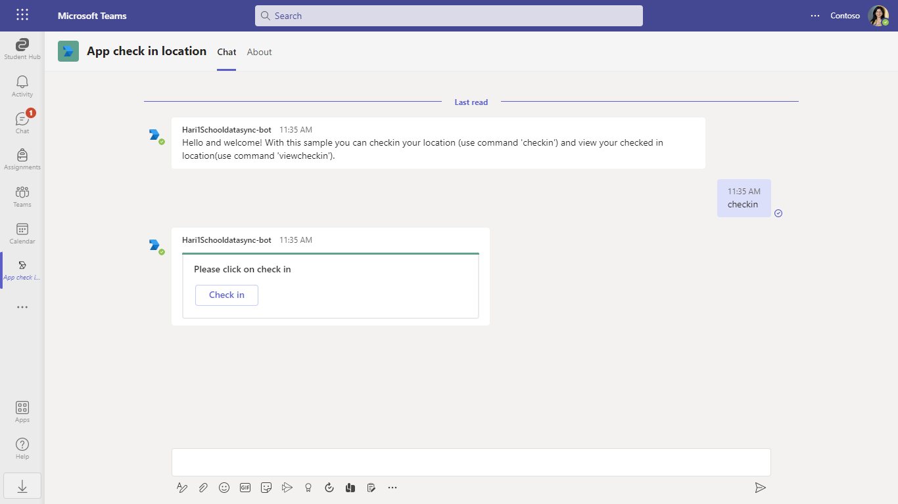
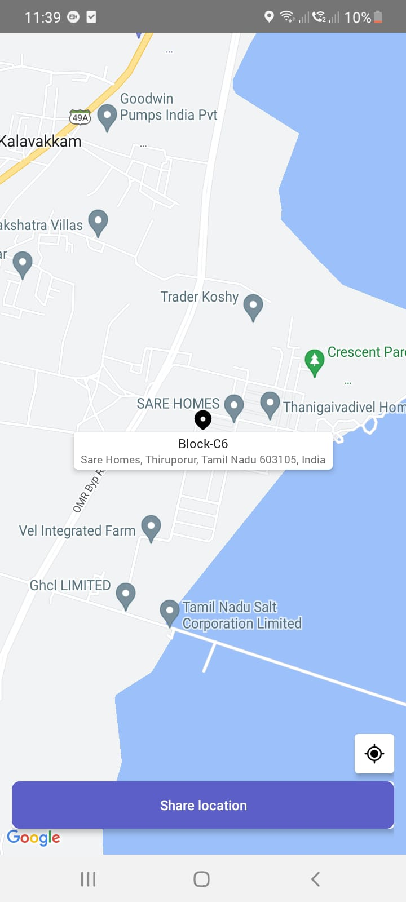
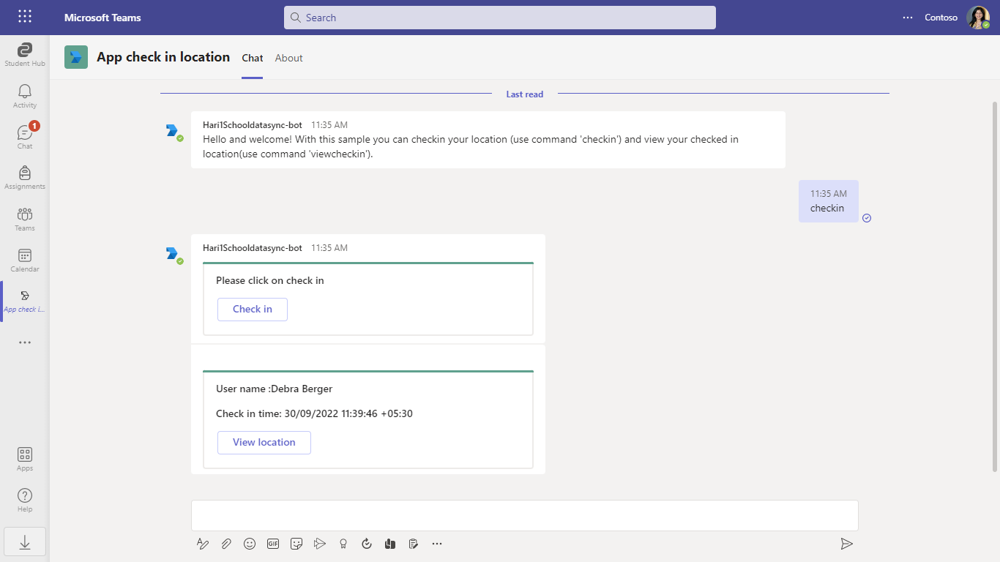
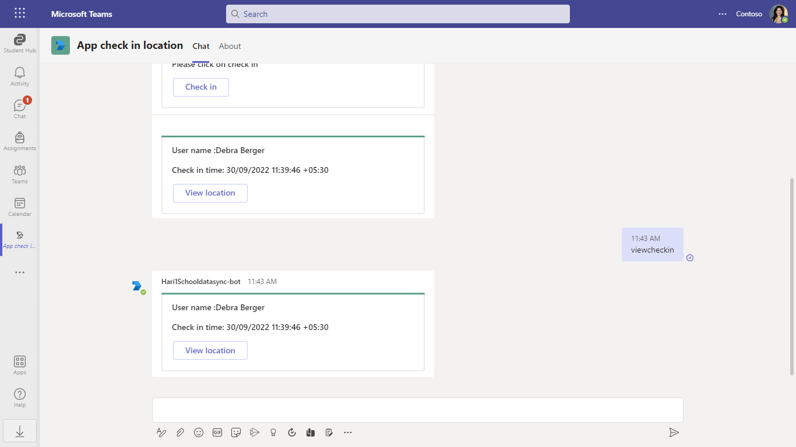

# App check in location

This sample shows feature where user can checkin with current location and view all previous checkins.

`Currently, Microsoft Teams support for get geolocation capability is only available for mobile clients`









## Prerequisites

- [.NET Core SDK](https://dotnet.microsoft.com/download) version 3.1

  determine dotnet version
  ```bash
  dotnet --version
  ```
- [Ngrok](https://ngrok.com/download) (For local environment testing) Latest (any other tunneling software can also be used)
  
  run ngrok locally
  ```bash
  ngrok http -host-header=localhost 3978
  ```
- [Teams](https://teams.microsoft.com) Microsoft Teams is installed and you have an account

## To try this sample

1) Create a Bot Registration
   In Azure portal, create a [Bot Framework registration resource](https://docs.microsoft.com/en-us/azure/bot-service/bot-builder-authentication?view=azure-bot-service-4.0&tabs=csharp%2Caadv2).
   - Ensure that you've [enabled the Teams Channel](https://docs.microsoft.com/en-us/azure/bot-service/channel-connect-teams?view=azure-bot-service-4.0)
   - While registering the bot, use `https://<your_ngrok_url>/api/messages` as the messaging endpoint.

  **NOTE:** When you create your bot you will create an App ID and App password - make sure you keep these for later.

2) Clone the repository
   ```bash
   git clone https://github.com/OfficeDev/Microsoft-Teams-Samples.git
   ```
   
3) In a terminal, navigate to `samples/app-checkin-location/csharp`

    change into project folder
    ```bash
    cd # AppCheckinLocation
    ```
    
4) Run ngrok - point to port 3978

    ```bash
    # ngrok http -host-header=rewrite 3978
    ```
 
5) Modify the `manifest.json` in the `/AppPackage` folder and replace the following details:
  - `{{Microsoft-App-Id}}` with Application id generated from Step 1
  - `{{domain-name}}` with base Url domain. E.g. if you are using ngrok it would be `1234.ngrok.io`

6) Zip the contents of `AppPackage` folder into a `manifest.zip`, and use the `manifest.zip` to deploy in app store or add to Teams using step 9.

7) Modify the `/appsettings.json` and fill in the following details:
  - `{{Microsoft-App-Id}}` - Generated from Step 1 is the application app id
  - `{{ Microsoft-App-Password}}` - Generated from Step 1, also referred to as Client secret
  - `{{ Application Base Url }}` - Your application's base url. E.g. https://12345.ngrok.io if you are using ngrok.

  
8) Run the bot from a terminal or from Visual Studio, choose option A or B.
 
   A) From a terminal
     ```bash
     # run the bot
     dotnet run
     ```

   B) Or from Visual Studio
     - Launch Visual Studio
     - File -> Open -> Project/Solution
     - Navigate to `AppCheckinLocation` folder
     - Select `AppCheckinLocation.csproj` file
     - Press `F5` to run the project 

9) Upload the manifest.zip to Teams (in the Apps view click "Upload a custom app")
   - Go to Microsoft Teams. From the lower left corner, select Apps
   - From the lower left corner, choose Upload a custom App
   - Go to your project directory, the ./AppPackage folder, select the zip folder, and choose Open.
   - Select Add in the pop-up dialog box. Your app is uploaded to Teams.

## Features of this sample

- Card with actions `check in`. 


- `Geo Location` of user.


- User details.


- `viewcheckindetails` of user.


## Deploy the bot to Azure

To learn more about deploying a bot to Azure, see [Deploy your bot to Azure](https://aka.ms/azuredeployment) for a complete list of deployment instructions.

## Further reading

- [Bot Framework Documentation](https://docs.botframework.com)
- [Bot Basics](https://docs.microsoft.com/azure/bot-service/bot-builder-basics?view=azure-bot-service-4.0)
- [Activity processing](https://docs.microsoft.com/en-us/azure/bot-service/bot-builder-concept-activity-processing?view=azure-bot-service-4.0)
- [Azure Bot Service Introduction](https://docs.microsoft.com/azure/bot-service/bot-service-overview-introduction?view=azure-bot-service-4.0)
- [Azure Bot Service Documentation](https://docs.microsoft.com/azure/bot-service/?view=azure-bot-service-4.0)
- [.NET Core CLI tools](https://docs.microsoft.com/en-us/dotnet/core/tools/?tabs=netcore2x)
- [Azure CLI](https://docs.microsoft.com/cli/azure/?view=azure-cli-latest)
- [Azure Portal](https://portal.azure.com)
- [Language Understanding using LUIS](https://docs.microsoft.com/en-us/azure/cognitive-services/luis/)
- [Channels and Bot Connector Service](https://docs.microsoft.com/en-us/azure/bot-service/bot-concepts?view=azure-bot-service-4.0)

