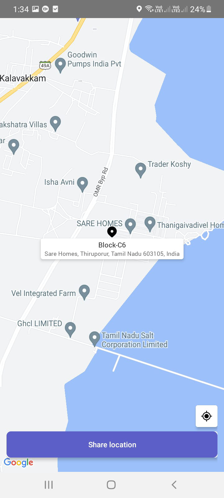

# App check-in location

This sample shows feature where user can checkin with current location and view all previous checkins using bot.

`Currently, Microsoft Teams support for get geolocation capability is only available for mobile clients`

## Included Features
* Bots
* Adaptive Cards
* Task Modules
* Device Permission API (location)

## Interaction with app


## Try it yourself - experience the App in your Microsoft Teams client
Please find below demo manifest which is deployed on Microsoft Azure and you can try it yourself by uploading the app package (.zip file link below) to your teams and/or as a personal app. (Sideloading must be enabled for your tenant, [see steps here](https://docs.microsoft.com/microsoftteams/platform/concepts/build-and-test/prepare-your-o365-tenant#enable-custom-teams-apps-and-turn-on-custom-app-uploading)).

**App check-in location:** [Manifest](/samples/app-checkin-location/csharp/demo-manifest/App-checkin-location.zip)

## Prerequisites

- [.NET Core SDK](https://dotnet.microsoft.com/download) version 6.0

  determine dotnet version
  ```bash
  dotnet --version
  ```
- [Ngrok](https://ngrok.com/download) (For local environment testing) Latest (any other tunneling software can also be used)
  
- [Teams](https://teams.microsoft.com) Microsoft Teams is installed and you have an account

## Setup

1) Setup for Bot
- Register a AAD aap registration in Azure portal.
- Also, register a bot with Azure Bot Service, following the instructions [here](https://docs.microsoft.com/azure/bot-service/bot-service-quickstart-registration?view=azure-bot-service-3.0).
- Ensure that you've [enabled the Teams Channel](https://docs.microsoft.com/azure/bot-service/channel-connect-teams?view=azure-bot-service-4.0)
- While registering the bot, use `https://<your_ngrok_url>/api/messages` as the messaging endpoint.

    > NOTE: When you create your app registration, you will create an App ID and App password - make sure you keep these for later.

2) Setup NGROK
- Run ngrok - point to port 3978

```bash
# ngrok http 3978 --host-header="localhost:3978"
```

3) Setup for code

- Clone the repository

    ```bash
    git clone https://github.com/OfficeDev/Microsoft-Teams-Samples.git
    ```

- Modify the `/appsettings.json` and fill in the following details:
  - `{{Microsoft-App-Id}}` - Generated from Step 1 while doing AAd app registration in Azure portal.
  - `{{ Microsoft-App-Password}}` - Generated from Step 1, also referred to as Client secret
  - `{{ Application Base Url }}` - Your application's base url. E.g. https://12345.ngrok-free.app if you are using ngrok.

- Run the bot from a terminal or from Visual Studio:

  A) From a terminal, navigate to `samples/app-checkin-location/csharp`

  ```bash
  # run the bot
  dotnet run
  ```
  B) Or from Visual Studio
     - Launch Visual Studio
     - File -> Open -> Project/Solution
     - Navigate to `AppCheckinLocation` folder
     - Select `AppCheckinLocation.csproj` file
     - Press `F5` to run the project

**Note**: If you are facing any issue in your app, please uncomment [this](https://github.com/OfficeDev/Microsoft-Teams-Samples/blob/main/samples/app-checkin-location/csharp/AppCheckinLocation/AdapterWithErrorHandler.cs#L33) line and put your debugger for local debug.

4) Setup Manifest for Teams
- __*This step is specific to Teams.*__
    - **Edit** the `manifest.json` contained in the ./AppPackage folder to replace your Microsoft App Id (that was created when you registered your app registration earlier) *everywhere* you see the place holder string `{{Microsoft-App-Id}}` (depending on the scenario the Microsoft App Id may occur multiple times in the `manifest.json`)
    - **Edit** the `manifest.json` for `validDomains` and replace `{{domain-name}}` with base Url of your domain. E.g. if you are using ngrok it would be `https://1234.ngrok-free.app` then your domain-name will be `1234.ngrok-free.app`.
    - **Zip** up the contents of the `AppPackage` folder to create a `manifest.zip` (Make sure that zip file does not contains any subfolder otherwise you will get error while uploading your .zip package)

- Upload the manifest.zip to Teams (in the Apps view click "Upload a custom app")
   - Go to Microsoft Teams. From the lower left corner, select Apps
   - From the lower left corner, choose Upload a custom App
   - Go to your project directory, the ./AppPackage folder, select the zip folder, and choose Open.
   - Select Add in the pop-up dialog box. Your app is uploaded to Teams.

## Running the sample

**Card with actions check in:**


**Geo Location of user:**



**User details:**


**Viewcheckin Details of user:**


**Geo Location of user:**


**View Location UI:**


## Deploy the bot to Azure

To learn more about deploying a bot to Azure, see [Deploy your bot to Azure](https://aka.ms/azuredeployment) for a complete list of deployment instructions.

## Further reading

- [Bot Framework Documentation](https://docs.botframework.com)
- [Bot Basics](https://docs.microsoft.com/azure/bot-service/bot-builder-basics?view=azure-bot-service-4.0)
- [Azure Bot Service Introduction](https://docs.microsoft.com/azure/bot-service/bot-service-overview-introduction?view=azure-bot-service-4.0)
- [Azure Bot Service Documentation](https://docs.microsoft.com/azure/bot-service/?view=azure-bot-service-4.0)
- [Integrate media Capabilities inside your app](https://learn.microsoft.com/microsoftteams/platform/concepts/device-capabilities/media-capabilities?tabs=mobile)

