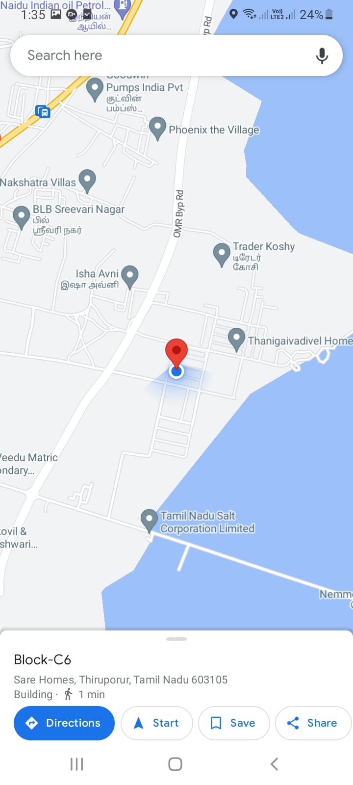

# Get Checkin info of user

This sample shows feature where user can checkin with current location and view all previous checkins.

`Currently, Microsoft Teams support for get geolocation capability is only available for mobile clients`

## Interaction with app


## Prerequisites

- Microsoft Teams is installed and you have an account (not a guest account)
- To test locally, [NodeJS](https://nodejs.org/en/download/) must be installed on your development machine (version 16.14.2  or higher)
- [ngrok](https://ngrok.com/) or equivalent tunneling solution
- [M365 developer account](https://docs.microsoft.com/en-us/microsoftteams/platform/concepts/build-and-test/prepare-your-o365-tenant) or access to a Teams account with the 
   appropriate permissions to install an app.

## Setup

> Note these instructions are for running the sample on your local machine, the tunnelling solution is required because
> the Teams service needs to call into the bot.

### 1. Setup for Bot
- In Azure portal, create a [Azure Bot resource](https://docs.microsoft.com/en-us/azure/bot-service/bot-builder-authentication?view=azure-bot-service-4.0&tabs=csharp%2Caadv2).
- Ensure that you've [enabled the Teams Channel](https://docs.microsoft.com/en-us/azure/bot-service/channel-connect-teams?view=azure-bot-service-4.0)
- While registering the bot, use `https://<your_ngrok_url>/api/messages` as the messaging endpoint.
**NOTE:** When you create app registration, you will create an App ID and App password - make sure you keep these for later.

### 2. Setup NGROK
1) Run ngrok - point to port 3978

    ```bash
    ngrok http -host-header=rewrite 3978
    ```
### 3. Setup for code
1) Clone the repository

    ```bash
    git clone https://github.com/OfficeDev/Microsoft-Teams-Samples.git
    ```

2) In a terminal, navigate to `samples/app-checkin-location/nodejs`

3) Install modules

    ```bash
    npm install
    ```

4) Update the `.env` configuration for the bot to use the `MicrosoftAppId` and `MicrosoftAppPassword`, `BaseUrl` with application base url. For e.g., your ngrok url. (Note the MicrosoftAppId is the AppId created in step 1 (Setup for Bot), the MicrosoftAppPassword is referred to as the "client secret" in step 1 (Setup for Bot) and you can always create a new client secret anytime.)

5) Run your app

    ```bash
    npm start
    ```
**Note**: If you are facing any issue in your app, please uncomment [this](https://github.com/OfficeDev/Microsoft-Teams-Samples/blob/main/samples/app-checkin-location/nodejs/index.js#L48) line and put your debugger for local debug.

### 4. Setup Manifest for Teams

- **This step is specific to Teams.**
    - Edit the `manifest.json` contained in the `appPackage/` folder to replace with your MicrosoftAppId (that was created in step1.1 and is the same value of MicrosoftAppId in `.env` file) *everywhere* you see the place holder string `{MicrosoftAppId}` (depending on the scenario the Microsoft App Id may occur multiple times in the `manifest.json`)
    - Zip up the contents of the `appPackage/` folder to create a `manifest.zip`
    - Upload the `manifest.zip` to Teams (in the left-bottom *Apps* view, click "Upload a custom app")

## Running the sample

**Card with actions check in:**


**Geo Location of user:**


**User details:**


**Viewcheckin Details of user:**


**View Location UI:**



## Deploy the bot to Azure

To learn more about deploying a bot to Azure, see [Deploy your bot to Azure](https://aka.ms/azuredeployment) for a complete list of deployment instructions.

## Further reading

- [Bot Framework Documentation](https://docs.botframework.com)
- [Bot Basics](https://docs.microsoft.com/azure/bot-service/bot-builder-basics?view=azure-bot-service-4.0)
- [Activity processing](https://docs.microsoft.com/en-us/azure/bot-service/bot-builder-concept-activity-processing?view=azure-bot-service-4.0)
- [Azure Bot Service Introduction](https://docs.microsoft.com/azure/bot-service/bot-service-overview-introduction?view=azure-bot-service-4.0)
- [Azure Bot Service Documentation](https://docs.microsoft.com/azure/bot-service/?view=azure-bot-service-4.0)
- [.NET Core CLI tools](https://docs.microsoft.com/en-us/dotnet/core/tools/?tabs=netcore2x)
- [Azure CLI](https://docs.microsoft.com/cli/azure/?view=azure-cli-latest)
- [Azure Portal](https://portal.azure.com)
- [Language Understanding using LUIS](https://docs.microsoft.com/en-us/azure/cognitive-services/luis/)
- [Channels and Bot Connector Service](https://docs.microsoft.com/en-us/azure/bot-service/bot-concepts?view=azure-bot-service-4.0)
