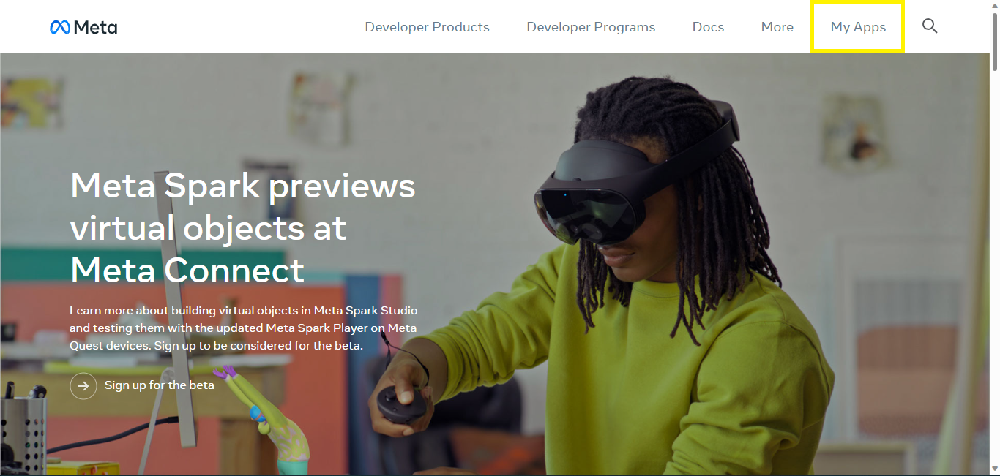
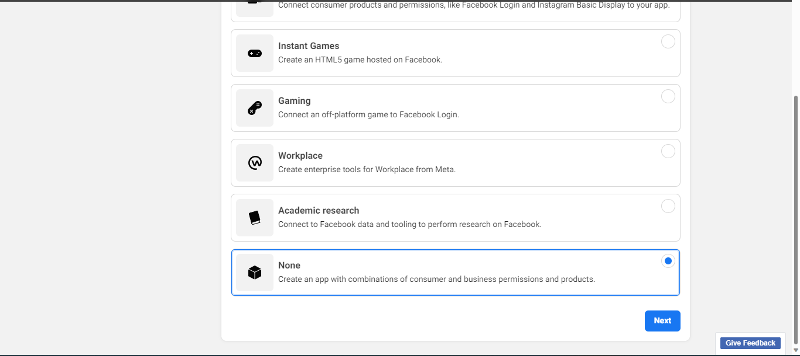
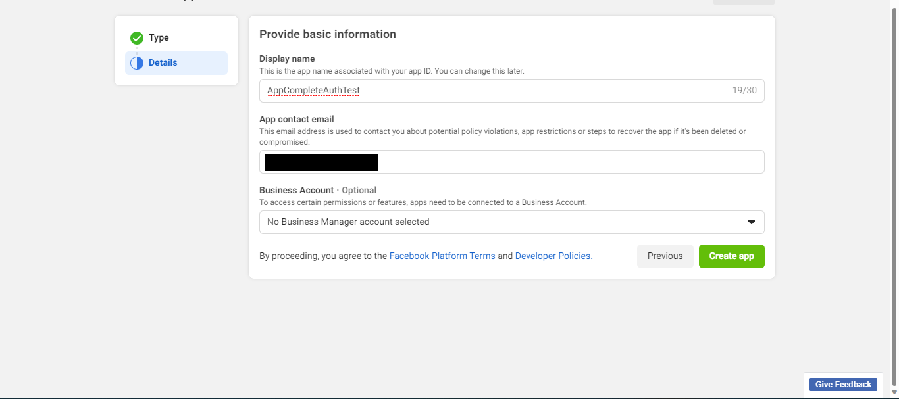
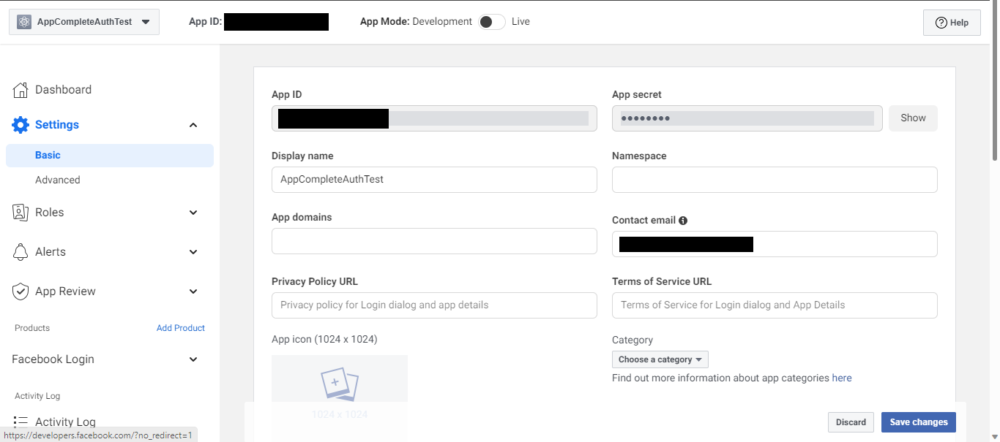
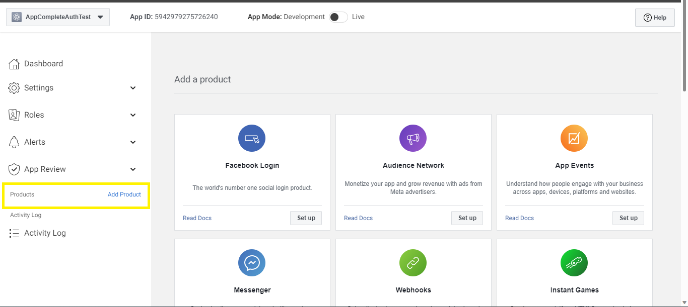
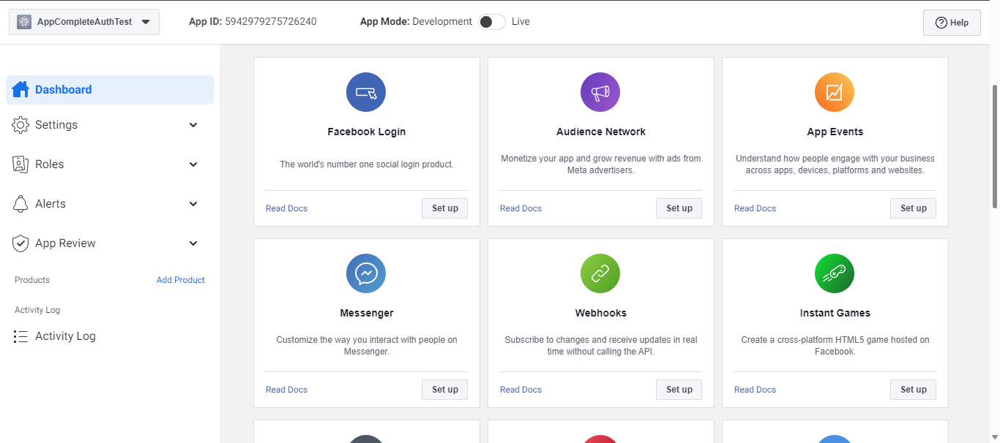
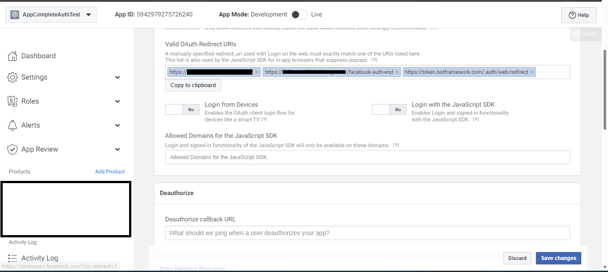

# Create and facebook app.

1. Open [Meta for Developers](https://developers.facebook.com/) and login with your facebook credentials.

2. One the dashboard page go to `My Apps` section.

3. Once the developer page opens, click on `Create App`.

4. It will redirect to `Select app type` page. From the options select app type as `None`.

5. On the basic information page `Display name` will be the name of your app and `App contact email` will be your email linked with facebook.

6. Once the app is created navigate to basic details section of the app. You will be able to see App ID `FacebookAppId` and App Secret `FacebookAppPassword` which needs to be fill inside appsettings.json file.

7. Now on you app dashboard page, go to products sections.

8. From the products section select `Facebook login` and click setup.

9. In the prodcuts section, `Facebook Login` will be added. Go to its settings section and add the below valid domains inside the valid domain area. (Note here base-url refers to your app's base url. For eg when using ngrok if our url is `https://1234.ngrok-free.app` then base-url will be `1234.ngrok-free.app`).
`https://<base-url>/`, `https://<base-url>/facebook-auth-end`, `https://token.botframework.com/.auth/web/redirect`.

