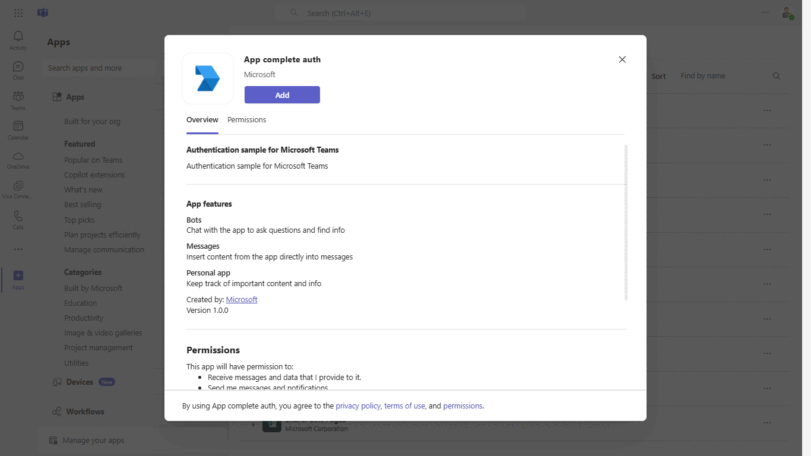
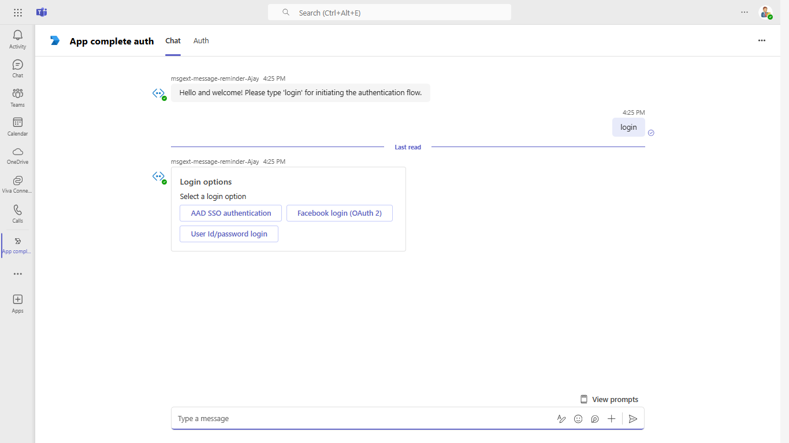
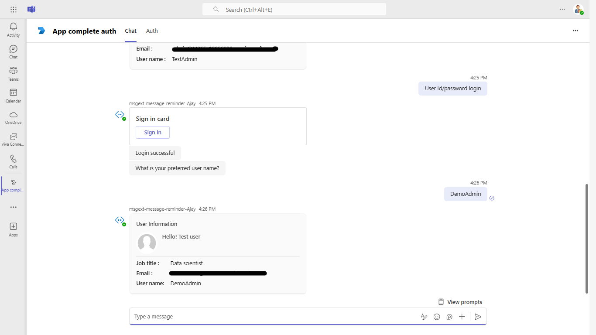
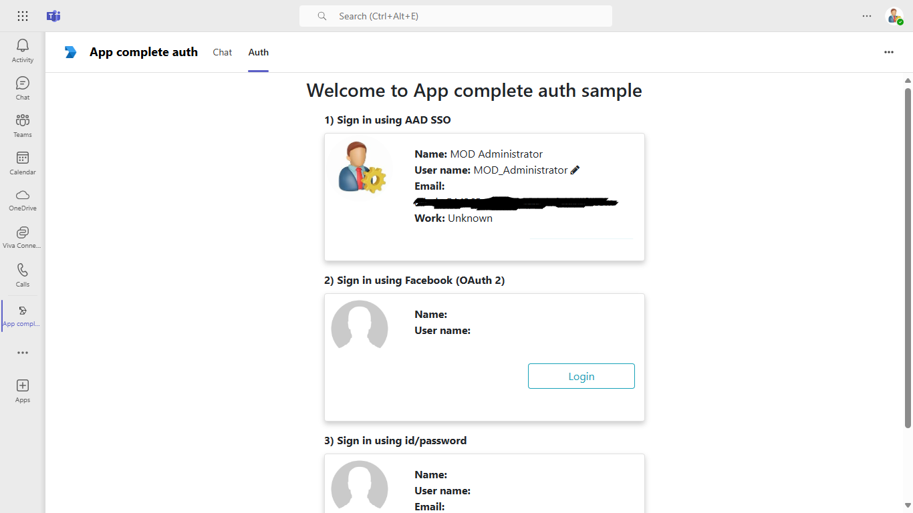
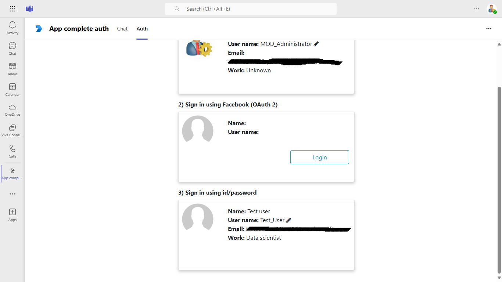
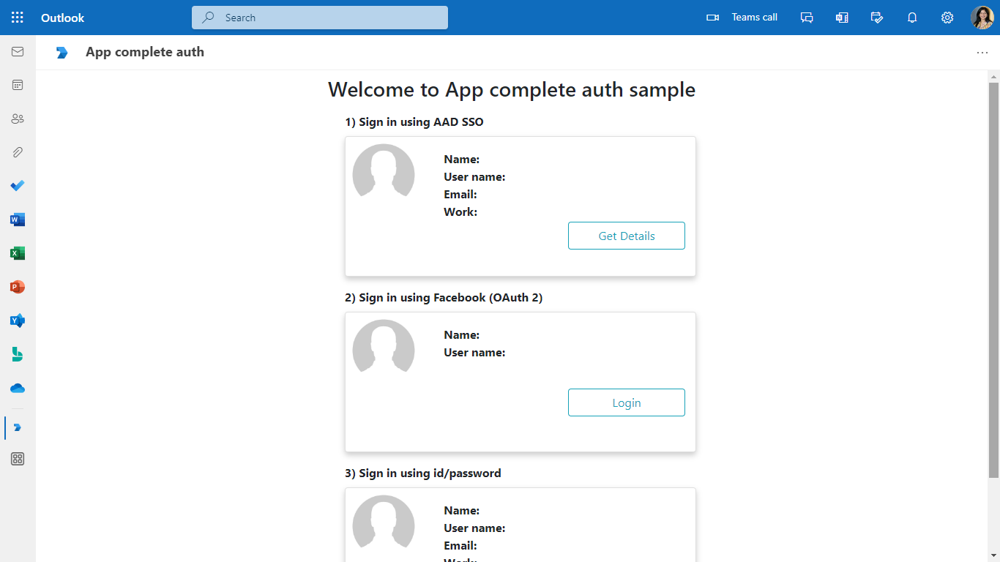
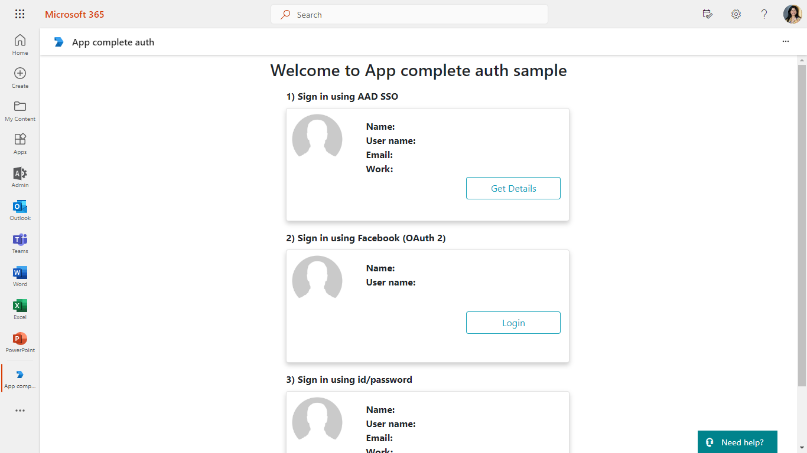

# Authentication complete sample

Using this C# sample, you can check authenticate in bot,tab and messaging extention with sso, facebook and using user name and password.

## Included Features
* Teams SSO (tabs, bots, messaging extensions, link unfurling)
* Facebook Authentication (tabs, bots, messaging extensions, link unfurling)
* Adaptive Cards
* Task Modules
* Graph API
* MSAL.js 2.0 support

### **Interaction with app**


## Try it yourself - experience the App in your Microsoft Teams client
Please find below demo manifest which is deployed on Microsoft Azure and you can try it yourself by uploading the app package (.zip file link below) to your teams and/or as a personal app. (Sideloading must be enabled for your tenant, [see steps here](https://docs.microsoft.com/microsoftteams/platform/concepts/build-and-test/prepare-your-o365-tenant#enable-custom-teams-apps-and-turn-on-custom-app-uploading)).

**App Complete Auth:** [Manifest](/samples/app-complete-auth/csharp/demo-manifest/App-Complete-Auth.zip)


## Prerequisites

- [.NET Core SDK](https://dotnet.microsoft.com/download) version 6.0

  ```bash
  # determine dotnet version
  dotnet --version
  ```
- Publicly addressable https url or tunnel such as [ngrok](https://ngrok.com/) or [Tunnel Relay](https://github.com/OfficeDev/microsoft-teams-tunnelrelay) 

- [Teams](https://teams.microsoft.com) Microsoft Teams is installed and you have an account

## Setup

### Register you app with Azure AD.

1. Register a new application in the [Azure Active Directory – App Registrations](https://go.microsoft.com/fwlink/?linkid=2083908) portal.
2. Select **New Registration** and on the *register an application page*, set following values:
    * Set **name** to your app name.
    * Choose the **supported account types** (any account type will work)
    * Leave **Redirect URI** empty.
    * Choose **Register**.
3. On the overview page, copy and save the **Application (client) ID, Directory (tenant) ID**. You’ll need those later when updating your Teams application manifest and in the appsettings.json.
4. Under **Manage**, select **Expose an API**. 
5. Select the **Set** link to generate the Application ID URI in the form of `api://{base-url}/botid-{AppID}`. Insert your fully qualified domain name (with a forward slash "/" appended to the end) between the double forward slashes and the GUID. The entire ID should have the form of: `api://fully-qualified-domain-name/botid-{AppID}`
    * ex: `api://%ngrokDomain%.ngrok-free.app/botid-00000000-0000-0000-0000-000000000000`.
6. Select the **Add a scope** button. In the panel that opens, enter `access_as_user` as the **Scope name**.
7. Set **Who can consent?** to `Admins and users`
8. Fill in the fields for configuring the admin and user consent prompts with values that are appropriate for the `access_as_user` scope:
    * **Admin consent title:** Teams can access the user’s profile.
    * **Admin consent description**: Allows Teams to call the app’s web APIs as the current user.
    * **User consent title**: Teams can access the user profile and make requests on the user's behalf.
    * **User consent description:** Enable Teams to call this app’s APIs with the same rights as the user.
9. Ensure that **State** is set to **Enabled**
10. Select **Add scope**
    * The domain part of the **Scope name** displayed just below the text field should automatically match the **Application ID** URI set in the previous step, with `/access_as_user` appended to the end:
        * `api://[ngrokDomain].ngrok-free.app/botid-00000000-0000-0000-0000-000000000000/access_as_user.
11. In the **Authorized client applications** section, identify the applications that you want to authorize for your app’s web application. Each of the following IDs needs to be entered:
    * `1fec8e78-bce4-4aaf-ab1b-5451cc387264` (Teams mobile/desktop application)
    * `5e3ce6c0-2b1f-4285-8d4b-75ee78787346` (Teams web application)
    **Note** If you want to test or extend your Teams apps across Office and Outlook, kindly add below client application identifiers while doing Azure AD app registration in your tenant:
   * `4765445b-32c6-49b0-83e6-1d93765276ca` (Office web)
   * `0ec893e0-5785-4de6-99da-4ed124e5296c` (Office desktop)
   * `bc59ab01-8403-45c6-8796-ac3ef710b3e3` (Outlook web)
   * `d3590ed6-52b3-4102-aeff-aad2292ab01c` (Outlook desktop)
12. Navigate to **API Permissions**, and make sure to add the follow permissions:
-   Select Add a permission
-   Select Microsoft Graph -\> Delegated permissions.
    - `User.Read` (enabled by default)
-   Click on Add permissions. Please make sure to grant the admin consent for the required permissions.
13. Navigate to **Authentication**
    If an app hasn't been granted IT admin consent, users will have to provide consent the first time they use an app.
- Set a redirect URI:
    * Select **Add a platform**.
    * Select **Single-page application**.
    * Enter the **redirect URI** for the app in the following format: `https://{Base_Url}/auth-end`.
- Set another redirect URI:
    * Select **Add a platform**.
    * Select **web**.
    * Enter the **redirect URI** `https://token.botframework.com/.auth/web/redirect`. This will be use for bot authenticaiton. 
14.  Navigate to the **Certificates & secrets**. In the Client secrets section, click on "+ New client secret". Add a description(Name of the secret) for the secret and select “Never” for Expires. Click "Add". Once the client secret is created, copy its value, it need to be placed in the appsettings.json.

15. Create a Bot Registration
   - Register a bot with Azure Bot Service, following the instructions [here](https://docs.microsoft.com/en-us/azure/bot-service/bot-service-quickstart-registration?view=azure-bot-service-3.0).
   - Ensure that you've [enabled the Teams Channel](https://docs.microsoft.com/en-us/azure/bot-service/channel-connect-teams?view=azure-bot-service-4.0)
   - While registering the bot, use `https://<your_ngrok_url>/api/messages` as the messaging endpoint.
   - Select Configuration section.
   - Under configuration -> Add OAuth connection string.
   - Provide connection Name : for eg `ssoconnection`
   - Select service provider ad `Azure Active Directory V2`
   - Complete the form as follows:

    a. **Name:** Enter a name for the connection. You'll use this name in your bot in the appsettings.json file.
    b. **Client id:** Enter the Application (client) ID that you recorded for your Azure identity provider app in the steps above.
    c. **Client secret:** Enter the secret that you recorded for your Azure identity provider app in the steps above.
    d. **Tenant ID**  Enter value as `common`.
    e. **Token Exchange Url** Enter the url in format `api://%ngrokDomain%.ngrok-free.app/botid-00000000-0000-0000-0000-000000000000`(Refer step 1.5)
    f. Provide **Scopes** like "User.Read openid"
  

16. To test facebook auth flow [create a facebookapp](AppCompleteAuth/FacebookDocumentation/README.md) and get client id and secret for facebook app.
    Now go to your bot channel registartion -> configuration -> Add OAuth connection string
   - Provide connection Name : for eg `facebookconnection`. You'll use this name in your bot in the appsettings.json file.
   - Select service provider ad `facebook`
   - Add clientid and secret of your facebook app that was created using Step 16.
   - For scopes, add `email public_profile`

### 2. Setup NGROK
1) Run ngrok - point to port 3978

```bash
# ngrok http 3978 --host-header="localhost:3978"
```

### 3. Setup for code
  
1. Clone the repository
   ```bash
   git clone https://github.com/OfficeDev/Microsoft-Teams-Samples.git
   ```

2. Open the code in Visual Studio
   - File -> Open -> Project/Solution
   - Navigate to folder where repository is cloned then `samples/app-complete-auth/csharp/AppCompleteAuth.sln`
 
3. Setup and run the bot from Visual Studio: 
    Modify the `appsettings.json` and fill in the following details:
   - `{{Microsoft-App-id}}` - Generated from Step 1 (Application (client) ID)is the application app id
   - `{{TenantId}}` - Enter value as `common`.
   - `{{MicrosoftAppPassword}}` - Generated from Step 1.14, also referred to as Client secret
   - `{{base-url}}` - Your application's base url. E.g. https://12345.ngrok-free.app if you are using ngrok.
   - `{{ Connection Name }}` - Generated from step 15.
   - `{{FacebookAppId}} and {{FacebookAppPassword}} and {{ Facebook Connection Name}}`- Generated from step 16.
   - Press `F5` to run the project

### 4. Setup Manifest for Teams

1. Modify the `manifest.json` in the `/AppManifest` folder and replace the following details:
   - `{{Microsoft-App-Id}}` with Application id generated from Step 3
   - `{Base_URL_Domain}` - Your application's base url domain. E.g. for https://12345.ngrok-free.app the base url domain will be 12345.ngrok-free.app if you are using ngrok.

**Note:** If you want to test your app across multi hub like: Outlook/Office.com, please update the `manifest.json` in the `app-complete-auth\csharp\AppCompleteAuth\Manifest_Hub` folder with the required values.

2. Zip up the contents of the `AppManifest` folder to create a `manifest.zip` or `Manifest_Hub` folder into a `Manifest_Hub.zip`. (Make sure that zip file does not contains any subfolder otherwise you will get error while uploading your .zip package) 

3. Upload the manifest.zip to Teams (in the Apps view click "Upload a custom app")
   - Go to Microsoft Teams and then go to side panel, select Apps
   - Choose Upload a custom App
   - Go to your project directory, the ./AppManifest folder, select the zip folder, and choose Open.
   - Select Add in the pop-up dialog box. Your app is uploaded to Teams.

 **Note**: To test facebook auth flow please setup the sample locally as due to limitations from facebook you cannot test the facebook auth flow in the deployed version of app.
- If you are facing any issue in your app, please uncomment [this](https://github.com/OfficeDev/Microsoft-Teams-Samples/blob/main/samples/app-complete-auth/csharp/AppCompleteAuth/AdapterWithErrorHandler.cs#L30) line and put your debugger for local debug.


## Running the sample

Bot Authentication

Install the bot in personal scope. A welcome card will be sent.


Type `login`.  A login card will be sent to user.


- **SSO**
  
Select AAD SSO login option. A consent popup will be sent. Click continue.


After the consent is granted, card will be sent containing user's profile details.


- **Authentication using user name and password**
  

  
**Tab Authentication**


- **SSO**
  

  
- **Authentication using user name and password**
  


Messaging Extention Authentication

- **ME Action**


- SSO
  

  
- Authentication using user name and password
  

  

  
- ME Search


  
- SSO
  

  
- Authentication using user name and password
  

   
- ME Link unfurling


  
- SSO
  

  
- Authentication using user name and password
  


## Outlook on the web

- To view your app in Outlook on the web.

- Go to [Outlook on the web](https://outlook.office.com/mail/)and sign in using your dev tenant account.

**On the side bar, select More Apps. Your sideloaded app title appears among your installed apps**


**Select your app icon to launch and preview your app running in Outlook on the web**




**Note:** Similarly, you can test your application in the Outlook desktop app as well.

## Office on the web

- To preview your app running in Office on the web.

- Log into office.com with test tenant credentials

**Select the Apps icon on the side bar. Your sideloaded app title appears among your installed apps**


**Select your app icon to launch your app in Office on the web**

 

 

 

 

**Note:** Similarly, you can test your application in the Office 365 desktop app as well.

## Deploy the bot to Azure

To learn more about deploying a bot to Azure, see [Deploy your bot to Azure](https://aka.ms/azuredeployment) for a complete list of deployment instructions.

## Further reading

- [Bot Framework Documentation](https://docs.botframework.com)
- [Bot Basics](https://docs.microsoft.com/azure/bot-service/bot-builder-basics?view=azure-bot-service-4.0)
- [Authentication basics](https://docs.microsoft.com/microsoftteams/platform/concepts/authentication/authentication)
- [Extend Teams apps across Microsoft 365](https://learn.microsoft.com/microsoftteams/platform/m365-apps/overview)
- [Create facebook app for development](https://developers.facebook.com/docs/development/create-an-app/)


