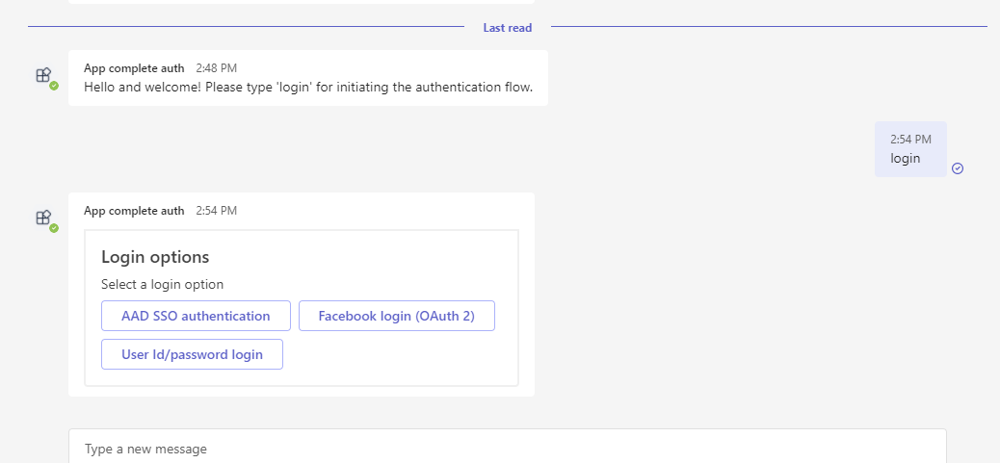
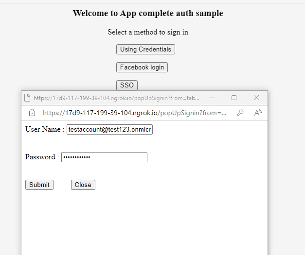
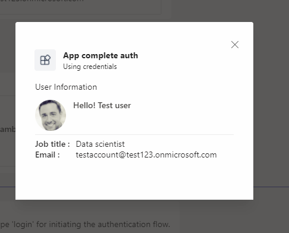
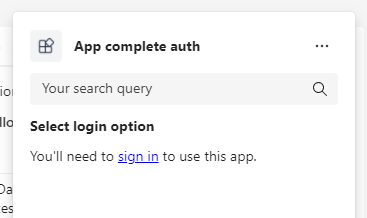
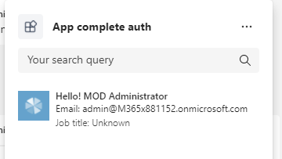
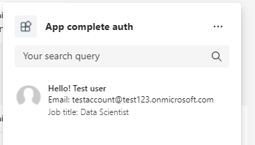
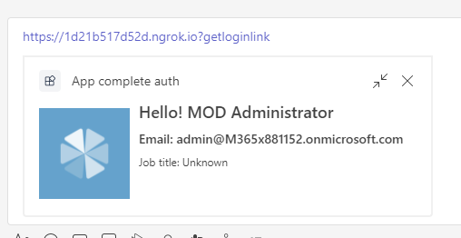
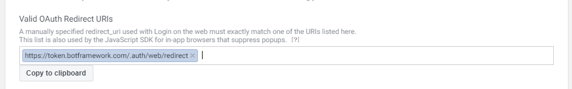

# Authentication complete sample

Using this C# sample, you can check authenticate in bot,tab and messaging extention with sso, facebook and using user name and password.

## Key features

Bot Authentication



  - SSO
  
  
  
  - Using user name and password
  
  
  
  
  
Tab Authentication


  - SSO
  
  
  
  - Authentication using user name and password
  
  

Messaging Extention Authentication

- ME Action

  

  - SSO
  
  
  
  - Authentication using user name and password
  
  
  
  
  
- ME Search

  
  
  - SSO
  
  
  
  - Authentication using user name and password
  
   
   
- ME Link unfurling

  
  
  - SSO
  
  
  
  - Authentication using user name and password
  
   

## Prerequisites

- Microsoft Teams is installed and you have an account (not a guest account)
-  [NodeJS](https://nodejs.org/en/)
-  [ngrok](https://ngrok.com/) or equivalent tunneling solution
-  [M365 developer account](https://docs.microsoft.com/en-us/microsoftteams/platform/concepts/build-and-test/prepare-your-o365-tenant) or access to a Teams account with the appropriate permissions to install an app.

## To try this sample

> Note these instructions are for running the sample on your local machine, the tunnelling solution is required because
> the Teams service needs to call into the bot.

### Register your Teams Auth SSO with Azure AD

1. Register a new application in the [Azure Active Directory – App Registrations](https://go.microsoft.com/fwlink/?linkid=2083908) portal.
2. Select **New Registration** and on the *register an application page*, set following values:
    * Set **name** to your app name.
    * Choose the **supported account types** (any account type will work)
    * Leave **Redirect URI** empty.
    * Choose **Register**.
3. On the overview page, copy and save the **Application (client) ID, Directory (tenant) ID**. You’ll need those later when updating your Teams application manifest and in the appsettings.json.
4. Under **Manage**, select **Expose an API**. 
5. Select the **Set** link to generate the Application ID URI in the form of `api://{AppID}`. Insert your fully qualified domain name (with a forward slash "/" appended to the end) between the double forward slashes and the GUID. The entire ID should have the form of: `api://fully-qualified-domain-name/{AppID}`
    * ex: `api://%ngrokDomain%.ngrok.io/00000000-0000-0000-0000-000000000000`.
6. Select the **Add a scope** button. In the panel that opens, enter `access_as_user` as the **Scope name**.
7. Set **Who can consent?** to `Admins and users`
8. Fill in the fields for configuring the admin and user consent prompts with values that are appropriate for the `access_as_user` scope:
    * **Admin consent title:** Teams can access the user’s profile.
    * **Admin consent description**: Allows Teams to call the app’s web APIs as the current user.
    * **User consent title**: Teams can access the user profile and make requests on the user's behalf.
    * **User consent description:** Enable Teams to call this app’s APIs with the same rights as the user.
9. Ensure that **State** is set to **Enabled**
10. Select **Add scope**
    * The domain part of the **Scope name** displayed just below the text field should automatically match the **Application ID** URI set in the previous step, with `/access_as_user` appended to the end:
        * `api://[ngrokDomain].ngrok.io/00000000-0000-0000-0000-000000000000/access_as_user.
11. In the **Authorized client applications** section, identify the applications that you want to authorize for your app’s web application. Each of the following IDs needs to be entered:
    * `1fec8e78-bce4-4aaf-ab1b-5451cc387264` (Teams mobile/desktop application)
    * `5e3ce6c0-2b1f-4285-8d4b-75ee78787346` (Teams web application)
12. Navigate to **API Permissions**, and make sure to add the follow permissions:
-   Select Add a permission
-   Select Microsoft Graph -\> Delegated permissions.
    - `User.Read` (enabled by default)
-   Click on Add permissions. Please make sure to grant the admin consent for the required permissions.
13. Navigate to **Authentication**
    If an app hasn't been granted IT admin consent, users will have to provide consent the first time they use an app.
- Set a redirect URI:
    * Select **Add a platform**.
    * Select **web**.
    * Enter the **redirect URI** for the app in the following format: `https://{Base_Url}/auth-end`. This will be the page where a successful implicit grant flow will redirect the user.
- Set another redirect URI:
    * Select **Add a platform**.
    * Select **web**.
    * Enter the **redirect URI** `https://token.botframework.com/.auth/web/redirect`. This will be use for bot authenticaiton. 
- Enable implicit grant by checking the following boxes:  
    ✔ ID Token  
    ✔ Access Token  
14.  Navigate to the **Certificates & secrets**. In the Client secrets section, click on "+ New client secret". Add a description(Name of the secret) for the secret and select “Never” for Expires. Click "Add". Once the client secret is created, copy its value, it need to be placed in the appsettings.json.

15. Create a Bot Registration
   In Azure portal, create a [Bot Framework registration resource](https://docs.microsoft.com/en-us/azure/bot-service/bot-builder-authentication?view=azure-bot-service-4.0&tabs=csharp%2Caadv2).

   - Ensure that you've [enabled the Teams Channel](https://docs.microsoft.com/en-us/azure/bot-service/channel-connect-teams?view=azure-bot-service-4.0)
   - Select Configuration section.
   - Under Configuration, select add OAuth Connection Setting.
   - Complete the form as follows:

    a. **Name:** Enter a name for the connection. You'll use this name in your bot in the .env file.
    b. **Client id:** Enter the Application (client) ID that you recorded for your Azure identity provider app in the steps above.
    c. **Client secret:** Enter the secret that you recorded for your Azure identity provider app in the steps above.
    d. Provide **Scopes** like "User.Read openid"
  

16. To test facebook auth flow [create a facebookapp](https://docs.microsoft.com/en-us/azure/bot-service/bot-service-channel-connect-facebook?view=azure-bot-service-4.0) and get client id and secret for facebook app.
    Now go to your bot channel registartion -> configuration -> Add OAuth connection string
   - Provide connection Name : for eg `facebookconnection`
   - Select service provider ad `facebook`
   - Add clientid and secret of your facebook app that was created using Step 16.

17. After creating the app and getting client id and secret, make sure you add facebook login service under products section.
     

18. Go to facebook settings and under valid domains, make sure to add the following url's
     - `https://token.botframework.com/.auth/web/redirect`
     - `https://<<base url>>`
     - `https://<<base url>>/fb-auth`
     
    


### Run your bot sample
1) Clone the repository

    ```bash
    git clone https://github.com/OfficeDev/Microsoft-Teams-Samples.git
    ```

2) In a terminal, navigate to `samples/app-complete-auth/nodejs`

3) Install node modules

   Inside node js folder, open your local terminal and run the below command to install node modules. You can do the same in Visual Studio code terminal by opening the project in Visual Studio code.

    ```bash
    npm install
    ```
4) Run ngrok - point to port 3978

    ```bash
    ngrok http -host-header=rewrite 3978
    ```
5)  Modify the `.env` file in your project folder (or in Visual Studio Code) and fill in below details:
   - `{{Microsoft-App-id}}` - Generated from Step 3 (Application (client) ID)is the application app id
   - `{{TenantId}}` - Generated from Step 3(Directory (tenant) ID) is the tenant id
   - `{{MicrosoftAppPassword}}` - Generated from Step 14, also referred to as Client secret
   - `{{ApplicationBaseUrll}}` - Your application's base url. E.g. https://12345.ngrok.io if you are using ngrok.
   - `{{ Connection Name }}` - Generated from step 15.
   - `{{FacebookAppId}} and {{FacebookAppPassword}} and {{ FBConnectionName}}`- Generated from step 16.

6) Run your app

    ```bash
    npm start
    ```
- **Manually update the manifest.json**
    Modify the `manifest.json` in the `/AppPackage` folder and replace the following details:
   - `{{Microsoft-App-Id}}` with Application id generated from Step 3
   - `{Base_URL}` - Your application's base url. E.g. https://12345.ngrok.io if you are using ngrok.

    > IMPORTANT: The manifest file in this app adds "token.botframework.com" to the list of `validDomains`. This must be included in any bot that uses the Bot Framework OAuth flow.

- Note: To test facebook auth flow please setup the sample locally as due to limitations from facebook you cannot test the facebook auth flow in the deployed version of app.

## Deploy the bot to Azure

To learn more about deploying a bot to Azure, see [Deploy your bot to Azure](https://aka.ms/azuredeployment) for a complete list of deployment instructions.

## Further reading

- [Bot Framework Documentation](https://docs.botframework.com)
- [Bot Basics](https://docs.microsoft.com/azure/bot-service/bot-builder-basics?view=azure-bot-service-4.0)
- [Authentication basics](https://docs.microsoft.com/en-us/microsoftteams/platform/concepts/authentication/authentication)

