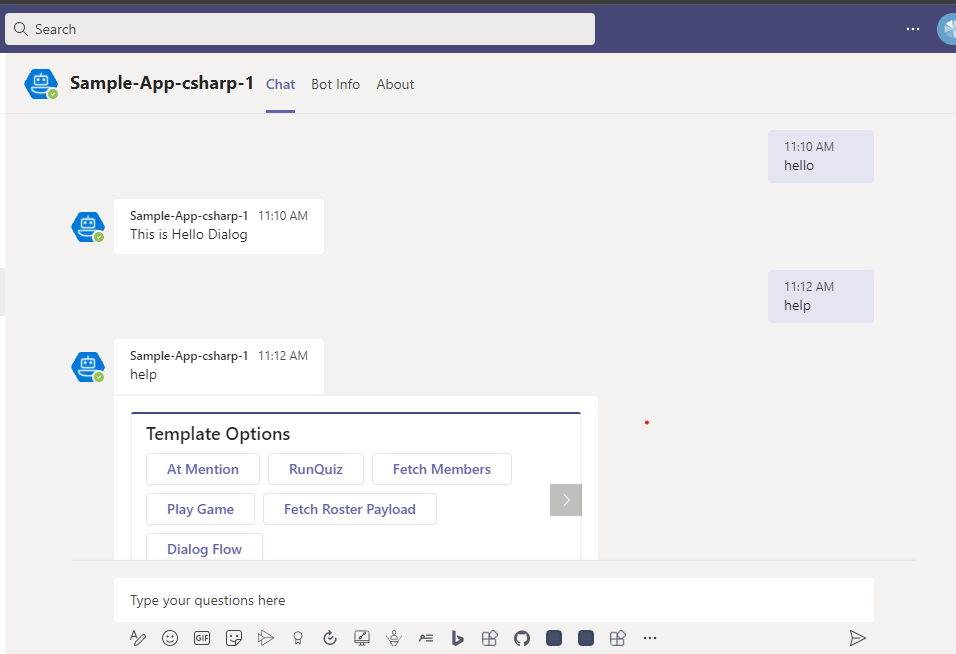
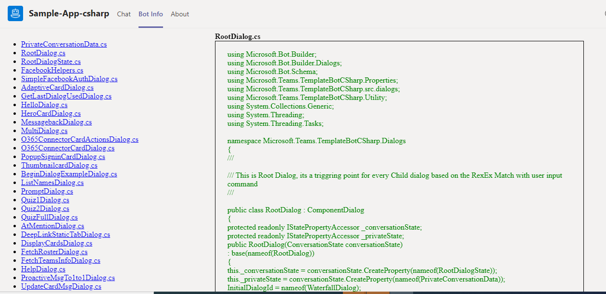
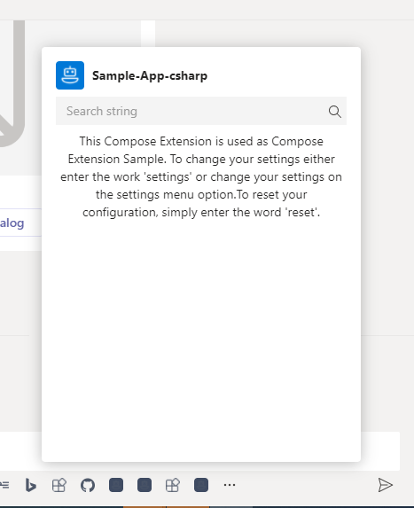

# Microsoft Teams Bot in C#

Sample that shows how to build a bot for Microsoft Teams in C#. 

## Features of this sample







## Prerequisites

* Install Git for windows: https://git-for-windows.github.io/

* Clone this repo:<br>
    ```bash
    git clone https://github.com/OfficeDev/Microsoft-Teams-Samples.git
    ```
* In a terminal, navigate to samples/app-complete-sample/csharp

* Install Visual Studio and launch it as an administrator

* Build the solution to download all configured NuGet packages

* (Only needed if wanting to run in Microsoft Teams)<br>
Install some sort of tunnelling service. These instructions assume you are using ngrok: https://ngrok.com/

* (Only needed if wanting to run in the Bot Emulator)<br>
Install the Bot Emulator - click on "Bot Framework Emulator (Mac and Windows)": https://docs.botframework.com/en-us/downloads/#navtitle  
    * NOTE: make sure to pin the emulator to your task bar because it can sometimes be difficult to find again 

## Steps to see the bot running in the Bot Emulator

NOTE: Teams does not work nor render things exactly like the Bot Emulator, but it is a quick way to see if your bot is running and functioning correctly.

1. Open the template-bot-master-csharp.sln solution with Visual Studio

2. In Visual Studio click the play button (should be defaulted to running the Microsoft Edge configuration) 

3. Once the code is running, connect with the Bot Emulator to the default endpoint, "http://localhost:3979/api/messages", leaving "Microsoft App ID" and "Microsoft App Password" blank

Congratulations!!! You can now chat with the bot in the Bot Emulator!

## Steps to see the full app in Microsoft Teams

1. Begin your tunnelling service to get an https endpoint. 

	* Open a new **Command Prompt** window. 

	* Change to the directory that contains the ngrok.exe application. 

	* Run the command `ngrok http [port] --host-header=localhost` (you'll need the https endpoint for the bot registration) e.g.<br>
		```
		ngrok http 3979 --host-header=localhost
		```

	* The ngrok application will fill the entire prompt window. Make note of the Forwarding address using https. This address is required in the next step. 

	* Minimize the ngrok Command Prompt window. It is no longer referenced in this lab, but it must remain running.


    
2. Register a new bot (or update an existing one) with Bot Framework by using the https endpoint started by ngrok and the extension "/api/messages" as the full endpoint for the bot's "Messaging endpoint". e.g. "https://####abcd.ngrok.io/api/messages" - Bot registration is here (open in a new browser tab): https://dev.botframework.com/bots/new. Ignore the warning about migrating to Azure, it is not necessary for Teams-only bots. You can however safely migrate your bot to Azure if you so choose, or use the Azure portal to create your bot.

    > **NOTE**: When you create your bot you will create an App ID and App password - make sure you keep these for later.

    - Ensure that you've [enabled the Teams Channel](https://docs.microsoft.com/en-us/azure/bot-service/channel-connect-teams?view=azure-bot-service-4.0)

3. You project needs to run with a configuration that matches your registered bot's configuration. To do this, you will need to update the web.config file:

	* In Visual Studio, open the Web.config file. Locate the `<appSettings>` section. 
 
	* Enter the BotId value. The BotId is the **Bot handle** from the **Configuration** section of the bot registration. 
 
	* Enter the MicrosoftAppId. The MicrosoftAppId is the app ID from the **Configuration** section of the bot registration. 
 
	* Enter the MicrosoftAppPassword. The MicrosoftAppPassword is the auto-generated app password displayed in the pop-up during bot registration.
	
	* Enter the BaseUri. The BaseUri is the https endpoint generated from ngrok.

	Here is an example for reference:
	
		<add key="BotId" value="Bot_Handle_Here" />
		<add key="MicrosoftAppId" value="88888888-8888-8888-8888-888888888888" />
		<add key="MicrosoftAppPassword" value="aaaa22229999dddd0000999" />
		<add key="BaseUri" value="https://#####abc.ngrok.io" />

4. In Visual Studio click the play button (should be defaulted to running the Microsoft Edge configuration)

5. Once the app is running, a manifest file is needed:
    * On the solution explorer of Visual Studio, navigate to the file, manifest/manifest.json - change:
        * <<REGISTERED_BOT_ID>> (there are 3) change to your registered bot's app ID
        * <<BASE_URI>> (there are 2) change to your https endpoint from ngrok
        * <<BASE_URI_DOMAIN>> (there is 1) change to your https endpoint from ngrok excluding the "https://" part
		
    * Save the file and zip this file and the bot_blue.png file (located next to it) together to create a manifest.zip file

6. Once complete, sideload your zipped manifest to a team as described here (open in a new browser tab): https://docs.microsoft.com/en-us/microsoftteams/platform/concepts/deploy-and-publish/apps-upload

Congratulations!!! You have just created and sideloaded your first Microsoft Teams app! Try adding a configurable tab, at-mentioning your bot by its registered name, or viewing your static tabs.<br><br>
NOTE: Most of this sample app's functionality will now work. The only limitations are the authentication examples because your app is not registered with AAD nor Visual Studio Team Services.

## Overview

This project is meant to help a Teams developer in two ways.  First, it is meant to show many examples of how an app can integrate into Teams.  Second, it is meant to give a set of patterns, templates, and tools that can be used as a starting point for creating a larger, scalable, more enterprise level bot to work within Teams.  Although this project focuses on creating a robust bot, it does include simples examples of tabs as well as examples of how a bot can give links into these tabs.

## What it is

At a high level, this project is written in C#, built to run a .Net, and uses the BotFramework to handle the bot's requests and responses. This project is designed to be run in Visual Studio using its debugger in order to leverage breakpoints. Most directories will hold a README file which will describe what the files within that directory do.
The easiest way to get started is to follow the steps listed in the "Steps to get started running the Bot Emulator". Once this is complete and running, the easiest way to add your own content is to create a new dialog in src/dialogs by copying one from src/dialogs/examples, change it accordingly, and then instantiate it with the others in the RootDialog.cs.

## General Architecture

Most code files that need to be compile reside in the src directory. Most files outside of the src directory are static files used for either configuration or for providing static resources to tabs, e.g. images and html.

## Files and Directories

* **manifest**<br><br>
This directory holds the skeleton of a manifest.json file that can be altered in order sideload this application into a team.

* **middleware**<br><br>
This directory holds the stripping at mention for channel class and Invoke message processing.

* **public**<br><br>
This directory holds static html, image, and javascript files used by the tabs and bot.  This is not the only public directory that is used for the tabs, though.  This directory holds the html and javascript used for the configuration page of the configurable tab.  The main content of the static and configurable comes from the static files placed in /public/tab/tabConfig.

* **src**<br><br>
This directory holds all the code files, which run the entire application.

* **utility**<br><br>
This directory holds utility functions for the project.

* **web.config**<br><br>
This file is a configuration file that can be used to update the config keys globally used in Application.

## Steps included in migration of Bot framework from v3 to V4
1. Updated the following packages:
  * Microsoft.Bot.Builder.Azure and Microsoft.Bot.Builder.Integration.AspNet.WebApi
  * Autofac.WebApi2
  * Bot.Builder.Community.Dialogs.Formflow

2. Updated the Global.asax.cs file

3. Updated messageController.cs

4. Added dilaogBot.cs. DialogExtension.cs, AdapterWithErrorHandler.cs

5. Updated Dialog files into waterfall model dialog.


## Contributing

This project welcomes contributions and suggestions.  Most contributions require you to agree to a
Contributor License Agreement (CLA) declaring that you have the right to, and actually do, grant us
the rights to use your contribution. For details, visit https://cla.microsoft.com.

When you submit a pull request, a CLA-bot will automatically determine whether you need to provide
a CLA and decorate the PR appropriately (e.g., label, comment). Simply follow the instructions
provided by the bot. You will only need to do this once across all repos using our CLA.

This project has adopted the [Microsoft Open Source Code of Conduct](https://opensource.microsoft.com/codeofconduct/).
For more information see the [Code of Conduct FAQ](https://opensource.microsoft.com/codeofconduct/faq/) or
contact [opencode@microsoft.com](mailto:opencode@microsoft.com) with any additional questions or comments.
