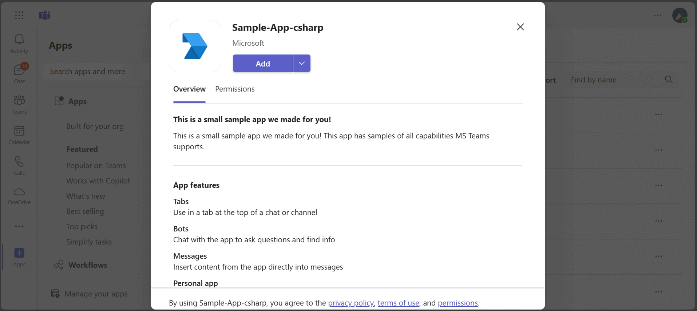
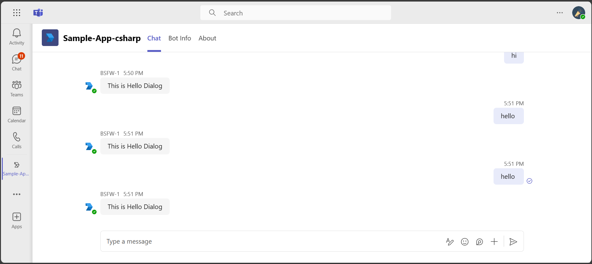
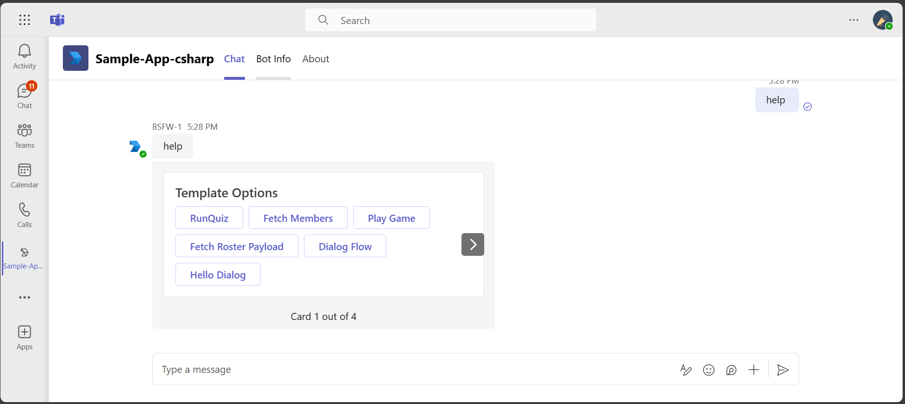
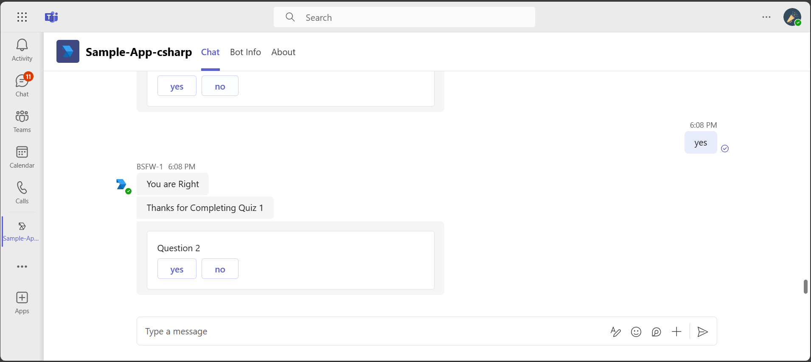
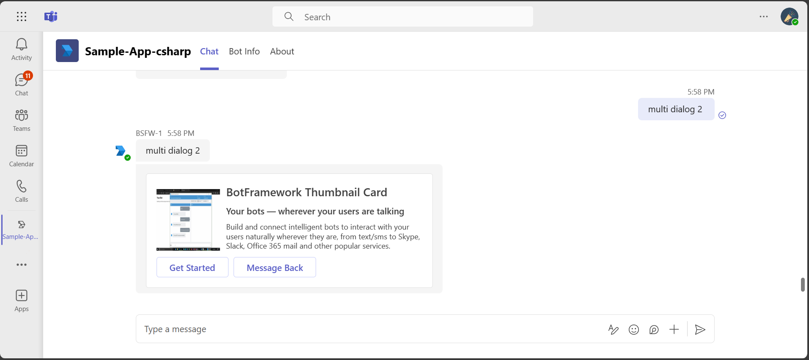
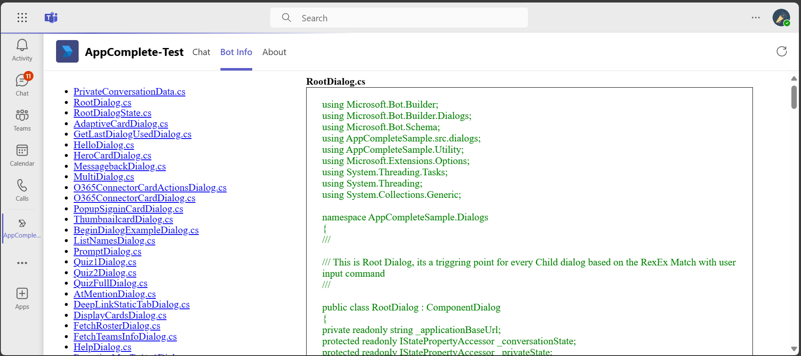
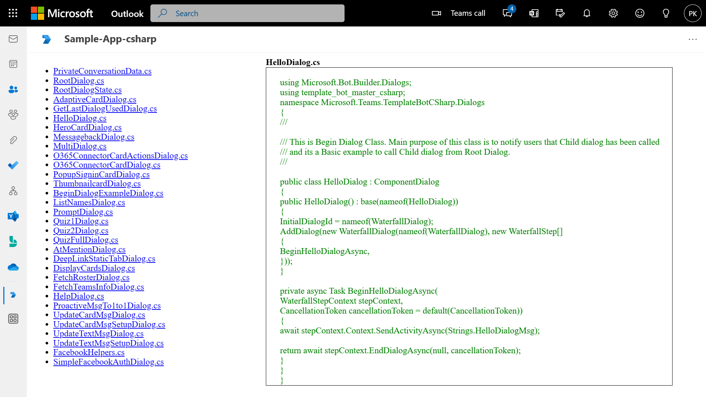
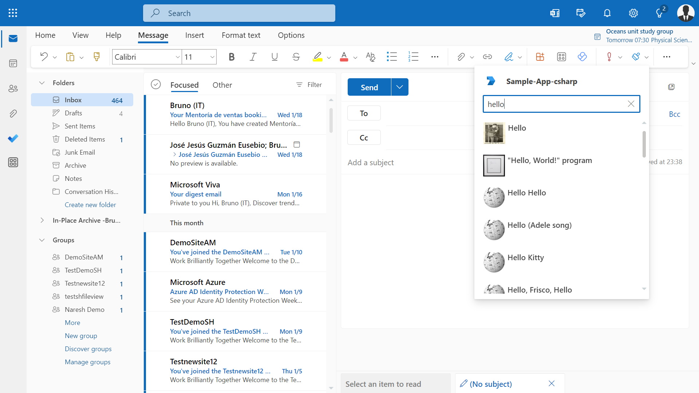
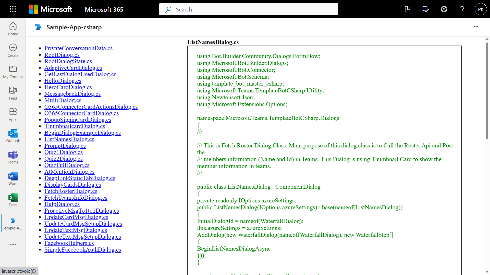

# Microsoft Teams Bot in C#

Develop a robust Microsoft Teams bot using C# and Bot Framework v4, featuring seamless integration of Tabs, Messaging Extensions, and Adaptive Cards. This sample also includes Facebook authentication to enrich user engagement and streamline interactions within the Teams environment.

## Included Features
* Bots
* Tabs
* Messaging Extensions
* Adaptive Cards
* Facebook Authentication (bots)

## Interaction with app



## Try it yourself - experience the App in your Microsoft Teams client
Please find below demo manifest which is deployed on Microsoft Azure and you can try it yourself by uploading the app manifest (.zip file link below) to your teams and/or as a personal app. (Uploading must be enabled for your tenant, [see steps here](https://docs.microsoft.com/microsoftteams/platform/concepts/build-and-test/prepare-your-o365-tenant#enable-custom-teams-apps-and-turn-on-custom-app-uploading)).

**Microsoft Teams Bot:** [Manifest](/samples/app-complete-sample/csharp/demo-manifest/app-complete-sample.zip)

## Prerequisites

* Install Git for windows: https://git-for-windows.github.io/

- [.NET Core SDK](https://dotnet.microsoft.com/download) version 6.0

  determine dotnet version
  ```bash
  dotnet --version
  ```
- [dev tunnel](https://learn.microsoft.com/en-us/azure/developer/dev-tunnels/get-started?tabs=windows) or [ngrok](https://ngrok.com/download) (For local environment testing) latest version (any other tunneling software can also be used)
  
- [Teams](https://teams.microsoft.com) Microsoft Teams is installed and you have an account

- [Microsoft 365 Agents Toolkit for Visual Studio](https://learn.microsoft.com/en-us/microsoftteams/platform/toolkit/toolkit-v4/install-teams-toolkit-vs?pivots=visual-studio-v17-7)

## Run the app (Using Microsoft 365 Agents Toolkit for Visual Studio)

The simplest way to run this sample in Teams is to use Microsoft 365 Agents Toolkit for Visual Studio.
1. Install Visual Studio 2022 **Version 17.14 or higher** [Visual Studio](https://visualstudio.microsoft.com/downloads/)
1. Install Microsoft 365 Agents Toolkit for Visual Studio [Microsoft 365 Agents Toolkit extension](https://learn.microsoft.com/en-us/microsoftteams/platform/toolkit/toolkit-v4/install-teams-toolkit-vs?pivots=visual-studio-v17-7)
1. In the debug dropdown menu of Visual Studio, select Dev Tunnels > Create A Tunnel (set authentication type to Public) or select an existing public dev tunnel.
1. Right-click the 'M365Agent' project in Solution Explorer and select **Microsoft 365 Agents Toolkit > Select Microsoft 365 Account**
1. Sign in to Microsoft 365 Agents Toolkit with a **Microsoft 365 work or school account**
1. Set `Startup Item` as `Microsoft Teams (browser)`.
1. Press F5, or select Debug > Start Debugging menu in Visual Studio to start your app
</br>
1. In the opened web browser, select Add button to install the app in Teams
> If you do not have permission to upload custom apps (uploading), Microsoft 365 Agents Toolkit will recommend creating and using a Microsoft 365 Developer Program account - a free program to get your own dev environment sandbox that includes Teams.
    
## Setup

NOTE: Teams does not work nor render things exactly like the Bot Emulator, but it is a quick way to see if your bot is running and functioning correctly.

1. Register a new application in the [Microsoft Entra ID – App Registrations](https://go.microsoft.com/fwlink/?linkid=2083908) portal.
  A) Select **New Registration** and on the *register an application page*, set following values:
      * Set **name** to your app name.
      * Choose the **supported account types** (any account type will work)
      * Leave **Redirect URI** empty.
      * Choose **Register**.
  B) On the overview page, copy and save the **Application (client) ID, Directory (tenant) ID**. You'll need those later when updating your Teams application manifest and in the appsettings.json.
  C) Navigate to **API Permissions**, and make sure to add the follow permissions:
   Select Add a permission
      * Select Add a permission
      * Select Microsoft Graph -\> Delegated permissions.
      * `User.Read` (enabled by default)
      * Click on Add permissions. Please make sure to grant the admin consent for the required permissions.

2. Setup for Bot
	- Register a Microsoft Entra ID aap registration in Azure portal.
	- Also, register a bot with Azure Bot Service, following the instructions [here](https://docs.microsoft.com/azure/bot-service/bot-service-quickstart-registration?view=azure-bot-service-3.0).
	- Ensure that you've [enabled the Teams Channel](https://docs.microsoft.com/azure/bot-service/channel-connect-teams?view=azure-bot-service-4.0)
	- While registering the bot, use `https://<your_tunnel_domain>/api/messages` as the messaging endpoint.

    > NOTE: When you create your app registration, you will create an App ID and App password - make sure you keep these for later.

3. Run ngrok - point to port 3978

   ```bash
   ngrok http 3978 --host-header="localhost:3978"
   ```  

   Alternatively, you can also use the `dev tunnels`. Please follow [Create and host a dev tunnel](https://learn.microsoft.com/en-us/azure/developer/dev-tunnels/get-started?tabs=windows) and host the tunnel with anonymous user access command as shown below:

	```bash
   devtunnel host -p 3978 --allow-anonymous
   ```

4. Setup for code

  - Clone the repository

    ```bash
    git clone https://github.com/OfficeDev/Microsoft-Teams-Samples.git
    ```
5. Modify the `/appsettings.json` and fill in the following details:
  - `{{BotId}}` - Generated from Step 1 is the application app id
  - `{{MicrosoftAppId}}` - Generated from Step 1 is the application app id
  - `{{MicrosoftAppPassword}}` - Generated from Step 1, also referred to as Client secret
  - `{{BaseUri}}` - Your application's base url. E.g. https://12345.ngrok-free.app if you are using ngrok and if you are using dev tunnels, your URL will be https://12345.devtunnels.ms.

	Here is an example for reference:
		<add key="BotId" value="Bot_Handle_Here" />
		<add key="MicrosoftAppId" value="88888888-8888-8888-8888-888888888888" />
		<add key="MicrosoftAppPassword" value="aaaa22229999dddd0000999" />
		<add key="BaseUri" value="https://#####abc.ngrok-free.app" />
		<add key="FBConnectionName" value="connectionname" />
		<add key="FBProfileUrl" value="profileurl" />
		
6. To test facebook auth flow [create a facebookapp](https://docs.microsoft.com/azure/bot-service/bot-service-channel-connect-facebook?view=azure-bot-service-4.0) and get client id and secret for facebook app.
    Now go to your bot channel registartion -> configuration -> Add OAuth connection string
   - Provide connection Name : for eg `FBConnectionName`
   - Provide FBProfileUrl: for eg `FBProfileUrl`
   
6. Run the bot from a terminal or from Visual Studio:

    A) From a terminal, navigate to `samples/app-complete-sample/csharp`

	  ```bash
	  # run the bot
	  dotnet run
	  ```
	  Or from Visual Studio
	     - Launch Visual Studio
	     - File -> Open -> Project/Solution
	     - Navigate to `app-complete-sample` folder
	     - Select `AppCompleteSample.sln` file
	     - Press `F5` to run the project

7. Setup Manifest for Teams
	- __*This step is specific to Teams.*__
	    - **Edit** the `manifest.json` contained in the ./appPackage or ./AppManifest_Hub folder to replace your Microsoft App Id (that was created when you registered your app registration earlier) *everywhere* you see the place holder string `{{Microsoft-App-Id}}` (depending on the scenario the Microsoft App Id may occur multiple times in the `manifest.json`)
	    - **Edit** the `manifest.json` for `validDomains` and replace `{{domain-name}}` with base Url of your domain. E.g. if you are using ngrok it would be `https://1234.ngrok-free.app` then your domain-name will be `1234.ngrok-free.app` and if you are using dev tunnels then your domain will be like: `12345.devtunnels.ms`.
	    - **Zip** up the contents of the `appPackage` or `AppManifest_Hub` folder to create a `manifest.zip` (Make sure that zip file does not contains any subfolder otherwise you will get error while uploading your .zip package)

	- Upload the manifest.zip to Teams (in the Apps view click "Upload a custom app")
	   - Go to Microsoft Teams. From the lower left corner, select Apps
	   - From the lower left corner, choose Upload a custom App
	   - Go to your project directory, the ./appPackage folder, select the zip folder, and choose Open.
	   - Select Add in the pop-up dialog box. Your app is uploaded to Teams.
   		
**Note:** If you want to test your app across multi hub like: Outlook/Office.com, please update the `manifest.json` in the `/AppManifest_Hub` folder with the required values.


**Note**: If you are facing any issue in your app, please uncomment [this](https://github.com/OfficeDev/Microsoft-Teams-Samples/blob/main/samples/app-complete-sample/csharp/AppCompleteSAmple/AdapterWithErrorHandler.cs#L23) line and put your debugger for local debug.
   
Congratulations!!! You have just created and uploaded your first Microsoft Teams app! Try adding a configurable tab, at-mentioning your bot by its registered name, or viewing your static tabs.<br><br>
NOTE: Most of this sample app's functionality will now work. The only limitations are the authentication examples because your app is not registered with Microsoft Entra ID nor Visual Studio Team Services.

## Overview

This project is meant to help a Teams developer in two ways.  First, it is meant to show many examples of how an app can integrate into Teams.  Second, it is meant to give a set of patterns, templates, and tools that can be used as a starting point for creating a larger, scalable, more enterprise level bot to work within Teams.  Although this project focuses on creating a robust bot, it does include simples examples of tabs as well as examples of how a bot can give links into these tabs.

## What it is

At a high level, this project is written in C#, built to run a .Net, and uses the BotFramework to handle the bot's requests and responses. This project is designed to be run in Visual Studio using its debugger in order to leverage breakpoints. Most directories will hold a README file which will describe what the files within that directory do.
The easiest way to get started is to follow the steps listed in the "Steps to get started running the Bot Emulator". Once this is complete and running, the easiest way to add your own content is to create a new dialog in src/dialogs by copying one from src/dialogs/examples, change it accordingly, and then instantiate it with the others in the RootDialog.cs.

## General Architecture

Most code files that need to be compile reside in the src directory. Most files outside of the src directory are static files used for either configuration or for providing static resources to tabs, e.g. images and html.

## Files and Directories

* **appManifest**<br><br>
This directory holds the skeleton of a manifest.json file that can be altered in order upload this application into a team.

* **middleware**<br><br>
This directory holds the stripping at mention for channel class and Invoke message processing.

* **Views**<br><br>
The main content of the static comes from the static files placed in /Views/BotInfo/BotInfo.cshtml.

* **src**<br><br>
This directory holds all the code files, which run the entire application.

* **utility**<br><br>
This directory holds utility functions for the project.

## Steps included in migration of Bot framework from v3 to V4
1. Updated the following packages:
  * Microsoft.Bot.Builder.Azure and Microsoft.Bot.Builder.Integration.AspNet.WebApi
  * Autofac.WebApi2
  * Bot.Builder.Community.Dialogs.Formflow

2. Updated messageController.cs

3. Added dilaogBot.cs. DialogExtension.cs, AdapterWithErrorHandler.cs

4. Updated Dialog files into waterfall model dialog.

## Running the sample.












## Outlook on the web

- To view your app in Outlook on the web.

- Go to [Outlook on the web](https://outlook.office.com/mail/)and sign in using your dev tenant account.

**On the side bar, select More Apps. Your uploaded app title appears among your installed apps**


**Select your app icon to launch and preview your app running in Outlook on the web**



**Select your app icon from message extension and find ward, it will show all options**



**Note:** Similarly, you can test your application in the Outlook desktop app as well.

## Office on the web

- To preview your app running in Office on the web.

- Log into office.com with test tenant credentials

**Select the Apps icon on the side bar. Your uploaded app title appears among your installed apps**


**Select your app icon to launch your app in Office on the web**

 

**Note:** Similarly, you can test your application in the Office 365 desktop app as well.

## Contributing

This project welcomes contributions and suggestions.  Most contributions require you to agree to a
Contributor License Agreement (CLA) declaring that you have the right to, and actually do, grant us
the rights to use your contribution. For details, visit https://cla.microsoft.com.

When you submit a pull request, a CLA-bot will automatically determine whether you need to provide
a CLA and decorate the PR appropriately (e.g., label, comment). Simply follow the instructions
provided by the bot. You will only need to do this once across all repos using our CLA.

This project has adopted the [Microsoft Open Source Code of Conduct](https://opensource.microsoft.com/codeofconduct/).
For more information see the [Code of Conduct FAQ](https://opensource.microsoft.com/codeofconduct/faq/) or
contact [opencode@microsoft.com](mailto:opencode@microsoft.com) with any additional questions or comments.

## Further reading

- [Bot Framework Documentation](https://docs.botframework.com)
- [Bot Basics](https://docs.microsoft.com/azure/bot-service/bot-builder-basics?view=azure-bot-service-4.0)
- [Authentication basics](https://docs.microsoft.com/microsoftteams/platform/concepts/authentication/authentication)
- [Extend Teams apps across Microsoft 365](https://learn.microsoft.com/microsoftteams/platform/m365-apps/overview)
- [Create facebook app for development](https://developers.facebook.com/docs/development/create-an-app/)

