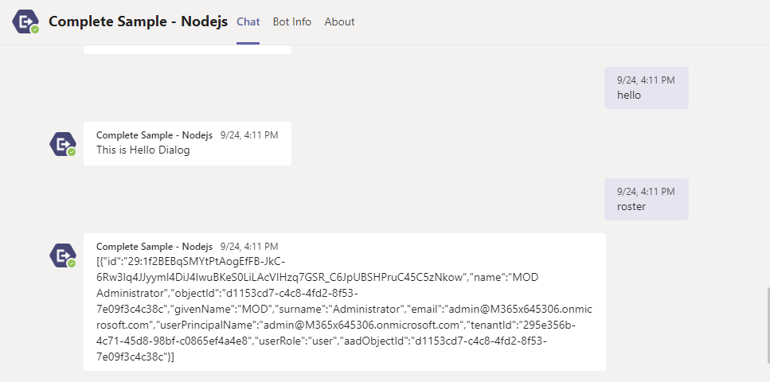
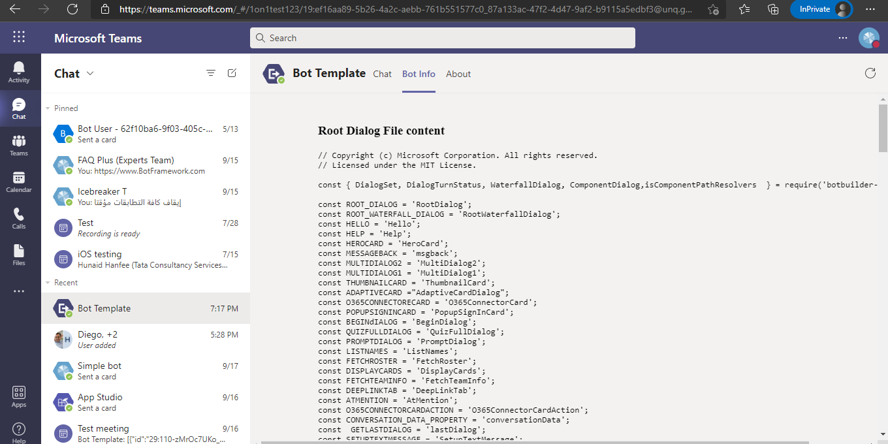
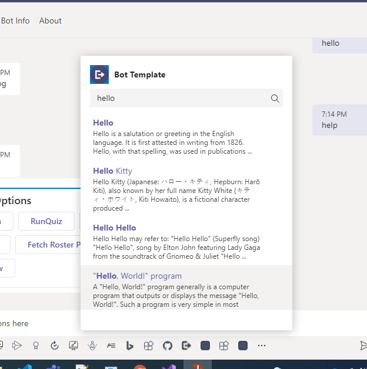
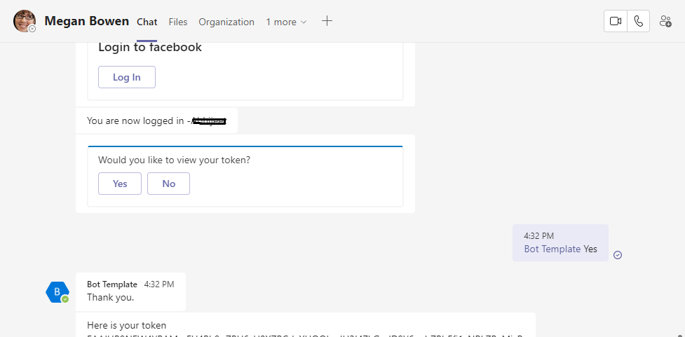

# Microsoft Teams Bot in Node.js

Sample that shows how to use dialog bot with bot sdk v4, messaging extension, facebook auth flow in Nodejs.

## Features of this sample










## Prerequisites

- [NodeJS](https://nodejs.org/en/)
- [ngrok](https://ngrok.com/) or equivalent tunnelling solution

## To try this sample

1) Clone the repository

    ```bash
    git clone https://github.com/OfficeDev/Microsoft-Teams-Samples.git
    ```

2) In a terminal, navigate to `samples/app-complete-sample/nodejs`

3) Install modules

    ```bash
    npm install
    ```

4) Run ngrok - point to port 3979

    ```bash
    ngrok http -host-header=rewrite 3979
    ```

5) Register a new bot (or update an existing one) with Bot Framework by using the full endpoint as the bot's "Messaging endpoint". Make sure to add Teams as a channel for the bot. Bot registration is here (open in a new browser tab): https://dev.botframework.com/bots

    > **NOTE**: When you create your bot you will create an App ID and App password - make sure you keep these for later.

   - Ensure that you've [enabled the Teams Channel](https://docs.microsoft.com/en-us/azure/bot-service/channel-connect-teams?view=azure-bot-service-4.0)

6) Once you have saved your bot and gotten the confirmation that it is created, navigate back to your  project. Open the ".env" file. There, copy/paste your App ID and App password from the step above.
    ```
    MicrosoftAppId=
    MicrosoftAppPassword=
    BaseUri=https://#####abc.ngrok.io
    ```

7) Run your bot at the command line:

    ```bash
    npm start
    ```

8) __*This step is specific to Teams.*__
- **Edit** the `manifest.json` contained in the  `appPackage` folder to replace your Microsoft App Id (that was created when you registered your bot earlier) *everywhere* you see the place holder string `<<REGISTERED_BOT_ID>>` (depending on the scenario the Microsoft App Id may occur multiple times in the `manifest.json`)and ngrok url *everywhere* you see the place holder string `<<BASE_URI>>`
- **Zip** up the contents of the `Manifest` folder to create a `manifest.zip`
- **Upload** the `manifest.zip` to Teams (in the Apps view click "Upload a custom app") 

9) To test facebook auth flow [create a facebookapp](https://docs.microsoft.com/en-us/azure/bot-service/bot-service-channel-connect-facebook?view=azure-bot-service-4.0) and get client id and secret for facebook app.
Now go to your bot channel registartion -> configuration -> Add OAuth connection string
- Provide connection Name : for eg `facebookconnection`
- Select service provider ad `facebook`
- Add clientid and secret of your facebook app that was created using Step 9.
 
Open the ".env" file in the project and add connection name which we have provided in bot channel registration
E.g. ConnectionName = facebookconnection
 
## Overview

This project is meant to help a Teams developer in two ways.  First, it is meant to show many examples of how an app can integrate into Teams.  Second, it is meant to give a set of patterns, templates, and tools that can be used as a starting point for creating a larger, scalable, more enterprise level bot to work within Teams.  Although this project focuses on creating a robust bot, it does include simples examples of tabs as well as examples of how a bot can give links into these tabs.

## What it is

At a high level, this project is written in TypeScript, built to run a Node server, uses Gulp to run its build steps, runs a TypeScript linting tool to keep the code uniform, and uses the BotFramework to handle the bot's requests and responses.  This project is designed to be run in VSCode using its debugger in order to leverage breakpoints in TypeScript.  Most directories will hold a README file which will describe what the files within that directory do. 

The easiest way to get started is to follow the steps listed in the "Steps to get started running the Bot Emulator". Once this is complete and running, the easiest way to add your own content is to create a new dialog in src/dialogs by copying one from src/dialogs/examples, change it accordingly, and then instantiate it with the others in the RootDialog.ts.

## Files and Directories

* **manifest**<br><br>
This directory holds the skeleton of a manifest.json file that can be altered in order sideload this application into a team.

* **public and views**<br><br>
This directory holds static html, image, and javascript files used by the tabs and bot.  This is not the only public directory that is used for the tabs, though.  This directory holds the html and javascript used for the configuration page of the configurable tab.  The main content of the static and configurable tabs is created dynamically by the code in src/tab/TabSetup.ts or comes from the static files placed in build/src/public/exampleDialogs, which are created at build time based upon the TypeScript dialogs in src/dialogs/examples.

* **src**<br><br>
This directory holds all of the TypeScript files, which run the entire application.  These files, at build, are transpiled and their transpiled javascript files are placed in the build directory.

## Contributing

This project has adopted the [Microsoft Open Source Code of Conduct](https://opensource.microsoft.com/codeofconduct/). For more information see the [Code of Conduct FAQ](https://opensource.microsoft.com/codeofconduct/faq/) or contact [opencode@microsoft.com](mailto:opencode@microsoft.com) with any additional questions or comments.
