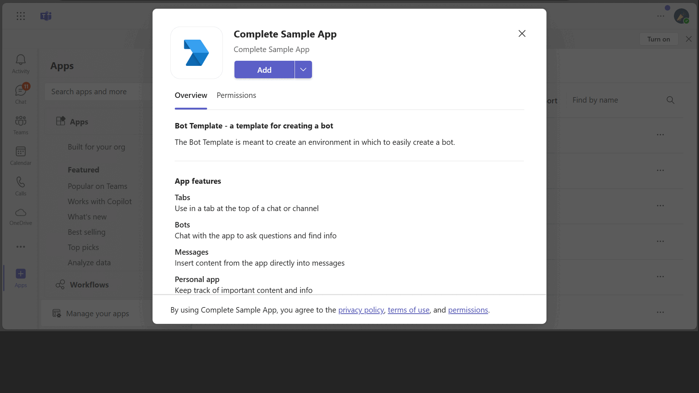

# Microsoft Teams Bot in Node.js

Sample that shows how to use dialog bot with bot sdk v4, messaging extension, facebook auth flow in Nodejs.

## Included Features
* Bots
* Tabs
* Messaging Extensions
* Adaptive Cards
* Facebook Authentication (bots)

## Interaction with app


## Try it yourself - experience the App in your Microsoft Teams client
Please find below demo manifest which is deployed on Microsoft Azure and you can try it yourself by uploading the app package (.zip file link below) to your teams and/or as a personal app. (Sideloading must be enabled for your tenant, [see steps here](https://docs.microsoft.com/microsoftteams/platform/concepts/build-and-test/prepare-your-o365-tenant#enable-custom-teams-apps-and-turn-on-custom-app-uploading)).

**Microsoft Teams Bot:** [Manifest](/samples/app-complete-sample/csharp/demo-manifest/Complete-Sample.zip)

## Prerequisites

- [NodeJS](https://nodejs.org/en/)
- [dev tunnel](https://learn.microsoft.com/en-us/azure/developer/dev-tunnels/get-started?tabs=windows) or [ngrok](https://ngrok.com/) latest version or equivalent tunnelling solution
- [Teams Toolkit for VS Code](https://marketplace.visualstudio.com/items?itemName=TeamsDevApp.ms-teams-vscode-extension) or [TeamsFx CLI](https://learn.microsoft.com/microsoftteams/platform/toolkit/teamsfx-cli?pivots=version-one)

## Run the app (Using Teams Toolkit for Visual Studio Code)

The simplest way to run this sample in Teams is to use Teams Toolkit for Visual Studio Code.

1. Ensure you have downloaded and installed [Visual Studio Code](https://code.visualstudio.com/docs/setup/setup-overview)
1. Install the [Teams Toolkit extension](https://marketplace.visualstudio.com/items?itemName=TeamsDevApp.ms-teams-vscode-extension)
1. Select **File > Open Folder** in VS Code and choose this samples directory from the repo
1. Using the extension, sign in with your Microsoft 365 account where you have permissions to upload custom apps
1. Select **Debug > Start Debugging** or **F5** to run the app in a Teams web client.
1. In the browser that launches, select the **Add** button to install the app to Teams.
1. To test facebook auth flow [create a facebookapp](https://docs.microsoft.com/azure/bot-service/bot-service-channel-connect-facebook?view=azure-bot-service-4.0) and get client id and secret for facebook app.
    Now go to your bot channel registartion -> configuration -> Add OAuth connection string
   - Provide connection Name : for eg `FBConnectionName`

> If you do not have permission to upload custom apps (sideloading), Teams Toolkit will recommend creating and using a Microsoft 365 Developer Program account - a free program to get your own dev environment sandbox that includes Teams.

## To try this sample
1. Register a new application in the [Microsoft Entra ID – App Registrations](https://go.microsoft.com/fwlink/?linkid=2083908) portal.

2.  Register a bot with Azure Bot Service, following the instructions [here](https://docs.microsoft.com/azure/bot-service/bot-service-quickstart-registration?view=azure-bot-service-3.0).
   - Ensure that you've [enabled the Teams Channel](https://docs.microsoft.com/azure/bot-service/channel-connect-teams?view=azure-bot-service-4.0)
   - While registering the bot, use `https://<your_tunnel_domain>/api/messages` as the messaging endpoint.
 
 3. To test facebook auth flow [create a facebookapp](https://docs.microsoft.com/azure/bot-service/bot-service-channel-connect-facebook?view=azure-bot-service- 4.0) and get client id and secret for facebook app.
Now go to your bot channel registartion -> configuration -> Add OAuth connection string
- Provide connection Name : for eg `facebookconnection`
- Select service provider ad `facebook`
- Add clientid and secret of your facebook app that was created using Step 9.
 
Open the ".env" file in the project and add connection name which we have provided in bot channel registration
E.g. ConnectionName = facebookconnection

4. Run ngrok - point to port 3978

   ```bash
   ngrok http 3978 --host-header="localhost:3978"
   ```  

   Alternatively, you can also use the `dev tunnels`. Please follow [Create and host a dev tunnel](https://learn.microsoft.com/en-us/azure/developer/dev-tunnels/get-started?tabs=windows) and host the tunnel with anonymous user access command as shown below:

   ```bash
   devtunnel host -p 3978 --allow-anonymous
   ```

5. Clone the repository

    ```bash
    git clone https://github.com/OfficeDev/Microsoft-Teams-Samples.git
    ```

 - In a terminal, navigate to `samples/app-complete-sample/nodejs`
 
 - Once you have saved your bot and gotten the confirmation that it is created, navigate back to your  project. Open the ".env" file. There, copy/paste your App ID and App password from the step above.
    ```
    MicrosoftAppId=
    MicrosoftAppPassword=
    BaseUri=https://#####abc.ngrok-free.app
    ```
 - Install modules

    ```bash
    npm install
    ```
- Run your bot at the command line:

    ```bash
    npm start
    ```

5. Setup Manifest for Teams
- __*This step is specific to Teams.*__
    - **Edit** the `manifest.json` contained in the ./appManifest or ./appManifest_Hub folder folder to replace your Microsoft App Id (that was created when you registered your app registration earlier) *everywhere* you see the place holder string `{{Microsoft-App-Id}}` (depending on the scenario the Microsoft App Id may occur multiple times in the `manifest.json`)
    - **Edit** the `manifest.json` for `validDomains` and replace `{{domain-name}}` with base Url of your domain. E.g. if you are using ngrok it would be `https://1234.ngrok-free.app` then your domain-name will be `1234.ngrok-free.app` and if you are using dev tunnels then your domain will be like: `12345.devtunnels.ms`.
    - **Zip** up the contents of the `appManifest` or `appManifest_Hub` folder to create a `manifest.zip` (Make sure that zip file does not contains any subfolder otherwise you will get error while uploading your .zip package)
    		
  **Note:** If you want to test your app across multi hub like: Outlook/Office.com, please update the `manifest.json` in the `/appManifest_Hub` folder with the required values.

- Upload the manifest.zip to Teams (in the Apps view click "Upload a custom app")
   - Go to Microsoft Teams. From the lower left corner, select Apps
   - From the lower left corner, choose Upload a custom App
   - Go to your project directory, the ./appManifest folder, select the zip folder, and choose Open.
   - Select Add in the pop-up dialog box. Your app is uploaded to Teams.

**Note**: If you are facing any issue in your app, please uncomment [this](https://github.com/OfficeDev/Microsoft-Teams-Samples/blob/main/samples/app-complete-sample/nodejs/server/index.js#L53) line and put your debugger for local debug.
 
## Overview

This project is meant to help a Teams developer in two ways.  First, it is meant to show many examples of how an app can integrate into Teams.  Second, it is meant to give a set of patterns, templates, and tools that can be used as a starting point for creating a larger, scalable, more enterprise level bot to work within Teams.  Although this project focuses on creating a robust bot, it does include simples examples of tabs as well as examples of how a bot can give links into these tabs.

## What it is

At a high level, this project is written in TypeScript, built to run a Node server, uses Gulp to run its build steps, runs a TypeScript linting tool to keep the code uniform, and uses the BotFramework to handle the bot's requests and responses.  This project is designed to be run in VSCode using its debugger in order to leverage breakpoints in TypeScript.  Most directories will hold a README file which will describe what the files within that directory do. 

The easiest way to get started is to follow the steps listed in the "Steps to get started running the Bot Emulator". Once this is complete and running, the easiest way to add your own content is to create a new dialog in src/dialogs by copying one from src/dialogs/examples, change it accordingly, and then instantiate it with the others in the RootDialog.ts.

## Files and Directories

* **manifest**<br><br>
This directory holds the skeleton of a manifest.json file that can be altered in order sideload this application into a team.

* **public and views**<br><br>
This directory holds static html, image, and javascript files used by the tabs and bot.  This is not the only public directory that is used for the tabs, though.  This directory holds the html and javascript used for the configuration page of the configurable tab.  The main content of the static and configurable tabs is created dynamically by the code in src/tab/TabSetup.ts or comes from the static files placed in build/src/public/exampleDialogs, which are created at build time based upon the TypeScript dialogs in src/dialogs/examples.

* **src**<br><br>
This directory holds all of the TypeScript files, which run the entire application.  These files, at build, are transpiled and their transpiled javascript files are placed in the build directory.

## Running the sample


## Outlook on the web

- To view your app in Outlook on the web.

- Go to [Outlook on the web](https://outlook.office.com/mail/)and sign in using your dev tenant account.

**On the side bar, select More Apps. Your sideloaded app title appears among your installed apps**


**Select your app icon to launch and preview your app running in Outlook on the web**


**Select your app icon from message extension and find ward, it will show all options**


**Note:** Similarly, you can test your application in the Outlook desktop app as well.

## Office on the web

- To preview your app running in Office on the web.

- Log into office.com with test tenant credentials

**Select the Apps icon on the side bar. Your sideloaded app title appears among your installed apps**


**Select your app icon to launch your app in Office on the web**

 

**Note:** Similarly, you can test your application in the Office 365 desktop app as well.

## Contributing

This project has adopted the [Microsoft Open Source Code of Conduct](https://opensource.microsoft.com/codeofconduct/). For more information see the [Code of Conduct FAQ](https://opensource.microsoft.com/codeofconduct/faq/) or contact [opencode@microsoft.com](mailto:opencode@microsoft.com) with any additional questions or comments.

## Further reading

- [Bot Framework Documentation](https://docs.botframework.com)
- [Bot Basics](https://docs.microsoft.com/azure/bot-service/bot-builder-basics?view=azure-bot-service-4.0)
- [Authentication basics](https://docs.microsoft.com/microsoftteams/platform/concepts/authentication/authentication)
- [Extend Teams apps across Microsoft 365](https://learn.microsoft.com/microsoftteams/platform/m365-apps/overview)
- [Create facebook app for development](https://developers.facebook.com/docs/development/create-an-app/)

