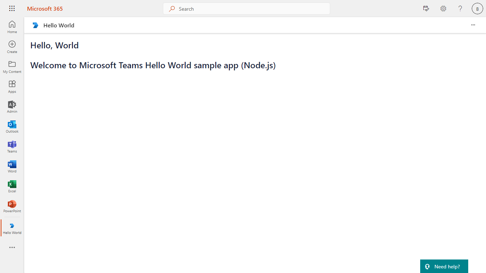

# Microsoft Teams hello world sample app.

- The Microsoft Teams Hello World application, built with .NET/C#, serves as an introductory sample showcasing fundamental Microsoft Teams capabilities, including tabs, bots, and messaging extensions. This application provides a hands-on experience for developers looking to explore the Teams platform and its integration options.

## Included Features
* Tabs
* Bots
* Messaging Extensions

## Interaction with app


## Try it yourself - experience the App in your Microsoft Teams client
Please find below demo manifest which is deployed on Microsoft Azure and you can try it yourself by uploading the app package (.zip file link below) to your teams and/or as a personal app. (Uploading must be enabled for your tenant, [see steps here](https://docs.microsoft.com/microsoftteams/platform/concepts/build-and-test/prepare-your-o365-tenant#enable-custom-teams-apps-and-turn-on-custom-app-uploading)).

**Microsoft Teams hello world sample app:** [Manifest](/samples/app-hello-world/csharp/demo-manifest/app-hello-world.zip)

## Prerequisites

- [.NET Core SDK](https://dotnet.microsoft.com/download) version 6.0

  ```bash
  # determine dotnet version
  dotnet --version
  ```
- Publicly addressable https url or tunnel such as [dev tunnel](https://learn.microsoft.com/en-us/azure/developer/dev-tunnels/get-started?tabs=windows) or [ngrok](https://ngrok.com/) latest version or [Tunnel Relay](https://github.com/OfficeDev/microsoft-teams-tunnelrelay)

## Run the app (Using Microsoft 365 Agents Toolkit for Visual Studio)

The simplest way to run this sample in Teams is to use Microsoft 365 Agents Toolkit for Visual Studio.
1. Install Visual Studio 2022 **Version 17.14 or higher** [Visual Studio](https://visualstudio.microsoft.com/downloads/)
1. Install Microsoft 365 Agents Toolkit for Visual Studio [Microsoft 365 Agents Toolkit extension](https://learn.microsoft.com/en-us/microsoftteams/platform/toolkit/toolkit-v4/install-teams-toolkit-vs?pivots=visual-studio-v17-7)
1. In the debug dropdown menu of Visual Studio, select Dev Tunnels > Create A Tunnel (set authentication type to Public) or select an existing public dev tunnel.
1. Right-click the 'M365Agent' project in Solution Explorer and select **Microsoft 365 Agents Toolkit > Select Microsoft 365 Account**
1. Sign in to Microsoft 365 Agents Toolkit with a **Microsoft 365 work or school account**
1. Set `Startup Item` as `Microsoft Teams (browser)`.
1. Press F5, or select Debug > Start Debugging menu in Visual Studio to start your app
</br>
1. In the opened web browser, select Add button to install the app in Teams
> If you do not have permission to upload custom apps (uploading), Microsoft 365 Agents Toolkit will recommend creating and using a Microsoft 365 Developer Program account - a free program to get your own dev environment sandbox that includes Teams.

## Setup
### Register your app with Azure AD.

  1. Register a new application in the [Microsoft Entra ID – App Registrations](https://go.microsoft.com/fwlink/?linkid=2083908) portal.
  2. Select **New Registration** and on the *register an application page*, set following values:
      * Set **name** to your app name.
      * Choose the **supported account types** (any account type will work)
      * Leave **Redirect URI** empty.
      * Choose **Register**.
  3. On the overview page, copy and save the **Application (client) ID, Directory (tenant) ID**. You'll need those later when updating your Teams application manifest and in the appsettings.json.
  4. Navigate to **API Permissions**, and make sure to add the follow permissions:
   Select Add a permission
      * Select Add a permission
      * Select Microsoft Graph -\> Delegated permissions.
      * `User.Read` (enabled by default)
      * Click on Add permissions. Please make sure to grant the admin consent for the required permissions.

### 1. Setup for Bot
- Register a bot with Azure Bot Service, following the instructions [here](https://docs.microsoft.com/azure/bot-service/bot-service-quickstart-registration?view=azure-bot-service-3.0).

- Ensure that you've [enabled the Teams Channel](https://docs.microsoft.com/azure/bot-service/channel-connect-teams?view=azure-bot-service-4.0)

- While registering the bot, use `https://<your_tunnel_domain>/api/messages` as the messaging endpoint.
    > NOTE: When you create your bot you will create an App ID and App password - make sure you keep these for later.

### 2. Setup NGROK
1) Run ngrok - point to port 5000

    ```bash
    ngrok http 5000 --host-header="localhost:5000"
    ```
   Alternatively, you can also use the `dev tunnels`. Please follow [Create and host a dev tunnel](https://learn.microsoft.com/en-us/azure/developer/dev-tunnels/get-started?tabs=windows) and host the tunnel with anonymous user access command as shown below:

   ```bash
   devtunnel host -p 5000 --allow-anonymous
   ```

### 3. Setup for code
- Clone the repository

    ```bash
    git clone https://github.com/OfficeDev/Microsoft-Teams-Samples.git
    ```
 Run the bot from a terminal or from Visual Studio:

  A) From a terminal, navigate to `Microsoft.Teams.Samples.HelloWorld.Web`

  ```bash
  # run the bot
  dotnet run
  ```

  B) Or from Visual Studio

  - Launch Visual Studio
  - File -> Open -> Project/Solution
  - Navigate to `Microsoft.Teams.Samples.HelloWorld.Web` folder
  - Select `Microsoft.Teams.Samples.HelloWorld.Web.csproj` file
  - Press `F5` to run the project   


### 4. Setup Manifest for Teams

- **This step is specific to Teams.**

1) Modify the `manifest.json` in the `/AppManifest` folder and replace the following details:
  - `{{Microsoft-App-Id}}` with Application id generated from Step 1
  - `{{domain-name}}` with base Url domain. E.g. if you are using ngrok it would be `1234.ngrok-free.app` and if you are using dev tunnels then your domain will be like: `12345.devtunnels.ms`.

  **Note:** If you want to test your app across multi hub like: Outlook/Office.com, please update the `manifest.json` in the `/AppManifest_Hub` folder with the required values.

2) Zip the contents of `appPackage` or `AppManifest_Hub` folder into a `manifest.zip`.

3) Modify the `/appsettings.json` and fill in the following details:
  - `{{Microsoft-App-Id}}` - Generated from Step 1 is the application app id
  - `{{ Microsoft-App-Password}}` - Generated from Step 1, also referred to as Client secret
  - `{{ Application Base Url }}` - Your application's base url. E.g. https://12345.ngrok-free.app if you are using ngrok and if you are using dev tunnels, your URL will be https://12345.devtunnels.ms.
  
5) Upload the manifest.zip to Teams (in the Apps view click "Upload a custom app")
   - Go to Microsoft Teams. From the lower left corner, select Apps
   - From the lower left corner, choose Upload a custom App
   - Go to your project directory, the ./appPackage folder, select the zip folder, and choose Open.
   - Select Add in the pop-up dialog box. Your app is uploaded to Teams.

This app has a default landing capability that determines whether the opening scope is set to the Bot or a static tab. Without configuring this, Microsoft Teams defaults to landing on the bot in desktop clients and tab in mobile clients.

To set the **Bot as the default landing capability**, configure the 'staticTabs' section in the manifest as follows:
```bash
"staticTabs": [
  {
    "entityId": "conversations",
    "scopes": [
      "personal"
    ]
  },
  {
    "entityId": "com.contoso.helloworld.hellotab",
    "name": "Hello Tab",
    "contentUrl": "https://${{BOT_DOMAIN}}/hello",
    "scopes": [
      "personal"
    ]
  }
],
```

To set the **Tab as the default landing capability**, configure the 'staticTabs' section in the manifest as follows:
```bash
"staticTabs": [
  {
    "entityId": "com.contoso.helloworld.hellotab",
    "name": "Hello Tab",
    "contentUrl": "https://${{BOT_DOMAIN}}/hello",
    "scopes": [
      "personal"
    ]
  },
  {
    "entityId": "conversations",
    "scopes": [
      "personal"
    ]
  }
],
```

**Note**: If you are facing any issue in your app, please uncomment [this](https://github.com/OfficeDev/Microsoft-Teams-Samples/blob/main/samples/app-hello-world/csharp/Microsoft.Teams.Samples.HelloWorld.Web/AdapterWithErrorHandler.cs#L24) line and put your debugger for local debug.

## Running the sample

**Install App:**


**Welcome Bot:**


**Welcome UI:**


## Outlook on the web

- To view your app in Outlook on the web.

- Go to [Outlook on the web](https://outlook.office.com/mail/)and sign in using your dev tenant account.

**On the side bar, select More Apps. Your uploaded app title appears among your installed apps**


**Select your app icon to launch and preview your app running in Outlook on the web**


**Note:** Similarly, you can test your application in the Outlook desktop app as well.

## Office on the web

- To preview your app running in Office on the web.

- Log into office.com with test tenant credentials

**Select the Apps icon on the side bar. Your uploaded app title appears among your installed apps**


**Select your app icon to launch your app in Office on the web**

 

**Note:** Similarly, you can test your application in the Office 365 desktop app as well.

## Deploy the bot to Azure

To learn more about deploying a bot to Azure, see [Deploy your bot to Azure](https://aka.ms/azuredeployment) for a complete list of deployment instructions.

## Further reading

- [Bot Framework Documentation](https://docs.botframework.com)
- [Bot Basics](https://docs.microsoft.com/azure/bot-service/bot-builder-basics?view=azure-bot-service-4.0)
- [Azure Bot Service Introduction](https://docs.microsoft.com/azure/bot-service/bot-service-overview-introduction?view=azure-bot-service-4.0)
- [Azure Bot Service Documentation](https://docs.microsoft.com/azure/bot-service/?view=azure-bot-service-4.0)
- [Extend Teams apps across Microsoft 365](https://learn.microsoft.com/en-us/microsoftteams/platform/m365-apps/overview)

