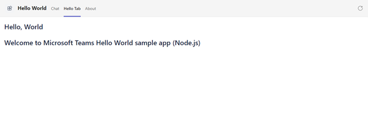

# Interaction with app



## Prerequisites

- Microsoft Teams is installed and you have an account (not a guest account)
-  [NodeJS](https://nodejs.org/en/)
-  [ngrok](https://ngrok.com/download) or equivalent tunneling solution
-  [M365 developer account](https://docs.microsoft.com/en-us/microsoftteams/platform/concepts/build-and-test/prepare-your-o365-tenant) or access to a Teams account with the 
   appropriate permissions to install an app.

## Setup

1. Register a new application in the [Azure Active Directory – App Registrations](https://go.microsoft.com/fwlink/?linkid=2083908) portal.

2. Setup for Bot
In Azure portal, create a [Azure Bot resource](https://docs.microsoft.com/en-us/azure/bot-service/bot-builder-authentication?view=azure-bot-service-4.0&tabs=csharp%2Caadv2).
- Ensure that you've [enabled the Teams Channel](https://docs.microsoft.com/en-us/azure/bot-service/channel-connect-teams?view=azure-bot-service-4.0)
- While registering the bot, use `https://<your_ngrok_url>/api/messages` as the messaging endpoint.
**NOTE:** When you create your bot you will create an App ID and App password - make sure you keep these for later.

3. Setup NGROK
  Run ngrok - point to port 3978

    ```bash
    ngrok http -host-header=rewrite 3978
    ```

4. Setup for code

  - Clone the repository
    ```bash
    git clone https://github.com/OfficeDev/Microsoft-Teams-Samples.git
    ```

   - In a terminal, navigate to  `samples/app-hello-world/nodejs`
   
  - Install modules
   
    ```bash
    npm install
    ```

  - Run your app
  
    ```bash
    npm start
    ```
 5. Setup Manifest for Teams

- **This step is specific to Teams.**
    - Edit the `manifest.json` contained in the `src/` folder to replace with your MicrosoftAppId (that was created in step1.1 and is the same value of MicrosoftAppId ) *everywhere* you see the place holder string `{MicrosoftAppId}` (depending on the scenario the Microsoft App Id may occur multiple times in the `manifest.json`)
    - Zip up the contents of the `src/` folder to create a `manifest.zip`
    - Upload the `manifest.zip` to Teams (in the left-bottom *Apps* view, click "Upload a custom app")
    
 ## Deploy the bot to Azure

To learn more about deploying a bot to Azure, see [Deploy your bot to Azure](https://aka.ms/azuredeployment) for a complete list of deployment instructions.

## Further reading

- [Bot Framework Documentation](https://docs.botframework.com)
- [Bot Basics](https://docs.microsoft.com/azure/bot-service/bot-builder-basics?view=azure-bot-service-4.0)
- [Azure Portal](https://portal.azure.com)
- [Add Authentication to Your Bot Via Azure Bot Service](https://docs.microsoft.com/en-us/azure/bot-service/bot-builder-authentication?view=azure-bot-service-4.0&tabs=csharp)
