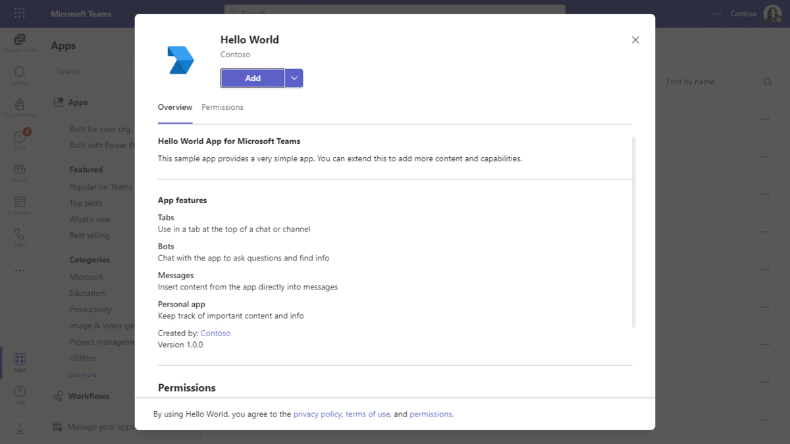
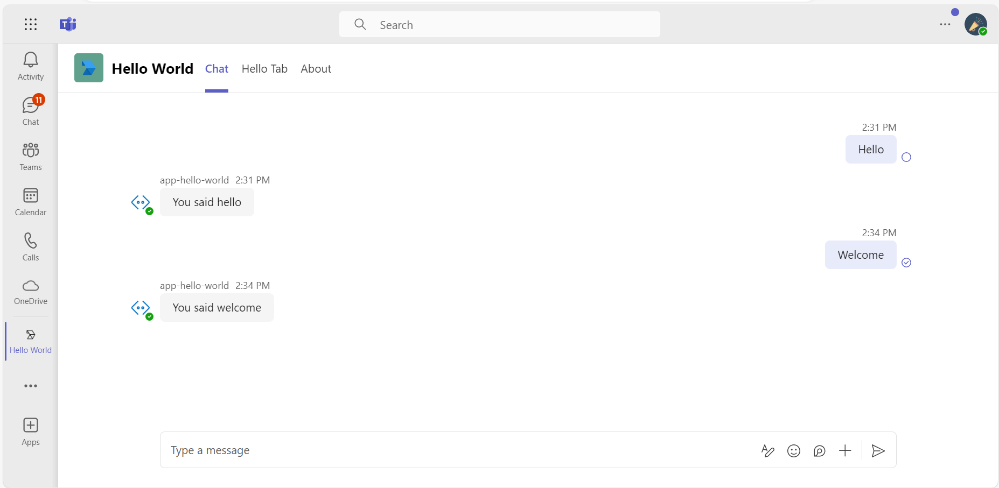
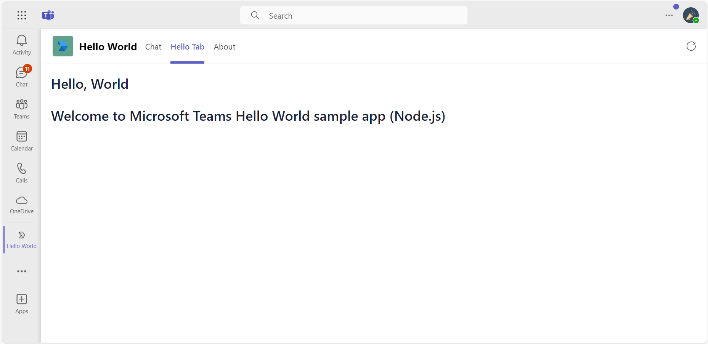
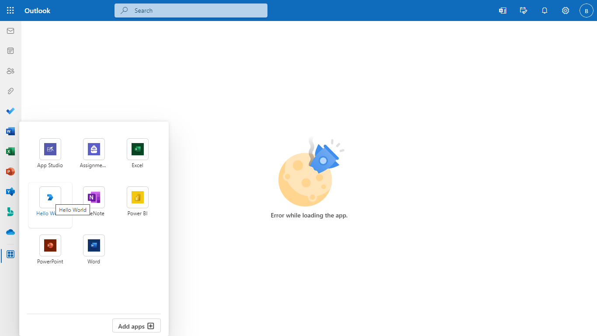
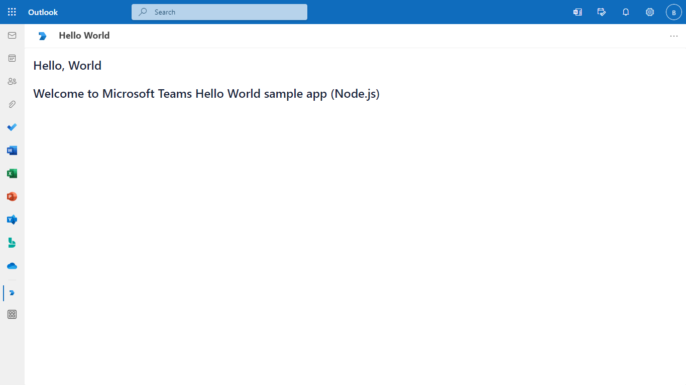
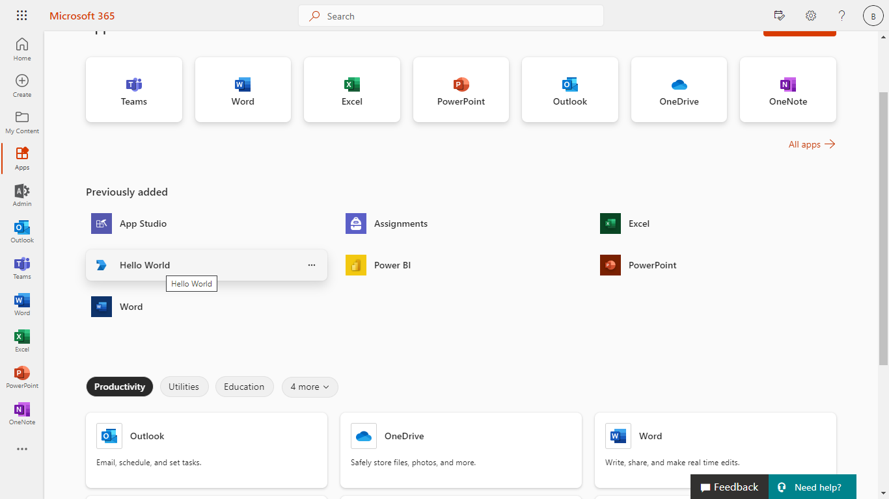
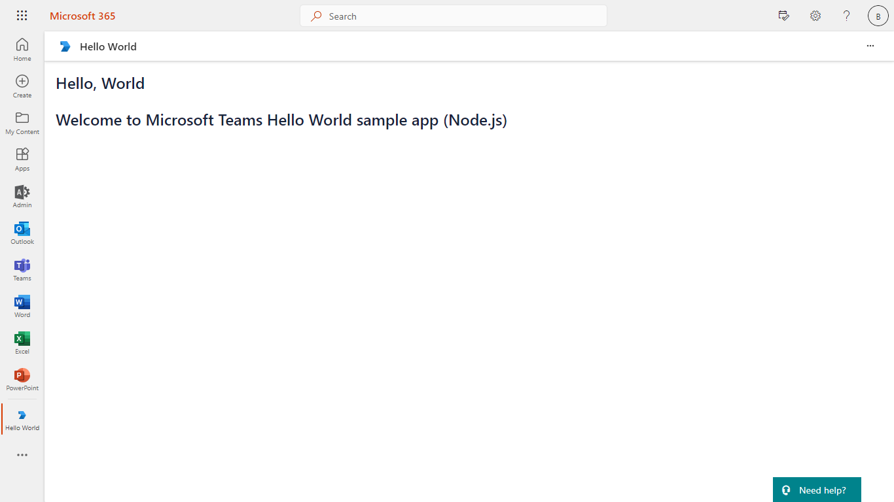

# Microsoft Teams hello world sample app.

- Microsoft Teams hello world sample app.

## Included Features
* Tabs
* Bots
* Messaging Extensions

## Interaction with app



## Try it yourself - experience the App in your Microsoft Teams client
Please find below demo manifest which is deployed on Microsoft Azure and you can try it yourself by uploading the app package (.zip file link below) to your teams and/or as a personal app. (Sideloading must be enabled for your tenant, [see steps here](https://docs.microsoft.com/microsoftteams/platform/concepts/build-and-test/prepare-your-o365-tenant#enable-custom-teams-apps-and-turn-on-custom-app-uploading)).

**Microsoft Teams hello world sample app:** [Manifest](/samples/app-hello-world/csharp/demo-manifest/app-hello-world.zip)

## Prerequisites

-  Microsoft Teams is installed and you have an account (not a guest account)

-  To test locally, [NodeJS](https://nodejs.org/en/download/) must be installed on your development machine (version 16.14.2  or higher)

-  [dev tunnel](https://learn.microsoft.com/en-us/azure/developer/dev-tunnels/get-started?tabs=windows) or [ngrok](https://ngrok.com/) latest version or equivalent tunneling solution

-  [M365 developer account](https://docs.microsoft.com/microsoftteams/platform/concepts/build-and-test/prepare-your-o365-tenant) or access to a Teams account with the appropriate permissions to install an app.

- [Teams Toolkit for VS Code](https://marketplace.visualstudio.com/items?itemName=TeamsDevApp.ms-teams-vscode-extension) or [TeamsFx CLI](https://learn.microsoft.com/microsoftteams/platform/toolkit/teamsfx-cli?pivots=version-one)

## Run the app (Using Teams Toolkit for Visual Studio Code)

The simplest way to run this sample in Teams is to use Teams Toolkit for Visual Studio Code.

1. Ensure you have downloaded and installed [Visual Studio Code](https://code.visualstudio.com/docs/setup/setup-overview)
1. Install the [Teams Toolkit extension](https://marketplace.visualstudio.com/items?itemName=TeamsDevApp.ms-teams-vscode-extension)
1. Select **File > Open Folder** in VS Code and choose this samples directory from the repo
1. Using the extension, sign in with your Microsoft 365 account where you have permissions to upload custom apps
1. Select **Debug > Start Debugging** or **F5** to run the app in a Teams web client.
1. In the browser that launches, select the **Add** button to install the app to Teams.

> If you do not have permission to upload custom apps (sideloading), Teams Toolkit will recommend creating and using a Microsoft 365 Developer Program account - a free program to get your own dev environment sandbox that includes Teams.

## Run the app (Manually Uploading to Teams)

> Note these instructions are for running the sample on your local machine, the tunnelling solution is required because
> the Teams service needs to call into the bot.

### 1. Setup for Bot
- In Azure portal, create a [Azure Bot resource](https://docs.microsoft.com/azure/bot-service/bot-builder-authentication?view=azure-bot-service-4.0&tabs=csharp%2Caadv2)

- Ensure that you've [enabled the Teams Channel](https://docs.microsoft.com/azure/bot-service/channel-connect-teams?view=azure-bot-service-4.0)

- While registering the bot, use `https://<your_tunnel_domain>/api/messages` as the messaging endpoint.
    > NOTE: When you create your bot you will create an App ID and App password - make sure you keep these for later.

### 2. Setup NGROK
1) Run ngrok - point to port 3333

    ```bash
    ngrok http 3333 --host-header="localhost:3333"
    ```
   Alternatively, you can also use the `dev tunnels`. Please follow [Create and host a dev tunnel](https://learn.microsoft.com/en-us/azure/developer/dev-tunnels/get-started?tabs=windows) and host the tunnel with anonymous user access command as shown below:

   ```bash
   devtunnel host -p 3333 --allow-anonymous
   ```

### 3. Setup for code
1) Clone the repository

    ```bash
    git clone https://github.com/OfficeDev/Microsoft-Teams-Samples.git
    ```
2) In a terminal, navigate to `samples/app-hello-world/nodejs`

3) Install modules

    ```bash
    npm install
    ```

4) Update the `custom-environment-variables` configuration for the bot to use the `MicrosoftAppId` and `MicrosoftAppPassword`, `BaseUrl` with application base url.

5) Update the `default` configuration for the bot to use the `appId` and `appPassword`.

5) Run your app

    ```bash
    npm start
    ```
### 4. Setup Manifest for Teams

 - **This step is specific to Teams.**

    - **Edit** the `manifest.json` contained in the `app-hello-world/nodejs/appManifest` folder to replace your Microsoft App Id (that was created when you registered your bot earlier) *everywhere* you see the place holder string `<<Your Microsoft App Id>>` (depending on the scenario the Microsoft App Id may occur multiple times in the `manifest.json`)
    - **Edit** the `manifest.json` for `configurationUrl` inside `configurableTabs` and `validDomains`. Replace `{{domain-name}}` with base Url domain. E.g. if you are using ngrok it would be `https://1234.ngrok-free.app` then your domain-name will be `1234.ngrok-free.app` and if you are using dev tunnels then your domain will be like: `12345.devtunnels.ms`.
    
    **Note:** If you want to test your app across multi hub like: Outlook/Office.com, please update the `manifest.json` in the `app-hello-world/nodejs/appManifest_Hub` folder with the required values.

    - **Zip** up the contents of the `app-hello-world/nodejs/appManifest` folder to create a `manifest.zip` or `app-hello-world/nodejs/appManifest_Hub` folder into a `Manifest_Hub.zip`.(Make sure that zip file does not contains any subfolder otherwise you will get error while uploading your .zip package)
    - **Upload** the `manifest.zip` to Teams (In Teams Apps/Manage your apps click "Upload an app". Browse to and Open the .zip file. At the next dialog, click the Add button.)
    - Add the app to personal/team/groupChat scope (Supported scopes)

**Note**: If you are facing any issue in your app, please uncomment [this](https://github.com/OfficeDev/Microsoft-Teams-Samples/blob/main/samples/app-hello-world/nodejs/src/bot.js#L38) line and put your debugger for local debug.

## Running the sample

**Install App:**


**Hello World Bot:**



**Hello Wrold Tab:**



## Outlook on the web

- To view your app in Outlook on the web.

- Go to [Outlook on the web](https://outlook.office.com/mail/)and sign in using your dev tenant account.

**On the side bar, select More Apps. Your sideloaded app title appears among your installed apps**



**Select your app icon to launch and preview your app running in Outlook on the web**



**Note:** Similarly, you can test your application in the Outlook desktop app as well.

## Office on the web

- To preview your app running in Office on the web.

- Log into office.com with test tenant credentials

**Select the Apps icon on the side bar. Your sideloaded app title appears among your installed apps**



**Select your app icon to launch your app in Office on the web**



**Note:** Similarly, you can test your application in the Office 365 desktop app as well.

## Deploy the bot to Azure

To learn more about deploying a bot to Azure, see [Deploy your bot to Azure](https://aka.ms/azuredeployment) for a complete list of deployment instructions.

## Further reading

- [Bot Framework Documentation](https://docs.botframework.com)
- [Bot Basics](https://docs.microsoft.com/azure/bot-service/bot-builder-basics?view=azure-bot-service-4.0)
- [Azure Bot Service Introduction](https://docs.microsoft.com/azure/bot-service/bot-service-overview-introduction?view=azure-bot-service-4.0)
- [Azure Bot Service Documentation](https://docs.microsoft.com/azure/bot-service/?view=azure-bot-service-4.0)
- [Extend Teams apps across Microsoft 365](https://learn.microsoft.com/en-us/microsoftteams/platform/m365-apps/overview)

