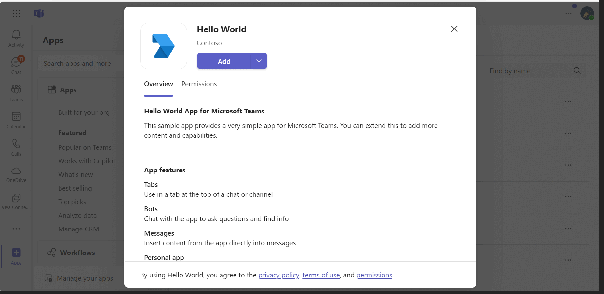

```markdown
---
page_type: sample
products:
- office-365
languages:
- javascript
title: Microsoft Teams NodeJS HelloWorld Sample
description: Explore a comprehensive Microsoft Teams hello world sample app built with Node.js, demonstrating key features such as tabs, bots, and messaging extensions.
extensions:
  contentType: samples
  createdDate: 10/19/2022 10:02:21 PM
urlFragment: officedev-microsoft-teams-samples-app-hello-world-nodejs
---

# Microsoft Teams HelloWorld Sample App

This HelloWorld sample app demonstrates the core features of Microsoft Teams using Node.js, including tabs, bots, and messaging extensions.

## Features Included

- Tabs
- Bots
- Messaging Extensions

## App Interaction



## Experience the App

Try the app in your Microsoft Teams client using the demo manifest deployed on Microsoft Azure. Upload the app package [.zip file](/samples/app-hello-world/csharp/demo-manifest/app-hello-world.zip) as a personal app or within your teams. Ensure [sideloading is enabled for your tenant](https://docs.microsoft.com/microsoftteams/platform/concepts/build-and-test/prepare-your-o365-tenant#enable-custom-teams-apps-and-turn-on-custom-app-uploading).

## Prerequisites

- Microsoft Teams installed with an account (not a guest account).
- NodeJS (version 16.14.2 or higher) installed on your development machine.
- [Dev Tunnel](https://learn.microsoft.com/en-us/azure/developer/dev-tunnels/get-started?tabs=windows) or [ngrok](https://ngrok.com/) or a similar tunneling solution.
- [M365 developer account](https://docs.microsoft.com/microsoftteams/platform/concepts/build-and-test/prepare-your-o365-tenant) or access to a Teams account with permissions to install apps.
- [Teams Toolkit for VS Code](https://marketplace.visualstudio.com/items?itemName=TeamsDevApp.ms-teams-vscode-extension) or [TeamsFx CLI](https://learn.microsoft.com/microsoftteams/platform/toolkit/teamsfx-cli?pivots=version-one).

## Run the App with Teams Toolkit for Visual Studio Code

Simplify your experience by using the Teams Toolkit for Visual Studio Code.

1. Install [Visual Studio Code](https://code.visualstudio.com/docs/setup/setup-overview).
2. Install [Teams Toolkit extension](https://marketplace.visualstudio.com/items?itemName=TeamsDevApp.ms-teams-vscode-extension).
3. Open this sample's directory using **File > Open Folder** in VS Code.
4. Sign in with your Microsoft 365 account with permissions to upload custom apps using the extension.
5. Select **Debug > Start Debugging** or press **F5** to launch the app in a browser for Teams integration.
6. Click the **Add** button to install the app in Teams.

> If custom app uploading is unavailable, consider getting a [Microsoft 365 Developer Program account](https://developer.microsoft.com/en-us/microsoft-365/dev-program).

## Run the App (Manual Upload to Teams)

> Teams requires a tunnelling solution for local machine runs to communicate with the bot.

### Step-by-Step Guide

#### 1. Bot Setup
- Create an [Azure Bot resource](https://docs.microsoft.com/azure/bot-service/bot-builder-authentication?view=azure-bot-service-4.0&tabs=csharp%2Caadv2) in the Azure portal.
- [Enable the Teams Channel](https://docs.microsoft.com/azure/bot-service/channel-connect-teams?view=azure-bot-service-4.0).
- Use `https://<your_tunnel_domain>/api/messages` as the messaging endpoint while registering the bot.

#### 2. NGROK Setup
Run ngrok pointing to port 3333:

```bash
ngrok http 3333 --host-header="localhost:3333"
```

Alternatively, use Dev Tunnels:

```bash
devtunnel host -p 3333 --allow-anonymous
```

#### 3. Code Setup

1. Clone the repository:

    ```bash
    git clone https://github.com/OfficeDev/Microsoft-Teams-Samples.git
    ```

2. Navigate to `samples/app-hello-world/nodejs`.
3. Install modules:

    ```bash
    npm install
    ```

4. Update `custom-environment-variables` and `default` for bot App ID, App Password, and Base URL.
5. Run the app:

    ```bash
    npm start
    ```

#### 4. Teams Manifest Setup

- Edit `manifest.json` in `app-hello-world/nodejs/appManifest`. Update placeholders with your App ID.
- Adjust `configurationUrl` in `configurableTabs` and replace `{{domain-name}}` with your base URL domain.

**Scenario Examples:**

1. For NGROK: `https://1234.ngrok-free.app`
2. For Dev Tunnels: `12345.devtunnels.ms`

- Zip contents into `manifest.zip` or `Manifest_Hub.zip` for Office multiple hub environment testing.
- Upload `manifest.zip` to Teams in Teams Apps > Manage your apps and click "Upload an app".
  
> Set the default landing capability in the manifest configuration:
  
- **Bot Default:**
  ```json
  "staticTabs": [
    {"entityId": "conversations", "scopes": ["personal"]},
    {"entityId": "com.contoso.helloworld.hellotab", "name": "Hello Tab", "contentUrl": "https://${{BOT_DOMAIN}}/hello", "scopes": ["personal"]}
  ]
  ```

- **Tab Default:**
  ```json
  "staticTabs": [
    {"entityId": "com.contoso.helloworld.hellotab", "name": "Hello Tab", "contentUrl": "https://${{BOT_DOMAIN}}/hello", "scopes": ["personal"]},
    {"entityId": "conversations", "scopes": ["personal"]}
  ]
  ```

> Tip: If encountering issues, activate debugging by commenting the [specific line](https://github.com/OfficeDev/Microsoft-Teams-Samples/blob/main/samples/app-hello-world/nodejs/src/bot.js#L38).

## Usage

### Install the App


### HelloWorld Bot Feature


### HelloWorld Tab Feature


## Additional Applications

### Outlook on the Web

Access via [Outlook on the web](https://outlook.office.com/mail/).

- Select **More Apps** to find installed apps including your sideloaded app.
  


- Launch your app by selecting its icon.


> Desktop testing is also available.

### Office on the Web

Preview your app on [office.com](https://office.com).

- Use test tenant credentials for login.
- Find your installed app under **Apps** on the sidebar.


- Launch your app via its icon.


> Desktop testing available on the Office 365 app.

## Deploy the Bot to Azure

For deploying your bot to Azure, refer to [Deploy your bot to Azure](https://aka.ms/azuredeployment) for detailed instructions.

## Additional Resources

- [Bot Framework Documentation](https://docs.botframework.com)
- [Bot Basics](https://docs.microsoft.com/azure/bot-service/bot-builder-basics?view=azure-bot-service-4.0)
- [Azure Bot Service Introduction](https://docs.microsoft.com/azure/bot-service/bot-service-overview-introduction?view=azure-bot-service-4.0)
- [Azure Bot Service Documentation](https://docs.microsoft.com/azure/bot-service/?view=azure-bot-service-4.0)
- [Extend Teams apps across Microsoft 365](https://learn.microsoft.com/en-us/microsoftteams/platform/m365-apps/overview)


```