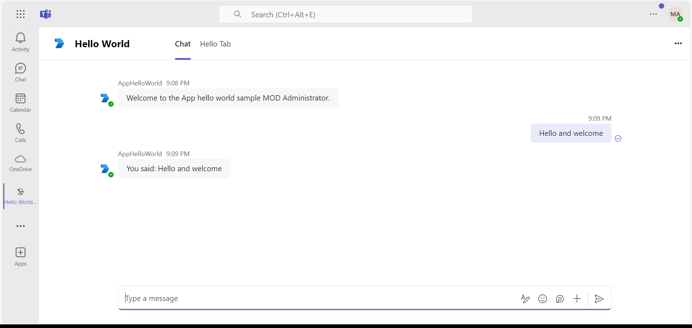
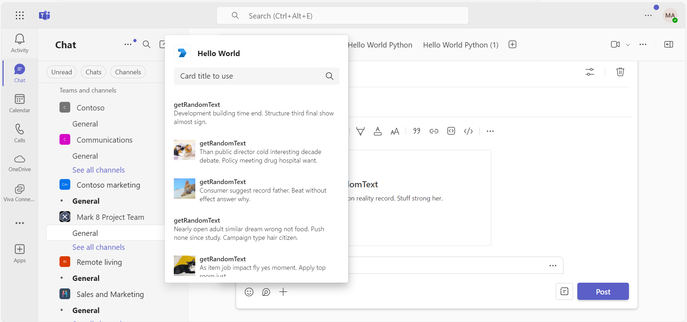
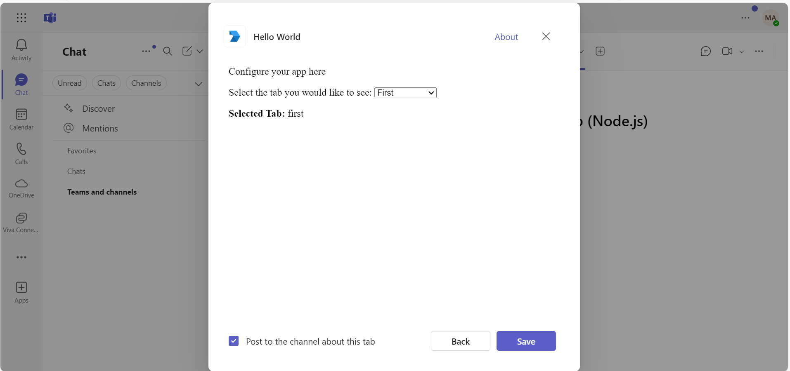
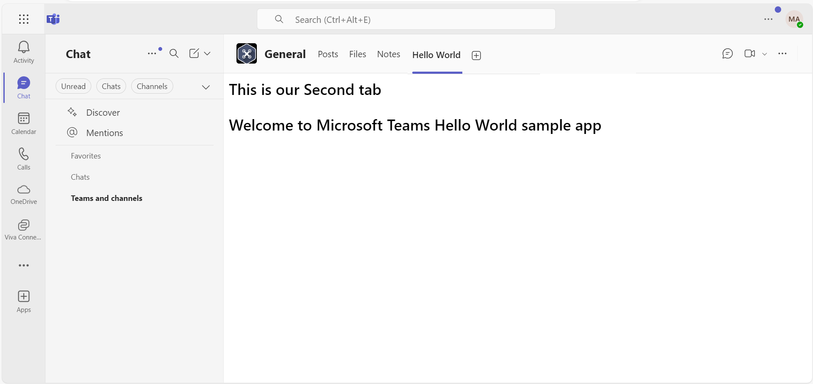
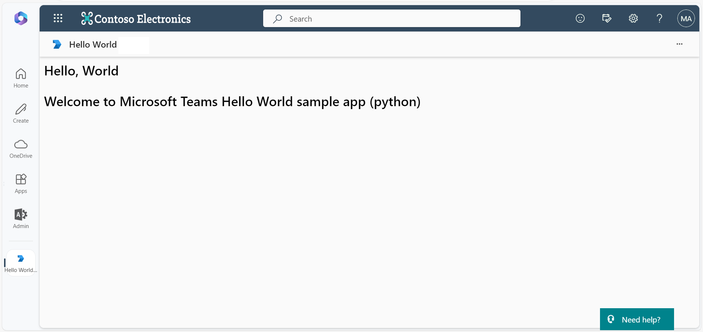

# Microsoft Teams hello world sample app.

The Microsoft Teams Python "Hello World" Sample app is a comprehensive demonstration of essential Microsoft Teams features built using Python. This sample highlights the core functionalities of Teams, such as tabs, bots, and messaging extensions, making it an excellent starting point for developers interested in creating robust Teams apps.

With this sample, users can:
- Experience a personal scope bot interaction.
- Explore static and configurable tabs for rich in-app content.
- Utilize messaging extensions for seamless content sharing within Teams.

## Included Features
* Tabs
* Bots
* Messaging Extensions
* Agents SDK

## Interaction with app



## Try it yourself - experience the App in your Microsoft Teams client
Please find below demo manifest which is deployed on Microsoft Azure and you can try it yourself by uploading the app package (.zip file link below) to your teams and/or as a personal app. (Uploading must be enabled for your tenant, [see steps here](https://docs.microsoft.com/microsoftteams/platform/concepts/build-and-test/prepare-your-o365-tenant#enable-custom-teams-apps-and-turn-on-custom-app-uploading)).

**Microsoft Teams hello world sample app:** [Manifest](/samples/app-hello-world/csharp/demo-manifest/app-hello-world.zip)

## Prerequisites

- Microsoft Teams is installed and you have an account
- [Python SDK](https://www.python.org/downloads/) min version 3.8
- [dev tunnel](https://learn.microsoft.com/en-us/azure/developer/dev-tunnels/get-started?tabs=windows) or [ngrok](https://ngrok.com/) latest version or equivalent tunnelling solution
-  [M365 developer account](https://docs.microsoft.com/microsoftteams/platform/concepts/build-and-test/prepare-your-o365-tenant) or access to a Teams account with the appropriate permissions to install an app.
- [Microsoft 365 Agents Toolkit for VS Code](https://marketplace.visualstudio.com/items?itemName=TeamsDevApp.ms-teams-vscode-extension) or [TeamsFx CLI](https://learn.microsoft.com/microsoftteams/platform/toolkit/teamsfx-cli?pivots=version-one)

## Run the app (Using Microsoft 365 Agents Toolkit for Visual Studio Code)

The simplest way to run this sample in Teams is to use Microsoft 365 Agents Toolkit for Visual Studio Code.

1. Ensure you have downloaded and installed [Visual Studio Code](https://code.visualstudio.com/docs/setup/setup-overview)
1. Install the [Microsoft 365 Agents Toolkit extension](https://marketplace.visualstudio.com/items?itemName=TeamsDevApp.ms-teams-vscode-extension) and [Python Extension](https://marketplace.visualstudio.com/items?itemName=ms-python.python)
1. Select **File > Open Folder** in VS Code and choose this samples directory from the repo
1. Press **CTRL+Shift+P** to open the command box and enter **Python: Create Environment** to create and activate your desired virtual environment. Remember to select `requirements.txt` as dependencies to install when creating the virtual environment.
1. Using the extension, sign in with your Microsoft 365 account where you have permissions to upload custom apps
1. Select **Debug > Start Debugging** or **F5** to run the app in a Teams web client.
1. In the browser that launches, select the **Add** button to install the app to Teams.

> If you do not have permission to upload custom apps (uploading), Microsoft 365 Agents Toolkit will recommend creating and using a Microsoft 365 Developer Program account - a free program to get your own dev environment sandbox that includes Teams.

## Run the app (Manually Uploading to Teams)

> Note these instructions are for running the sample on your local machine, the tunnelling solution is required because
the Teams service needs to call into the bot.

1) Clone the repository

    ```bash
    git clone https://github.com/OfficeDev/Microsoft-Teams-Samples.git
    ```

2) Run ngrok - point to port 3978

   ```bash
   ngrok http 3978 --host-header="localhost:3978"
   ```  

   Alternatively, you can also use the `dev tunnels`. Please follow [Create and host a dev tunnel](https://learn.microsoft.com/en-us/azure/developer/dev-tunnels/get-started?tabs=windows) and host the tunnel with anonymous user access command as shown below:

   ```bash
   devtunnel host -p 3978 --allow-anonymous
   ```

3) Register a new application in the [Microsoft Entra ID – App Registrations](https://go.microsoft.com/fwlink/?linkid=2083908) portal.
  
  A) Select **New Registration** and on the *register an application page*, set following values:
      * Set **name** to your app name.
      * Choose the **supported account types** (any account type will work)
      * Leave **Redirect URI** empty.
      * Choose **Register**.
  B) On the overview page, copy and save the **Application (client) ID, Directory (tenant) ID**. You'll need those later when updating your Teams application manifest and in the appsettings.json.
  C) Navigate to **API Permissions**, and make sure to add the follow permissions:
   Select Add a permission
      * Select Add a permission
      * Select Microsoft Graph -\> Delegated permissions.
      * `User.Read` (enabled by default)
      * Click on Add permissions. Please make sure to grant the admin consent for the required permissions.

4) Create [Azure Bot resource resource](https://docs.microsoft.com/azure/bot-service/bot-service-quickstart-registration) in Azure
    - Use the current `https` URL you were given by running the tunneling application. Append with the path `/api/messages` used by this sample
    - Ensure that you've [enabled the Teams Channel](https://docs.microsoft.com/azure/bot-service/channel-connect-teams?view=azure-bot-service-4.0)
    - __*If you don't have an Azure account*__ you can use this [Azure free account here](https://azure.microsoft.com/free/)

5) In a terminal, go to `samples\app-hello-world`

6) Activate your desired virtual environment

7) Install dependencies by running ```pip install -r requirements.txt``` in the project folder.

8) Update the `config.py` configuration for the bot to use the Microsoft App Id and App Password from the Bot Framework registration. (Note the App Password is referred to as the "client secret" in the azure portal and you can always create a new client secret anytime.)

9) Run your app with `python app.py`

### 4. Setup Manifest for Teams

 - **This step is specific to Teams.**

    - **Edit** the `manifest.json` contained in the `app-hello-world/python/appManifest` folder to replace your Microsoft App Id (that was created when you registered your bot earlier) *everywhere* you see the place holder string `<<Your Microsoft App Id>>` (depending on the scenario the Microsoft App Id may occur multiple times in the `manifest.json`)
    - **Edit** the `manifest.json` for `configurationUrl` inside `configurableTabs` and `validDomains`. Replace `{{domain-name}}` with base Url domain. E.g. if you are using ngrok it would be `https://1234.ngrok-free.app` then your domain-name will be `1234.ngrok-free.app` and if you are using dev tunnels then your domain will be like: `12345.devtunnels.ms`.
    
    **Note:** If you want to test your app across multi hub like: Outlook/Office.com, please update the `manifest.json` in the `app-hello-world/python/appManifest_Hub` folder with the required values.

    - **Zip** up the contents of the `app-hello-world/python/appManifest` folder to create a `manifest.zip`(Make sure that zip file does not contains any subfolder otherwise you will get error while uploading your .zip package)
    - **Upload** the `manifest.zip` to Teams (In Teams Apps/Manage your apps click "Upload an app". Browse to and Open the .zip file. At the next dialog, click the Add button.)
    - Add the app to personal/team/groupChat scope (Supported scopes)

This app has a default landing capability that determines whether the opening scope is set to the Bot or a static tab. Without configuring this, Microsoft Teams defaults to landing on the bot in desktop clients and tab in mobile clients.

To set the **Bot as the default landing capability**, configure the 'staticTabs' section in the manifest as follows:
```bash
"staticTabs": [
  {
    "entityId": "conversations",
    "scopes": [
      "personal"
    ]
  },
  {
    "entityId": "com.contoso.helloworld.hellotab",
    "name": "Hello Tab",
    "contentUrl": "https://${{BOT_DOMAIN}}/hello",
    "scopes": [
      "personal"
    ]
  }
],
```

To set the **Tab as the default landing capability**, configure the 'staticTabs' section in the manifest as follows:
```bash
"staticTabs": [
  {
    "entityId": "com.contoso.helloworld.hellotab",
    "name": "Hello Tab",
    "contentUrl": "https://${{BOT_DOMAIN}}/hello",
    "scopes": [
      "personal"
    ]
  },
  {
    "entityId": "conversations",
    "scopes": [
      "personal"
    ]
  }
],
```

## Running the sample

**Install App:**


*Installing the Hello World app in personal scope. Once added, the bot sends a welcome message and you can interact with it through chat.*

**Hello World Tab:**


*The Hello Tab displays a static page in personal scope, demonstrating how to embed custom web content within Teams.*

**Messaging Extension (ME):**


*Messaging extension search interface showing the "getRandomText" command, which allows users to search and insert content into conversations.*


*Search results from the messaging extension displaying randomly generated text and images that can be shared in the conversation.*

**Teams Scope**


*Bot interaction in a Teams channel. The bot responds to messages from team members and can be @mentioned for specific interactions.*



*Opening the messaging extension compose area in a Teams conversation to search for content.*


*Messaging extension results displayed in Teams scope, showing the preview of content before inserting into the conversation.*



*Configuration page for a configurable tab in Teams, allowing users to customize tab settings before adding it to a channel.*


*The First Tab displaying custom content in a Teams channel, demonstrating how tabs can provide dedicated workspace within Teams.*



*The Second Tab showing additional content options, illustrating how multiple tabs can be used to organize different features.*

## Outlook on the web

- To view your app in Outlook on the web.

- Go to [Outlook on the web](https://outlook.office.com/mail/)and sign in using your dev tenant account.

**On the side bar, select More Apps. Your uploaded app title appears among your installed apps**


*Accessing the Hello World app from Outlook on the web. The app appears in the More Apps section of the sidebar.*

**Select your app icon to launch and preview your app running in Outlook on the web**


*Launching the Hello World app in Outlook. Click Continue to load the app content.*


*The Hello World tab successfully loaded in Outlook on the web, displaying the same content as in Teams.*

**M365 Copilot Office**


*Accessing the Hello World app from Microsoft 365 Copilot in Office on the web.*


*Loading the Hello World app in M365 Copilot. Click Continue to proceed.*


*The Hello World tab successfully loaded in M365 Copilot, showcasing cross-platform compatibility.*

**Note:** Similarly, you can test your application in the Outlook desktop app as well.

## Office on the web

- To preview your app running in Office on the web.

- Log into office.com with test tenant credentials

**Select the Apps icon on the side bar. Your uploaded app title appears among your installed apps**


*Finding the Hello World app in the Office on the web Apps section.*

**Select your app icon to launch your app in Office on the web**



*The Hello World app running in Office on the web, demonstrating Microsoft 365 integration.*

**Note:** Similarly, you can test your application in the Office 365 desktop app as well.

## Further reading

- [Microsoft 365 Agents SDK Documentation](https://aka.ms/agents)
- [Microsoft 365 Agents SDK for Python - GitHub](https://github.com/microsoft/Agents)
- [Microsoft 365 Agents SDK Python Samples](https://github.com/microsoft/Agents/tree/main/samples/python)
- [Building Conversational Agents with Microsoft 365 Agents SDK](https://learn.microsoft.com/microsoft-365-copilot/extensibility/overview-agents-sdk)
- [Azure Bot Service Introduction](https://docs.microsoft.com/azure/bot-service/bot-service-overview-introduction?view=azure-bot-service-4.0)
- [Extend Teams apps across Microsoft 365](https://learn.microsoft.com/en-us/microsoftteams/platform/m365-apps/overview)
- [Bot Basics](https://docs.microsoft.com/azure/bot-service/bot-builder-basics?view=azure-bot-service-4.0)
- [Azure Bot Service Introduction](https://docs.microsoft.com/azure/bot-service/bot-service-overview-introduction?view=azure-bot-service-4.0)
- [Azure Bot Service Documentation](https://docs.microsoft.com/azure/bot-service/?view=azure-bot-service-4.0)
- [Extend Teams apps across Microsoft 365](https://learn.microsoft.com/en-us/microsoftteams/platform/m365-apps/overview)

