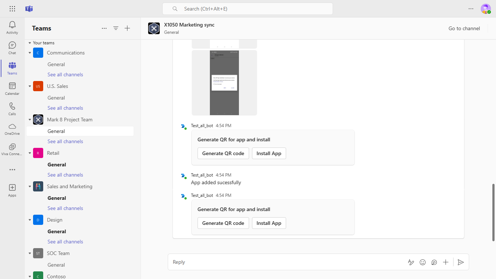

# Install app using barcode sample

This sample demos app installation using QR code.

The user can Generate a new QR code (contains app id information) and then use Install action to scan and then install the app.

`Currently, Microsoft Teams support for QR or barcode scanner capability is only available for mobile clients`.

## Included Features
* Bot
* Teams SSO (bots)
* Adaptive Cards
* Task Modules
* Device Permissions (media)
* Graph API

## Interaction with bot - Desktop View


## Interaction with bot - Mobile View


## Try it yourself - experience the App in your Microsoft Teams client
Please find below demo manifest which is deployed on Microsoft Azure and you can try it yourself by uploading the app package (.zip file link below) to your teams and/or as a personal app. (Sideloading must be enabled for your tenant, [see steps here](https://docs.microsoft.com/microsoftteams/platform/concepts/build-and-test/prepare-your-o365-tenant#enable-custom-teams-apps-and-turn-on-custom-app-uploading)).

**Install app using barcode sample:** [Manifest](/samples/app-installation-using-qr-code/csharp/demo-manifest/App-Installation-Using-QR.zip)

## Prerequisites

- [.NET Core SDK](https://dotnet.microsoft.com/download) version 6.0

  determine dotnet version
  ```bash
  dotnet --version
  ```
- [Ngrok](https://ngrok.com/download) (For local environment testing) Latest (any other tunneling software can also be used)

- [Teams](https://teams.microsoft.com) Microsoft Teams is installed and you have an account

## Setup

1) Setup for Bot SSO
- Refer to [Bot SSO Setup document](../BotSSOSetup.md)

- Ensure that you've [enabled the Teams Channel](https://docs.microsoft.com/azure/bot-service/channel-connect-teams?view=azure-bot-service-4.0)

- While registering the Azure bot, use `https://<your_ngrok_url>/api/messages` as the messaging endpoint.
    
    > NOTE: When you create your app registration in Azure portal, you will create an App ID and App password - make sure you keep these for later.

2) Setup NGROK
- Run ngrok - point to port 3978

    ```bash
    ngrok http 3978 --host-header="localhost:3978"
    ```

3) Setup for code
- Clone the repository
   ```bash
   git clone https://github.com/OfficeDev/Microsoft-Teams-Samples.git
   ```
   
- In a terminal, navigate to `samples/app-installation-using-qr-code/csharp`

    change into project folder
    ```bash
    cd # QRAppInstallation
    ```
 
- Modify the `/appsettings.json` and fill in the following details:
  - `{{Microsoft-App-Id}}` - Generated from Step 1 from AAD app registration in Azure portal
  - `{{Microsoft-App-Password}}` - Generated from Step 1, also referred to as Client secret
  - `{{ Application Base Url }}` - Your application's base url. E.g. https://12345.ngrok-free.app if you are using ngrok.
  - `{{ Auth Connection Name }}` - The OAuthConnection setting from step 1, from Azure Bot SSO setup

The `Connection Name` referred to is the name that we provide while adding OAuth connection setting in the Bot channel registration.
Please follow link [Add authentication to your bot](https://docs.microsoft.com/microsoftteams/platform/bots/how-to/authentication/add-authentication?tabs=dotnet%2Cdotnet-sample#azure-ad-v2) to see how we can add the setting.
 
- Run the bot from a terminal or from Visual Studio, choose option A or B.
 
   A) From a terminal
     ```bash
     # run the bot
     dotnet run
     ```

   B) Or from Visual Studio
     - Launch Visual Studio
     - File -> Open -> Project/Solution
     - Navigate to `QRAppInstallation` folder
     - Select `QRAppInstallation.csproj` file
     - Press `F5` to run the project 

- Modify the `manifest.json` in the `/AppPackage` folder and replace the following details:
  - `{{Microsoft-App-Id}}` with AAD app registration Application id, generated from Step 1
  - `{{domain-name}}` with base Url domain. E.g. if you are using ngrok it would be `https://1234.ngrok-free.app` then your domain-name will be `1234.ngrok-free.app`.

- Zip the contents of `AppPackage` folder into a `manifest.zip`, and use the `manifest.zip` to deploy in app store or add to Teams.

- Upload the manifest.zip to Teams (in the Apps view click "Upload a custom app")
   - Go to Microsoft Teams. From the lower left corner, select Apps
   - From the lower left corner, choose Upload a custom App
   - Go to your project directory, the ./AppPackage folder, select the zip folder, and choose Open.
   - Select Add in the pop-up dialog box. Your app is uploaded to Teams.

 - **Note**
 Kindly add the app/bot in personal scope and login there, afterwards add the app/bot in any Teams channel.

**Note**: If you are facing any issue in your app, please uncomment [this](https://github.com/OfficeDev/Microsoft-Teams-Samples/blob/main/samples/app-installation-using-qr-code/csharp/QRAppInstallation/AdapterWithErrorHandler.cs#L30) line and put your debugger for local debug.

## Running the sample

- **Desktop View**
**Card with actions Generate QR code and Install App:**



**Generate QR code is used to generate a QR code by selecting the app:**


**Install App is used to Scan the QR code and it then installs the app:**


-  **Mobile View**
**Hey command interaction:**


**Permission UI:**


**QR Code:**


**App added:**


**Polly App Install:**


## Deploy the bot to Azure

To learn more about deploying a bot to Azure, see [Deploy your bot to Azure](https://aka.ms/azuredeployment) for a complete list of deployment instructions.

## Further reading

- [Bot Framework Documentation](https://docs.botframework.com)
- [Bot Basics](https://docs.microsoft.com/azure/bot-service/bot-builder-basics?view=azure-bot-service-4.0)
- [Azure Bot Service Introduction](https://docs.microsoft.com/azure/bot-service/bot-service-overview-introduction?view=azure-bot-service-4.0)
- [Azure Bot Service Documentation](https://docs.microsoft.com/azure/bot-service/?view=azure-bot-service-4.0)
- [Integrate media Capabilities inside your app](https://learn.microsoft.com/microsoftteams/platform/concepts/device-capabilities/media-capabilities?tabs=mobile)


