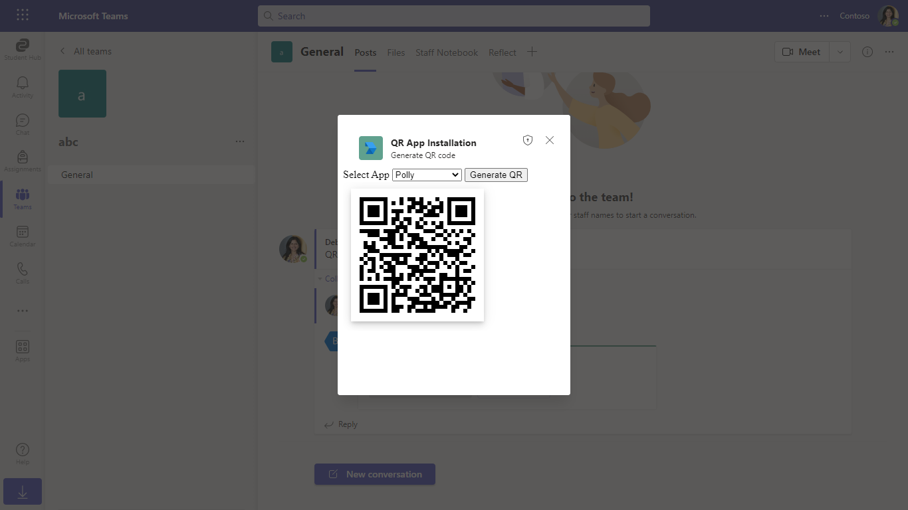
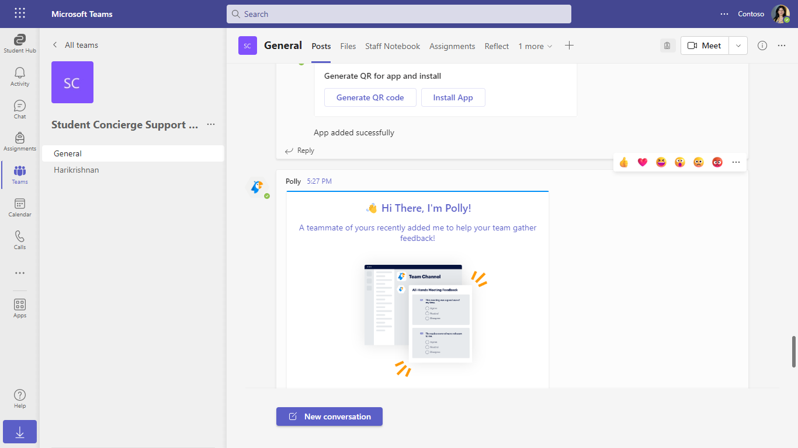

# Install app using barcode sample

This sample demos app installation using QR code.

The user can Generate a new QR code (contains app id information) and then use Install action to scan and install the app.

`Currently, Microsoft Teams support for QR or barcode scanner capability is only available for mobile clients`

# Feature of the sample - Desktop View


# Feature of the sample - Mobile View


**Desktop View**






**Mobile View**


## Prerequisites

- Microsoft Teams is installed and you have an account (not a guest account)
-  [NodeJS](https://nodejs.org/en/)
-  [ngrok](https://ngrok.com/) or equivalent tunneling solution
-  [M365 developer account](https://docs.microsoft.com/en-us/microsoftteams/platform/concepts/build-and-test/prepare-your-o365-tenant) or access to a Teams account with the 
   appropriate permissions to install an app.

## To try this sample

> Note these instructions are for running the sample on your local machine, the tunnelling solution is required because
> the Teams service needs to call into the bot.

### 1. Setup for Bot SSO
In Azure portal, create a [Bot Framework registration resource](https://docs.microsoft.com/en-us/azure/bot-service/bot-builder-authentication?view=azure-bot-service-4.0&tabs=csharp%2Caadv2).

- Ensure that you've [enabled the Teams Channel](https://docs.microsoft.com/en-us/azure/bot-service/channel-connect-teams?view=azure-bot-service-4.0)

Add the following permission in app registration


### 2. Run your bot sample
1) Clone the repository

    ```bash
    git clone https://github.com/OfficeDev/Microsoft-Teams-Samples.git
    ```

2) In a terminal, navigate to `samples/app-installation-using-qr-code/nodejs`

3) Install modules

    ```bash
    npm install
    ```

4) Run ngrok - point to port 3978

    ```bash
    ngrok http -host-header=rewrite 3978
    ```
5) Update the `.env` configuration for the bot to use the `MicrosoftAppId` and `MicrosoftAppPassword`, `connectionName` from the Bot Framework registration and `BaseUrl` with application base url. For e.g., your ngrok url. (Note the MicrosoftAppId is the AppId created in step 1 (Setup for Bot SSO), the MicrosoftAppPassword is referred to as the "client secret" in step 1 (Setup for Bot SSO) and you can always create a new client secret anytime.)

6) Run your app

    ```bash
    npm start
    ```
- **Manually update the manifest.json**
    - Edit the `manifest.json` contained in the  `appPackage/` folder to replace with your MicrosoftAppId (that was created in step1.1 and is the same value of MicrosoftAppId in `.env` file) *everywhere* you see the place holder string `{MicrosoftAppId}` (depending on the scenario the Microsoft App Id may occur multiple times in the `manifest.json`)
    - Zip up the contents of the `appPackage/` folder to create a `manifest.zip`
    - Upload the `manifest.zip` to Teams (in the left-bottom *Apps* view, click "Upload a custom app")

    > IMPORTANT: The manifest file in this app adds "token.botframework.com" to the list of `validDomains`. This must be included in any bot that uses the Bot Framework OAuth flow.

## Features of this sample

- Card with actions `Generate QR code` and `Install App`. 


- `Generate QR code` is used to generate a QR code by selecting the app.


- `Install App` is used to Scan the QR code and it then installs the app.


