# Teams App Localization
A comprehensive sample that illustrates how to implement localization for Microsoft Teams apps using Bots and Tabs. This sample covers app registration, setup, and configuration to enable language-specific content in Microsoft Teams, Outlook, and Office on the web. Supports multiple languages, such as en-US, fr-CA, hi-IN, and es-MX, and includes integration with Microsoft Entra ID and Azure Bot Service.

This sample illustrates how to implement [Localization for Microsoft Teams apps](https://docs.microsoft.com/microsoftteams/platform/concepts/build-and-test/apps-localization).

## Included Features
* Bots
* Tabs
* Localization
* Copilot Custome Engine Agents
## Interaction with app

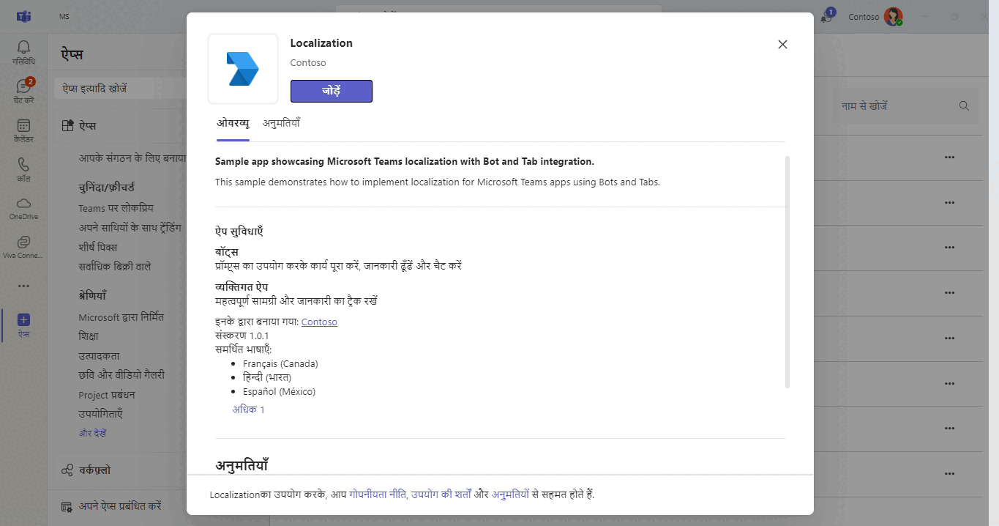

## Try it yourself - experience the App in your Microsoft Teams client
Please find below demo manifest which is deployed on Microsoft Azure and you can try it yourself by uploading the app package (.zip file link below) to your teams and/or as a personal app. (Uploading must be enabled for your tenant; [see steps here](https://docs.microsoft.com/microsoftteams/platform/concepts/build-and-test/prepare-your-o365-tenant#enable-custom-teams-apps-and-turn-on-custom-app-uploading).).

**App Localization:** [Manifest](/samples/app-localization/csharp/demo-manifest/app-localization.zip)

## Prerequisites

Verify you have the right account for building Teams apps and install some recommended development tools.

- You need a Teams account that allows [custom app uploading](https://docs.microsoft.com/microsoftteams/platform/build-your-first-app/build-first-app-overview#set-up-your-development-account).
- [.NET Core SDK](https://dotnet.microsoft.com/download) version 6.0
- [dev tunnel](https://learn.microsoft.com/en-us/azure/developer/dev-tunnels/get-started?tabs=windows) or [ngrok](https://ngrok.com/) latest version or equivalent tunnelling solution

## Run the app (Using Microsoft 365 Agents Toolkit for Visual Studio)

The simplest way to run this sample in Teams is to use Microsoft 365 Agents Toolkit for Visual Studio.
1. Install Visual Studio 2022 **Version 17.14 or higher** [Visual Studio](https://visualstudio.microsoft.com/downloads/)
1. Install Microsoft 365 Agents Toolkit for Visual Studio [Microsoft 365 Agents Toolkit extension](https://learn.microsoft.com/en-us/microsoftteams/platform/toolkit/toolkit-v4/install-teams-toolkit-vs?pivots=visual-studio-v17-7)
1. In the debug dropdown menu of Visual Studio, select Dev Tunnels > Create A Tunnel (set authentication type to Public) or select an existing public dev tunnel.
1. Right-click the 'M365Agent' project in Solution Explorer and select **Microsoft 365 Agents Toolkit > Select Microsoft 365 Account**
1. Sign in to Microsoft 365 Agents Toolkit with a **Microsoft 365 work or school account**
1. Set `Startup Item` as `Microsoft Teams (browser)`.
1. Press F5, or select Debug > Start Debugging menu in Visual Studio to start your app
</br>
1. In the opened web browser, select Add button to install the app in Teams
> If you do not have permission to upload custom apps (uploading), Microsoft 365 Agents Toolkit will recommend creating and using a Microsoft 365 Developer Program account - a free program to get your own dev environment sandbox that includes Teams.

## Setup
1. Register a new application in the [Microsoft Entra ID – App Registrations](https://go.microsoft.com/fwlink/?linkid=2083908) portal.|
  A) Select **New Registration** and on the *register an application page*, set following values:
      * Set **name** to your app name.
      * Choose the **supported account types** (any account type will work)
      * Leave **Redirect URI** empty.
      * Choose **Register**.
  B) On the overview page, copy and save the **Application (client) ID, Directory (tenant) ID**. You'll need those later when updating your Teams application manifest and in the appsettings.json.
  C) Navigate to **API Permissions**, and make sure to add the follow permissions:
   Select Add a permission
      * Select Add a permission
      * Select Microsoft Graph -\> Delegated permissions.
      * `User.Read` (enabled by default)
      * Click on Add permissions. Please make sure to grant the admin consent for the required permissions.
      
    > NOTE: When you create your app registration, you will create an App ID and App password (Secret) - make sure you keep these for later.

2. Setup for Bot
	
	- Also, register a bot with Azure Bot Service, following the instructions [here](https://docs.microsoft.com/azure/bot-service/bot-service-quickstart-registration?view=azure-bot-service-3.0)
	- Ensure that you've [enabled the Teams Channel](https://docs.microsoft.com/azure/bot-service/channel-connect-teams?view=azure-bot-service-4.0)
	- While registering the bot, use `https://<your_tunnel_domain>/api/messages` as the messaging endpoint.

3. Setup NGROK
 - Run ngrok - point to port 3978

    ```bash
    ngrok http 3978 --host-header="localhost:3978"
    ```

   Alternatively, you can also use the `dev tunnels`. Please follow [Create and host a dev tunnel](https://learn.microsoft.com/en-us/azure/developer/dev-tunnels/get-started?tabs=windows) and host the tunnel with anonymous user access command as shown below:

   ```bash
   devtunnel host -p 3978 --allow-anonymous
   ```

4. Setup for code

  - Clone the repository

    ```bash
    git clone https://github.com/OfficeDev/Microsoft-Teams-Samples.git
    ```
  - Modify the `/appsettings.json` and fill in the following details:
  - `{{MicrosoftAppId}}` - Generated from Step 1 while doing Microsoft Entra ID app registration in Azure portal.
  - `{{ClientSecret}}` - Generated from Step 1, also referred to as Client secret

- Run the bot from a terminal or from Visual Studio:

5. If you are using Visual Studio
  - Launch Visual Studio
  - File -> Open -> Project/Solution
  - Navigate to `app-localization\csharp` folder
  - Select `Localization.csproj` file

6. This step is related to Microsoft Teams app manifest
    - **Edit** the `manifest.json` contained in the `appPackage` or `AppManifest_Hub` folder to replace your Microsoft App Id (that was created when you registered your bot earlier) *everywhere* you see the place holder string `<<YOUR-MICROSOFT-APP-ID>>` and <<Azure Bot ID>> and for the contentUrl "<<Tunnel Url>>?culture={locale}" (depending on the scenario the Microsoft App Id may occur multiple times in the `manifest.json`)
   - **Provide turnnelling Url** in `manifest.json` for contentUrl in case of tabs and for messaging endpoint in case of bots if enabled
   - replace `{{domain-name}}` with base Url of your domain. E.g. if you are using ngrok it would be `https://1234.ngrok-free.app` then your domain-name will be `1234.ngrok-free.app` and if you are using dev tunnels then your domain will be like: `12345.devtunnels.ms`.
    - **Zip** up the contents of the `Manifest` or `Manifest_hub` folder to create a `manifest.zip`
    - **Upload** the `manifest.zip` to Teams (in the Apps view click "Upload a custom app")

**Note:** If you want to test your app across multi hub like: Outlook/Office.com, please update the `manifest.json` in the `/AppManifest_Hub` folder with the required values.

**Note**: If you are facing any issue in your app, please uncomment [this](https://github.com/OfficeDev/Microsoft-Teams-Samples/blob/main/samples/app-localization/csharp/Localization/AdapterWithErrorHandler.cs#L24) line and put your debugger for local debug.

# Running the sample

In Teams, Once the app is successfully installed, you can interact with tab and bot in your preferred language.

#### To change language in Teams
To change the language in Microsoft Teams, please click your profile picture at the top of the app, then select Settings -> General and go to the Language section. Choose the preferred language and restart to apply the change. This sample supports en-US, fr-CA, hi-IN and es-MX.
1. **Installation**: You should see your app installation screen content in selected language.
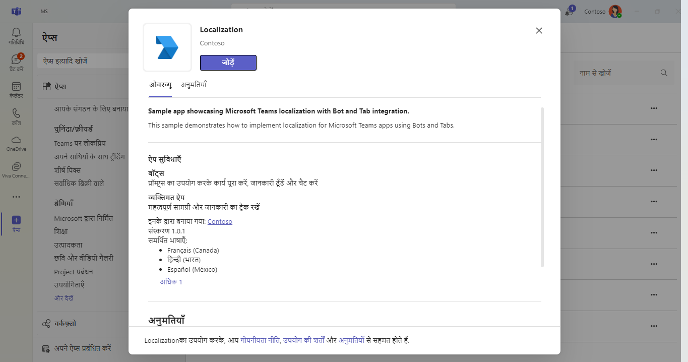

1. **Bot**: send any message to see localized
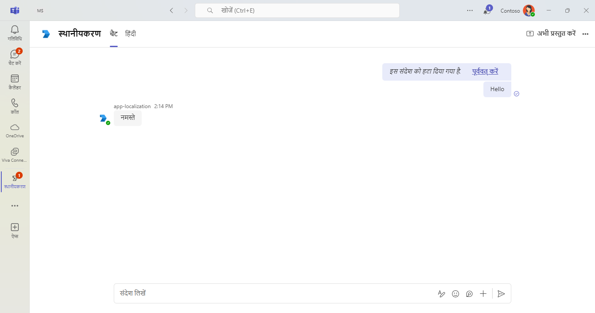
1. **Tab**: click on tab to see localized info.
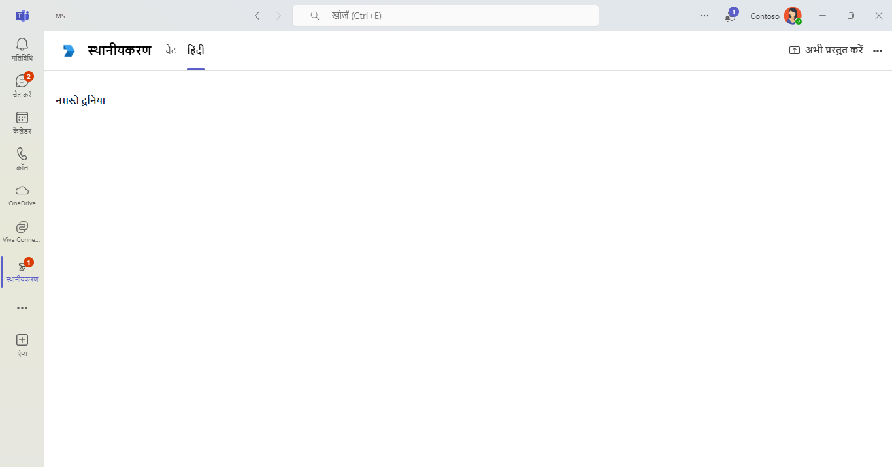

**Copilot Custome Engine Agents**
Install App In Copilot
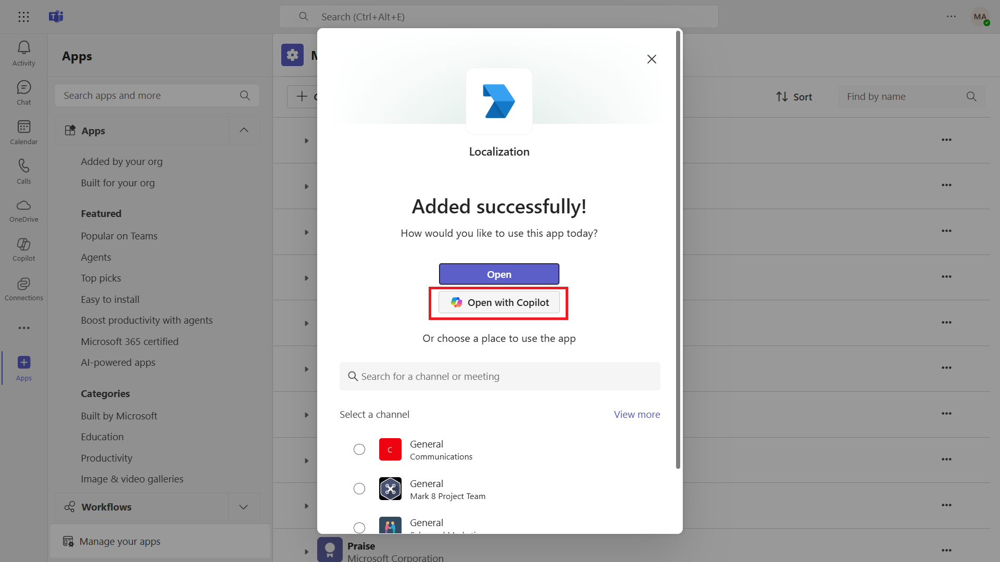

Default Language English(USA)
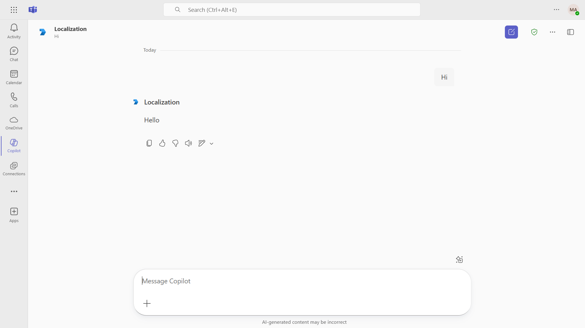

After Changing Language to Hindi
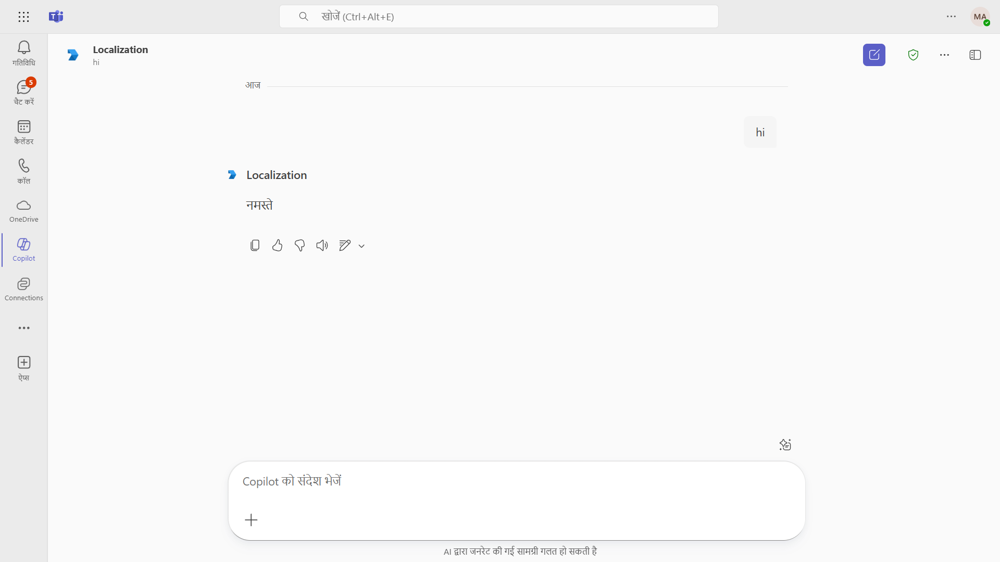

## Outlook on the web

- To view your app in Outlook on the web.

- Go to [Outlook on the web](https://outlook.office.com/mail/)and sign in using your dev tenant account.

**On the side bar, select More Apps. Your uploaded app title appears among your installed apps**

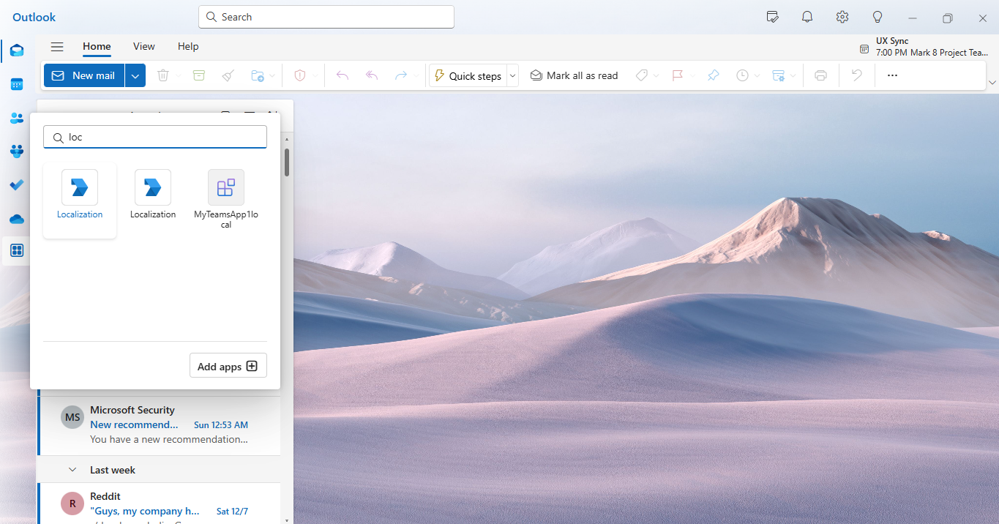

**Select your app icon to launch and preview your app running in Outlook on the web**

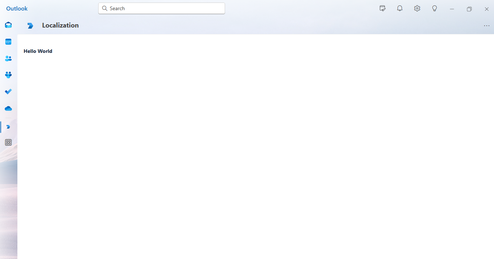

**Note:** Similarly, you can test your application in the Outlook desktop app as well.

## Office on the web

- To preview your app running in Office on the web.

- Log into office.com with test tenant credentials

**Select the Apps icon on the side bar. Your uploaded app title appears among your installed apps**

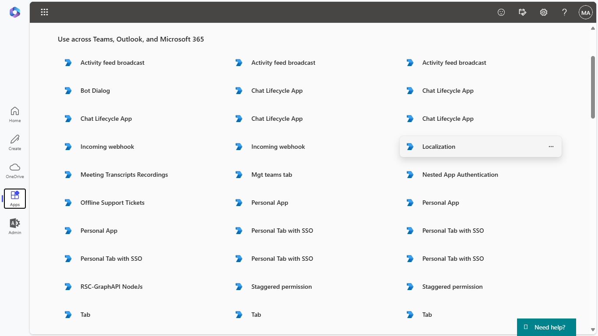

**Select your app icon to launch your app in Office on the web**

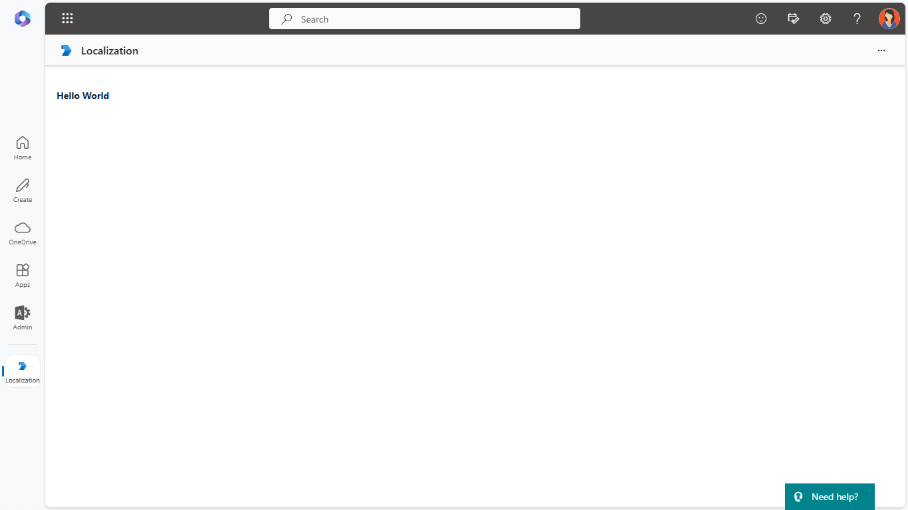 

**Note:** Similarly, you can test your application in the Office 365 desktop app as well.

#### To Add more languages for localization in Teams through Code.
 
 Add Resource files for the respective languages, Check culture fallback behaviour and how to add other cultures refer [Globalization and localization Fundamentals](https://docs.microsoft.com/aspnet/core/fundamentals/localization?view=aspnetcore-5.0). 

## Further reading

- [Localize your app](https://learn.microsoft.com/microsoftteams/platform/concepts/build-and-test/apps-localization)


