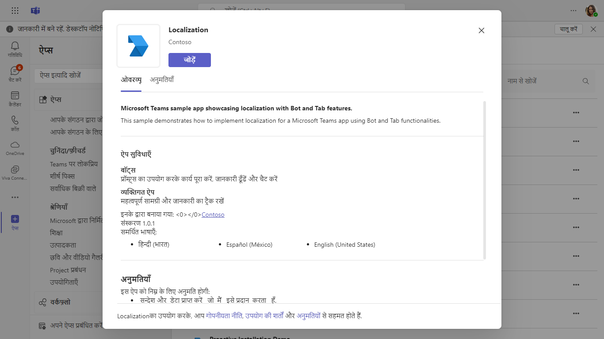

# Teams App Localization Node.js
This sample illustrates how to implement [Localization for Microsoft Teams apps](https://docs.microsoft.com/microsoftteams/platform/concepts/build-and-test/apps-localization).

## Included Features
* Bots
* Tabs
* Localization

## Interaction with app


## Try it yourself - experience the App in your Microsoft Teams client
Please find below demo manifest which is deployed on Microsoft Azure and you can try it yourself by uploading the app package (.zip file link below) to your teams and/or as a personal app. (Sideloading must be enabled for your tenant; [see steps here](https://docs.microsoft.com/microsoftteams/platform/concepts/build-and-test/prepare-your-o365-tenant#enable-custom-teams-apps-and-turn-on-custom-app-uploading).).

**App Localization:** [Manifest](/samples/app-localization/csharp/demo-manifest/app-localization.zip)

## Prerequisites

- Microsoft Teams is installed and you have an account (not a guest account)
- To test locally, [NodeJS](https://nodejs.org/en/download/) must be installed on your development machine (version 16.14.2  or higher)
- [ngrok](https://ngrok.com/download) or equivalent tunneling solution
- [M365 developer account](https://docs.microsoft.com/microsoftteams/platform/concepts/build-and-test/prepare-your-o365-tenant) or access to a Teams account with the 
   appropriate permissions to install an app.

## Setup

1. Register a new application in the [Azure Active Directory – App Registrations](https://go.microsoft.com/fwlink/?linkid=2083908) portal.

2. Setup for Bot
	
	- Also, register a bot with Azure Bot Service, following the instructions [here](https://docs.microsoft.com/azure/bot-service/bot-service-quickstart-registration?view=azure-bot-service-3.0).
	- Ensure that you've [enabled the Teams Channel](https://docs.microsoft.com/azure/bot-service/channel-connect-teams?view=azure-bot-service-4.0)
	- While registering the bot, use `https://<your_ngrok_url>/api/messages` as the messaging endpoint.

    > NOTE: When you create your app registration, you will create an App ID and App password - make sure you keep these for later.

3. Setup NGROK
      - Run ngrok - point to port 3978

	```bash
	  ngrok http 3978 --host-header="localhost:3978"
	```   
4. Setup for code

   - Clone the repository

    ```bash
    git clone https://github.com/OfficeDev/Microsoft-Teams-Samples.git
    ```

 - In a terminal, navigate to `samples\app-localization\nodejs`

    ```bash
    cd samples/app-localization/nodejs
    ```

 - Install node modules For Server

   Inside node js folder, open your local terminal and run the below command to install node modules. You can do the same in Visual Studio code terminal by opening the project in Visual Studio code.

    ```bash
    npm install
    ```

 - Install node modules For Client

   Navigate to folder `client` folder, open your local terminal and run the below command to install node modules. You can do the same in Visual Studio code terminal by opening the project in Visual Studio code.

    ```bash
    npm install
    ```

5. Update the `.env` configuration for the bot to use the `MicrosoftAppId` and `MicrosoftAppPassword`, `BaseUrl` with application base url. For e.g., your ngrok url. (Note the MicrosoftAppId is the AppId created in step 1 (Setup for Bot), the MicrosoftAppPassword is referred to as the "client secret" in step 1 (Setup for Bot) and you can always create a new client secret anytime.)

6. Setup Manifest for Teams

- **This step is specific to Teams.**
    - **Edit** the `manifest.json` contained in the `appPackage/` or `Manifest_Hub/` folder to replace with your MicrosoftAppId (that was created in step1.1 and is the same value of MicrosoftAppId in `.env` file) *everywhere* you see the place holder string `{MicrosoftAppId}` (depending on the scenario the Microsoft App Id may occur multiple times in the `manifest.json`)
    - **Edit** the `manifest.json` for `validDomains` and replace `{{domain-name}}` with base Url of your domain. E.g. if you are using ngrok it would be `https://1234.ngrok-free.app` then your domain-name will be `1234.ngrok-free.app`.
    - Zip up the contents of the `appPackage/` or `Manifest_Hub/` folder to create a `manifest.zip`
    - Upload the `manifest.zip` to Teams (in the left-bottom *Apps* view, click "Upload a custom app")
	
  **Note:** If you want to test your app across multi hub like: Outlook/Office.com, please update the `manifest.json` in the `/Manifest_Hub` folder with the required values.

**Note**: If you are facing any issue in your app, please uncomment [this](https://github.com/OfficeDev/Microsoft-Teams-Samples/blob/main/samples/app-localization/nodejs/server/api/botController.js#L24) line and put your debugger for local debug.

7. Run your app.
- Start the bot

    ```bash
    npm start
    ```

## Interacting with the app in Teams
In Teams, Once the app is successfully installed, you can interact with tab and bot in your preferred language.

#### To change language in Teams
To change the language in Microsoft Teams, please click your profile picture at the top of the app, then select Settings -> General and go to the Language section. Choose the preferred language and restart to apply the change. This sample supports en-US, fr-CA, hi-IN and es-MX.

## Running the sample

1. **Installation**: You should see your app installation screen content in selected language. 


2. **Bot**: send any message to see localized 
[image](Images/Reply.png)

## Outlook on the web

- To view your app in Outlook on the web.

- Go to [Outlook on the web](https://outlook.office.com/mail/)and sign in using your dev tenant account.

**On the side bar, select More Apps. Your sideloaded app title appears among your installed apps**


**Select your app icon to launch and preview your app running in Outlook on the web**


**Note:** Similarly, you can test your application in the Outlook desktop app as well.

## Office on the web

- To preview your app running in Office on the web.

- Log into office.com with test tenant credentials

**Select the Apps icon on the side bar. Your sideloaded app title appears among your installed apps**


**Select your app icon to launch your app in Office on the web**

 

**Note:** Similarly, you can test your application in the Office 365 desktop app as well.


#### To Add more languages for localization in Teams through Code.
 
 Add Resource files for the respective languages, Check culture fallback behaviour and how to add other cultures refer [Globalization and localization Fundamentals](https://docs.microsoft.com/aspnet/core/fundamentals/localization?view=aspnetcore-5.0).

## Further reading

- [Localize your app](https://learn.microsoft.com/microsoftteams/platform/concepts/build-and-test/apps-localization)


