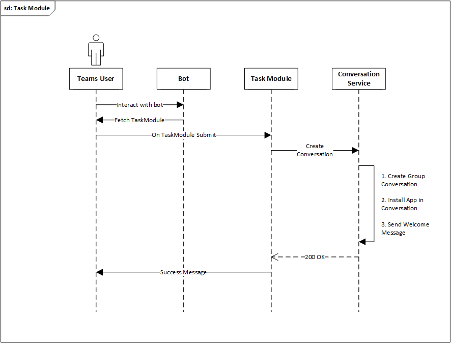
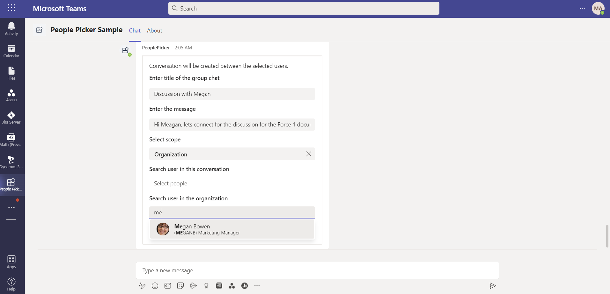

### People Picker Sample

#### About
This sample illustrates [people picker implementation using Adaptive Card](https://docs.microsoft.com/en-us/microsoftteams/platform/task-modules-and-cards/cards/people-picker?tabs=desktop) inside Teams App.

#### Task Module


##### Workflow:
* User invokes the people picker bot and [selects "task" bot command](https://docs.microsoft.com/en-us/microsoftteams/platform/bots/how-to/create-a-bot-commands-menu?tabs=desktop%2Cdotnet). NOTE : Bot can be invoked in 1-1 conversation, group or channel.
* The bot replies with an Adaptive Card to choose the context.
* On select, Task Module is rendered with an Adaptive Card.
* User enters title, message and selects users from people picker.
* On Submit
    * Task module displays success message.
    * A new group conversation is created with the above selected users.
    * People picker app is proactively installed.
    * Welcome message is proactively sent.

##### Sequence Diagram


#### Adaptive Card



##### Workflow:
* User invokes the people picker bot and [selects "card" bot command](https://docs.microsoft.com/en-us/microsoftteams/platform/bots/how-to/create-a-bot-commands-menu?tabs=desktop%2Cdotnet). NOTE : Bot can be invoked in 1-1 conversation, group or channel.
* Bot replies with an Adaptive Card to choose the context, enter title, message and select users from people picker.
* User enters title, message and selects users from people picker.
* On Submit
    * Task module displays success message.
    * A new group conversation is created with the above selected users.
    * People picker app is proactively installed.
    * Welcome message is proactively sent.


#### Action Based Message Extension


##### Workflow:
* User [invokes the people picker message extension](https://docs.microsoft.com/en-us/microsoftteams/platform/messaging-extensions/what-are-messaging-extensions?tabs=dotnet) by selecting a message and using "..." overflow on message actions. NOTE : Message Extension can be invoked in 1-1 conversation, group or channel.
* For a selected message, user chooses the context where message needs to be shared.
* On Select, Task Module is rendered with an Adaptive Card.
* On Submit
    * Adaptive Card displays success message.
    * A new group conversation is created with the above selected users.
    * People picker app is proactively installed.
    * Welcome message is proactively sent.


#### Prerequisites
* Make sure you have an active [Azure subscription](https://azure.microsoft.com/en-us/free/).
* Make sure [Publish to organization's app store](https://docs.microsoft.com/en-us/MicrosoftTeams/manage-apps?toc=%2Fmicrosoftteams%2Fplatform%2Ftoc.json&bc=%2Fmicrosoftteams%2Fplatform%2Fbreadcrumb%2Ftoc.json#publish-a-custom-app-to-your-organizations-app-store)  is available in Teams.
* Install [Visual Studio](https://docs.microsoft.com/en-us/visualstudio/install/install-visual-studio?view=vs-2022) or [Visual Studio Code](https://code.visualstudio.com/download) to run and debug the sample code.
  * [.NET Core SDK](https://dotnet.microsoft.com/download) version 5
* Install [ngrok](https://ngrok.com/download) for local setup. (or any other tunneling solution)


#### Setup

##### Bot setup
* [Register a bot with Azure](https://docs.microsoft.com/en-us/azure/bot-service/bot-service-quickstart-registration?view=azure-bot-service-4.0&tabs=userassigned).
  * Make sure to copy and save the Azure Bot resource app ID and password.
* [Connect the bot to Microsoft Teams](https://docs.microsoft.com/en-us/azure/bot-service/channel-connect-teams?view=azure-bot-service-4.0).
* Run ngrok and point it to port: 50086.
    ```
    ngrok http 50086 -host-header=localhost:50086
    ```


##### Publish AppPackage to App Catalog
* Update the following in the manifest.json.
  * `{Bot App Id}` - Replace with app ID saved earlier.
  * `{BaseUrl}` - Replace with ngrok url saved earlier.
  * `{WebsiteUrl}` - Replace with ngrok url saved earlier.
  * `description`, `developer` - Update these fields with relevant information.
* Zip the manifest and app icons. (say `sample.zip`)
* Publish the app package to organization's app store.
  * Make sure to copy and save app's ID in organization's app store.

##### Azure AD App Registration and Permission
* The app uses client context for Creating Chat and App Installation in Group Conversation.
* Goto Azure AD Portal and look for the Application with the app ID saved earlier.
* Navigate to API Permissions for the app. Select Add a permission. Select Microsoft Graph, Application Permission.
* Provide the Following Application Permissions.
  * Chat.Create
  * TeamsAppInstallation.ReadWriteForChat.All
* Grant Admin consent.
  * If you are the Admin, then admin consent can be granted from API permissions page by clicking Grant Admin consent once an API permission is added.
  * If you are not the admin, share the following URL with the admin and request to grant consent.
    * URL - https://login.microsoftonline.com/{tenant-id}/adminconsent?client_id={app-id} where
    * {app-id} is the app ID saved earlier.
    * {tenant-id} is your organization's tenant ID.

NOTE : We can add the above API permissions to a new application by [Registering a new app with Azure AD](https://docs.microsoft.com/en-us/powerapps/developer/data-platform/walkthrough-register-app-azure-active-directory) and save new App Id and Client Secret specifically for Graph API calls. Being a Sample, we are lmiting to single app registration only.

##### Project setup
* Clone the repo or download the sample code to your machine.
* Update the following settings in `appsettings.json`
  * `MicrosoftAppId` - App Id saved earlier.
  * `MicrosoftAppPassword` - App secret saved earlier.
  * `AzureAd:ClientId` - App Id saved earlier.
  * `AzureAd:TenantId` - Tenant ID where you wll run the Teams application.
  * `TeamsBot:CatalogAppId` - App ID in organization's app store saved earlier.
* Build and run the sample code in Visual studio / Visual studio code.

#### Basic Tests
* You should be able to install the application to personal scope, group chats and Teams.
* Use commands 'task' or 'card' to interact with bot and create a conversation. Use action based message extension to forward a message into a new conversation.
* New conversation is created between selected users and given title. Proactive message is sent from the bot into the conversation.