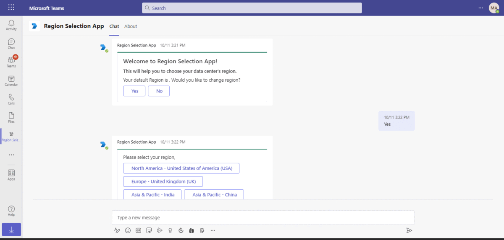
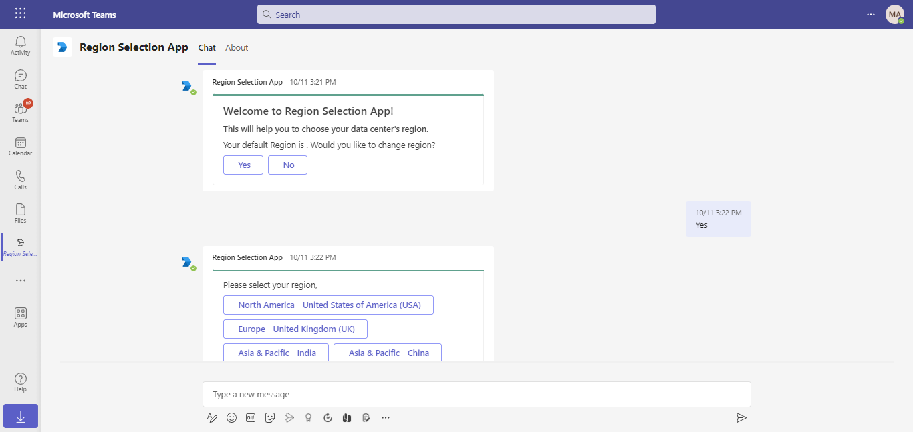
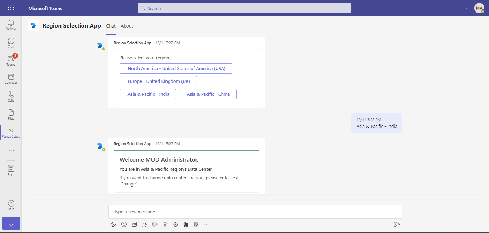
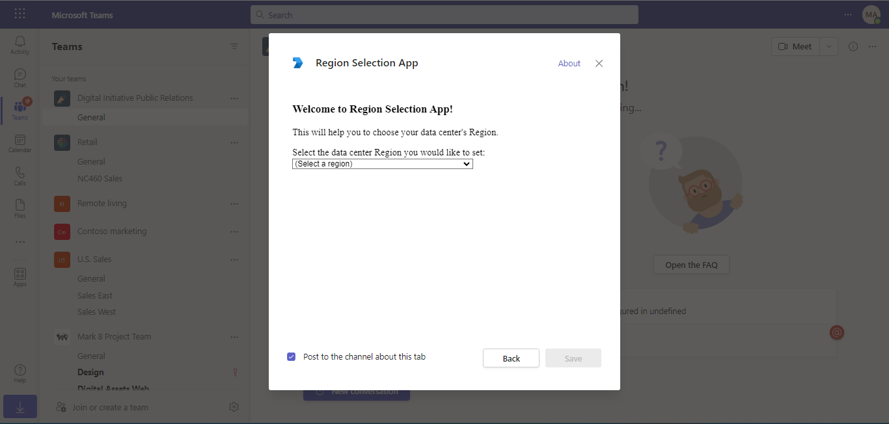
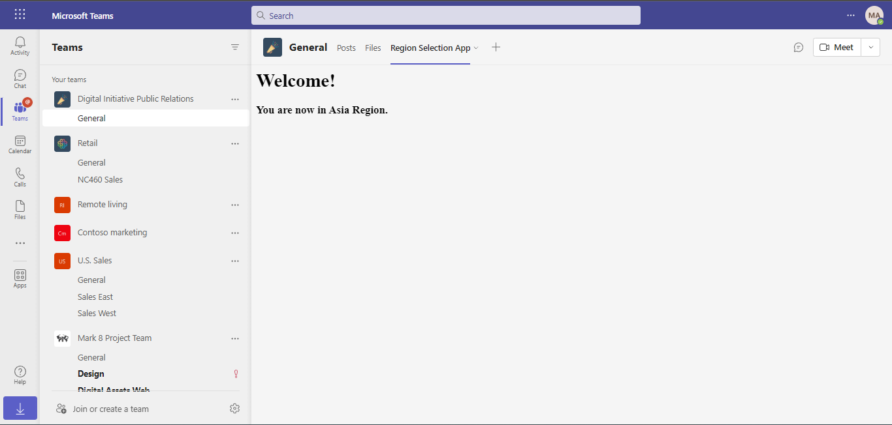

# Region Selection App

A Microsoft Teams sample app for region selection, leveraging both Bot and Tab interactions. The app features Adaptive Cards to facilitate region configuration and provides a seamless experience to manage data center selection through the Teams client.

Bot Framework v4 Region Selection sample.

This bot has been created using [Bot Framework](https://dev.botframework.com), for the region selection for the app's data center using Bot and Tab.

## Included Features
* Bots
* Tabs
* Adaptive Cards

## Interaction with app


## Try it yourself - experience the App in your Microsoft Teams client
Please find below demo manifest which is deployed on Microsoft Azure and you can try it yourself by uploading the app package (.zip file link below) to your teams and/or as a personal app. (Uploading must be enabled for your tenant, [see steps here](https://docs.microsoft.com/microsoftteams/platform/concepts/build-and-test/prepare-your-o365-tenant#enable-custom-teams-apps-and-turn-on-custom-app-uploading)).

**Region Selection App:** [Manifest](/samples/app-region-selection/csharp/demo-manifest/app-region-selection.zip)

## Prerequisites

- [.NET Core SDK](https://dotnet.microsoft.com/download) version 6.0

  ```bash
  # determine dotnet version
  dotnet --version
  ```
- Publicly addressable https url or tunnel such as [dev tunnel](https://learn.microsoft.com/en-us/azure/developer/dev-tunnels/get-started?tabs=windows) or [dev tunnel](https://learn.microsoft.com/en-us/azure/developer/dev-tunnels/get-started?tabs=windows) or [ngrok](https://ngrok.com/) latest version or [Tunnel Relay](https://github.com/OfficeDev/microsoft-teams-tunnelrelay)

- [Teams](https://teams.microsoft.com) Microsoft Teams is installed and you have an account

## Run the app (Using Microsoft 365 Agents Toolkit for Visual Studio)

The simplest way to run this sample in Teams is to use Microsoft 365 Agents Toolkit for Visual Studio.
1. Install Visual Studio 2022 **Version 17.14 or higher** [Visual Studio](https://visualstudio.microsoft.com/downloads/)
1. Install Microsoft 365 Agents Toolkit for Visual Studio [Microsoft 365 Agents Toolkit extension](https://learn.microsoft.com/en-us/microsoftteams/platform/toolkit/toolkit-v4/install-teams-toolkit-vs?pivots=visual-studio-v17-7)
1. In the debug dropdown menu of Visual Studio, select Dev Tunnels > Create A Tunnel (set authentication type to Public) or select an existing public dev tunnel.
1. Right-click the 'M365Agent' project in Solution Explorer and select **Microsoft 365 Agents Toolkit > Select Microsoft 365 Account**
1. Sign in to Microsoft 365 Agents Toolkit with a **Microsoft 365 work or school account**
1. Set `Startup Item` as `Microsoft Teams (browser)`.
1. Press F5, or select Debug > Start Debugging menu in Visual Studio to start your app
</br>
1. In the opened web browser, select Add button to install the app in Teams
> If you do not have permission to upload custom apps (uploading), Microsoft 365 Agents Toolkit will recommend creating and using a Microsoft 365 Developer Program account - a free program to get your own dev environment sandbox that includes Teams.

## Setup

### 1. Setup for Bot

- Register a bot with Azure Bot Service, following the instructions [here](https://docs.microsoft.com/azure/bot-service/bot-service-quickstart-registration?view=azure-bot-service-3.0).
- Ensure that you've [enabled the Teams Channel](https://docs.microsoft.com/azure/bot-service/channel-connect-teams?view=azure-bot-service-4.0)
- While registering the bot, use `https://<your_tunnel_domain>/api/messages` as the messaging endpoint.
    > NOTE: When you create your bot you will create an App ID and App password - make sure you keep these for later.

### 2. Setup NGROK
1) Run ngrok - point to port 3978

   ```bash
   ngrok http 3978 --host-header="localhost:3978"
   ```  

   Alternatively, you can also use the `dev tunnels`. Please follow [Create and host a dev tunnel](https://learn.microsoft.com/en-us/azure/developer/dev-tunnels/get-started?tabs=windows) and host the tunnel with anonymous user access command as shown below:

   ```bash
   devtunnel host -p 3978 --allow-anonymous
   ```

### 3. Register your app with Azure AD.

  1. Register a new application in the [Microsoft Entra ID – App Registrations](https://go.microsoft.com/fwlink/?linkid=2083908) portal.
  2. Select **New Registration** and on the *register an application page*, set following values:
      * Set **name** to your app name.
      * Choose the **supported account types** (any account type will work)
      * Leave **Redirect URI** empty.
      * Choose **Register**.
  3. On the overview page, copy and save the **Application (client) ID, Directory (tenant) ID**. You'll need those later when updating your Teams application manifest and in the appsettings.json.
  4. Navigate to **API Permissions**, and make sure to add the follow permissions:
   Select Add a permission
      * Select Add a permission
      * Select Microsoft Graph -\> Delegated permissions.
      * `User.Read` (enabled by default)
      * Click on Add permissions. Please make sure to grant the admin consent for the required permissions.


### 4. Setup for code

- Clone the repository

    ```bash
    git clone https://github.com/OfficeDev/Microsoft-Teams-Samples.git
    ```

- Run the bot from a terminal or from Visual Studio:

  A) From a terminal, navigate to `samples/app-region-selection/RegionSelectionApp`

  ```bash
  # run the bot
  dotnet run
  ```

  B) Or from Visual Studio

  - Launch Visual Studio
  - File -> Open -> Project/Solution
  - Navigate to `samples/app-region-selection/RegionSelectionApp` folder
  - Select `RegionSelectionApp.sln` file
  - Press `F5` to run the project

 - Update the `appsettings.json` configuration for the bot to use the MicrosoftAppId, MicrosoftAppPassword generated in Step 1 (Setup for Bot). (Note the App Password is referred to as the "client secret" in the azure portal and you can always create a new client secret anytime.)

 ### 5. Setup Manifest for Teams
1) __*This step is specific to Teams.*__
    - **Edit** the `manifest.json` contained in the  `appPackage` folder to replace your Microsoft App Id (that was created when you registered your bot earlier) *everywhere* you see the place holder string `<<Your Microsoft App Id>>` (depending on the scenario the Microsoft App Id may occur multiple times in the `manifest.json`)
    - **Edit** the `manifest.json` for `configurationUrl` inside `configurableTabs` . Replace `{{domain-name}}` with base Url domain. E.g. if you are using ngrok it would be `https://1234.ngrok-free.app` then your domain-name will be `1234.ngrok-free.app` and if you are using dev tunnels then your domain will be like: `12345.devtunnels.ms`.
    - **Edit** the `manifest.json` for `validDomains` with base Url domain. E.g. if you are using ngrok it would be `https://1234.ngrok-free.app` then your domain-name will be `1234.ngrok-free.app` and if you are using dev tunnels then your domain will be like: `12345.devtunnels.ms`.
    - **Zip** up the contents of the `appPackage` folder to create a `manifest.zip` (Make sure that zip file does not contains any subfolder otherwise you will get error while uploading your .zip package)
    - **Upload** the `manifest.zip` to Teams (In Teams Apps/Manage your apps click "Upload an app". Browse to and Open the .zip file. At the next dialog, click the Add button.)
    - Add the app to personal/team/groupChat scope (Supported scopes)


**Note**: If you are facing any issue in your app, please uncomment [this](https://github.com/OfficeDev/Microsoft-Teams-Samples/blob/main/samples/app-region-selection/csharp/RegionSectionApp/AdapterWithErrorHandler.cs#L25) line and put your debugger for local debug.

## Running the sample

Install the Region Selection App manifest in Microsoft Teams. @mention the region selection bot to start the conversation.
- Bot sends an Adaptive card in chat

- Select the region from the card. Bot sets the selected region and notify user in chat


## Interacting with Region Selection Tab

- Set up the region selection app as a Tab in channel

- Tab will display the selected region


## Deploy the bot to Azure

To learn more about deploying a bot to Azure, see [Deploy your bot to Azure](https://aka.ms/azuredeployment) for a complete list of deployment instructions.


## Further reading
- [Overview for Microsoft Teams App](https://docs.microsoft.com/microsoftteams/platform/build-your-first-app/build-first-app-overview)
- [Build a Configurable Tab for Microsoft Teams App](https://docs.microsoft.com/microsoftteams/platform/build-your-first-app/build-channel-tab)
- [Build a Bot](https://docs.microsoft.com/microsoftteams/platform/build-your-first-app/build-bot)

