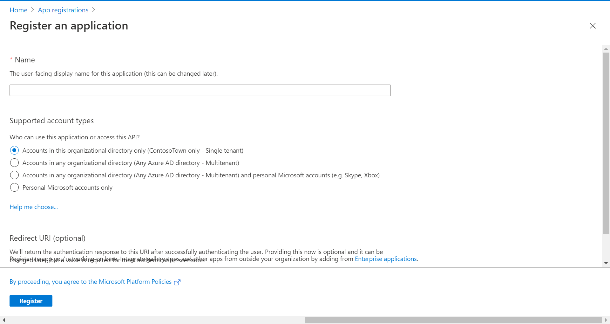
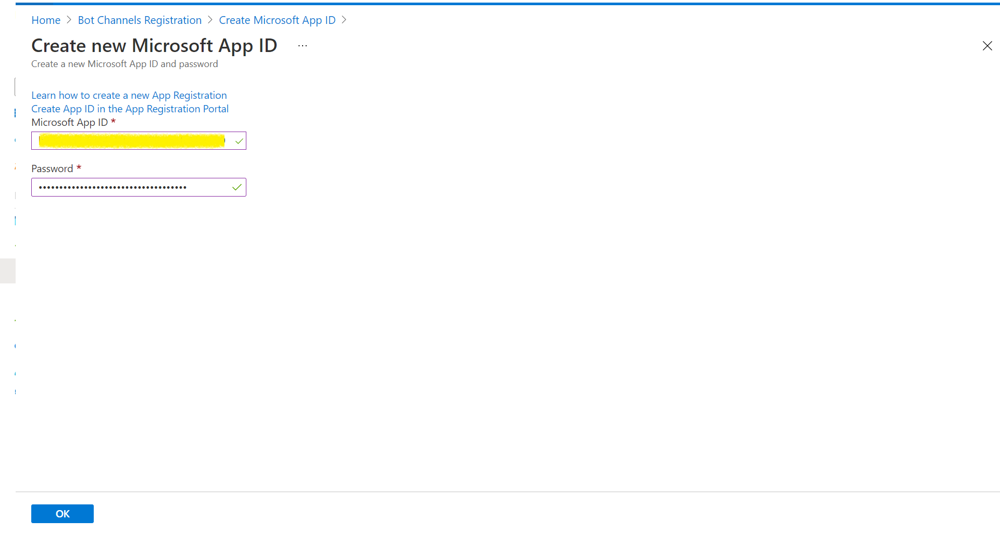
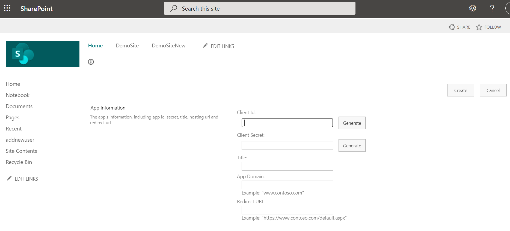
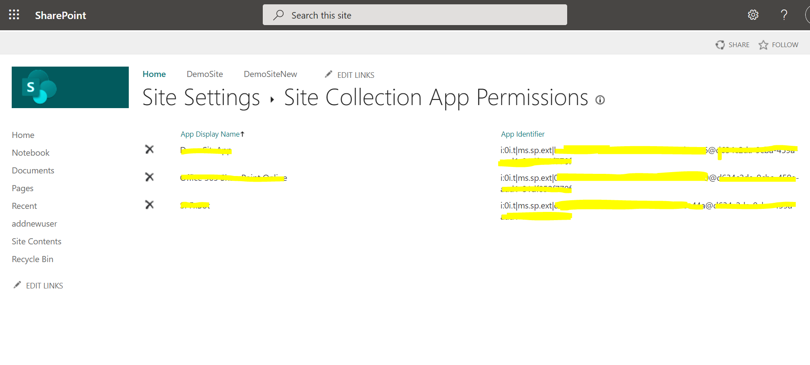
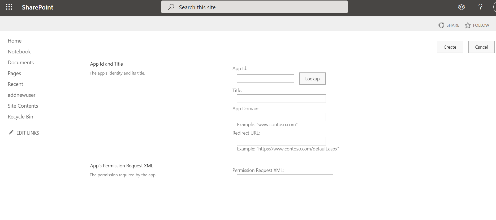
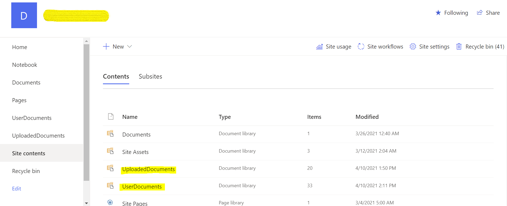
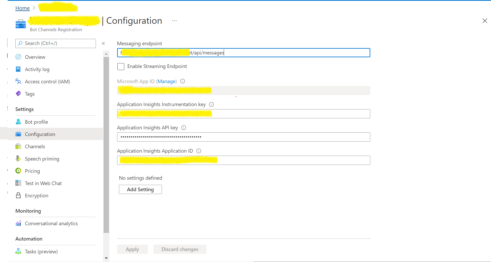
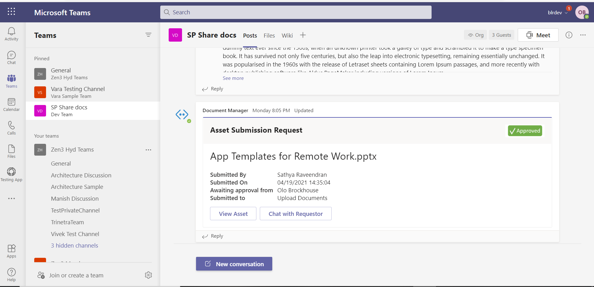

# Document Manager  

## Summary

Document manager sample app provides basis for building a digital asset / document repository management app. This sample makes use of Teams platform capabilities to bring some of the basic document management features to life. Any document or asset management app would need the following functionalities -  

	Consumption: Search and find an asset file in the repository for self-consumption 

	Consumption: Share assets with others in the team allowing ease of adoption and usage 

	Contribution: Submit good asset files back to the repository for others to find and use 

	Governance: Monitor and review assets being uploaded to the library 


## Frameworks


## Prerequisites

* [Office 365 tenant](https://developer.microsoft.com/en-us/microsoft-365/dev-program)

* To test locally, you'll need [Ngrok](https://ngrok.com/download) and [Sharepoint App](https://docs.microsoft.com/en-us/sharepoint/dev/solution-guidance/security-apponly-azureacs#setting-up-an-app-only-principal-with-tenant-permissions). Make sure you've downloaded and installed the ngrok on your local machine. ngrok will tunnel requests from the Internet to your local computer and terminate the SSL connection from Teams.

    * ex: `https://subdomain.ngrok.io`.
    
	 NOTE: A free Ngrok plan will generate a new URL every time you run it, which requires you to update your Azure AD registration, the Teams app manifest, and the project configuration. A paid account with a permanent Ngrok URL is recommended.

## Version history

Version|Date|Author|Comments
-------|----|----|--------
1.0|April 21, 2021|Sathya Raveendran <br />Varaprasad SSLN|Initial release

## Disclaimer

**THIS CODE IS PROVIDED *AS IS* WITHOUT WARRANTY OF ANY KIND, EITHER EXPRESS OR IMPLIED, INCLUDING ANY IMPLIED WARRANTIES OF FITNESS FOR A PARTICULAR PURPOSE, MERCHANTABILITY, OR NON-INFRINGEMENT.**

---

## Minimal Path to Awesome

Step 1: Setup bot in Service
====================================
1. Create new bot channel registration resource in Azure.


2. Create New Microsoft App ID and Password.


3. Go to App registrations and create a new app registration in a different tab.
4. Register an application.
	* Fill out name and select third option for supported account type and click "Register".



	* Copy and paste the App Id and Tenant ID somewhere safe. You will need it in a future step.

5. Create Client Secret.
   * Navigate to the "Certificates & secrets" blade and add a client secret by clicking "New Client Secret".


	* Copy and paste the secret somewhere safe. You will need it in a future step.
	
   * Paste the App Id and password in the respective blocks and click on OK.



   * Click on Create on the Bot Channel registration.
   
6. Go to the created resource, navigate to channels and add "Microsoft Teams" and “Web chat” channels.


7. Add any necessary API permissions for downstream calls in the App registration.
	* Navigate to "API permissions" blade on the left-hand side.
	* Add following permissions to the application.
		* Application permissions - User.Read.All, User.ReadWrite.All, Directory.Read.All, Directory.ReadWrite.All,
									GroupMember.Read.All, Group.Read.All, GroupMember.ReadWrite.All, Group.ReadWrite.All,Directory.AccessAsUser.All
		* Delegated permissions - User.Read (enabled by default)


Step 2: Create sharepoint app
====================================
1. Register a new sharepoint app
	
	* You need to register a new addin/app in your Sharepoint site, this will generate a ClientID and a Client Secret, which we will use to authenticate.
	* Navigate to https//{SharePointDomain}/_layouts/15/appregnew.aspx



2. Know your Tenant ID and Resource ID
	* It is very important to know your tenant ID for triggering any kind of service calls. You can get your Tenant ID, Resource Id by following below points:
	* Navigate to https//{SharePointDomain}/_layouts/15/appprincipals.aspx
	* You will see Site Collection App Permissions under site settings.
	* You can check your any App and get the Tenant Id and Resource Id from App Identifier. The part after "@" is your tenant ID and the part before @ is Resource ID



3. Grant permissions
	* New Client app has been created in SP Online site, now its time to decide what permissions this app should have on your site. You can grant Site collection, web or even at list level read or write permissions.
	* Go to  https//{SharePointDomain}/_layouts/15/appinv.aspx and serach with ClientID we generated earlier. The application will fetch all other details based on your ClientID.



4. Create document library
	* Create Two document libraries to upload the files into sharepoint doc library




Step 3: Run the app locally 
====================================
1. Clone the repository.

  		git clone “https://github.com/pnp/teams-dev-samples.git”

2. Run the bot from a terminal or from Visual Studio:
	A) From a terminal, navigate to the teams-dev-samples/samples/msgext-bot-SPUploader/SPUploader folder
	  ```bash
	  # run the project
	  dotnet run
	  ```

	B) Or from Visual Studio

	  - Launch Visual Studio
	  - File -> Open -> Project/Solution
	  - Navigate to `samples/msgext-bot-SPUploader` folder
	  - Select `MessageExtension_SP.csproj` file
	  - Press `F5` to run the project

3. Update the appsettings.json files. 


NOTE: The App id to be installed into Teams meeting can be retrieved using the graph explorer. As this sample uses the same app to be added to the teams meeting, app needs to be installed into Teams (follow step 4 on how to package and install the app to teams) and use the app's ID generated by Teams (different from the external ID). For more information, see the [List teamsApp](https://docs.microsoft.com/en-us/graph/api/appcatalogs-list-teamsapps?view=graph-rest-1.0&tabs=http) refernce article

4. Press F5 to run the project in the Visual studio.

5. Run Ngrok to expose your local web server via a public URL. Make sure to point it to your Ngrok URI. For example, if you're using port 3333 locally, run:

		Win: ./ngrok http 3333 -host-header=localhost:3333 -subdomain="contoso"
		Mac: /ngrok http 3333 -host-header=localhost:3333 -subdomain="contoso".

6. Update messaging endpoint in the Azure Bots Channel Registration. Open the Bot channel registration, click on Configuration/Settings on the left pane, whichever is available and update the messaging endpoint to the endpoint that bot app will be listening on. Update the ngrok URL in the below format for the messaging endpoint.

		ex: https://<subdomain>.ngrok.io/api/messages.



Step 4: Packaging and installing your app to Teams 
==================================================

Make sure the required values such ap App id, bot ids are populated in the manifest, Zip the manifest with the profile images and install/add it in Teams.


Step 5: Try out the app
==================================================

This sample app allows users to perform the above functionalities using Teams platform. The app assumes that the asset library / document repository is maintained as a SharePoint document library. 

* Searching to find assets and sharing of those assets is facilitated by search based messaging extension 


* If a user has an important asset they had created and want to share with wider community, they can submit the document for uploading to library using messaging action. Document submitted as upload requests are stored in a staging folder, a temporary location 


* Designated repository owners (Team owner in this case) or content team can review and approve incoming document upload requests.  


Contextual role-based view in adaptive card is used to provide differing views of the same card in approval workflow. In the above example, the adaptive card posted allows a designated team member on the right side to approve or reject the request based on their review. However, the same adaptive card only allows view option for rest of the team members on the left window.  

On approval, all members of the team get to see a single view of the card updated to show approved status.  

* The sample also demonstrates the use of [full-width adaptive cards](https://docs.microsoft.com/en-us/microsoftteams/platform/task-modules-and-cards/cards/cards-format?tabs=adaptive-md%2Cconnector-html#full-width-adaptive-card) which is useful when an adaptive card has 3+ actions.  



## Take it Further

This sample app can provide as basis for multiple real world scenarios across different industries 

Industry |Scenario Description
------|--------
Professional Services |	Client proposals, templates, pitch decks are stored in a common repository organized by tags. Document manager can help professionals find and share such information among colleagues 
Finance & Banking | Customer information, policy assets, brochures are stored in a repository. The app can be extended to facilitate easy finding and sharing of these assets as actionable cards 
Healthcare | Doctors frequently need to search, find and share information around drugs, diseases from a common repository. They also frequently update this information and add new entries to keep up with new products in the industry. Document manager can help doctors easily search and share such product information 
Cross-Industry | While uploading documents or assets, the form can be customized to include attributes around the document which can be used as tags related to the asset. This can be used to facilitate advanced searches of information based on tagged data.   


