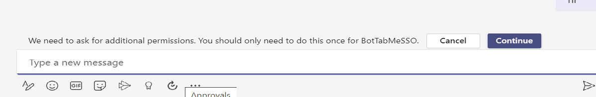
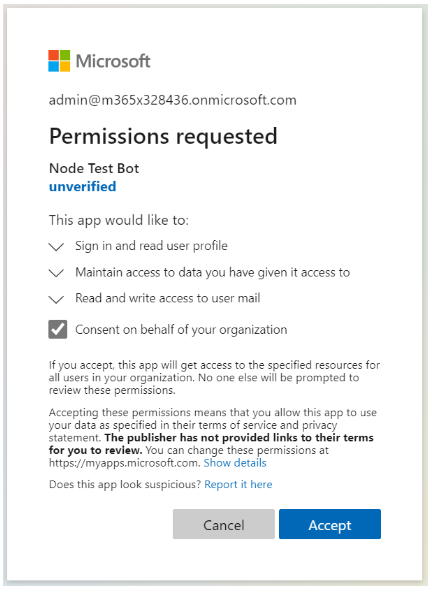
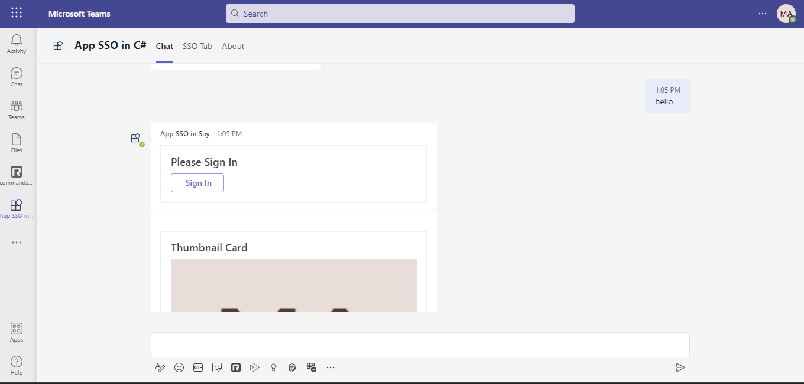
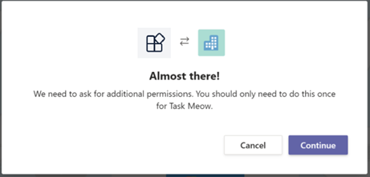
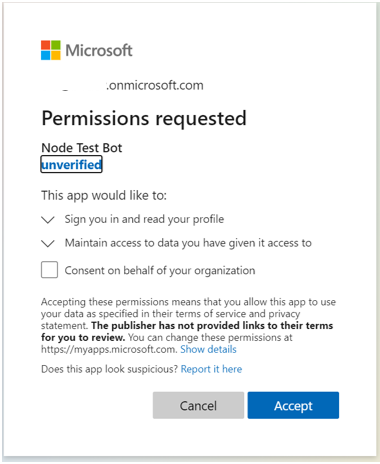

# App SSO C#

This app talks about the Teams Tab, Bot, ME - search, action, linkunfurl SSO with C#

__Tab SSO__

This sample shows how to implement Azure AD single sign-on support for tabs. It will

- Obtain an access token for the logged-in user using SSO
- Call a web service - also part of this project - to exchange this access token
- Call Graph and retrieve the user's profile

__Bot, ME SSO__

Bot Framework v4 bot using Teams authentication

This bot has been created using [Bot Framework](https://dev.botframework.com), it shows how to get started with authentication in a bot for Microsoft Teams.

The focus of this sample is how to use the Bot Framework support for oauth in your bot. Teams behaves slightly differently than other channels in this regard. Specifically an Invoke Activity is sent to the bot rather than the Event Activity used by other channels. _This Invoke Activity must be forwarded to the dialog if the OAuthPrompt is being used._ This is done by subclassing the ActivityHandler and this sample includes a reusable TeamsActivityHandler. This class is a candidate for future inclusion in the Bot Framework SDK.

The sample uses the bot authentication capabilities in [Azure Bot Service](https://docs.botframework.com), providing features to make it easier to develop a bot that authenticates users to various identity providers such as Azure AD (Azure Active Directory), GitHub, Uber, etc. The OAuth token is then used to make basic Microsoft Graph queries. Refer the **SSO** setup [documentation](https://docs.microsoft.com/en-us/microsoftteams/platform/bots/how-to/authentication/add-authentication?tabs=dotnet%2Cdotnet-sample).

> IMPORTANT: The manifest file in this app adds "token.botframework.com" to the list of `validDomains`. This must be included in any bot that uses the Bot Framework OAuth flow.

## Interaction with bot

 

## Prerequisites

1. A global administrator account for an Office 365 tenant. Testing in a production tenant is not recommended! You can get a free tenant for development use by signing up for the [Office 365 Developer Program](https://developer.microsoft.com/en-us/microsoft-365/dev-program) (not a guest account).


2. To test locally, you'll need [Ngrok](https://ngrok.com/) installed on your development machine.
Make sure you've downloaded and installed Ngrok on your local machine. ngrok will tunnel requests from the Internet to your local computer and terminate the SSL connection from Teams.

> NOTE: The free ngrok plan will generate a new URL every time you run it, which requires you to update your Azure AD registration, the Teams app manifest, and the project configuration. A paid account with a permanent ngrok URL is recommended.

3. Required Permissions
        * Make sure you have the following Graph permissions enabled: `email`, `offline_access`, `openid`, `profile`, and `User.Read` (default).
        * For permissions `Manage > API Permissions`
        * Our SSO flow will give you access to the first 4 permissions, and we will have to exchange the token server-side to get an elevated token for the `profile` permission (for example, if we want access to the user's profile photo).
        


## Setup

- Setup for Bot SSO
Refer to [Bot SSO Setup document](https://github.com/OfficeDev/Microsoft-Teams-Samples/blob/main/samples/bot-conversation-sso-quickstart/BotSSOSetup.md).

> **NOTE:**
Create [Bot Framework registration resource](https://docs.microsoft.com/en-us/azure/bot-service/bot-service-quickstart-registration) in Azure
    - Use the current `https` URL you were given by running ngrok. Append with the path `/api/messages` used by this sample
    - Ensure that you've [enabled the Teams Channel](https://docs.microsoft.com/en-us/azure/bot-service/channel-connect-teams?view=azure-bot-service-4.0)
    - __*If you don't have an Azure account*__ you can use this [Bot Framework registration](https://docs.microsoft.com/en-us/microsoftteams/platform/bots/how-to/create-a-bot-for-teams#register-your-web-service-with-the-bot-framework)

-  Clone the repository
   ```bash
    git clone https://github.com/OfficeDev/microsoft-teams-samples.git
    ```
-  Run the bot from a terminal or from Visual Studio:
    - Launch Visual Studio
    - File -> Open -> Project/Solution  
    - Navigate to `samples/csharp_dotnetcore/app_sso` folder
    - Select `app_sso.sln` file
    - Press `F5` to run the project

- Run ngrok - point to port `3978`

    ```bash
    ngrok http -host-header=localhost 4000
    ```
- Update the `appsettings.json` configuration for the bot to use the `MicrosoftAppId` (Microsoft App Id), `MicrosoftAppPassword` (App Password) and `connectionName` (OAuth Connection Name) from the Bot Framework registration. 
> NOTE: the App Password is referred to as the `client secret` in the azure portal and you can always create a new client secret anytime.

- __*This step is specific to Teams.*__
    - **Edit** the `manifest.json` contained in the  `teamsAppManifest` folder to replace your Microsoft App Id (that was created when you registered your bot earlier) *everywhere* you see the place holder string `<<YOUR-MICROSOFT-APP-ID>>` (depending on the scenario the Microsoft App Id may occur multiple times in the `manifest.json`) also update the `<<DOMAIN-NAME>>` with the ngrok URL
    - **Zip** up the contents of the `teamsAppManifest` folder to create a `manifest.zip`
    - **Upload** the `manifest.zip` to Teams (in the Apps view click "Upload a custom app")


## Running the sample.

> Note: This `manifest.json` specified that the bot will be installed in a "personal" scope only. Please refer to Teams documentation for more details.

You can interact with this bot by sending it a message. The bot will respond by requesting you to login to AAD, then making a call to the Graph API on your behalf and returning the results.
- Install App


- Type *anything* on the compose box and send
- The bot will perform `Single Sign-On` and Profile card will be displayed along with the option prompt to view the `token`


> **NOTE:** 
If the user is using the application for the first time and user consent is required for additional permissions, the following dialog box appears to continue with the consent experience



>If the bot couldn't perform `SSO` then it will fallback to normal Authentication method and show a `Sign In` card like below


- Open `Messaging Extension`(Search), it will show profile details


- Open `Messaging Extension`(Action), it will show profile details


__*or*__


- Open `Messaging Extension`(linkunfurl), The link will unfurl and show profile details

**Paste** https://profile.botframework.com on the compose box


> NOTE: If `SSO` couldn't be performed then it will fallback to normal Authentication method and you will get a default `Sign In` action

Consent the *ME Search* by clicking the `Sign In` link like below 


Consent the *ME Action* by clicking the `Setup` button like below 


- Open `SSO Tab`, Continue and then Accept and it'll show the profile details





## Deploy the bot to Azure

To learn more about deploying a bot to Azure, see [Deploy your bot to Azure](https://aka.ms/azuredeployment) for a complete list of deployment instructions.

## Further reading

- [Bot Framework Documentation](https://docs.botframework.com)
- [Bot Basics](https://docs.microsoft.com/azure/bot-service/bot-builder-basics?view=azure-bot-service-4.0)
- [SSO for Bot](https://docs.microsoft.com/en-us/microsoftteams/platform/bots/how-to/authentication/auth-aad-sso-bots)
- [SSO for Messaging Extensions](https://docs.microsoft.com/en-us/microsoftteams/platform/messaging-extensions/how-to/enable-sso-auth-me)
- [SSO for Tab](https://docs.microsoft.com/en-us/microsoftteams/platform/tabs/how-to/authentication/auth-aad-sso)
- [Azure Portal](https://portal.azure.com)
- [Add Authentication to Your Bot Via Azure Bot Service](https://docs.microsoft.com/en-us/azure/bot-service/bot-builder-authentication?view=azure-bot-service-4.0&tabs=csharp)
- [Activity processing](https://docs.microsoft.com/en-us/azure/bot-service/bot-builder-concept-activity-processing?view=azure-bot-service-4.0)
- [Azure Bot Service Introduction](https://docs.microsoft.com/azure/bot-service/bot-service-overview-introduction?view=azure-bot-service-4.0)
- [Azure Bot Service Documentation](https://docs.microsoft.com/azure/bot-service/?view=azure-bot-service-4.0)
- [Azure CLI](https://docs.microsoft.com/cli/azure/?view=azure-cli-latest)
- [Azure Portal](https://portal.azure.com)
- [Language Understanding using LUIS](https://docs.microsoft.com/en-us/azure/cognitive-services/luis/)
- [Channels and Bot Connector Service](https://docs.microsoft.com/en-us/azure/bot-service/bot-concepts?view=azure-bot-service-4.0)
- [Microsoft Teams Developer Platform](https://docs.microsoft.com/en-us/microsoftteams/platform/)

