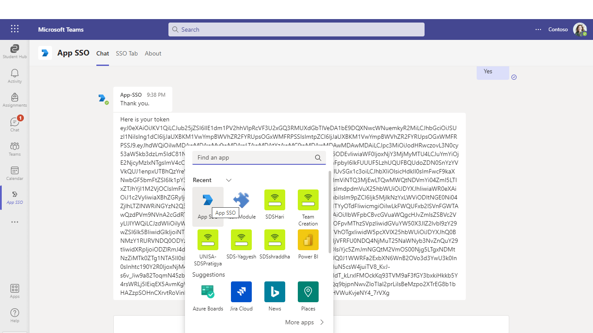
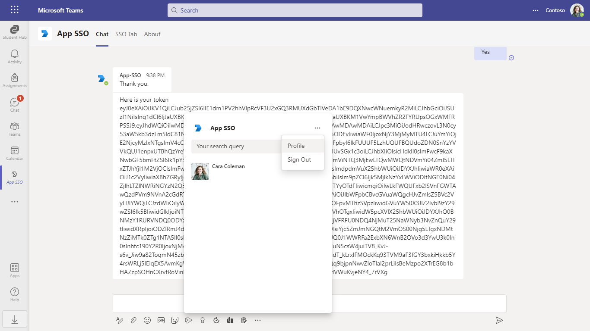
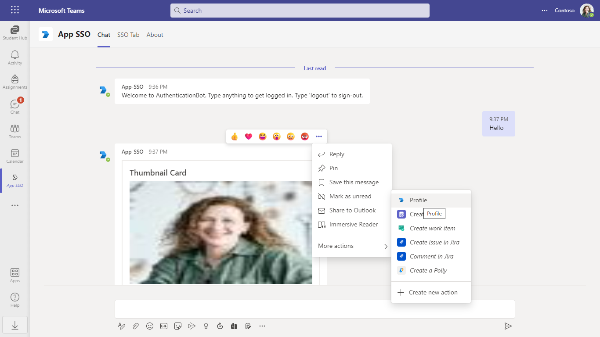

# App SSO C#

This app talks about the Teams Tab, Bot, Messaging Extension (ME) - search, action, linkunfurl SSO with C#

__Tab SSO__

This sample shows how to implement Azure AD single sign-on support for tabs. It will

- Obtain an access token for the logged-in user using SSO
- Call a web service - also part of this project - to exchange this access token
- Call Graph and retrieve the user's profile

__Bot, ME SSO__

Bot Framework v4 bot using Teams authentication

This bot has been created using [Bot Framework](https://dev.botframework.com), it shows how to get started with authentication in a bot for Microsoft Teams.

The focus of this sample is how to use the Bot Framework support for oauth in your bot. Teams behaves slightly differently than other channels in this regard. Specifically an Invoke Activity is sent to the bot rather than the Event Activity used by other channels. _This Invoke Activity must be forwarded to the dialog if the OAuthPrompt is being used._ This is done by subclassing the ActivityHandler and this sample includes a reusable TeamsActivityHandler. This class is a candidate for future inclusion in the Bot Framework SDK.

The sample uses the bot authentication capabilities in [Azure Bot Service](https://docs.botframework.com), providing features to make it easier to develop a bot that authenticates users to various identity providers such as Azure AD (Azure Active Directory), GitHub, Uber, etc. The OAuth token is then used to make basic Microsoft Graph queries. Refer the **SSO** setup [documentation](https://docs.microsoft.com/microsoftteams/platform/bots/how-to/authentication/add-authentication?tabs=dotnet%2Cdotnet-sample).

> IMPORTANT: The manifest file in this app adds "token.botframework.com" to the list of `validDomains`. This must be included in any bot that uses the Bot Framework OAuth flow.

## Included Features
* Teams SSO (bots, tabs, messaging extensions, link unfurling)
* Adaptive Cards
* MSAL.js 2.0 support

## Interaction with app

 

 ## Try it yourself - experience the App in your Microsoft Teams client
Please find below demo manifest which is deployed on Microsoft Azure and you can try it yourself by uploading the app package (.zip file link below) to your teams and/or as a personal app. (Sideloading must be enabled for your tenant, [see steps here](https://docs.microsoft.com/microsoftteams/platform/concepts/build-and-test/prepare-your-o365-tenant#enable-custom-teams-apps-and-turn-on-custom-app-uploading)).

**App SSO:** [Manifest](/samples/app-sso/csharp/demo-manifest/App-SSO.zip)

## Prerequisites

- Microsoft Teams is installed and you have an account
- [.NET SDK](https://dotnet.microsoft.com/download) version 6.0
- [ngrok](https://ngrok.com/) or equivalent tunnelling solution

1. A global administrator account for an Office 365 tenant. Testing in a production tenant is not recommended! You can get a free tenant for development use by signing up for the [Office 365 Developer Program](https://developer.microsoft.com/microsoft-365/dev-program) (not a guest account).

2. To test locally, you'll need [Ngrok](https://ngrok.com/) installed on your development machine.
Make sure you've downloaded and installed Ngrok on your local machine. ngrok will tunnel requests from the Internet to your local computer and terminate the SSL connection from Teams.

> NOTE: The free ngrok plan will generate a new URL every time you run it, which requires you to update your Azure AD registration, the Teams app manifest, and the project configuration. A paid account with a permanent ngrok URL is recommended.

## Setup

### 1. Setup for Bot SSO
- Setup for Bot SSO
Refer to [Bot SSO Setup document](https://github.com/OfficeDev/Microsoft-Teams-Samples/blob/main/samples/bot-conversation-sso-quickstart/BotSSOSetup.md).

- Ensure that you've [enabled the Teams Channel](https://docs.microsoft.com/en-us/azure/bot-service/channel-connect-teams?view=azure-bot-service-4.0)

- While registering the bot, use `https://<your_ngrok_url>/api/messages` as the messaging endpoint.
    > NOTE: When you create your bot you will create an App ID and App password - make sure you keep these for later.

### 2. Setup NGROK
1) Run ngrok - point to port 3978

```bash
# ngrok http 3978 --host-header="localhost:3978"
```
### 3. Setup for code

- Clone the repository

    ```bash
    git clone https://github.com/OfficeDev/Microsoft-Teams-Samples.git
    ```

- Run the bot from a terminal or from Visual Studio:

  A) From a terminal, navigate to `samples/app-sso/csharp`

  ```bash
  # run the bot
  dotnet run
  ```
  B) Or from Visual Studio

  - Launch Visual Studio
  - File -> Open -> Project/Solution
  - Navigate to `samples/app-sso/csharp` folder
  - Select `App SSO Sample.sln` file
  - Press `F5` to run the project

- Update the appsettings.json configuration for the bot to use the MicrosoftAppId (Microsoft App Id), MicrosoftAppPassword (App Password) and connectionName (OAuth Connection Name) and SiteUrl eg.(123.ngrok-free.app), TenantId (We can get from Azure app registration), ClientId (Is same appid), AppSecret (App Password) and ApplicationIdURI (api://botid-xxxxxxxxxxxxxxxxxxxxx) from the AAD app registration or from Bot Framework registration. SiteUrl as your application base URL.

**Bot Configuration:**


**Bot OAuth Connection:**


### 4. Register your Teams Auth SSO with Azure AD

1. Register a new application in the [Azure Active Directory – App Registrations](https://go.microsoft.com/fwlink/?linkid=2083908) portal.
2. Select **New Registration** and on the *register an application page*, set following values:
    * Set **name** to your app name.
    * Choose the **supported account types** (any account type will work)
    * Leave **Redirect URI** empty.
    * Choose **Register**.
3. On the overview page, copy and save the **Application (client) ID, Directory (tenant) ID**. You’ll need those later when updating your Teams application manifest and in the appsettings.json.
4. Under **Manage**, select **Expose an API**. 
5. Select the **Set** link to generate the Application ID URI in the form of `api://{AppID}`. Insert your fully qualified domain name (with a forward slash "/" appended to the end) between the double forward slashes and the GUID. The entire ID should have the form of: `api://fully-qualified-domain-name/botid-{AppID}`
    * ex: `api://%ngrokDomain%.ngrok-free.app/botid-00000000-0000-0000-0000-000000000000`.
6. Select the **Add a scope** button. In the panel that opens, enter `access_as_user` as the **Scope name**.
7. Set **Who can consent?** to `Admins and users`
8. Fill in the fields for configuring the admin and user consent prompts with values that are appropriate for the `access_as_user` scope:
    * **Admin consent title:** Teams can access the user’s profile.
    * **Admin consent description**: Allows Teams to call the app’s web APIs as the current user.
    * **User consent title**: Teams can access the user profile and make requests on the user's behalf.
    * **User consent description:** Enable Teams to call this app’s APIs with the same rights as the user.
9. Ensure that **State** is set to **Enabled**
10. Select **Add scope**
    * The domain part of the **Scope name** displayed just below the text field should automatically match the **Application ID** URI set in the previous step, with `/access_as_user` appended to the end:
        * `api://[ngrokDomain].ngrok-free.app/00000000-0000-0000-0000-000000000000/access_as_user.
11. In the **Authorized client applications** section, identify the applications that you want to authorize for your app’s web application. Each of the following IDs needs to be entered:
    * `1fec8e78-bce4-4aaf-ab1b-5451cc387264` (Teams mobile/desktop application)
    * `5e3ce6c0-2b1f-4285-8d4b-75ee78787346` (Teams web application)
**Note** If you want to test or extend your Teams apps across Office and Outlook, kindly add below client application identifiers while doing Azure AD app registration in your tenant:
   * `4765445b-32c6-49b0-83e6-1d93765276ca` (Office web)
   * `0ec893e0-5785-4de6-99da-4ed124e5296c` (Office desktop)
   * `bc59ab01-8403-45c6-8796-ac3ef710b3e3` (Outlook web)
   * `d3590ed6-52b3-4102-aeff-aad2292ab01c` (Outlook desktop)    
12. Navigate to **API Permissions**, and make sure to add the follow permissions:
-   Select Add a permission
-   Select Microsoft Graph -\> Delegated permissions.
    * User.Read (enabled by default)
    * email
    * offline_access
    * OpenId
    * profile
-   Click on Add permissions. Please make sure to grant the admin consent for the required permissions.


13. Navigate to **Authentication**
    If an app hasn't been granted IT admin consent, users will have to provide consent the first time they use an app.
    - Set a redirect URI:
    * Select **Add a platform**.
    * Select **Single-page application**.
    * Enter the **redirect URI** for the app in the following format: 
      1) https://%ngrokDomain%.ngrok-free.app/Auth/End

    - Set another redirect URI:
    * Select **Add a platform**.
    * Select **web**.
    * Enter the **redirect URI** for the app in the following format: 
      1) https://token.botframework.com/.auth/web/redirect
    
14.  Navigate to the **Certificates & secrets**. In the Client secrets section, click on "+ New client secret". Add a description      (Name of the secret) for the secret and select “Never” for Expires. Click "Add". Once the client secret is created, copy its value, it need to be placed in the appsettings.json.

 ### 5. Setup Manifest for Teams

**This step is specific to Teams.**
   - **Edit** the `manifest.json` contained in the  `TeamsAppManifest` folder to replace your Microsoft App Id (that was created when you registered your bot earlier) *everywhere* you see the place holder string `<<YOUR-MICROSOFT-APP-ID>>` (depending on the scenario the Microsoft App Id may occur multiple times in the `manifest.json`)
   - **Edit** the `manifest.json` for `validDomains` and `<<DOMAIN-NAME>>` with base Url domain. E.g. if you are using ngrok it would be `https://1234.ngrok-free.app` then your domain-name will be `1234.ngrok-free.app`.
   - **Note:** If you want to test your app across multi hub like: Outlook/Office.com, please update the `manifest.json` in the `app-sso\csharp\App SSO Sample` folder with the required values.
   - **Zip** up the contents of the `TeamsAppManifest` folder to create a `manifest.zip` or `Manifest_Hub` folder into a `manifest.zip`.(Make sure that zip file does not contains any subfolder otherwise you will get error while uploading your .zip package)
   - **Upload** the `manifest.zip` to Teams (In Teams Apps/Manage your apps click "Upload an app". Browse to and Open the .zip file. At the next dialog, click the Add button.)

**Note**: This `manifest.json` specified that the bot will be installed in a "personal" scope only. Please refer to Teams documentation for more details. 
  
- If you are facing any issue in your app, please uncomment [this](https://github.com/OfficeDev/Microsoft-Teams-Samples/blob/main/samples/app-sso/csharp/App%20SSO%20Sample/AdapterWithErrorHandler.cs#L255) line and put your debugger for local debug.

## Running the sample

You can interact with this bot by sending it a message. The bot will respond by requesting you to login to AAD, then making a call to the Graph API on your behalf and returning the results.

**Install App:**


**Welcome Card:**


- Type *anything* on the compose box and send
- The bot will perform `Single Sign-On` and Profile card will be displayed along with the option prompt to view the `token`


**Would you like to view your token:**


**Click token Yes:**


**Open Messaging Extension (Search), it will show profile details:**



**Open App SSO**


**Open Messaging Extension (Action), it will show profile details:**



**Click profile UI:**


**Select profile UI:**



**Click profile UI:**


**Open Messaging Extension (linkunfurl), The link will unfurl and show profile details:**

**Paste** https://profile.botframework.com on the compose box


**Open SSO Tab Continue and then Accept and it'll show the profile details:**


**Install app other tenant:**


> NOTE: If `SSO` couldn't be performed then it will fallback to normal Authentication method and you will get a default `Sign In` action

**Consent the ME Search by clicking the Sign In link like below:**


**Consent the ME Action by clicking the Setup button like below:**


## Outlook on the web

- To view your app in Outlook on the web.

- Go to [Outlook on the web](https://outlook.office.com/mail/)and sign in using your dev tenant account.

**On the side bar, select More Apps. Your sideloaded app title appears among your installed apps**


**Select your app icon to launch and preview your app running in Outlook on the web**


**Note:** Similarly, you can test your application in the Outlook desktop app as well.

## Office on the web

- To preview your app running in Office on the web.

- Log into office.com with test tenant credentials

**Select the Apps icon on the side bar. Your sideloaded app title appears among your installed apps**


**Select your app icon to launch your app in Office on the web**

 

**Note:** Similarly, you can test your application in the Office 365 desktop app as well.

## Deploy the bot to Azure

To learn more about deploying a bot to Azure, see [Deploy your bot to Azure](https://aka.ms/azuredeployment) for a complete list of deployment instructions.

## Further reading

- [Bot Framework Documentation](https://docs.botframework.com)
- [Bot Basics](https://docs.microsoft.com/azure/bot-service/bot-builder-basics?view=azure-bot-service-4.0)
- [SSO for Bot](https://docs.microsoft.com/microsoftteams/platform/bots/how-to/authentication/auth-aad-sso-bots)
- [SSO for Messaging Extensions](https://docs.microsoft.com/microsoftteams/platform/messaging-extensions/how-to/enable-sso-auth-me)
- [SSO for Tab](https://docs.microsoft.com/en-us/microsoftteams/platform/tabs/how-to/authentication/auth-aad-sso)
- [Azure Portal](https://portal.azure.com)
- [Add Authentication to Your Bot Via Azure Bot Service](https://docs.microsoft.com/azure/bot-service/bot-builder-authentication?view=azure-bot-service-4.0&tabs=csharp)
- [Azure Bot Service Introduction](https://docs.microsoft.com/azure/bot-service/bot-service-overview-introduction?view=azure-bot-service-4.0)
- [Azure Bot Service Documentation](https://docs.microsoft.com/azure/bot-service/?view=azure-bot-service-4.0)
- [Extend Teams apps across Microsoft 365](https://learn.microsoft.com/microsoftteams/platform/m365-apps/overview)

