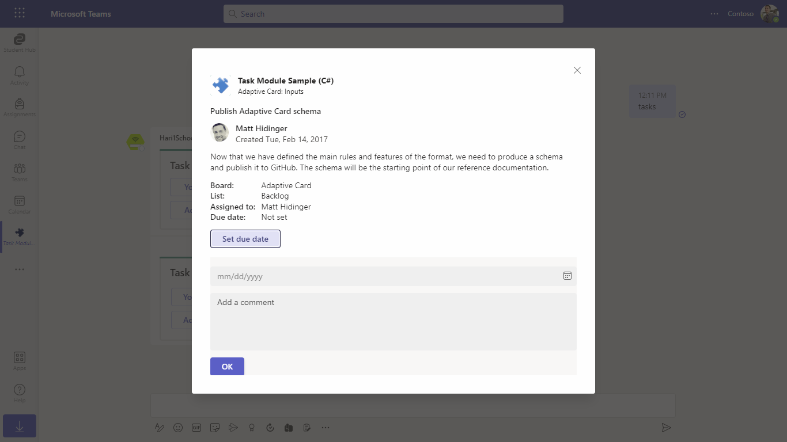
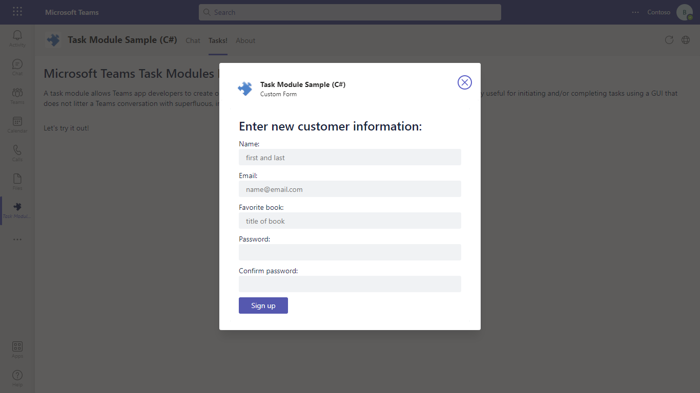
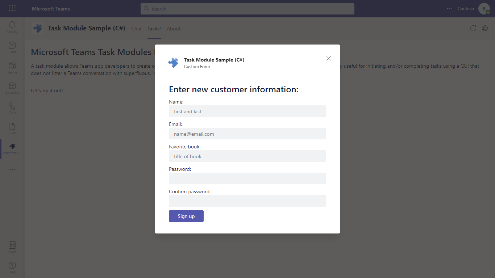
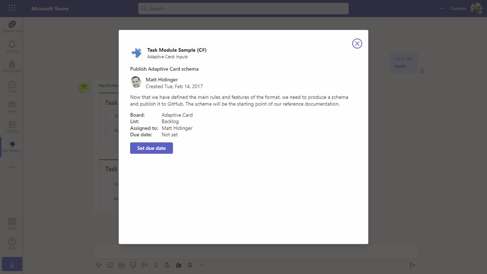
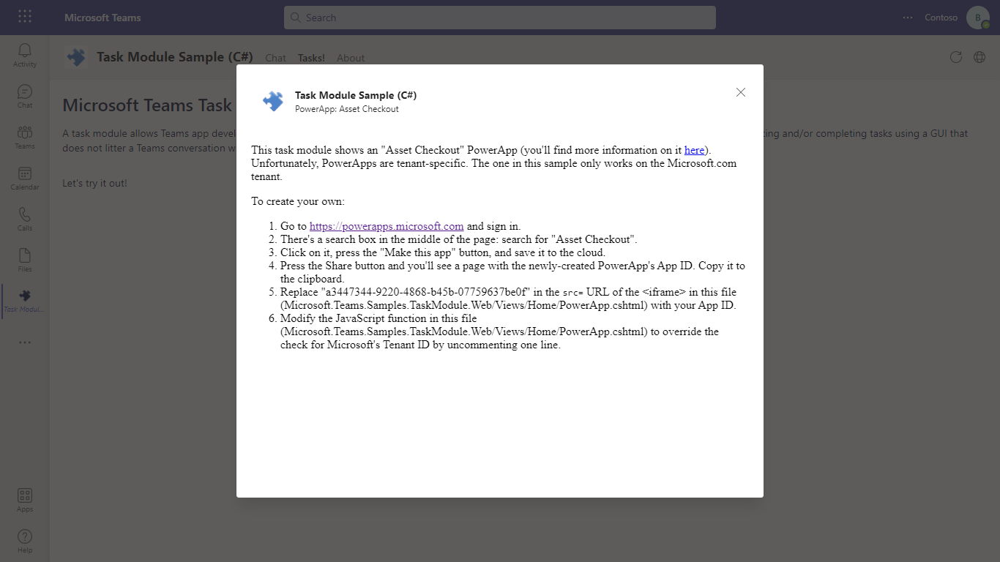
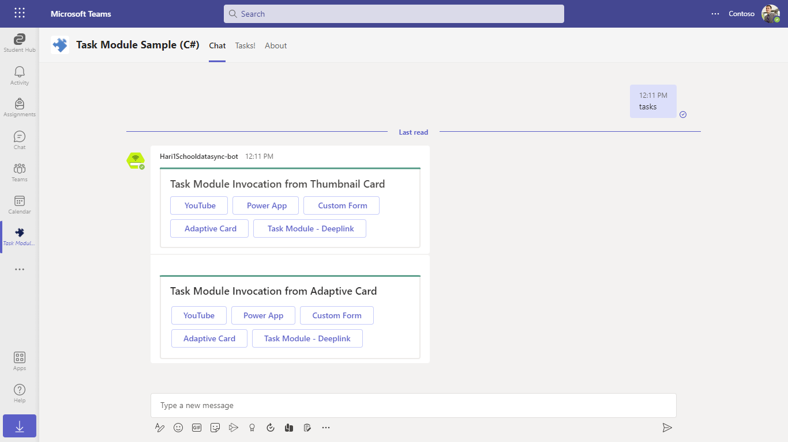
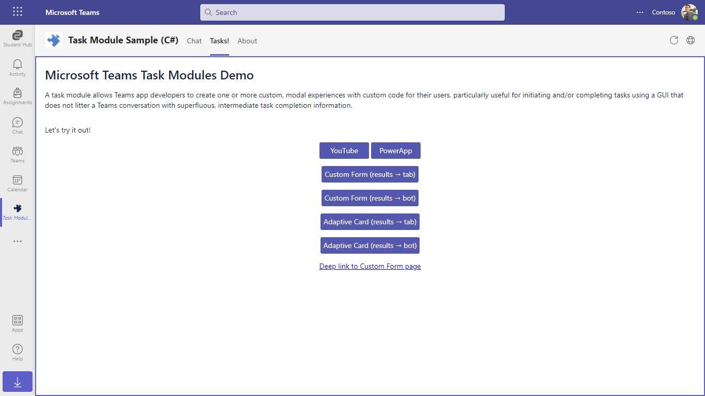
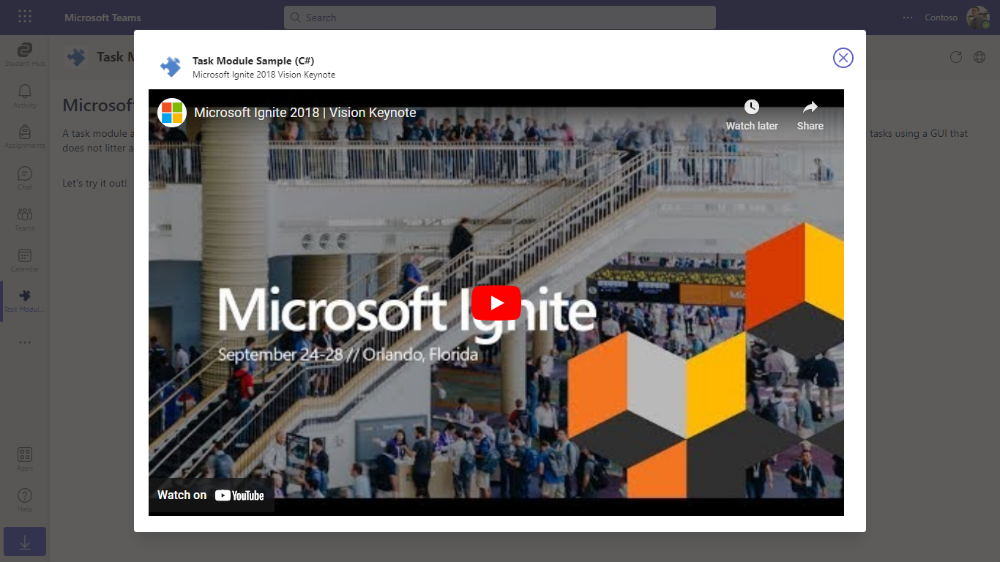

# Microsoft Teams task module
A task module allows you to create modal popup experiences in your Teams application. Inside the popup, you can run your own custom HTML/JavaScript code, show an `<iframe>`-based widget such as a YouTube or Microsoft Stream video, or display an [Adaptive card](https://docs.microsoft.com/en-us/adaptive-cards/).

Task modules build on the foundation of Microsoft Teams tabs: a task module is essentially a tab in a popup window. It uses the same SDK, so if you've built a tab you are already 90% of the way to being able to create a task module.

## Included Features
* Bots
* Tabs
* Task Modules
* Adaptive Cards


## Interaction with app


## Prerequisites

- [.NET Core SDK](https://dotnet.microsoft.com/download) version 3.1

  determine dotnet version 
  ```bash
  dotnet --version
  ```
- [Ngrok](https://ngrok.com/download) (For local environment testing) Latest (any other tunneling software can also be used)
  
- [Teams](https://teams.microsoft.com) Microsoft Teams is installed and you have an account


## Setup

1. Register a new application in the [Azure Active Directory – App Registrations](https://go.microsoft.com/fwlink/?linkid=2083908) portal.

2. Setup for Bot

- Register a bot with Azure Bot Service, following the instructions [here](https://docs.microsoft.com/en-us/azure/bot-service/bot-service-quickstart-registration?view=azure-bot-service-3.0).
- Ensure that you've [enabled the Teams Channel](https://docs.microsoft.com/en-us/azure/bot-service/channel-connect-teams?view=azure-bot-service-4.0)
- While registering the bot, use `https://<your_ngrok_url>/api/messages` as the messaging endpoint.
    > NOTE: When you create your bot you will create an App ID and App password - make sure you keep these for later.
    
3. Setup NGROK
 - Run ngrok - point to port 3978

```bash
  ngrok http 3978 --host-header="localhost:3978"
```

4. Setup for code

- Clone the repository

    ```bash
    git clone https://github.com/OfficeDev/Microsoft-Teams-Samples.git
    ```
- From a terminal, navigate to `samples/app-task-module/csharp`
    
-  Modify the /web.config in appSettings section and fill in the {{ MicrosoftAppId }},{{ MicrosoftAppPassword }} with the id from step 1 and {{BaseUrl}} we get from previous step. ngrok BaseUrl will look something like `https://abc21-hun-12ef.ngrok-free.app`.
 
- Run the bot from a terminal or from Visual Studio:

  A) From a terminal, navigate to `samples/app-task-module/csharp`

  ```bash
  # run the bot
  dotnet run
  ```
  
  B) Or from Visual Studio

  - Launch Visual Studio
  - File -> Open -> Project/Solution
  - Navigate to `samples/app-task-module/csharp` folder
  - Select `Microsoft.Teams.Samples.TaskModule.sln` file
  - Press `F5` to run the project
  
5. Setup Manifest for Teams
- __*This step is specific to Teams.*__
    - **Edit** the `manifest.json` contained in the ./Manifest folder to replace your Microsoft App Id (that was created when you registered your app registration earlier) *everywhere* you see the place holder string `{{Microsoft-App-Id}}` (depending on the scenario the Microsoft App Id may occur multiple times in the `manifest.json`)
    - **Edit** the `manifest.json` for `validDomains` and replace `{{domain-name}}` with base Url of your domain. E.g. if you are using ngrok it would be `https://1234.ngrok-free.app` then your domain-name will be `1234.ngrok-free.app`.
    - **Note:** If you want to test your app across multi hub like: Outlook/Office.com, please update the `manifest.json` in the `app-task-module\csharp\Microsoft.Teams.Samples.TaskModule.Web\Manifest_Hub` folder with the required values.
    - **Zip** up the contents of the `Manifest` folder to create a `Manifest.zip` or `Manifest_Hub` folder into a `Manifest_Hub.zip`. (Make sure that zip file does not contains any subfolder otherwise you will get error while uploading your .zip package)

- Upload the manifest.zip to Teams (in the Apps view click "Upload a custom app")
   - Go to Microsoft Teams. From the lower left corner, select Apps
   - From the lower left corner, choose Upload a custom App
   - Go to your project directory, the ./Manifest folder, select the zip folder, and choose Open.
   - Select Add in the pop-up dialog box. Your app is uploaded to Teams.
   
## Deploy the bot to Azure

To learn more about deploying a bot to Azure, see [Deploy your bot to Azure](https://aka.ms/azuredeployment) for a complete list of deployment instructions.
## Overview of this sample

* **A personal app.** When you upload the [Task Module CSharp.zip](Microsoft.Teams.Samples.TaskModule.Web/Manifest/TaskModuleCSharp.zip) file, choose "Add for you" and "Task Module CSharp" will appear in the "..." menu in the Teams app bar. The personal app has both a tab and a bot.
* **A channel tab.** Add the app to a team, then add a Task Module CSharp tab and choose "Task Module Demo" from the radio button list.
* **A channel bot.** Add the app to a team, then chat with it (@Task Module CSharp).

The tab shows how to invoke the task module using the Teams SDK. Source code for the tab is found in [Tasks.cshtml](Microsoft.Teams.Samples.TaskModule.Web/Views/Home/Tasks.cshtml). 

The following task modules are supported:

* YouTube, which is comprised of a [generic template for embedded `<iframe>` experiences](Microsoft.Teams.Samples.TaskModule.Web/Views/Shared/_EmbedPage.cshtml) (also used for the PowerApp task module below) plus a [one-line stub containing the YouTube embed URL](Microsoft.Teams.Samples.TaskModule.Web/Views/Home/YouTube.cshtml)
* [PowerApp](Microsoft.Teams.Samples.TaskModule.Web/Views/Home/PowerApp.cshtml) &mdash; unfortunately it doesn't work out of the box; click the button or see the [source code](Microsoft.Teams.Samples.TaskModule.Web/Views/Home/PowerApp.cshtml) for details on how you can customize it for your tenant
* There are two custom form examples:
  * Showing the results of a custom form returned to the tab
  * Showing the results of a custom form returned to the bot
* There are two Adaptive card examples:
  * Showing the results of an `Action.Submit` button returned to the tab
  * Showing the results returned to the bot as a message

The sample app also contains a bot with cards allowing you to invoke these task modules. You can invoke them from an Adaptive card or from a Bot Framework thumbnail card. [RootDialog.cs](Microsoft.Teams.Samples.TaskModule.Web/Dialogs/RootDialog.cs) contains the code for the cards, and [MessagesController.cs](Microsoft.Teams.Samples.TaskModule.Web/Controllers/MessagesController.cs) contains the code for responding to `task/fetch` and `task/submit` messages.

## Implementation notes

  * Metadata used to generate [TaskInfo objects](https://docs.microsoft.com/en-us/microsoftteams/platform/concepts/task-modules/task-modules-overview#the-taskinfo-object) is in [TaskModel.cs](Microsoft.Teams.Samples.TaskModule.Web/Models/TaskModel.cs).
  * Model classes for handling [Bot Framework card actions vs. Adaptive card Action.Submit actions](https://docs.microsoft.com/en-us/microsoftteams/platform/concepts/task-modules/task-modules-bots#bot-framework-card-actions-vs-adaptive-card-actionsubmit-actions) are defined in [CardActionValue.cs](Microsoft.Teams.Samples.TaskModule.Web/Models/CardActionValue.cs)
  * Deeplink is generated in [DeeplinkHelper.cs](Microsoft.Teams.Samples.TaskModule.Web/Helper/DeeplinkHelper.cs)

## Running the sample

















## Outlook on the web

- To view your app in Outlook on the web.

- Go to [Outlook on the web](https://outlook.office.com/mail/)and sign in using your dev tenant account.

**On the side bar, select More Apps. Your sideloaded app title appears among your installed apps**


**Select your app icon to launch and preview your app running in Outlook on the web**


**Note:** Similarly, you can test your application in the Outlook desktop app as well.

## Office on the web

- To preview your app running in Office on the web.

- Log into office.com with test tenant credentials

**Select the Apps icon on the side bar. Your sideloaded app title appears among your installed apps**


**Select your app icon to launch your app in Office on the web**

 

**Note:** Similarly, you can test your application in the Office 365 desktop app as well.

## Contributing

This project welcomes contributions and suggestions.  Most contributions require you to agree to a
Contributor License Agreement (CLA) declaring that you have the right to, and actually do, grant us
the rights to use your contribution. For details, visit <https://cla.microsoft.com.>

When you submit a pull request, a CLA-bot will automatically determine whether you need to provide
a CLA and decorate the PR appropriately (e.g., label, comment). Simply follow the instructions
provided by the bot. You will only need to do this once across all repos using our CLA.

This project has adopted the [Microsoft Open Source Code of Conduct](https://opensource.microsoft.com/codeofconduct/).
For more information see the [Code of Conduct FAQ](https://opensource.microsoft.com/codeofconduct/faq/) or
contact [opencode@microsoft.com](mailto:opencode@microsoft.com) with any additional questions or comments.

## Further reading

- [Extend Teams apps across Microsoft 365](https://learn.microsoft.com/en-us/microsoftteams/platform/m365-apps/overview)


