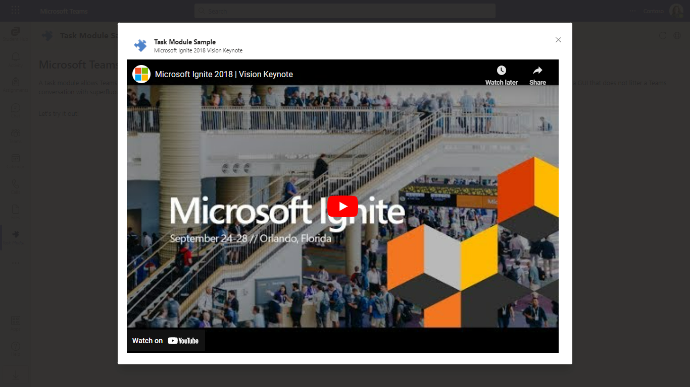
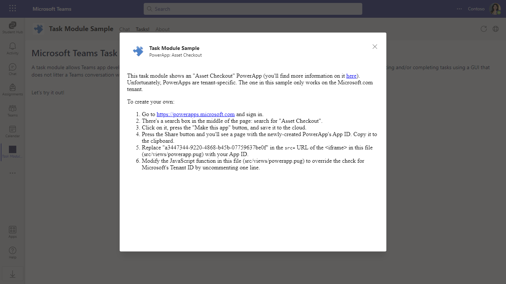
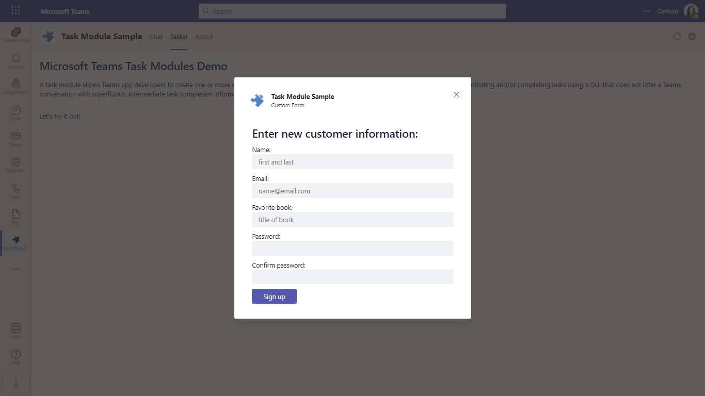
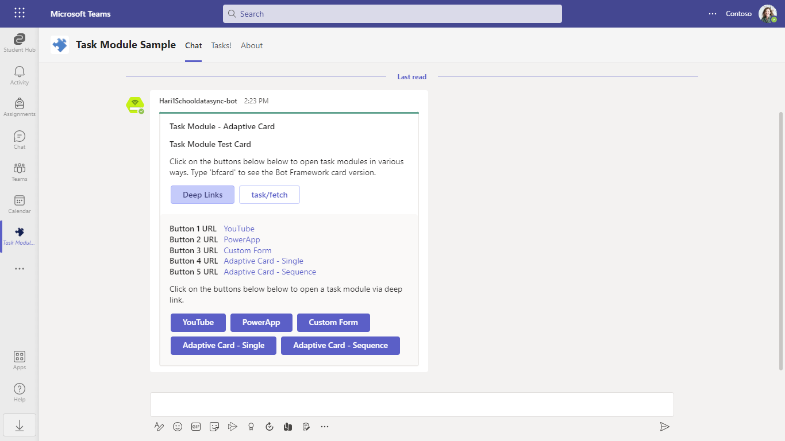
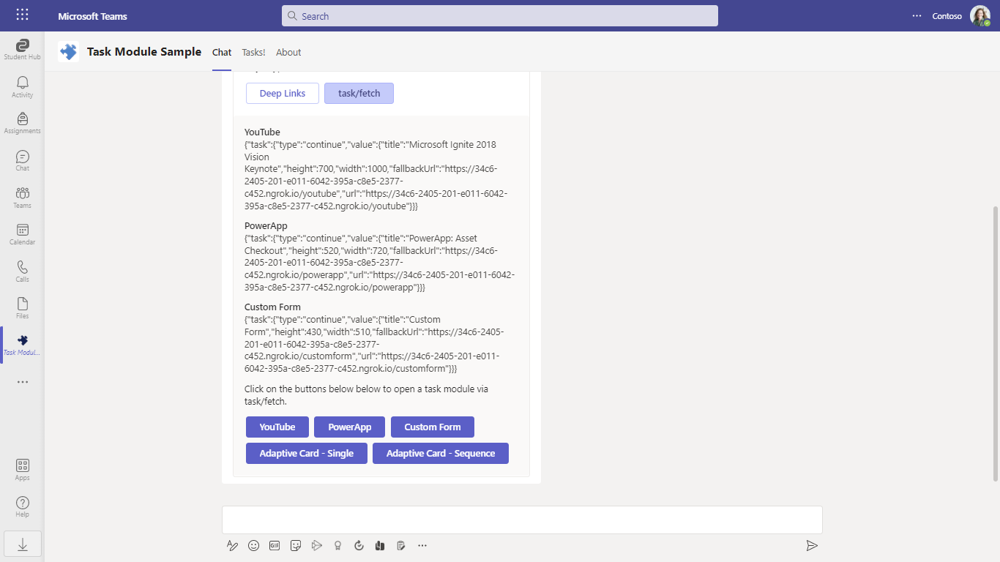

# Microsoft Teams task module

A task module allows you to create modal popup experiences in your Teams application. Inside the popup, you can run your own custom HTML/JavaScript code, show an `<iframe>`-based widget such as a YouTube or Microsoft Stream video, or display an [Adaptive card](https://docs.microsoft.com/en-us/adaptive-cards/).

Task modules build on the foundation of Microsoft Teams tabs: a task module is essentially a tab in a popup window. It uses the same SDK, so if you've built a tab you are already 90% of the way to being able to create a task module.

## Included Features
* Bots
* Tabs
* Task Modules
* Adaptive Cards

## Interaction with app


## Prerequisites

- Microsoft Teams is installed and you have an account (not a guest account)
-  [NodeJS](https://nodejs.org/en/)
-  [ngrok](https://ngrok.com/download) or equivalent tunneling solution
-  [M365 developer account](https://docs.microsoft.com/en-us/microsoftteams/platform/concepts/build-and-test/prepare-your-o365-tenant) or access to a Teams account with the 
   appropriate permissions to install an app.
   
 ## Setup
 
 1. Register a new application in the [Azure Active Directory – App Registrations](https://go.microsoft.com/fwlink/?linkid=2083908) portal.
   
 2. Setup for Bot
- In Azure portal, create a [Azure Bot resource](https://docs.microsoft.com/en-us/azure/bot-service/bot-builder-authentication?view=azure-bot-service-4.0&tabs=csharp%2Caadv2).
- Ensure that you've [enabled the Teams Channel](https://docs.microsoft.com/en-us/azure/bot-service/channel-connect-teams?view=azure-bot-service-4.0)
- While registering the bot, use `https://<your_ngrok_url>/api/messages` as the messaging endpoint.
**NOTE:** When you create app registration, you will create an App ID and App password - make sure you keep these for later.

3. Setup NGROK

 - Run ngrok - point to port 3978

    ```bash
    ngrok http 3978 --host-header="localhost:3978"
    ```
4. Setup for code
  - Clone the repository

    ```bash
    git clone https://github.com/OfficeDev/Microsoft-Teams-Samples.git
    ```
  - In a terminal, navigate to `samples/app-task-module/nodejs`
  
  - Update the `.env` configuration for the bot to use the `MICROSOFT_APP_ID` and `MICROSOFT_APP_PASSWORD` from the Azure Bot resource. (Note that the MicrosoftAppId is the AppId created in step 1, the MicrosoftAppPassword is referred to as the "client secret" in step 1 and you can always create a new client secret anytime.). For `BASE_URI` provide the application base url, you get by running ngrok it should look something like `https://abc21-hun-12ef.ngrok-free.app`

  - Install modules

    ```bash
    npm install
    ```
  - Build application:

    ```bash
    npm run build
    ```

  - Run your app.
  
    ```bash
    npm start
    ```
5. Setup Manifest for Teams
- __*This step is specific to Teams.*__
    - **Edit** the `manifest.json` contained in the `appPackage` folder to replace your Microsoft App Id (that was created when you registered your app registration earlier) *everywhere* you see the place holder string `{{Microsoft-App-Id}}` (depending on the scenario the Microsoft App Id may occur multiple times in the `manifest.json`)
    - **Edit** the `manifest.json` for `validDomains` and replace `{{domain-name}}` with base Url of your domain. E.g. if you are using ngrok it would be `https://1234.ngrok-free.app` then your domain-name will be `1234.ngrok-free.app`.
    -  **Note:** If you want to test your app across multi hub like: Outlook/Office.com, please update the `manifest.json` in the `app-task-module\nodejs\Manifest_Hub` folder with the required values.
    - **Zip** up the contents of the `appPackage` folder to create a `Manifest.zip` or `Manifest_Hub` folder into a `Manifest_Hub.zip`. (Make sure that zip file does not contains any subfolder otherwise you will get error while uploading your .zip package)

- Upload the manifest.zip to Teams (in the Apps view click "Upload a custom app")
   - Go to Microsoft Teams. From the lower left corner, select Apps
   - From the lower left corner, choose Upload a custom App
   - Go to your project directory, the `appPackage` folder, copy that file and paste someother folder then zip, and choose Open.
   - Select Add in the pop-up dialog box. Your app is uploaded to Teams. 
   
 ## Overview of this sample

This sample app was developed in conjunction with the task module feature itself to exercise as much of it as possible. Here's what's included:

* **A channel tab.** Add the app to a team, then add a Task Module tab and choose "Task Module Demo" from the dropdown list.
* **A bot.** Add the app to a team, then chat with it (@Task Module)
* **A personal app.** When you upload the [TaskModule.zip](TaskModule.zip) file, choose "Add for you" and "Task Module" will appear in the "..." menu in the Teams app bar. The personal app has both a tab and a bot.

The tab shows how to invoke the task module using the Teams SDK. Source code for the tab is found in [TaskModuleTab.ts](src/TaskModuleTab.ts); the view definition is in [taskmodule.pug](src/views/taskmodule.pug). This sample app uses [Pug](https://pugjs.org) (formerly Jade) for HTML rendering.

## Running the sample

* YouTube, which is comprised of a [generic template for embedded `<iframe>` experiences](src/views/embed.pug) (also used for the PowerApp task module below) plus a [four-line stub containing the YouTube embed URL](src/views/youtube.pug)


* [PowerApp](src/views/powerapp.pug) &mdash; unfortunately it doesn't work out of the box; click the button or see the [source code](src/views/powerapp.pug) for details on how you can customize it for your tenant


* [A simple HTML form](src/views/customform.pug)


* There are two Adaptive card examples:
  * Showing the results of an `Action.Submit` button returned to the tab
  * Showing the results returned to the bot as a message

The sample app also contains a bot with cards allowing you to invoke these task modules.





You can invoke them from an Adaptive card (using the _tasks_ command) or from a Bot Framework thumbnail card (using the _bfcard_ command). 

[RootDialog.ts](src/dialogs/RootDialog.ts) contains the code for the _tasks_ and _bfcard_ commands, and [TeamsBot.ts](src/TeamsBot.ts) contains the code for responding to `task/fetch` and `task/submit` messages. The task modules when invoked from a bot are the same as for the tab, except for the Adaptive card examples:

* _Adaptive Card - Single_ returns the results to the conversation as a message.
* _Adaptive Card - Sequence_ shows how adaptive cards can be chained together: instead of returning the result to the chat, the result is shown in another Adaptive card.

## Outlook on the web

- To view your app in Outlook on the web.

- Go to [Outlook on the web](https://outlook.office.com/mail/)and sign in using your dev tenant account.

**On the side bar, select More Apps. Your sideloaded app title appears among your installed apps**


**Select your app icon to launch and preview your app running in Outlook on the web**


**Note:** Similarly, you can test your application in the Outlook desktop app as well.

## Office on the web

- To preview your app running in Office on the web.

- Log into office.com with test tenant credentials

**Select the Apps icon on the side bar. Your sideloaded app title appears among your installed apps**


**Select your app icon to launch your app in Office on the web**

  

  

**Note:** Similarly, you can test your application in the Office 365 desktop app as well.

## Implementation notes

* This sample is data-driven as much as possible and shares as much code as possible between the bot and the tabs forms of task module:
  * Metadata used to generate [TaskInfo objects](https://docs.microsoft.com/en-us/microsoftteams/platform/concepts/task-modules/task-modules-overview#the-taskinfo-object) is in [contants.ts](src/constants.ts).
  * All cards are generated via JSON templates in [the cardTemplates collection in CardTemplates.ts](src/dialogs/CardTemplates.ts) and rendered using the [ST-JS (Select Transform) JavaScript library](https://st-js.github.io/reference.html). The values in `cardTemplates` have data placeholders, e.g. `{{title}}`; JavaScript objects are created in [TaskModuleTab.ts](src/TaskModuleTab.ts) and [RootDialog.ts](src/dialogs/RootDialog.ts), and helper functions in [CardUtils.ts](src/utils/CardUtils.ts) are used to render the cards.
  * Deep links are generated in the `taskModuleLink()` function in [DeepLinks.ts](src/utils/DeepLinks.ts).
  * Except for the JavaScript in the task modules themselves, all code is in TypeScript. Three source files, [contants.ts](src/constants.ts), [DeepLinks.ts](src/utils/DeepLinks.ts), and [CardTemplates.ts](src/dialogs/CardTemplates.ts) are used on both the client (tab) and server (bot). [Browserify](https://browserify.org) is used in the [gulpfile.js](gulpfile.js) build script to bundle the JavaScript generated by TypeScript; this script file is referenced by [taskmodule.pug](src/views/taskmodule.pug).
* The logic for handling `task/fetch` messages is also data-driven, shared across card types (Adaptive and Bot Framework), and supports chaining of Adaptive card task modules. The data-driven approach for card generation combined with the fact that the Adaptive and Bot Framework card schemas are quite different unfortunately means that the way it works is not obvious. Here's how it works:
  * All the `task/fetch` and `task/submit` requests and responses are JavaScript objects defined in the `fetchTemplates[]` collection in [CardTemplates.ts](src/dialogs/CardTemplates.ts) and generated in [TeamsBot.ts](src/TeamsBot.ts) in the `onInvoke()` function.
  * The custom properties `data.taskModule` (for Adaptive card `Action.Submit` buttons) and `value.taskModule` (for Bot Framework card actions) are used as lookup values to select a specific response from the `fetchTemplates[]` collection when a `task/fetch` message is received.
  * Adaptive card chaining &mdash; showing multiple adaptive cards in a sequence &mdash; is implemented using the `data.taskResponse` property on an Adaptive card `Action.Submit` button. With _Adaptive Card - Single_, the card is rendered with `data.taskResponse` set to "message" (show a message to the user); for _Adaptive Card - Sequence_, the same Adaptive card is rendered with `data.taskResponse` set to "continue" (show another Adaptive card). This is the only difference between `fetchTemplates.adaptivecard1` and `fetchTemplates.adaptivecard2`. The second Adaptive card (`cardTemplates.acSubmitResponse` in [CardTemplates.ts](src/dialogs/CardTemplates.ts)) in the sequence just shows the JSON submitted in the first; its `data.taskResponse` is set to "final". The logic for handling the various values of `data.taskResponse` is in [TeamsBot.ts](src/TeamsBot.ts). The `taskResponse` values form a simple "protocol" for responding to the different ways to respond to `task/submit` messages: do nothing (complete), show a message to the user, load a subsequent adaptive card in a sequence, or load the final adaptive card in a sequence.
* To avoid hardcoding an `appId` in [customform.pug](src/views/customform.pug), the `appId` is passed in at Pug template rendering time by [tabs.ts, the TypeScript  which implements the tab routes](src/tabs.ts).
* Theming and simple keyboard handling for the Esc key are supported.

## Bonus features

There's also an _actester_ bot command. It's a handy way of seeing what an Adaptive card looks like in Teams - simply copy/paste the JSON of Adaptive cards, e.g. the [Samples page on the Adaptive card site](http://adaptivecards.io/samples/), and the bot will render it as a reply.


## Contributing

This project welcomes contributions and suggestions.  Most contributions require you to agree to a
Contributor License Agreement (CLA) declaring that you have the right to, and actually do, grant us
the rights to use your contribution. For details, visit <https://cla.microsoft.com.>

When you submit a pull request, a CLA-bot will automatically determine whether you need to provide
a CLA and decorate the PR appropriately (e.g., label, comment). Simply follow the instructions
provided by the bot. You will only need to do this once across all repos using our CLA.

This project has adopted the [Microsoft Open Source Code of Conduct](https://opensource.microsoft.com/codeofconduct/).
For more information see the [Code of Conduct FAQ](https://opensource.microsoft.com/codeofconduct/faq/) or
contact [opencode@microsoft.com](mailto:opencode@microsoft.com) with any additional questions or comments.

## Further reading

- [Extend Teams apps across Microsoft 365](https://learn.microsoft.com/en-us/microsoftteams/platform/m365-apps/overview)

