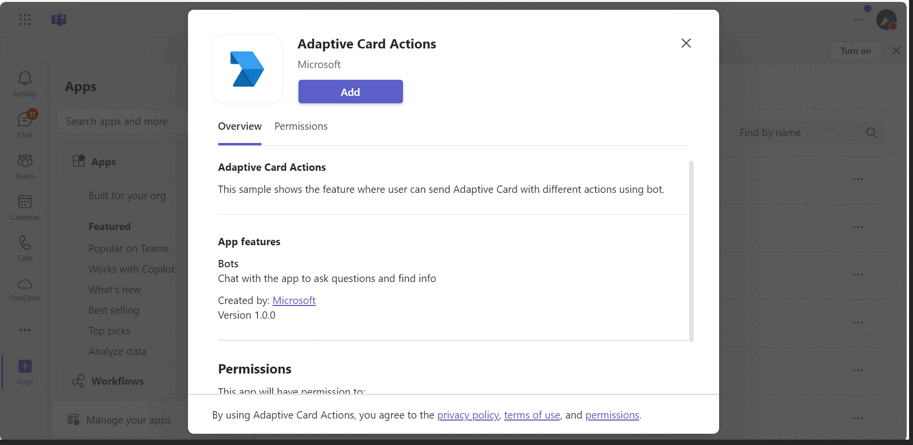

# Send Adaptive Card Including Different Actions - NodeJS

This sample shows the feature where user can send adaptive card with different actions using bot.

## Interaction with app



## Prerequisites

-  Microsoft Teams is installed and you have an account (not a guest account)
-  To test locally, [NodeJS](https://nodejs.org/en/download/) must be installed on your development machine (version 18.12.1)
-  [ngrok](https://ngrok.com/) or equivalent tunneling solution
-  [M365 developer account](https://docs.microsoft.com/en-us/microsoftteams/platform/concepts/build-and-test/prepare-your-o365-tenant) or access to a Teams account with the 
   appropriate permissions to install an app.

## Setup

> Note these instructions are for running the sample on your local machine, the tunnelling solution is required because
> the Teams service needs to call into the bot.

2. Setup For Bot
- In Azure portal, create a [Azure Bot resource](https://docs.microsoft.com/en-us/azure/bot-service/bot-builder-authentication?view=azure-bot-service-4.0&tabs=csharp%2Caadv2).
- Ensure that you've [enabled the Teams Channel](https://docs.microsoft.com/en-us/azure/bot-service/channel-connect-teams?view=azure-bot-service-4.0)
- While registering the bot, use `https://<your_ngrok_url>/api/messages` as the messaging endpoint.

	**NOTE:** When you create your bot you will create an App ID and App password - make sure you keep these for later.

3. Setup NGROK  
Run ngrok - point to port 3978

    ```bash
    ngrok http -host-header=rewrite 3978
    ```

4. Setup For Code  
  - Clone the repository

    ```bash
    git clone https://github.com/OfficeDev/Microsoft-Teams-Samples.git
    ```

  - In a terminal, navigate to `samples/bot-adaptive-card-actions/nodejs`

  - Update the `.env` configuration for the bot to use the `MicrosoftAppId` and `MicrosoftAppPassword`. (Note the MicrosoftAppId is the AppId created in step 1 (Setup AAD app registration in your Azure portal), the MicrosoftAppPassword is referred to as the "client secret" in step 1 (Setup for Bot) and you can always create a new client secret anytime.)


  - Install modules

    ```bash
    npm install
    ```

  - Run your app

    ```bash
    npm start
    ```

5. Setup Manifest for Teams
- __*This step is specific to Teams.*__
    - **Edit** the `manifest.json` contained in the ./AppPackage folder to replace your Microsoft App Id (that was created when you registered your app registration earlier) *everywhere* you see the place holder string `{{Microsoft-App-Id}}` (depending on the scenario the Microsoft App Id may occur multiple times in the `manifest.json`)
    - **Edit** the `manifest.json` for `validDomains` and replace `{{Domain-Name}}` with base Url of your domain. E.g. if you are using ngrok it would be `https://1234.ngrok.io` then your domain-name will be `1234.ngrok.io`.
    - **Zip** up the contents of the `AppPackage` folder to create a `manifest.zip` (Make sure that zip file does not contains any subfolder otherwise you will get error while uploading your .zip package)

- Upload the manifest.zip to Teams (in the Apps view click "Upload a custom app")
   - Go to Microsoft Teams. From the lower left corner, select Apps
   - From the lower left corner, choose Upload a custom App
   - Go to your project directory, the ./AppPackage folder, select the zip folder, and choose Open.
   - Select Add in the pop-up dialog box. Your app is uploaded to Teams.

**Note**: If you are facing any issue in your app, please uncomment [this](https://github.com/OfficeDev/Microsoft-Teams-Samples/blob/main/samples/bot-adaptive-card-actions/nodejs/index.js#L44) line and put your debugger for local debug.
 

## Running the sample

**Install App:**


**Welcome UI:**


## Deploy the bot to Azure

To learn more about deploying a bot to Azure, see [Deploy your bot to Azure](https://aka.ms/azuredeployment) for a complete list of deployment instructions.

## Further reading

- [Actions](https://learn.microsoft.com/adaptive-cards/rendering-cards/actions)
- [Send suggested actions](https://learn.microsoft.com/microsoftteams/platform/bots/how-to/conversations/conversation-messages?tabs=dotnet#send-suggested-actions)
